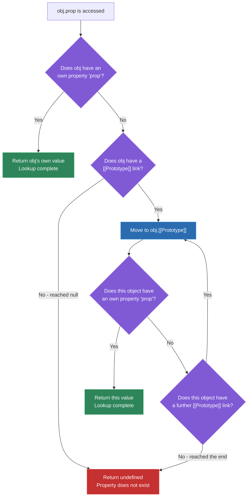
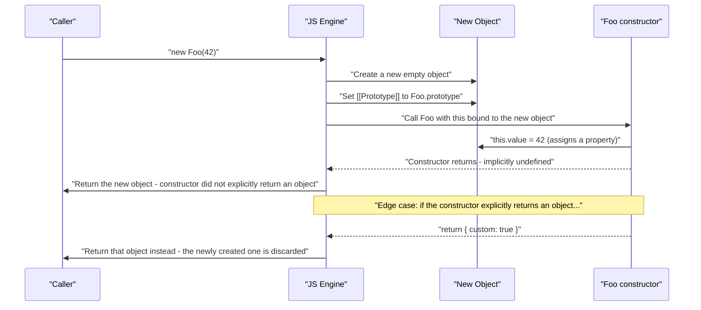

# Prototypal inheritance vs class-based

## 🎯 Executive Summary

JavaScript has exactly one inheritance mechanism: a live, linked chain of objects connected via an internal `[[Prototype]]` slot. `class` syntax does not add a second mechanism — it's a specific, opinionated syntax layered on top of the same prototype chain that `Object.create()` and constructor functions have always used. A Lead is expected to know precisely which parts of `class` are pure syntax sugar and which parts genuinely change runtime behavior (hoisting semantics, method enumerability, `super` binding, constructor enforcement) — conflating "sugar" with "identical behavior" is a real, testable gap.

This is a must-know topic because it's a proxy for whether a candidate understands JavaScript's object model at the engine level or has only memorized `class` syntax as if it were Java. The deeper signal interviewers are after is the composition-over-inheritance judgment call — knowing when a prototype chain is the right tool and when it's the source of a fragile, over-coupled hierarchy, illustrated concretely by React's own move from class components to hooks.

## 🧠 Core Technical Deep Dive

### What a prototype actually is: a live link, not a copy

Every object has an internal `[[Prototype]]` slot pointing to another object, or `null`. Accessing `obj.prop` first checks `obj`'s own properties; if not found, the engine walks `[[Prototype]]` links — `obj → obj.[[Prototype]] → obj.[[Prototype]].[[Prototype]] → ...` — until the property is found or the chain terminates at `null`.

This is a **live reference**, not a copy operation. Mutating a property on a prototype object is immediately visible to every object linked to it, with no propagation step — there's nothing to propagate, since the lookup itself walks the chain at access time, every time.

```javascript
const base = { greet() { return 'hi'; } };
const derived = Object.create(base);
base.greet = function () { return 'hello'; }; // mutate the prototype after linking
derived.greet(); // 'hello' — derived was never "copied from" base, it's linked to it
```

> **Key takeaway:** the prototype chain is a runtime lookup path, not a compile-time or construction-time copy. Anything that changes this fact (like `Object.freeze`-ing a prototype, or breaking the link with `Object.setPrototypeOf`) is a deliberate, observable architectural decision, not a performance detail to ignore.

### `class` is sugar over the same mechanism — but not *only* sugar

`class Foo {}` still creates a function `Foo` with a `.prototype` object, and `new Foo()` still performs the exact same `[[Prototype]]` linking that a pre-ES6 constructor function always did. But `class` syntax genuinely changes several behaviors beyond cosmetics — conflating these with "just nicer syntax" is the most common gap at this topic.

| Behavior | Pre-ES6 constructor function | `class` syntax |
|---|---|---|
| **Hoisting** | Function declarations are fully hoisted, immediately callable | Class declarations are hoisted into a Temporal Dead Zone — referencing before the declaration throws `ReferenceError`, same as `let`/`const` |
| **Calling without `new`** | Runs anyway, with `this` bound to the global object (non-strict) or `undefined` (strict) — a silent, dangerous misbehavior | Throws `TypeError: Class constructor Foo cannot be invoked without 'new'` — structurally impossible to misuse this way |
| **Method enumerability** | `Foo.prototype.bar = function(){}` creates an *enumerable* property — shows up in `for...in` and `Object.keys(Foo.prototype)` | Methods defined in a class body are **non-enumerable** by default |
| **`super` calls** | Manual chaining (`Parent.call(this, ...)`), fragile if methods are reassigned or extracted | `super` resolves via a spec-defined `[[HomeObject]]` internal slot, remaining correct even if the method is later extracted and reassigned |

> **Key takeaway:** `class` doesn't introduce a new inheritance mechanism, but it does introduce real, spec-mandated behavioral guarantees the old pattern never had — the correct framing in an interview is "sugar with teeth," not "just sugar."

### Constructing the prototype chain without `class` at all

Because `class` is optional syntax over a more general mechanism, inheritance-like structures can be built with `Object.create()` directly — worth knowing precisely because it reveals that classes were never a requirement, only a convention.

```javascript
const animalProto = {
  speak() { return `${this.name} makes a sound`; },
};

function createAnimal(name) {
  const instance = Object.create(animalProto); // explicit [[Prototype]] link, no constructor function needed
  instance.name = name;
  return instance;
}

const dog = createAnimal('Rex');
dog.speak(); // 'Rex makes a sound' — no class, no `new`, same underlying mechanism
```

| Construction approach | What it does to the prototype chain | When it's still idiomatic today |
|---|---|---|
| `class` + `new` | Links to `ClassName.prototype`, runs constructor with `this` bound to the new object | Default choice for most application code — clearest syntax, structural `new` enforcement |
| `Object.create(proto)` | Directly sets `[[Prototype]]` to `proto`, no constructor invocation at all | Building objects with a chosen prototype without a class's constructor ceremony; implementing `class`-free factory patterns |
| Constructor function + `new` | Identical linking to `class`, without hoisting TDZ or `new` enforcement | Legacy codebases; rarely chosen for new code now that `class` exists |
| Factory function returning a plain object | No prototype chain at all — every instance gets its own copy of every method | When you specifically want per-instance closures over private state instead of shared prototype methods (the module pattern) |

> **Key takeaway:** reaching for `class` by default is fine for typical application code, but knowing `Object.create()` exists as a direct, lower-level tool is what signals you understand the mechanism underneath the syntax, not just the syntax itself.

### Performance: prototype chain depth and V8's hidden classes

V8 (and other engines) optimize property access using **hidden classes** ("shapes" in some engine literature) — objects constructed with the same properties added in the same order share a hidden class, letting the engine use fast inline-caching for property lookups instead of a dictionary-style lookup. Objects sharing a prototype but built with inconsistent property-addition order can force **hidden class transitions**, degrading lookups from monomorphic (fast) toward megamorphic (slow).

Prototype chain *depth* compounds this at **polymorphic call sites** — code paths that receive objects of genuinely different shapes/prototype chains. A single inline cache entry can't serve all of them, and the engine falls back to a slower lookup path. This is a real, measurable cost in hot loops (rendering engines, hit-testing, data-transform pipelines) — not a theoretical concern reserved for engine authors.

```javascript
// Consistent shape: fast, monomorphic property access
function Point(x, y) { this.x = x; this.y = y; }

// Inconsistent shape: some instances get `y` added later, in different order
const a = new Point(1, 2);
const b = new Point(3, 4);
b.z = 5; // shape diverges from `a` here, even though both came from the same constructor
```

> **Key takeaway:** constructing objects with a consistent property shape isn't a micro-optimization — it's what keeps the engine's inline caches monomorphic. This becomes concretely relevant in any hot path processing many similarly-shaped objects.

### Composition over inheritance: the actual Staff-level debate

Deep class hierarchies create the **fragile base class problem**: a change to a base class's behavior can silently break distant subclasses that depend on assumptions the base class author never documented, because the dependency is implicit in the inheritance chain rather than an explicit interface. Composition — building behavior by combining independent functions or objects rather than extending a shared ancestor — avoids this by flattening the dependency graph into explicit, individually-testable pieces.

The clearest real-world proof of this trade-off is React's own evolution: class components (`extends React.Component`) coupled state, lifecycle, and rendering into a single inheritance hierarchy, where sharing behavior across components required patterns like higher-order components or render props specifically to work around the single-inheritance limitation. Hooks replaced this with **composition of plain functions** — `useState`, `useEffect`, and custom hooks compose freely with no hierarchy at all, which is a direct, shipped-at-scale resolution of the composition-over-inheritance debate, not just a stylistic preference.

> **Key takeaway:** this isn't "inheritance is bad" — shallow, well-defined hierarchies are fine. It's that inheritance depth should track how well-understood and stable the shared behavior actually is; composition is the safer default when extension points aren't fully known in advance.

### `this` binding: dynamic dispatch vs. lexical capture

Prototype and class methods have **dynamic `this`** — determined by the call site, not where the method was defined. `obj.method()` binds `this` to `obj`, but extracting the method (`const fn = obj.method; fn()`) loses that binding entirely, since the function itself doesn't remember what it was attached to.

Arrow-function class fields (`handleClick = () => {...}`) intentionally trade this dynamic dispatch away for lexical `this` capture — the arrow function closes over the instance's `this` at construction time, the same closure mechanism covered in scope/closures fundamentals, applied here specifically to solve method-extraction bugs (passing `this.handleClick` as a callback without `.bind()`).

```javascript
class Button {
  label = 'Click';
  handleClick = () => { console.log(this.label); }; // lexically bound - safe to extract
  handleHover() { console.log(this.label); }         // dynamically bound - unsafe to extract
}
```

> **Key takeaway:** arrow-function class fields aren't just a stylistic React convention — they're a deliberate substitution of closures-based lexical binding for prototype-based dynamic dispatch, chosen specifically because callbacks get extracted from their instance and invoked elsewhere.

## 📊 Visual Architecture & Logic

### Diagram 1 — Property lookup walking the prototype chain



### Diagram 2 — What `new Foo()` actually does, step by step



**→ Visualize it:** [`resources/js-memory-visualizer.html`](resources/js-memory-visualizer.html) is a step-through visualizer covering the call stack, heap, and garbage collector, including a dedicated prototype-chain example — `new Animal()` linking `[[Prototype]]` to `Animal.prototype`, then a `dog.speak()` lookup walking the chain step by step: own properties checked first, then the walk up to the prototype, until the method is found.

## 🏢 Interview Context & FAANG Signals

This topic surfaces in **coding rounds** ("what does `new` actually do, implement it yourself," "implement inheritance without `class`"), **system design rounds** discussing plugin or component-library extensibility (composition vs. inheritance for sharing behavior across unrelated types), and **architecture/behavioral rounds** explaining framework migrations (why a codebase moved from class components to hooks).

**Lead signals interviewers listen for:**

- Stating unprompted that `class` doesn't introduce a new inheritance mechanism, then correctly naming the behaviors it *does* genuinely change (TDZ hoisting, `new` enforcement, non-enumerable methods, `super` binding) — not just asserting "it's the same thing."
- Connecting prototype chain construction consistency to V8 hidden classes and inline caching, with a concrete hot-path scenario, not as abstract trivia.
- Bringing up composition over inheritance with a specific, real example (React hooks vs. class components) rather than a generic design-patterns platitude.
- Correctly distinguishing dynamic (`this` at call site) vs. lexical (`this` at closure creation) binding, and naming exactly when each is the correct choice.
- Knowing `Object.create()` as a direct tool, signaling the mental model isn't "classes are how JS does inheritance" but "classes are one syntax for a more general mechanism."

## ⚔️ Lead Level vs Senior Level

**Scenario: "Explain how inheritance works in JavaScript, and whether you'd reach for `class` syntax."**

A **Senior** response is accurate but stops at the standard explanation: "JavaScript uses prototypal inheritance — objects inherit from other objects through the prototype chain, and `class` is syntactic sugar over that. I'd use `class` because it's cleaner and everyone on the team already knows the syntax."

A **Lead/Staff** response covers the same ground but goes further in specific, evaluable ways:

- **Names the real behavioral differences `class` adds** beyond syntax — TDZ hoisting, structural `new` enforcement, non-enumerable methods, `[[HomeObject]]`-based `super` binding — rather than treating "sugar" as "behaviorally identical."
- **Connects object construction consistency to engine performance**, citing V8's hidden classes and the monomorphic-vs-megamorphic distinction, and names a concrete scenario (a hot rendering or data-transform loop) where this matters in practice.
- **Frames the class-vs-composition choice as depth-dependent, not binary**: shallow, stable hierarchies are fine with `class`; anything where extension points aren't fully known in advance defaults to composition, citing React's hooks migration as the concrete, shipped-at-scale precedent.
- **Distinguishes dynamic vs. lexical `this` binding as a deliberate architectural choice** (arrow-function class fields trading dispatch flexibility for extraction safety), not just "arrow functions fix the `this` bug."

The differentiator: a Senior gives a textbook-correct answer; a Lead treats the same question as an opportunity to demonstrate engine-level understanding and a considered, non-dogmatic position on when inheritance depth becomes a liability.

## ⚠️ Common Pitfalls & Anti-Patterns

> ### ✕ Believing `class` Is a Fundamentally Different Inheritance Mechanism
> **Why it's wrong:** Treating `class`-based inheritance as categorically different from prototype-based inheritance leads to wrong assumptions about performance (there's no separate "class engine," it's the same prototype chain lookup) and about what `Object.create()`-based patterns are actually doing under the hood.
> **✓ Correct Lead Approach:** Hold the model that `class` is one syntax over a single, general prototype-linking mechanism — and be able to name the specific behavioral additions `class` provides (hoisting TDZ, `new` enforcement, non-enumerable methods, `super` binding) rather than treating it as "the same, but nicer."

> ### ✕ Building Deep Class Hierarchies (3+ Levels) for Code Reuse
> **Why it's wrong:** Each additional level of inheritance is an additional implicit dependency on the base class's undocumented assumptions — a change to base class behavior can silently break distant subclasses in ways that are hard to trace back to the actual change, the classic fragile base class problem.
> **✓ Correct Lead Approach:** Default to composition (combining independent functions/objects) for shared behavior across more than one or two levels, reserving inheritance for genuinely stable, well-understood "is-a" relationships with a small, deliberate hierarchy depth.

> ### ✕ Extracting a Method From Its Instance Without Handling `this`
> **Why it's wrong:** `const handler = instance.method; handler()` silently loses the dynamic `this` binding, since a plain function reference remembers nothing about the object it was retrieved from — a frequent source of `undefined is not a function`/`Cannot read property of undefined` bugs when passing methods as callbacks.
> **✓ Correct Lead Approach:** Use arrow-function class fields for anything that will be passed as a callback (lexical binding, safe to extract), or explicitly `.bind(this)` in the constructor for prototype methods — and know this is a deliberate lexical-vs-dynamic binding trade-off, not a syntax quirk to work around blindly.

> ### ✕ Ignoring Object Shape Consistency in Hot Paths
> **Why it's wrong:** Constructing objects with properties added in inconsistent order (or mixing `Object.create(null)` objects with regular ones on the same code path) causes V8 hidden-class transitions, degrading property access from monomorphic inline-cached lookups to slower megamorphic lookups — a real, measurable cost in loops processing many objects, not a premature optimization to dismiss.
> **✓ Correct Lead Approach:** In genuinely hot paths (render loops, large data transforms), initialize all properties in a consistent order at construction time, and verify with profiling before assuming shape consistency doesn't matter — but don't over-apply this discipline to code that isn't actually a hot path.

> ### ✕ Composing Multiple Mixins Without Handling Method Name Collisions
> **Why it's wrong:** `Object.assign(target, mixinA, mixinB)`-style composition silently lets a later mixin's method overwrite an earlier one with the same name, with no warning — producing behavior that depends on mixin application order in a way that's easy to get wrong and hard to debug.
> **✓ Correct Lead Approach:** Treat method name collisions across composed mixins as a design-time concern to check explicitly (naming conventions, a composition helper that throws on collision, or scoping each mixin's methods under a namespace) rather than relying on `Object.assign`'s silent last-write-wins behavior.

## 🛠️ Practice Scenarios (5-10 Scenarios)

<details>
<summary><strong>Scenario 1: Implement your own `new`</strong></summary>

**Problem statement:** Implement a function `myNew(Constructor, ...args)` that replicates exactly what the `new` keyword does, including the edge case where the constructor explicitly returns an object.

**Staff-Level Solution:**
```typescript
function myNew<T>(Constructor: new (...args: any[]) => T, ...args: any[]): T {
  const instance = Object.create(Constructor.prototype); // link [[Prototype]] to Constructor.prototype
  const result = Constructor.apply(instance, args);       // run the constructor with `this` bound to instance
  return (typeof result === 'object' && result !== null) ? result : instance;
  // if the constructor explicitly returned an object, that object wins;
  // otherwise (undefined, a primitive, or nothing returned) the new instance is used
}
```
This mirrors the sequence from the diagram exactly: create the object, link its prototype, invoke the constructor with the new object as `this`, then decide the return value based on whether the constructor itself returned an object. I'd call out the `typeof result === 'object' && result !== null` check specifically — a naive `typeof result === 'object'` alone would incorrectly treat a constructor returning `null` as "returned an object," since `typeof null === 'object'` is one of JavaScript's well-known quirks.
</details>

<details>
<summary><strong>Scenario 2: Why does `for...in` behave differently for class methods vs. prototype-assigned methods?</strong></summary>

**Problem statement:** A teammate is confused: `for (const key in instance)` shows a method when it was added via `Foo.prototype.bar = function(){}`, but not when the identical method was defined inside a `class` body. Explain why.

**Staff-Level Solution:**
Methods defined inside a `class` body are non-enumerable by default — a genuine behavioral difference `class` syntax adds, not a bug. `Foo.prototype.bar = function(){}` creates a normal, enumerable property assignment, which `for...in` (and `Object.keys()`) will include when iterating.

```javascript
class WithClass { bar() {} }
function WithProto() {}
WithProto.prototype.bar = function () {};

for (const k in new WithClass()) console.log(k);  // nothing logged
for (const k in new WithProto()) console.log(k);  // logs 'bar'
```
I'd flag this as one of the concrete, testable reasons `class` isn't "purely" sugar — the ECMAScript spec explicitly defines class methods as non-enumerable, specifically so that iterating over an instance's "own state" via `for...in` isn't cluttered with method names, which was a common historical complaint about prototype-based objects before `class` existed.
</details>

<details>
<summary><strong>Scenario 3: A React class component's event handler loses `this`</strong></summary>

**Problem statement:** `<button onClick={this.handleClick}>` throws `Cannot read properties of undefined` inside `handleClick` when it tries to access `this.state`. Diagnose, and explain three different fixes with their trade-offs.

**Staff-Level Solution:**
`this.handleClick` is a plain function reference by the time it's passed as a prop — extracting it from `this` loses the dynamic binding that `this.handleClick()` (called *as a method*) would have had. By the time React invokes it, there's no `this` context at all.

**Fix 1 — bind in the constructor:**
```javascript
constructor(props) {
  super(props);
  this.handleClick = this.handleClick.bind(this); // creates a new, permanently-bound function once
}
```
Runs once per instance; no extra allocation per render.

**Fix 2 — arrow function class field:**
```javascript
handleClick = () => { /* uses this.state correctly via lexical capture */ };
```
Cleaner syntax, same one-time-per-instance cost as binding in the constructor, and is the pattern most codebases converged on.

**Fix 3 — inline arrow function in render:**
```javascript
<button onClick={() => this.handleClick()}>
```
Works, but creates a brand-new function on every render — defeats `React.memo`/`PureComponent` on the receiving child if it's passed further down, and is the one option I'd actively steer a team away from in a render-frequency-sensitive component tree.
</details>

<details>
<summary><strong>Scenario 4: Implement inheritance using only `Object.create`, no `class` syntax</strong></summary>

**Problem statement:** Implement an `Animal` "base" and a `Dog` that inherits from it and overrides one method, without using `class` anywhere.

**Staff-Level Solution:**
```javascript
const Animal = {
  init(name) { this.name = name; return this; },
  speak() { return `${this.name} makes a sound`; },
};

const Dog = Object.create(Animal); // Dog's [[Prototype]] is Animal
Dog.speak = function () { return `${this.name} barks`; }; // override, shadows Animal's speak

const rex = Object.create(Dog).init('Rex'); // rex's [[Prototype]] is Dog, Dog's is Animal
rex.speak(); // 'Rex barks' - own lookup on rex fails, found on Dog before reaching Animal
```
This is functionally equivalent to `class Dog extends Animal { speak() {...} }` — same three-link prototype chain (`rex → Dog → Animal`), same shadowing behavior for the overridden method. I'd use this to demonstrate that `class`/`extends` is producing exactly this chain structure under the hood, not something categorically different.
</details>

<details>
<summary><strong>Scenario 5: Diagnosing a megamorphic property-access slowdown</strong></summary>

**Problem statement:** A canvas-based hit-testing engine processing thousands of shape objects per frame is slower than expected. Profiling shows significant time in property access, not in the actual math. The shape objects come from several different constructors, and properties are sometimes added conditionally after construction. Diagnose and fix.

**Staff-Level Solution:**
This is very likely a hidden-class/shape consistency problem: objects from different constructors, with properties conditionally added post-construction in varying order, prevents V8 from settling on a small set of hidden classes for the hot property-access call site — pushing it toward megamorphic lookups instead of fast monomorphic inline caches.

Fix: normalize shape construction — initialize every property (even to `null`/a default sentinel) in the constructor itself, in the same order, for every shape type that flows through the same hot code path, rather than conditionally adding properties afterward.

```javascript
// Before: shape varies based on runtime conditions
function Shape(type) {
  this.type = type;
  if (type === 'circle') this.radius = 0; // sometimes present, sometimes not
}

// After: every instance has the same shape regardless of type
function Shape(type) {
  this.type = type;
  this.radius = 0;    // always present, default value if unused
  this.width = 0;
  this.height = 0;
}
```
I'd verify with the actual profiler (V8's `--trace-opt`/`--trace-deopt`, or Chrome DevTools' performance profile) rather than assuming — this class of fix is specific enough that it's worth confirming the hypothesis before restructuring object construction across the codebase.
</details>

<details>
<summary><strong>Scenario 6: Designing a mixin system for a component library</strong></summary>

**Problem statement:** A component library needs to share behaviors — keyboard navigation, focus trapping, controlled/uncontrolled state — across several unrelated component types (`Select`, `Dialog`, `Menu`) that don't share a natural single-inheritance hierarchy. Design an approach.

**Staff-Level Solution:**
Single inheritance can't express "shares behavior with several unrelated things," which is exactly the signal to reach for composition instead of forcing an artificial shared base class. The idiomatic approach for this specific problem — matching how real headless component libraries (Radix, React Aria) are actually built — is extracting each behavior into an independent hook or state machine, composed per component rather than inherited:

```typescript
function useKeyboardNav(items: string[]) { /* returns navigation state + handlers */ }
function useFocusTrap(containerRef: RefObject<HTMLElement>) { /* returns focus management */ }

function useSelect(options: Option[]) {
  const nav = useKeyboardNav(options.map(o => o.id));
  const focus = useFocusTrap(containerRef);
  return { ...nav, ...focus, /* Select-specific state */ };
}
```
This avoids the mixin name-collision problem too — each hook returns an explicitly-named slice of state rather than mutating a shared object, so composing `useKeyboardNav` and `useFocusTrap` together has no silent overwrite risk the way `Object.assign(target, mixinA, mixinB)` would. I'd name this as directly analogous to the class-components-to-hooks migration — the same composition-over-inheritance reasoning, applied at the component-library-architecture level instead of the single-component level.
</details>

<details>
<summary><strong>Scenario 7: Why does a class constructor throw without `new`, but an old-style constructor function doesn't?</strong></summary>

**Problem statement:** Calling `Foo()` (a `class`) without `new` throws `TypeError: Class constructor Foo cannot be invoked without 'new'`. Calling an old-style constructor function the same way doesn't throw — it just runs, silently misbehaving. Explain why, and why this matters.

**Staff-Level Solution:**
Pre-ES6 constructor functions are just regular functions — nothing distinguishes "a function meant to be called with `new`" from any other function at the language level, so calling it without `new` just executes it normally, with `this` bound to the global object (non-strict mode) or `undefined` (strict mode). Any `this.x = ...` assignments inside then either silently pollute the global object or throw much later when something tries to read `this.x` from `undefined` — a bug that surfaces far from its actual cause.

`class` constructors carry an internal flag the spec uses to reject invocation without `new` outright, converting a class of silent, hard-to-trace bugs into an immediate, loud `TypeError` at the exact call site that misused it. This is a genuine safety improvement `class` syntax provides — not a style preference, a structural elimination of an entire bug category that existed in the pre-ES6 pattern.
</details>

<details>
<summary><strong>Scenario 8: Explaining the hooks migration to a junior engineer in inheritance terms</strong></summary>

**Problem statement:** A junior engineer asks why the team moved away from class components to hooks, expecting an answer like "hooks are just newer." Give a technically grounded explanation instead.

**Staff-Level Solution:**
"It's not really about hooks being newer — it's about what happens when you need to share behavior across components that don't share a natural inheritance relationship. Class components put state, lifecycle, and rendering all inside one inheritance hierarchy, so sharing something like 'subscribe to this data source and clean up on unmount' across unrelated components meant reaching for workarounds like higher-order components or render props, specifically because JavaScript classes only support single inheritance.

Hooks solve the same problem with composition instead — `useEffect`, `useState`, and custom hooks are just functions that compose together with no hierarchy involved at all. You can share `useDataSubscription` across a `Chart` and a `Table` component with zero relationship between them, which was awkward to express cleanly in the class-based model. It's the same 'composition over inheritance' principle you'd apply to any object-oriented codebase — React just went through this transition at massive scale, which is why it's such a clean, concrete example to point to."
</details>
