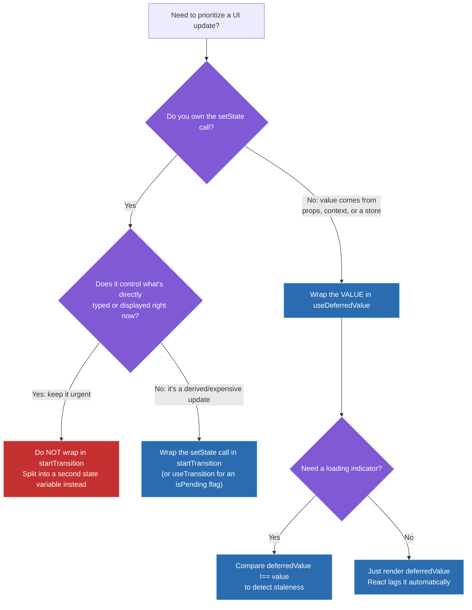
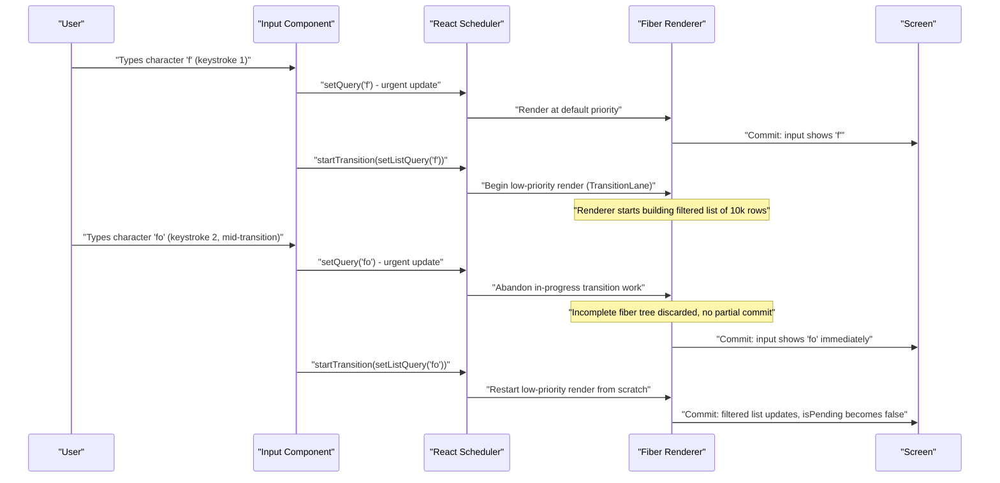
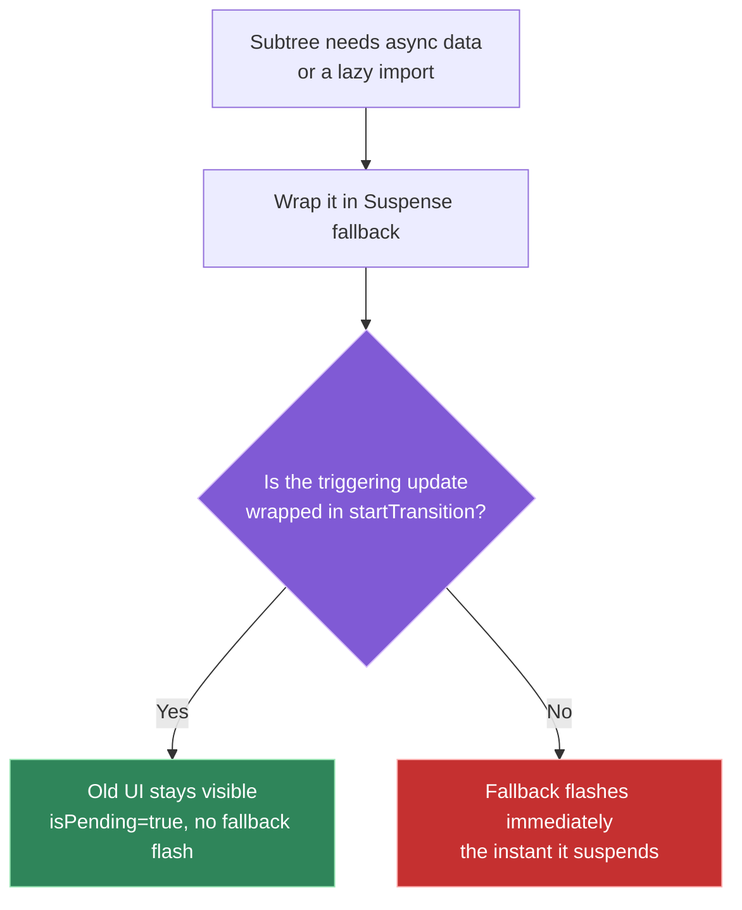

# React 18 features: useTransition, useDeferredValue, Suspense

## 🎯 Executive Summary

React 18's concurrent features don't make React faster — they make React's scheduler *honest about priority*. `useTransition`, `useDeferredValue`, and `Suspense` all sit on top of the same mechanism: interruptible, priority-ranked rendering via Fiber's "lanes" model. A Lead is expected to know this is a scheduling story, not a performance story — the actual computation still has to happen, memoization and virtualization are still the tools that make it cheaper, and concurrent rendering only controls *when* that work gets a turn on the main thread relative to more urgent work like a keystroke.

This is a must-know topic because it's one of the few areas where React's public API directly exposes an internal architectural concept (priority lanes) to userland. Interviewers use it to test whether a candidate can reason about *scheduling* as a first-class system design concern — the same instinct that shows up in OS process scheduling, event-loop prioritization, and network request prioritization — rather than treating "make it faster" as a single undifferentiated goal.

## 🧠 Core Technical Deep Dive

### Concurrent rendering: the mechanism underneath all three APIs

Before React 18, a render, once started, ran to completion synchronously — there was no way to pause a `setState`-triggered re-render partway through to handle something more urgent. Fiber's architecture always supported incremental, interruptible work in principle, but React 18 is the first version that actually exposes that interruptibility to application code via priority.

Every update in React 18 is assigned to a **lane** — a priority tier represented internally as a bitmask, which lets the scheduler efficiently compare and merge priorities. A rough simplification of the tiers:

| Lane tier | Triggered by | Can be interrupted by |
|---|---|---|
| **Sync / Discrete** | Direct user input like clicks, keystrokes, form submission | Nothing — always wins immediately |
| **Continuous** | Drag, scroll, pointer-move driven updates | Sync/Discrete |
| **Default** | A plain `setState` call outside any special API | Sync, Continuous |
| **Transition** | Anything wrapped in `startTransition` or produced by `useDeferredValue` | Anything above it |
| **Idle / Offscreen** | Work React defers indefinitely if nothing else needs it | Everything |

When a lower-priority render is in progress and a higher-priority update arrives, React **abandons the in-progress work** — the partially-built fiber tree for the low-priority render is discarded, not committed — processes the urgent update, and only afterward restarts the low-priority render from scratch. Nothing partial ever reaches the screen; a render is all-or-nothing at commit time.

> **Key takeaway:** `useTransition`, `useDeferredValue`, and `Suspense` are three different ergonomic entry points into the same lane-based scheduler. None of them do less work — they change when that work is allowed to interrupt something more urgent.

### useTransition and startTransition: deprioritizing an update you own

`startTransition(callback)` tells React "the state updates you call synchronously inside this callback belong in a Transition lane, not the Default lane." `useTransition()` is the same mechanism plus an `isPending` boolean that flips to `true` for the duration of the low-priority render and back to `false` once it commits.

```typescript
function ProductFilter() {
  const [query, setQuery] = useState('');
  const [isPending, startTransition] = useTransition();

  function handleChange(e: React.ChangeEvent<HTMLInputElement>) {
    setQuery(e.target.value); // urgent: keeps the input itself responsive
    startTransition(() => {
      setFilteredResults(computeExpensiveFilter(e.target.value)); // low priority
    });
  }

  return (
    <>
      <input value={query} onChange={handleChange} />
      {isPending && <Spinner />}
      <ResultsList items={filteredResults} />
    </>
  );
}
```

`isPending` is superior to a hand-rolled `isLoading` flag because it's tied directly to the actual commit — there's no manual `setIsLoading(true)` / `setIsLoading(false)` pairing to get wrong, no race condition if a second transition starts before the first finishes, and nothing to clean up on unmount.

> **Key takeaway:** `startTransition` only reschedules the state updates called synchronously inside it. It does not make the underlying computation cheaper — that's still `useMemo`/`React.memo`'s job — and it does not extend to work after an `await` (covered in Pitfalls).

### useDeferredValue: deprioritizing a value you don't own

`useTransition` requires owning the `setState` call. `useDeferredValue(value)` solves the case where you don't — the value is a prop, a context value, or anything else you can only read, not set. It returns a "lagging" copy of that value: on an urgent update, React first re-renders with the *old* deferred value (keeping the UI responsive), then immediately schedules a low-priority re-render with the new value.

```typescript
function ProductFilter({ query }: { query: string }) {
  const deferredQuery = useDeferredValue(query);
  const isStale = query !== deferredQuery;

  return (
    <div style={{ opacity: isStale ? 0.6 : 1 }}>
      <ResultsList items={computeExpensiveFilter(deferredQuery)} />
    </div>
  );
}
```

Comparing `query !== deferredQuery` is the idiomatic way to detect staleness with `useDeferredValue`, since it doesn't expose an `isPending` flag the way `useTransition` does.

| | `useTransition` | `useDeferredValue` |
|---|---|---|
| **Controls** | The `setState` call | A value you only read |
| **Use when** | You own the state update (event handler, click) | The value comes from props/context/a store |
| **Staleness signal** | `isPending` boolean | Manually compare `value !== deferredValue` |
| **Typical pairing** | Own state + expensive derived render | Prop/store value + expensive derived render |

> **Key takeaway:** the deciding question is ownership of the `setState` call, not "which hook sounds more relevant." If you can call `setState` yourself, reach for `useTransition`; if you can only read the value, reach for `useDeferredValue`.

### Suspense: declarative "not ready yet" boundaries

A component "suspends" by throwing a promise instead of returning JSX — `React.lazy()` does this for code-split components, and data-fetching libraries (Relay, Next.js's data layer) do it internally for async data. React catches that thrown promise the same way an Error Boundary catches a thrown error, pauses the subtree, and renders the nearest `<Suspense fallback>` until the promise resolves, then retries the render.

The interaction with transitions is the detail most candidates miss: if the update that causes a subtree to suspend is wrapped in `startTransition` (or arrives via a value going through `useDeferredValue`), React does **not** show the fallback. It keeps the *previous* committed UI on screen, flips `isPending` to `true`, and only swaps to the new content once it's actually ready — no flash of a loading spinner. If that same update is *not* wrapped in a transition, the fallback appears immediately the instant something suspends.

```typescript
function handleNavigate(nextPage: string) {
  startTransition(() => {
    setPage(nextPage); // if <PageContent> suspends, old page stays visible + isPending=true
  });
}
```

Suspense boundaries also drive **streaming SSR**: `renderToPipeableStream`/`renderToReadableStream` flush completed HTML chunks to the client as each Suspense boundary resolves, out of order, rather than blocking the entire response on the slowest piece of data. Boundary placement is a real architectural decision — too granular and you multiply round trips and hydration overhead; too coarse and one slow boundary blocks everything behind it.

> **Key takeaway:** Suspense fallback flashing is usually not a Suspense bug — it's a missing `startTransition` (or `useDeferredValue`) around whatever triggered the suspend. Fix the scheduling, not the fallback.

## 📊 Visual Architecture & Logic

### Diagram 1 — Choosing between useTransition and useDeferredValue



### Diagram 2 — An urgent update interrupting an in-progress transition



### Diagram 3 — Suspense fallback behavior depends on how the trigger was scheduled



**→ Reference:** [`resources/react-api-quick-reference.html`](resources/react-api-quick-reference.html) has a one-page cheat sheet for `useTransition`, `startTransition`, `useDeferredValue`, and `Suspense` alongside every other hook covered across the React topics — including which scheduling lane each actually uses.

## 🏢 Interview Context & FAANG Signals

This topic surfaces most often in **coding rounds** ("this search box is laggy over a large list, fix it") and **system design rounds** touching any UI with expensive derived rendering — search-as-you-type, tab switchers with heavy content, dashboards recomputing on filter changes. It also appears in **behavioral rounds** as "tell me about a rendering performance problem you diagnosed."

**Lead signals interviewers listen for:**

- Correctly distinguishing `useTransition` from `useDeferredValue` based on *ownership of the setState call*, not just reciting both APIs exist.
- Naming the classic controlled-input trap unprompted: never wrap the input's own displayed-value state in a transition.
- Stating explicitly that transitions don't reduce work — they reschedule it — and that memoization/virtualization are still required for genuinely expensive renders.
- Knowing the Suspense-fallback-flash fix is "wrap the trigger in a transition," not "add a debounce" or "cache more aggressively."
- Bringing up streaming SSR and Suspense boundary placement as a system-wide (not just client-side) design decision.

## ⚔️ Lead Level vs Senior Level

**Scenario: "Filtering a 10,000-row table on every keystroke is janky. Fix it."**

A **Senior** response is correct but stops at the API: wrap the filter computation in `useDeferredValue` (or `startTransition`), confirm the input stays responsive, ship it.

A **Lead/Staff** response treats the fix as one layer of several:

- **Fix the scheduling first** (as the Senior did) — deferred value or transition, whichever fits based on setState ownership.
- **Then ask whether the work itself is actually necessary at that size** — should `computeExpensiveFilter` be memoized so unrelated re-renders don't redo it, and should the *rendered list* be virtualized so 10,000 DOM nodes were never the plan in the first place? Deferring an expensive computation is not a substitute for making it cheap.
- **Question the API boundary**: if this filtering logic is shared across the app, does it belong in a hook (`useFilteredList`) that encapsulates the deferred-value pattern, so the next engineer building a similar list gets this scheduling behavior by default instead of rediscovering it?
- **Verify it under realistic conditions**: `isPending`/staleness UI should be checked on a throttled CPU profile, not just a dev machine — the entire point of this fix is invisible on fast hardware.

The differentiator: a Senior fixes the reported symptom with the correct API; a Lead treats the API as one piece of a system (memoization + virtualization + reusable abstraction + realistic verification), because the same underlying mistake (unmemoized expensive derived render) will resurface elsewhere if only the scheduling layer gets fixed.

## ⚠️ Common Pitfalls & Anti-Patterns

> ### ✕ Wrapping a controlled input's own value in startTransition
> **Why it's wrong:** If the state that drives `<input value={state}>` itself is set inside `startTransition`, React deprioritizes updating what's literally displayed in the box — typing feels broken because the character you just pressed doesn't appear immediately.
> **✓ Correct Lead Approach:** Keep the input's own state update synchronous and urgent. Split the expensive derived work into a second piece of state (updated via `startTransition`) or use `useDeferredValue` on a value derived from the input, never on the input's own displayed value.

> ### ✕ Assuming startTransition makes the wrapped computation faster
> **Why it's wrong:** Transitions only change scheduling priority — the same amount of CPU work still has to run. Wrapping an O(n²) computation in `startTransition` makes it interruptible, not cheaper; on a slow enough device it can still block the transition's own commit for a long time.
> **✓ Correct Lead Approach:** Use `useTransition`/`useDeferredValue` to control *when* expensive work is allowed to run, and separately use `useMemo`, `React.memo`, or virtualization to reduce *how much* work there is. These are complementary, not substitutes for each other.

> ### ✕ Expecting startTransition to cover state updates after an await
> **Why it's wrong:** A transition's priority applies only to `setState` calls made synchronously within the `startTransition` callback's current call stack. Anything scheduled after an `await` runs as a normal, untransitioned update, which is a common surprise in code like `startTransition(async () => { await fetchData(); setResults(data); })` — the `setResults` call is not actually in the transition.
> **✓ Correct Lead Approach:** Call `startTransition` again around the specific `setState` call that happens after the `await`, rather than wrapping the entire async function once: `const data = await fetchData(); startTransition(() => setResults(data));`.

> ### ✕ Treating a suspending update's fallback flash as a Suspense bug
> **Why it's wrong:** A `<Suspense>` fallback flashing on every update is standard behavior for updates that aren't scheduled as transitions — it's not a defect in Suspense, it's the expected result of an urgent-priority update suspending.
> **✓ Correct Lead Approach:** Wrap the update that triggers the suspense (navigation, data refetch) in `startTransition`, or feed it through `useDeferredValue`, so React keeps the previous UI visible with `isPending=true` instead of unmounting to the fallback.

> ### ✕ Reaching for concurrent features as a first response to any perf complaint
> **Why it's wrong:** `useTransition`/`useDeferredValue` fix a specific symptom — main-thread contention between an urgent update and a lower-priority render. Applying them everywhere without first profiling turns "why is this slow" into "why is this slow, but now also harder to reason about," without addressing renders that are slow for unrelated reasons (missing memoization, unnecessary re-renders, unvirtualized lists).
> **✓ Correct Lead Approach:** Profile first. Apply concurrent scheduling specifically where a genuinely expensive render is contending with a genuinely urgent one — not as a default wrapper around every `setState`.

## 🛠️ Practice Scenarios (5-10 Scenarios)

<details>
<summary><strong>Scenario 1: The laggy 10,000-row search filter</strong></summary>

**Problem statement:** A search input filters a 10,000-row client-side table on every keystroke. Typing feels sluggish and characters appear to lag behind the keyboard. A previous engineer's fix was to wrap the input's own `setState` call in `startTransition`, which made the lag worse, not better. Diagnose and fix.

**Staff-Level Solution:**
The previous fix wrapped the wrong state update — it deprioritized the input's own displayed value, so keystrokes visibly lag, which is the classic controlled-input trap. The correct pattern splits ownership: the input's own state stays a normal synchronous update, and only the value used to compute the filtered list should lag.

```typescript
function SearchableTable() {
  const [query, setQuery] = useState('');
  const deferredQuery = useDeferredValue(query);
  const isStale = query !== deferredQuery;

  const filtered = useMemo(
    () => computeExpensiveFilter(deferredQuery),
    [deferredQuery]
  );

  return (
    <>
      <input value={query} onChange={e => setQuery(e.target.value)} />
      <VirtualizedList items={filtered} style={{ opacity: isStale ? 0.6 : 1 }} />
    </>
  );
}
```
Beyond the API fix, I'd also confirm the list is virtualized (10,000 rendered DOM nodes is its own problem independent of scheduling) and that `computeExpensiveFilter` is memoized so it doesn't re-run on unrelated re-renders.
</details>

<details>
<summary><strong>Scenario 2: A tab switcher that freezes for a moment on every tab change</strong></summary>

**Problem statement:** A settings page has five tabs; each tab's content is moderately expensive to render (a few hundred form fields with validation). Clicking a tab freezes the UI for ~150ms before the new tab's content appears, and the previously active tab's content disappears immediately, even during that freeze.

**Staff-Level Solution:**
Wrap the tab-switching `setState` in `startTransition` so the old tab's content stays visible and interactive while the new tab's expensive render happens off the urgent path, with an `isPending` flag driving a subtle loading affordance instead of an abrupt freeze-then-swap:

```typescript
function SettingsTabs() {
  const [activeTab, setActiveTab] = useState('profile');
  const [isPending, startTransition] = useTransition();

  function selectTab(tab: string) {
    startTransition(() => setActiveTab(tab));
  }

  return (
    <>
      <TabBar active={activeTab} onSelect={selectTab} pending={isPending} />
      <div style={{ opacity: isPending ? 0.6 : 1 }}>
        <TabContent tab={activeTab} />
      </div>
    </>
  );
}
```
I'd also cache each tab's rendered subtree (e.g., keep all tabs mounted and toggle visibility with CSS, or memoize per-tab content) so switching back to a previously visited tab is instant rather than re-paying the render cost — the transition smooths the *first* visit to an expensive tab, but shouldn't be the only mitigation for repeated visits.
</details>

<details>
<summary><strong>Scenario 3: The async startTransition footgun</strong></summary>

**Problem statement:** An engineer wraps a data refetch in `startTransition` to avoid a Suspense fallback flash, but the fallback still flashes:
```typescript
function refreshResults(query: string) {
  startTransition(async () => {
    const data = await fetchResults(query);
    setResults(data); // still flashes the Suspense fallback
  });
}
```
Explain why, and fix it.

**Staff-Level Solution:**
`startTransition`'s priority marking only applies to `setState` calls made synchronously within the callback's current execution — once the code hits `await fetchResults(query)`, the JS call stack that was inside the transition unwinds, and the `setResults(data)` call afterward runs as a plain, untransitioned update in a new microtask. It never actually gets Transition-lane priority, so if `setResults` causes something to suspend, React treats it as an urgent update and shows the fallback immediately.

```typescript
async function refreshResults(query: string) {
  const data = await fetchResults(query);
  startTransition(() => {
    setResults(data); // now genuinely scheduled as a transition
  });
}
```
This is a subtle enough gotcha that I'd flag it in code review specifically whenever `startTransition` wraps an `async` callback, since the pattern looks correct at a glance and only fails silently (as a UX regression, not a runtime error).
</details>

<details>
<summary><strong>Scenario 4: Suspense fallback flashes despite the navigation being wrapped in startTransition</strong></summary>

**Problem statement:** A single-page app wraps route changes in `startTransition`, but users still see a full-page Suspense fallback flash on every navigation. Diagnose.

**Staff-Level Solution:**
The most common cause is that the code that visually appears to be "the navigation" isn't actually the code calling `setState` inside `startTransition` — for example, a router library's `navigate()` function might internally schedule its own state update asynchronously (via its own internal store, a `Promise.then`, or a microtask) outside of the call stack that was wrapped:
```typescript
// Looks wrapped, but router.push() may resolve its own state update later,
// outside the synchronous scope startTransition actually covers.
startTransition(() => {
  router.push('/next-page');
});
```
The fix depends on the router's API — some expose their own transition-aware navigation method (e.g., a `startTransition`-compatible `navigate` call, or React Router's `useNavigate` combined with its own concurrent-mode support) that should be used instead of assuming any callback passed into `startTransition` is automatically covered end-to-end. I'd verify with the React DevTools Profiler that the navigation's state update is actually landing in a Transition lane, not just assume the wrapping worked.
</details>

<details>
<summary><strong>Scenario 5: "We added startTransition, why does it still feel slow?"</strong></summary>

**Problem statement:** A PM reports that after engineering added `startTransition` around a dashboard's filter update, the UI still feels sluggish when the filter changes, though input responsiveness is fine. Explain what's likely going on and what to do next.

**Staff-Level Solution:**
`startTransition` fixed the *symptom* it's designed for — main thread contention that made the input itself lag — but it does not make the filtered dashboard computation itself cheaper. If that computation is expensive (unmemoized aggregation over a large dataset, for example), the transition's own render can still take a long time to complete; it's just no longer blocking urgent input. The perceived "still feels slow" is very likely the transition's render duration itself, visible via the `isPending` state lasting a long time.

Next steps: profile the transition's render with the React DevTools Profiler to see what's actually expensive inside it, add `useMemo` around the aggregation so it doesn't re-run unnecessarily, and check whether the result set needs virtualization. I'd explain to the PM that `startTransition` bought us "the app doesn't freeze while this happens," not "this happens faster" — those are different problems requiring different fixes.
</details>

<details>
<summary><strong>Scenario 6: Data tearing in a component reading from a third-party store during a transition</strong></summary>

**Problem statement:** An app uses a third-party (non-React) state store that components read directly via `store.getState()` inside render. Under React 18's concurrent rendering, users occasionally see two parts of the same screen reflecting different versions of the store's data during a single interaction. Diagnose.

**Staff-Level Solution:**
This is "tearing" — because concurrent rendering can pause and resume a render, or work on multiple priority lanes, a component reading a mutable external value directly (`store.getState()`) during render can read a different snapshot than another component that renders slightly later in the same update, if the store mutated in between. Before concurrent rendering, this wasn't possible because renders were always atomic and synchronous; React 18 exposed the gap.

The fix is `useSyncExternalStore`, which subscribes to the store correctly and guarantees every component reading from it during the same render sees a consistent snapshot, even across interrupted/resumed concurrent work:
```typescript
function useStoreValue<T>(store: ExternalStore<T>): T {
  return useSyncExternalStore(store.subscribe, store.getState);
}
```
I'd flag this as a required migration for any non-React state container used in an app that has adopted concurrent features (transitions, Suspense-based data fetching) — direct `getState()` reads in render were "usually fine" pre-18 and are a real correctness bug now.
</details>

<details>
<summary><strong>Scenario 7: Designing Suspense boundaries for a streamed product page</strong></summary>

**Problem statement:** You're designing a product detail page server-rendered with `renderToPipeableStream`. Product title/price load fast; reviews and "related products" load slowly from separate services. Where do you put Suspense boundaries, and why?

**Staff-Level Solution:**
Put the fast-loading core content (title, price, primary image) outside any Suspense boundary so it streams and becomes visible immediately, and wrap the slow sections (reviews, related products) in their own separate Suspense boundaries so each streams in independently as its data resolves, rather than one boundary around the whole page blocking everything behind the slowest service.

The granularity trade-off matters: one boundary per slow section gives the best perceived performance (user sees the page shell immediately, sections fill in progressively) but multiplies the number of separate hydration boundaries and loading-state designs the team has to maintain. I'd avoid over-fragmenting further than the actual data-loading boundaries in the backend — a boundary per individual review, for instance, would add overhead without meaningfully improving perceived performance over one boundary for the whole reviews section.
</details>

<details>
<summary><strong>Scenario 8: Explaining to a junior engineer why concurrent scheduling beats a setTimeout debounce</strong></summary>

**Problem statement:** A junior engineer proposes fixing a laggy filtered list by debouncing the input with `setTimeout(..., 300)` instead of using `useDeferredValue`. Explain the trade-offs.

**Staff-Level Solution:**
"A debounce waits a fixed amount of time no matter what — 300ms whether the actual computation takes 5ms or 500ms. If it's fast, we've added artificial lag the user didn't need; if it's slow, 300ms might not even be enough and we still block the thread once it finally runs. `useDeferredValue` doesn't add an artificial delay at all — it lets the expensive render happen at low priority immediately, and React's scheduler naturally interrupts it if you type again, without us having to guess a timing number.

There's also a responsiveness difference: with a debounce, the input value itself is often *also* delayed if it's implemented naively, or requires extra state to decouple the two. `useDeferredValue` gives us that separation — instant input, lagging expensive render — without hand-rolling timers or cleanup logic on unmount. Debouncing is still the right tool for *reducing request volume* to a network endpoint; it's not the right tool for local rendering performance, which is a scheduling problem, not a frequency problem."
</details>
