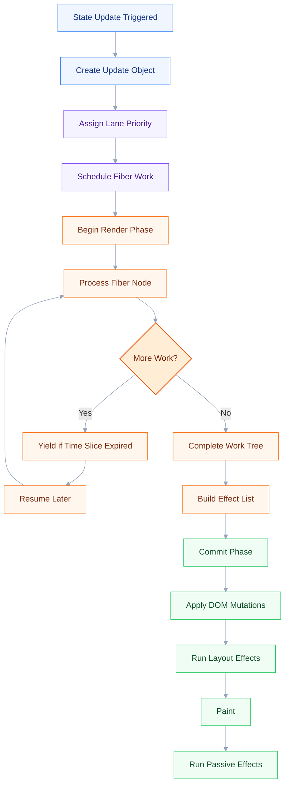
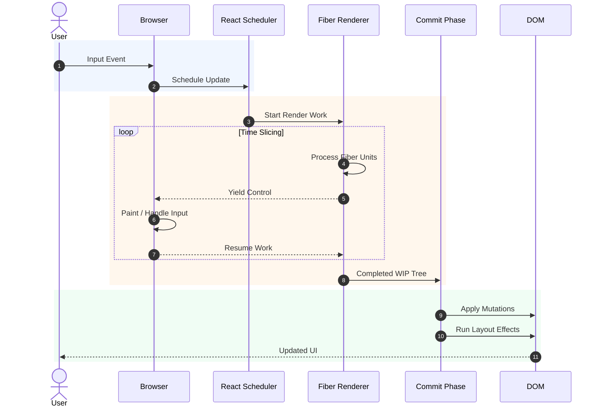

# Fiber architecture and concurrent rendering

## 🎯 Executive Summary

React Fiber is a complete reimplementation of React’s reconciliation engine introduced to solve a fundamental limitation in the legacy stack reconciler:

> Rendering work in the browser cannot block the main thread indefinitely.

The old React renderer was **synchronous and recursive**:

* Once rendering started, it could not be interrupted.
* Large trees caused frame drops and input lag.
* High-priority updates (typing, animations) waited behind low-priority work.

Fiber introduced:

* **Incremental rendering**
* **Cooperative scheduling**
* **Priority-based work**
* **Interruptible reconciliation**
* **Concurrent rendering primitives**

This architecture enables features like:

* `startTransition`
* Suspense
* selective hydration
* streaming SSR
* time slicing
* concurrent rendering
* offscreen rendering

At FAANG Staff/Lead level, interviewers are not testing whether you “know Fiber exists.”

They are testing whether you understand:

* browser scheduling constraints
* rendering economics
* priority systems
* starvation prevention
* reconciliation trade-offs
* how UI consistency is preserved under interruption
* why concurrent rendering is *not parallelism*
* how architecture choices impact large-scale frontend systems

---

# 🧠 Core Technical Deep Dive

---

## Why React Needed Fiber

### Legacy Stack Reconciler Problem

Before Fiber, React reconciliation looked conceptually like this:

```javascript
function renderTree(node) {
  render(node);

  node.children.forEach(renderTree);
}
```

This recursive model had severe constraints:

| Problem                            | Impact                              |
| ---------------------------------- | ----------------------------------- |
| Non-interruptible recursion        | Long renders freeze UI              |
| No prioritization                  | Typing waits behind heavy rendering |
| No scheduling awareness            | React ignores browser frame budget  |
| Entire tree rendered synchronously | Large apps become janky             |
| No pause/resume capability         | Wasted rendering work               |

Modern frontend apps:

* stream data
* hydrate SSR incrementally
* animate continuously
* process user input in real time
* render thousands of nodes dynamically

A synchronous renderer fundamentally does not scale.

---

# Fiber: Core Architectural Shift

Fiber converts React rendering into:

* discrete units of work
* stored as linked objects
* schedulable
* interruptible
* resumable

---

## What Is a Fiber Node?

A Fiber node is:

* a lightweight virtual stack frame
* representing a React element instance
* stored as a mutable JS object

Conceptually:

```typescript
type Fiber = {
  type: any;
  stateNode: any;

  child: Fiber | null;
  sibling: Fiber | null;
  return: Fiber | null;

  pendingProps: any;
  memoizedProps: any;
  memoizedState: any;

  lanes: Lanes;

  alternate: Fiber | null;

  flags: Flags;
};
```

---

## Why Fiber Uses Linked Structures Instead of Recursion

React replaced recursive traversal with an explicit linked-list tree structure.

This enables:

* pausing work
* resuming later
* abandoning work
* reprioritizing updates
* yielding to browser tasks

This is effectively:

* implementing React’s own cooperative call stack in userland JavaScript

---

# Double Buffering Architecture

React maintains two trees:

| Tree                  | Purpose                       |
| --------------------- | ----------------------------- |
| Current Tree          | UI currently committed to DOM |
| Work-In-Progress Tree | New render being prepared     |

The `alternate` pointer links both versions.

---

## Why Double Buffering Matters

Concurrent rendering must preserve UI consistency.

If React mutated the current tree directly:

* interrupted renders would corrupt UI state
* partial renders could leak visually

Instead:

1. React builds a new tree in memory
2. work may pause/resume
3. only after completion does React commit atomically

This mirrors graphics rendering pipelines:

* front buffer
* back buffer
* atomic swap

---

# Render Phase vs Commit Phase

## Render Phase

Goals:

* reconciliation
* diffing
* scheduling
* computing mutations

Characteristics:

* interruptible
* async-capable
* restartable
* pure

No DOM mutations occur here.

---

## Commit Phase

Goals:

* apply DOM mutations
* execute layout effects
* finalize state

Characteristics:

* synchronous
* non-interruptible
* minimal duration

React guarantees:

> DOM consistency only after commit.

---

# Scheduling and Cooperative Multitasking

The browser main thread is shared by:

* JS execution
* layout
* paint
* user input
* animation
* network callbacks

React cannot monopolize it.

Fiber introduces cooperative scheduling:

```javascript
while (work && timeRemaining()) {
  work = performUnitOfWork(work);
}
```

If frame budget expires:

* React yields control back to browser
* browser processes input/paint
* React resumes later

---

# Time Slicing

Time slicing allows React to split rendering work into chunks.

Without Fiber:

```text
Render Entire App -> 120ms block
```

With Fiber:

```text
Render Chunk -> Yield
Render Chunk -> Yield
Render Chunk -> Commit
```

This reduces:

* input latency
* dropped frames
* UI freezing

---

# Concurrent Rendering

Concurrent rendering means:

> Rendering work can be interrupted, reprioritized, restarted, or discarded before commit.

Important:

* concurrent rendering is NOT multithreading
* JavaScript remains single-threaded
* React simulates concurrency via scheduling

---

# Lanes: React’s Priority Model

React originally used expiration times.

Modern React uses **lanes**.

A lane is:

* a bitmask priority bucket
* representing update urgency

Example conceptual priorities:

| Priority            | Example              |
| ------------------- | -------------------- |
| SyncLane            | clicks               |
| InputContinuousLane | dragging             |
| DefaultLane         | normal updates       |
| TransitionLane      | background rendering |
| IdleLane            | prefetching          |

---

## Why Lanes Matter

Lanes enable:

* batching
* starvation prevention
* update merging
* interruptible rendering
* selective prioritization

Example:

```javascript
startTransition(() => {
  setSearchResults(expensiveData);
});
```

Typing remains high priority.
Search rendering becomes interruptible background work.

---

# Interruptible Rendering

Suppose React is rendering:

```text
Huge Dashboard Tree
```

Midway:

```text
User types into search box
```

React can:

1. pause dashboard rendering
2. process high-priority input
3. resume or restart dashboard work later

This is one of Fiber’s most important capabilities.

---

# Reconciliation Under Fiber

Fiber traversal uses:

* child
* sibling
* return

instead of recursion.

Traversal is depth-first.

Pseudo-flow:

```javascript
function performUnitOfWork(fiber) {
  beginWork(fiber);

  if (fiber.child) {
    return fiber.child;
  }

  while (fiber) {
    completeWork(fiber);

    if (fiber.sibling) {
      return fiber.sibling;
    }

    fiber = fiber.return;
  }
}
```

This enables granular scheduling checkpoints.

---

# Suspense Integration

Suspense works because Fiber supports pausing work.

When a component suspends:

* React can pause subtree rendering
* show fallback UI
* resume later

Without Fiber, Suspense architecture would be impossible.

---

# Selective Hydration

In SSR hydration:

* Fiber allows hydrating only interacted regions first

Example:

* user clicks navbar before footer hydrates
* React prioritizes navbar hydration

Critical for:

* large SSR apps
* streaming architectures
* perceived performance

---

# Memory Trade-Offs

Fiber increases memory usage substantially.

Why?

Because React stores:

* current tree
* work-in-progress tree
* scheduling metadata
* effect lists
* alternate pointers

Trade-off:

* more memory
* dramatically better responsiveness

Lead-level understanding:

> Fiber intentionally trades memory efficiency for scheduling flexibility.

---

# Effect List Optimization

React avoids walking entire trees during commit.

Instead:

* side effects are collected into linked effect lists

This minimizes commit duration.

Critical because:

* commit phase blocks main thread synchronously

---

# Browser Scheduler Interaction

React Scheduler cooperates with browser APIs:

* `MessageChannel`
* `postTask` (future)
* microtasks/macrotasks
* frame deadlines

React does NOT control browser rendering.
It negotiates with it.

---

# Why Concurrent Rendering Is Difficult

Concurrent rendering introduces consistency problems:

| Problem             | Challenge                         |
| ------------------- | --------------------------------- |
| Tearing             | UI showing mixed states           |
| Starvation          | low-priority work never completes |
| Stale renders       | outdated async work               |
| Re-entrancy         | updates during render             |
| Effects duplication | render retries                    |

React solves these through:

* lanes
* atomic commit
* render purity
* idempotent reconciliation
* transition boundaries

---

# Strict Mode and Double Rendering

In development:

* React intentionally re-renders components

Purpose:

* detect unsafe side effects
* validate render purity
* prepare ecosystem for concurrency

Many developers misunderstand this.

It is fundamentally:

> a concurrency safety validation mechanism.

---

# React 18 Concurrency APIs

---

## `startTransition`

Marks updates as non-urgent.

```javascript
startTransition(() => {
  setResults(data);
});
```

Enables:

* interruptible background rendering

---

## `useTransition`

Provides pending state visibility.

```javascript
const [isPending, startTransition] = useTransition();
```

---

## `useDeferredValue`

Defers expensive rendering.

```javascript
const deferredQuery = useDeferredValue(query);
```

Useful for:

* search filtering
* large tables
* virtualization coordination

---

# Tearing and External Stores

Concurrent rendering exposed issues with external state systems.

React introduced:

* `useSyncExternalStore`

to guarantee consistency during concurrent reads.

This became critical for:

* Redux
* Zustand
* custom stores

---

# Concurrent Rendering Is Opt-In-ish

React 18 enables concurrent capabilities,
but rendering remains:

* mostly synchronous unless features trigger concurrency

This is important in interviews.

Many candidates incorrectly claim:

> “React 18 is fully concurrent.”

It is not.

---

# 📊 Visual Architecture & Logic

## Fiber Reconciliation Flow



---

## Concurrent Scheduling Architecture



---

# 🏢 Interview Context & FAANG Signals

---

## Where This Appears

| Interview Type        | Typical Focus            |
| --------------------- | ------------------------ |
| Frontend Architecture | rendering scalability    |
| React Deep Dive       | reconciliation internals |
| Performance Round     | input latency            |
| Staff System Design   | SSR + hydration          |
| Debugging Round       | unnecessary renders      |
| Leadership Round      | migration strategy       |

---

# Common FAANG Questions

---

## Meta

Meta often probes:

* reconciliation internals
* scheduling trade-offs
* Suspense architecture
* rendering consistency

Example:

> “Why did React rewrite the reconciler?”

---

## Google

Google often focuses on:

* browser scheduling
* frame budgets
* rendering pipelines
* responsiveness metrics

Example:

> “How does concurrent rendering improve INP?”

---

## Amazon

Amazon often asks:

* practical performance scaling
* e-commerce rendering bottlenecks
* hydration optimization
* low-end device impact

---

## Microsoft

Microsoft often explores:

* framework internals
* interoperability
* state consistency
* large application maintainability

---

# Strong Lead Signals

Interviewers look for candidates who:

* understand browser constraints deeply
* discuss trade-offs, not features
* reason about scheduler economics
* understand consistency guarantees
* connect architecture to UX metrics
* explain memory/performance trade-offs

---

# Weak Signals

Candidates fail when they:

* describe Fiber only as “faster React”
* confuse concurrency with multithreading
* cannot explain interruption semantics
* ignore browser event loop interaction
* over-focus on APIs instead of architecture

---

# ⚔️ Lead Level vs Senior Level

| Senior Engineer                 | Staff/Lead Engineer                         |
| ------------------------------- | ------------------------------------------- |
| Knows Fiber enables concurrency | Explains why scheduler control matters      |
| Uses Suspense                   | Understands interruption guarantees         |
| Uses transitions                | Explains starvation avoidance               |
| Talks about performance         | Quantifies frame-budget economics           |
| Optimizes components            | Optimizes rendering architecture            |
| Understands reconciliation      | Understands scheduler + browser integration |
| Talks about rerenders           | Talks about latency distribution            |

---

## Example Interview Difference

### Senior-Level Answer

> “Fiber allows React to pause rendering and improves performance.”

Correct but shallow.

---

### Lead-Level Answer

> “Fiber replaces recursive synchronous reconciliation with a schedulable linked-unit work model. The key innovation isn’t speed alone — it’s control over rendering priority and interruption. This enables React to preserve input responsiveness under heavy rendering workloads by cooperating with the browser scheduler and splitting work across frame boundaries.”

This demonstrates:

* architectural reasoning
* systems thinking
* runtime awareness
* browser knowledge

---

# ⚠️ Common Pitfalls & Anti-Patterns

> ### ✕ Treating Concurrent Rendering as Parallelism
>
> **Why it's wrong:** JavaScript still runs on a single main thread. React concurrency is cooperative scheduling, not multithreaded execution.
> **✓ Correct Lead Approach:** Explain concurrency as interruptible prioritized rendering within a single-threaded event loop.

---

> ### ✕ Assuming React 18 Is Fully Concurrent
>
> **Why it's wrong:** Most rendering still behaves synchronously unless concurrent features are engaged.
> **✓ Correct Lead Approach:** Clarify that concurrency capabilities are selectively activated through transitions, Suspense, deferred rendering, and scheduler heuristics.

---

> ### ✕ Running Side Effects During Render
>
> **Why it's wrong:** Concurrent rendering may restart renders multiple times.
> **✓ Correct Lead Approach:** Ensure render functions remain pure and move effects into appropriate lifecycle/effect phases.

---

> ### ✕ Ignoring Commit Phase Cost
>
> **Why it's wrong:** Commit is synchronous and blocks the main thread.
> **✓ Correct Lead Approach:** Optimize DOM mutation volume and minimize layout thrashing during commit.

---

> ### ✕ Overusing Transitions
>
> **Why it's wrong:** Excessive transitions can create starvation or stale-feeling UI.
> **✓ Correct Lead Approach:** Prioritize responsiveness carefully and apply transitions only to non-urgent rendering.

---

> ### ✕ Misunderstanding Suspense
>
> **Why it's wrong:** Suspense is not merely a loading spinner abstraction.
> **✓ Correct Lead Approach:** Explain Suspense as coordinated async rendering orchestration enabled by Fiber interruption semantics.

---

> ### ✕ Believing Memoization Solves All Rendering Problems
>
> **Why it's wrong:** Memoization may increase memory usage and comparison overhead.
> **✓ Correct Lead Approach:** Evaluate rendering cost vs memoization overhead empirically.

---

# 🛠️ Practice Scenarios (5-10 Scenarios)

---

## Scenario 1 — Search Input Lag in Large Dashboard

### Problem

A dashboard contains:

* 10,000-row virtualized table
* charts
* expensive filtering logic

Typing in search input causes:

* dropped frames
* delayed keystrokes

How would you redesign rendering?

---

### Staff-Level Solution

<details>
<summary>View Solution</summary>

Key architectural reasoning:

* input responsiveness is higher priority than results rendering
* expensive filtering should become interruptible

Approach:

```javascript
const [isPending, startTransition] = useTransition();

function onChange(value) {
  setInput(value);

  startTransition(() => {
    setFilteredResults(expensiveFilter(value));
  });
}
```

Additional optimizations:

* workerize filtering if CPU-heavy
* incremental rendering
* virtualization tuning
* deferred computations
* memoized selectors
* avoid synchronous commit spikes

Discuss:

* INP metrics
* frame budget
* commit duration
* scheduler starvation

</details>

---

## Scenario 2 — Suspense Waterfall Problem

### Problem

A page contains nested Suspense boundaries.
Data fetching creates sequential waterfalls.

How would you redesign the architecture?

---

### Staff-Level Solution

<details>
<summary>View Solution</summary>

Lead-level thinking:

* avoid serial dependency chains
* parallelize async resources
* use streaming SSR
* split boundaries strategically

Discuss:

* reveal order
* hydration priority
* cache coordination
* React Server Components implications

</details>

---

## Scenario 3 — Commit Phase Bottleneck

### Problem

Profiling shows:

* render phase: 12ms
* commit phase: 85ms

What does this imply?

---

### Staff-Level Solution

<details>
<summary>View Solution</summary>

This indicates:

* DOM mutation cost dominates
* layout/reflow likely excessive

Investigate:

* layout thrashing
* synchronous measurements
* excessive node replacements
* animation coupling
* CSS recalculation

Lead response:

* optimize DOM mutation granularity
* preserve node identity
* batch measurements
* reduce layout invalidation scope

</details>

---

## Scenario 4 — External Store Tearing

### Problem

A Redux-like store shows inconsistent UI during concurrent rendering.

---

### Staff-Level Solution

<details>
<summary>View Solution</summary>

Explain tearing:

* concurrent render reads inconsistent snapshots

Correct solution:

* `useSyncExternalStore`
* immutable snapshots
* atomic subscriptions

Discuss:

* render consistency guarantees
* concurrent read semantics
* subscription timing

</details>

---

## Scenario 5 — Hydration Performance on Low-End Android Devices

### Problem

SSR app hydrates entire page synchronously causing 5-second freeze.

---

### Staff-Level Solution

<details>
<summary>View Solution</summary>

Lead-level redesign:

* selective hydration
* streaming SSR
* route segmentation
* Suspense boundaries
* priority hydration
* partial interactivity

Metrics:

* TTI
* INP
* hydration CPU cost

</details>

---

## Scenario 6 — Animation Jank During State Updates

### Problem

A drag-and-drop interaction stutters during background rendering.

---

### Staff-Level Solution

<details>
<summary>View Solution</summary>

Key reasoning:

* urgent interaction updates competing with background work

Approach:

* isolate animation state
* avoid synchronous large commits
* move non-urgent rendering into transitions
* minimize layout invalidation

Discuss scheduler priorities explicitly.

</details>

---

## Scenario 7 — Large Form Builder Architecture

### Problem

A dynamic form builder has:

* thousands of controlled inputs
* validation
* async rules
* live previews

Typing becomes sluggish.

---

### Staff-Level Solution

<details>
<summary>View Solution</summary>

Lead-level architecture:

* localize state
* avoid global invalidations
* deferred validation
* field-level subscriptions
* transitions for preview rendering
* segmented rendering zones

Discuss:

* reconciliation boundaries
* render granularity
* commit optimization

</details>

---

## Scenario 8 — Infinite Feed With Concurrent Data Updates

### Problem

A social feed continuously streams updates while user scrolls.

How do you avoid scroll jank?

---

### Staff-Level Solution

<details>
<summary>View Solution</summary>

Key concepts:

* prioritize scroll/input lanes
* defer feed reconciliation
* incremental insertion
* virtualization stability
* avoid layout shifts

Potential techniques:

* transitions
* Offscreen API
* chunked rendering
* anchor preservation

</details>

---

## Scenario 9 — Explaining Fiber to a Principal Engineer

### Problem

Explain Fiber in 2 minutes to a Principal Engineer interviewer.

---

### Staff-Level Solution

<details>
<summary>View Solution</summary>

Strong concise explanation:

> “Fiber is React’s cooperative scheduling architecture. Instead of recursive synchronous reconciliation, React models rendering as resumable linked work units with priority lanes. This allows interruption, reprioritization, and atomic commits, enabling features like Suspense, transitions, streaming SSR, and selective hydration while preserving UI consistency under heavy rendering workloads.”

</details>

---

# Final Staff-Level Mental Model

The most important realization:

> Fiber is not primarily a rendering optimization.

It is:

* a scheduling architecture
* designed around browser constraints
* enabling responsive UI under unpredictable workloads

At Staff/Lead level, the differentiator is understanding:

* not just *what* concurrent rendering does
* but *why the browser runtime forced React to evolve this way*
