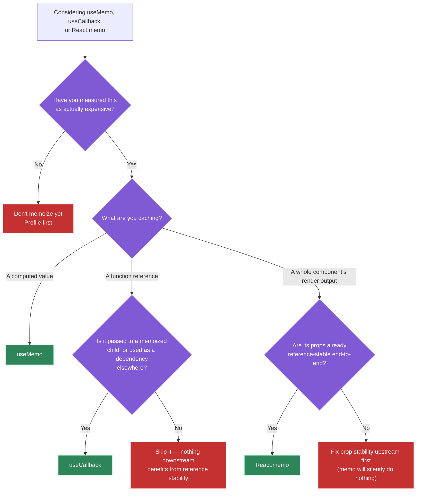
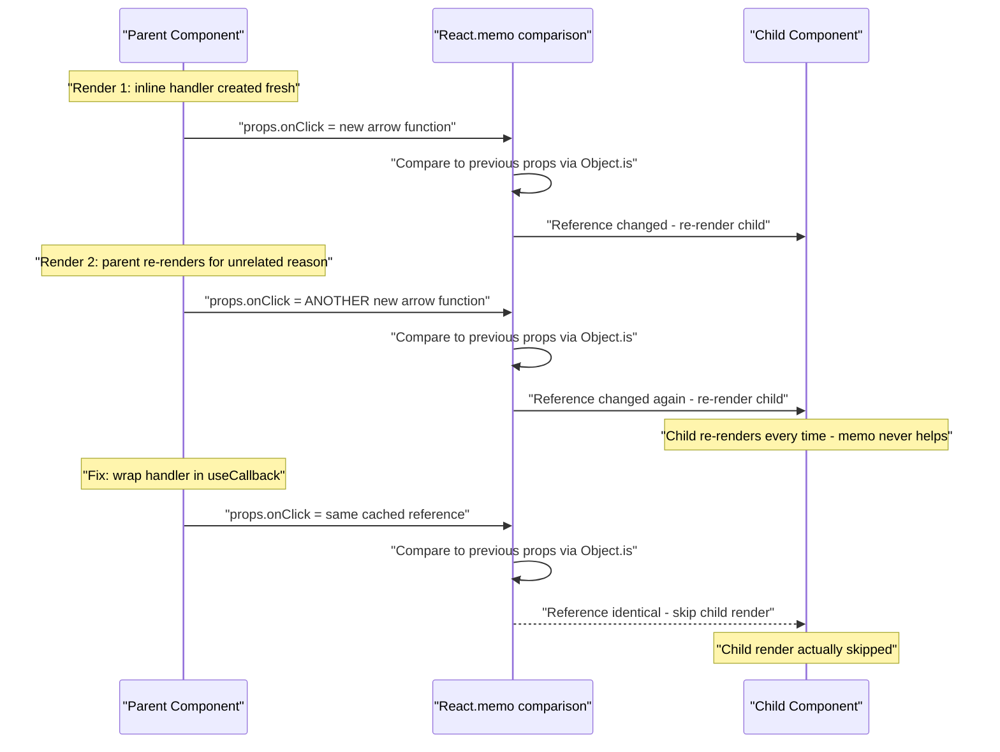

# useMemo, useCallback, React.memo — when and when NOT to use

## 🎯 Executive Summary

`useMemo`, `useCallback`, and `React.memo` are frequently taught as three separate performance tools. They're actually one mechanism — reference-identity caching keyed by shallow dependency comparison — applied at three different points in the render tree: a value, a function, and a component. A Lead is expected to know that this mechanism has a real cost of its own, that it's a *correctness* tool as much as a performance one (a wrong dependency array is a bug, not just a missed optimization), and that memoization only works end-to-end — one unstable link anywhere in the chain silently defeats every memoized component downstream of it.

This is a must-know topic because "just wrap it in useMemo" is the single most common wrong answer to a React performance question, and interviewers use it specifically to separate candidates who've internalized *why* memoization works from candidates who've memorized *that* it exists. The Lead-level signal is knowing when reaching for these APIs is a net loss, not just how to use them.

## 🧠 Core Technical Deep Dive

### The shared mechanism: reference caching keyed by shallow comparison

All three APIs store a value on the fiber's hook list alongside a dependency array from the previous render, and on each new render compare the new dependency array to the stored one element-by-element using `Object.is` — not deep equality, not `===`'s edge cases with `NaN`/`±0`, but `Object.is` specifically. If every element compares equal, React returns the cached value/function without re-invoking anything; if any element differs, it recomputes and re-caches.

`useCallback(fn, deps)` is not a distinct mechanism — it's defined as `useMemo(() => fn, deps)`. It caches the function *reference*, not the function's behavior; the closure it returns still captures whatever variables were in scope when it was created, which is exactly why incorrect dependencies cause stale closures rather than stale renders.

`React.memo(Component)` runs a **shallow prop comparison** (`Object.is` per prop key, by default) before a re-render triggered by the *parent*. It does not affect renders triggered by the component's own state changes or by context it subscribes to — those always proceed regardless of memoization.

| | Caches | Comparison | Skips |
|---|---|---|---|
| **`useMemo`** | A computed value | Dependency array, shallow `Object.is` | Recomputing the value |
| **`useCallback`** | A function reference | Dependency array, shallow `Object.is` | Creating a new function reference |
| **`React.memo`** | A rendered component output | Props, shallow `Object.is` per key (or custom comparator) | The component's own re-render, when triggered by its parent |

> **Key takeaway:** these are the same caching mechanism at three different granularities. None of them do anything unless the thing being compared can actually be reference-stable across renders — which is the crux of everything below.

### The cost side of the ledger

Memoization is not free. Every `useMemo`/`useCallback` call allocates a hook slot, retains a closure and a dependency array between renders, and runs an `Object.is` comparison across every dependency on every render — even the renders where nothing changed. `React.memo`'s shallow comparison similarly costs proportional to prop count on every parent re-render, whether or not it ends up skipping anything.

For a computation that's already cheap — string concatenation, a small array `.map()`, simple arithmetic — the bookkeeping overhead of memoizing it can exceed the cost of just redoing it. This is the most common Senior-level mistake in this topic: treating memoization as strictly additive safety rather than a trade-off that needs a genuinely expensive operation on the other side of the ledger to pay for itself.

| Scenario | Memoize? | Why |
|---|---|---|
| Sorting/filtering a large array on every render | Yes | Recomputation cost measurably exceeds comparison overhead |
| Formatting a date string or concatenating a label | No | Comparison overhead likely exceeds the work being avoided |
| Callback passed to a `React.memo` child | Yes, *if the child's render is actually expensive* | Stabilizes the prop reference so memo comparison can succeed |
| Callback passed to a plain (non-memoized) DOM element handler | Usually no | Nothing downstream benefits from reference stability |

> **Key takeaway:** memoize because you measured an expensive operation, not because the API is available. An unmeasured `useMemo` around cheap work is a net loss dressed up as an optimization.

### Correctness, not just performance: dependency arrays and stale closures

A `useCallback`/`useMemo` closure captures the variables in scope *at the render where it was created*. If the dependency array is missing a variable the function actually uses, React will keep returning the *old* cached function on subsequent renders — even though the component re-rendered with new values — because the (incomplete) dependency array looked unchanged. The function then operates on stale data, silently. This is why `eslint-plugin-react-hooks`'s `exhaustive-deps` rule exists: an incorrect dependency array isn't a missed optimization, it's a live bug.

```typescript
function SearchBox({ onSearch }: { onSearch: (q: string) => void }) {
  const [query, setQuery] = useState('');

  // BUG: missing `query` dependency — this callback closes over the query
  // value from whichever render first created it, forever, until something
  // else forces a new dependency array.
  const handleSubmit = useCallback(() => {
    onSearch(query);
  }, [onSearch]); // should be [onSearch, query]

  return <button onClick={handleSubmit}>Search</button>;
}
```

> **Key takeaway:** treat dependency array warnings as correctness errors, not lint noise. Suppressing `exhaustive-deps` without understanding why it's firing is one of the most common sources of "it works until it doesn't" bugs in React codebases.

### Memoization only works end-to-end

`React.memo` on a child is useless if the parent passes an inline object, array, arrow function, or JSX literal as a prop — all of those are new references on every render regardless of whether their *contents* are identical, and `Object.is` compares references, not structure. The entire point of `useCallback`/`useMemo` in the parent is to make the *props themselves* reference-stable so the child's memo comparison has something to actually succeed on.

This also applies to JSX passed as `children`: `<MemoLayout>{someJsx}</MemoLayout>` creates a new React element for `children` on every render of the parent, even if `someJsx`'s own rendered output would be identical — `MemoLayout` re-renders every time unless that JSX itself is hoisted out of the re-rendering scope (e.g., rendered by an ancestor that doesn't re-render, or the element reference is itself memoized with `useMemo`).

> **Key takeaway:** a memoized component is only as stable as the least-stable prop flowing into it. Auditing "why isn't this memo working" almost always means walking up the tree looking for the first unstable reference.

## 📊 Visual Architecture & Logic

### Diagram 1 — Should you memoize this?



### Diagram 2 — An unstable callback silently defeating React.memo



## 🏢 Interview Context & FAANG Signals

This topic shows up constantly in **coding rounds** ("this list re-renders too often, fix it") and is a near-guaranteed **follow-up question** after any React performance discussion, because it's an easy way to distinguish memorized API knowledge from real understanding. It also appears in **code review exercises**, where candidates are shown a component full of `useMemo`/`useCallback` and asked which ones are actually doing anything.

**Lead signals interviewers listen for:**

- Stating unprompted that memoization has a cost and should be justified by measurement, not applied reflexively.
- Correctly diagnosing "why isn't `React.memo` working" as a props-stability problem, not a `React.memo` bug.
- Treating dependency array correctness as a bug-prevention concern, not just a performance lint.
- Knowing that `React.memo` doesn't stop re-renders from the component's own state or from context changes.
- Awareness that the React Compiler exists specifically to automate correct memoization, and being able to discuss what that shifts about how a team should think about manual memoization going forward.

## ⚔️ Lead Level vs Senior Level

**Scenario: "This component tree re-renders too often. Fix it."**

A **Senior** response is correct but reaches for the tool directly: wrap the expensive child in `React.memo`, wrap the callback prop passed to it in `useCallback`, verify the re-render count drops in React DevTools, ship it.

A **Lead/Staff** response treats the fix as a system-level audit, not a single wrap-and-check:

- **Confirms the fix is real, not incidental**: profiles with React DevTools' Profiler to verify the re-renders were actually expensive, not just frequent — frequent-but-cheap re-renders aren't worth the memoization overhead.
- **Walks the full prop chain**, not just the immediate parent-child pair — a stable callback at one level does nothing if a grandparent two levels up is still passing an unstable object further down.
- **Checks for context and state leaks** that would defeat the memoization regardless of prop stability — if the memoized subtree consumes a broad context object, no amount of `useCallback` upstream will help.
- **Proposes a systemic guardrail**: enabling/enforcing `eslint-plugin-react-hooks`'s `exhaustive-deps` rule at error level (not warning) so the next engineer can't silently introduce a stale-closure bug, and considers whether adopting the React Compiler removes the entire category of manual-memoization mistakes going forward.
- **Weighs the trade-off out loud**: more `useMemo`/`useCallback` means more code to read and more places dependency-array bugs can hide — the fix should be scoped to where profiling actually showed a problem, not applied blanket across the tree "to be safe."

The differentiator: a Senior fixes the specific slow render; a Lead treats unnecessary re-renders as a symptom of unstable references propagating through the tree, and fixes the propagation, not just the symptom closest to the complaint.

## ⚠️ Common Pitfalls & Anti-Patterns

> ### ✕ Memoizing cheap computations by default
> **Why it's wrong:** `useMemo`/`useCallback` allocate a hook slot, retain a closure and dependency array, and run an `Object.is` comparison on every render. For work that's already cheap (formatting a string, a small `.map()`), this bookkeeping can cost more than just redoing the work — the "optimization" is a net loss.
> **✓ Correct Lead Approach:** Profile before memoizing. Reach for these APIs when a measured, genuinely expensive computation or a real downstream re-render cost justifies the bookkeeping — not as a reflexive habit applied to every value and function.

> ### ✕ Wrapping a child in React.memo without stabilizing its props
> **Why it's wrong:** Inline objects, arrays, arrow functions, and JSX passed as props are new references on every parent render regardless of their contents. `React.memo`'s shallow comparison sees a "changed" prop every time and re-renders the child anyway — the wrapping does nothing, silently, with no error to signal the failure.
> **✓ Correct Lead Approach:** Audit every prop flowing into the memoized component for reference stability, wrapping the ones that need it in `useMemo`/`useCallback` in the parent. Memoization is only as effective as the least-stable prop feeding it.

> ### ✕ Suppressing exhaustive-deps warnings instead of fixing them
> **Why it's wrong:** An incomplete dependency array doesn't just skip an optimization — it causes the memoized function to close over stale values, producing bugs that only surface later ("it works until it doesn't"), often far from where the `useCallback` was defined.
> **✓ Correct Lead Approach:** Treat `exhaustive-deps` warnings as correctness signals. If a dependency genuinely shouldn't trigger recomputation, use a ref or a functional state update to sidestep the need for it — don't disable the lint rule to make the warning disappear.

> ### ✕ Writing a custom React.memo comparator that's too lenient
> **Why it's wrong:** A custom `areEqual` function that misses a prop, or compares it incorrectly (e.g., comparing a nested object's top-level reference when the actual mutation happened deeper), can make `React.memo` report "props are equal" when they're not — the component silently stops reflecting real prop changes, which looks like a rendering bug with no obvious cause.
> **✓ Correct Lead Approach:** Prefer the default shallow comparator paired with immutable update patterns (never mutate state/props in place) over a custom comparator. If a custom comparator is genuinely necessary, write a test that asserts it returns `false` for every prop that should trigger a re-render.

> ### ✕ Assuming React.memo prevents all re-renders
> **Why it's wrong:** `React.memo` only skips re-renders triggered by the parent passing unchanged props. It has no effect on re-renders caused by the component's own `useState`/`useReducer` updates, or by a context value it subscribes to changing — both still proceed at full priority regardless of memoization.
> **✓ Correct Lead Approach:** When diagnosing "why does this memoized component still re-render," check the render's actual trigger (DevTools Profiler shows this) before assuming the memoization is broken — it may be functioning correctly against a re-render source it was never meant to prevent.

## 🛠️ Practice Scenarios (5-10 Scenarios)

<details>
<summary><strong>Scenario 1: A memoized list item re-renders on every keystroke anyway</strong></summary>

**Problem statement:** A todo list wraps each `TodoItem` in `React.memo`, but React DevTools shows every item re-rendering on every keystroke in an unrelated search box in the same parent component. Diagnose and fix.

**Staff-Level Solution:**
The parent almost certainly defines the `onToggle`/`onDelete` handlers passed to each `TodoItem` as inline arrow functions inside its render body — new references every render, defeating `React.memo`'s comparison regardless of the search box being unrelated. Any parent re-render (including one caused by unrelated local state like the search query) recreates those inline functions and cascades a "changed props" result to every child.

```typescript
function TodoList({ todos, searchQuery, setSearchQuery }: Props) {
  const handleToggle = useCallback((id: string) => {
    dispatch({ type: 'TOGGLE', id });
  }, [dispatch]);

  const handleDelete = useCallback((id: string) => {
    dispatch({ type: 'DELETE', id });
  }, [dispatch]);

  return (
    <>
      <input value={searchQuery} onChange={e => setSearchQuery(e.target.value)} />
      {todos.map(todo => (
        <TodoItem key={todo.id} todo={todo} onToggle={handleToggle} onDelete={handleDelete} />
      ))}
    </>
  );
}
```
I'd also verify `todo` itself is stable per item (not a freshly-spread object on every render) and confirm via the Profiler that this was actually costing meaningful render time before treating it as solved — memoizing a `<li>` with a checkbox is rarely worth the ceremony unless the item's own render is non-trivial.
</details>

<details>
<summary><strong>Scenario 2: useMemo made a component measurably slower</strong></summary>

**Problem statement:** After profiling shows a component is slow, an engineer wraps a computation in `useMemo`. Profiling afterward shows it got *slower*. Diagnose.

**Staff-Level Solution:**
The most likely cause is a dependency array containing an inline object or array literal that's recreated every render — the memoization recomputes every single time (because the "changed" dependency never actually stabilizes) while also paying the `Object.is` comparison and hook bookkeeping cost on top of the original work, a strict net loss.

```typescript
// BUG: `{ sortBy, sortOrder }` is a new object every render, so useMemo
// never actually hits its cache — recomputes every time, plus overhead.
const sorted = useMemo(
  () => sortItems(items, { sortBy, sortOrder }),
  [items, { sortBy, sortOrder }]
);

// Fix: depend on the primitive values directly.
const sorted = useMemo(
  () => sortItems(items, { sortBy, sortOrder }),
  [items, sortBy, sortOrder]
);
```
Beyond the immediate fix, I'd flag this as a review-process gap: `useMemo` was added without profiling *after* the change to confirm it helped, only before — the fix isn't just correcting the dependency array, it's establishing "measure after, not just before" as a habit.
</details>

<details>
<summary><strong>Scenario 3: A stale closure bug in a memoized submit handler</strong></summary>

**Problem statement:** A form's submit button intermittently sends outdated form data — not the values currently shown in the inputs. The submit handler is wrapped in `useCallback` with `// eslint-disable-next-line react-hooks/exhaustive-deps` above it. Diagnose and fix.

**Staff-Level Solution:**
The disabled lint rule is the smoking gun — it was almost certainly suppressed because adding the missing dependency (the form state) would have caused the callback to be recreated "too often," but the actual bug is that the callback is closing over form state from whichever render first created it, sending stale data on submit until something else forces a new dependency array.

```typescript
// BUG: eslint-disable was used to silence a real warning
const handleSubmit = useCallback(() => {
  submitForm(formState); // formState is stale here
  // eslint-disable-next-line react-hooks/exhaustive-deps
}, []);

// Fix: include the real dependency, or avoid needing it via a functional
// update / ref if recreating the callback is genuinely undesirable.
const formStateRef = useRef(formState);
formStateRef.current = formState;

const handleSubmit = useCallback(() => {
  submitForm(formStateRef.current); // always current, no stale closure
}, []);
```
I'd raise this as a broader audit trigger: grep the codebase for other `eslint-disable-next-line react-hooks/exhaustive-deps` comments, since suppressing this specific rule is a repeatable way to introduce the same class of bug elsewhere.
</details>

<details>
<summary><strong>Scenario 4: A React.memo comparator that hides real updates</strong></summary>

**Problem statement:** A dashboard widget wrapped in `React.memo` with a custom comparator stops updating when a nested field in its `config` prop changes, even though the widget clearly should re-render. The comparator only checks `prevProps.config === nextProps.config`.

**Staff-Level Solution:**
Two compounding issues: the comparator only checks the top-level reference of `config`, and somewhere upstream, `config`'s nested field is being **mutated in place** rather than replaced with a new object — so the reference genuinely never changes, and the comparator (correctly, by its own logic) reports "equal," even though the actual data changed.

```typescript
// BUG upstream: mutates config in place, so its reference never changes.
config.theme = 'dark';
setConfig(config); // same reference — comparator says "equal"

// Fix upstream: always produce a new reference on change.
setConfig(prev => ({ ...prev, theme: 'dark' }));
```
The comparator itself should also be replaced with the default shallow comparison (or removed entirely) unless there's a specific reason a custom one is needed — a custom comparator checking a single top-level reference is a fragile substitute for consistently practicing immutable updates. I'd add this as a lint-enforced pattern (no direct property mutation on state objects) rather than relying on every engineer remembering to spread.
</details>

<details>
<summary><strong>Scenario 5: When to tell your team NOT to reach for these APIs by default</strong></summary>

**Problem statement:** A new team lead notices every component in the codebase wraps its handlers in `useCallback` and every value in `useMemo`, "just in case." Interview question: is this good practice, and what would you do about it?

**Staff-Level Solution:**
It's not good practice — it's a cargo-culted safety habit that adds real cost (bookkeeping overhead, more surface area for dependency-array bugs, harder-to-read components) in exchange for optimizations that, in most cases, were never measured to matter. I'd introduce a team norm: memoize when profiling has shown a specific expensive computation or a specific costly re-render, not preemptively.

Concretely: enable `eslint-plugin-react-hooks`'s `exhaustive-deps` at error level so the memoization that *does* exist is at least correct, add a lightweight profiling step to the PR template for performance-motivated changes ("what did you measure before and after"), and evaluate adopting the React Compiler, which statically inserts correct memoization automatically and removes the need for most manual `useMemo`/`useCallback` — turning this whole category of hand-written bugs into a solved problem rather than an ongoing discipline the team has to maintain by hand.
</details>

<details>
<summary><strong>Scenario 6: A memoized component re-renders on every unrelated context update</strong></summary>

**Problem statement:** A component wrapped in `React.memo` consumes a large `AppContext` via `useContext` for one small piece of data. It re-renders every time *anything* in that context changes, even fields it doesn't use. Diagnose and fix.

**Staff-Level Solution:**
`React.memo` has no effect here because the re-render isn't coming from the parent passing new props — it's coming from the context subscription itself. Any component calling `useContext(AppContext)` re-renders whenever the context's value reference changes, regardless of which fields it actually reads, because context doesn't do field-level dependency tracking.

```typescript
// Splits a broad context into narrow ones so consumers only subscribe
// to the slice they actually use.
const UserContext = createContext<User | null>(null);
const ThemeContext = createContext<Theme>('light');
// instead of one AppContext bundling both
```
For cases where splitting context isn't practical, I'd consider a selector-based state library (Zustand, Jotai, or `useSyncExternalStore` with a selector) that only re-renders subscribers when the specific slice they read actually changes — this is a state-management-architecture fix, not something `React.memo` was ever positioned to solve.
</details>

<details>
<summary><strong>Scenario 7: A memoized layout component that never actually skips a render</strong></summary>

**Problem statement:** `<MemoLayout>{children}</MemoLayout>` is wrapped in `React.memo` to avoid re-rendering an expensive layout shell, but DevTools shows it re-rendering every time its parent re-renders, regardless of whether `children`'s own content changed.

**Staff-Level Solution:**
JSX written inline as `children` (`<MemoLayout><ExpensiveTree /></MemoLayout>`) creates a brand-new React element object on every render of whatever component wrote that JSX — `MemoLayout`'s `children` prop is therefore a new reference every time, regardless of whether `ExpensiveTree`'s own output would be identical, and the memo comparison correctly reports "changed."

```typescript
// The JSX is defined here, in the frequently re-rendering parent —
// a new element reference every render, defeating MemoLayout's memo check.
function Page() {
  const [tick, setTick] = useState(0); // re-renders often, unrelated to layout
  return (
    <MemoLayout>
      <ExpensiveTree />
    </MemoLayout>
  );
}
```
The fix is architectural, not a wrapper: lift the JSX to an ancestor that doesn't re-render as often (composition via `children` passed down from a stable boundary), or restructure so the frequently-changing state (`tick`) lives in a component that doesn't also own the JSX being passed through `MemoLayout`. `React.memo` can't help here — the instability is in *how the tree is composed*, not in a prop that could be wrapped in `useMemo`.
</details>

<details>
<summary><strong>Scenario 8: Explaining to a PM why "we added memo everywhere" made things worse</strong></summary>

**Problem statement:** After a sprint dedicated to "performance improvements" that added `useMemo`/`useCallback`/`React.memo` broadly across the codebase, a PM reports the app feels the same or slightly slower, and asks why the performance sprint didn't help.

**Staff-Level Solution:**
"Performance work has to start with measuring what's actually slow, not applying a general-purpose 'safety' pattern everywhere. These specific tools have a real cost — extra bookkeeping on every render — and that cost only pays for itself when it's wrapped around something genuinely expensive. Applied broadly without measurement, we likely added that overhead in a lot of places where there was nothing expensive to save, which is why the app doesn't feel faster — in some cases it's now doing strictly more work than before.

Going forward, I'd want the next round of performance work to start with profiling — the React DevTools Profiler will show us exactly which components are actually re-rendering expensively — and only apply these tools where the profile shows a real cost. I'd also propose evaluating the React Compiler, which analyzes the code and inserts correct memoization automatically, so we're not relying on engineers manually guessing where it's needed and getting the trade-off wrong in either direction."
</details>
