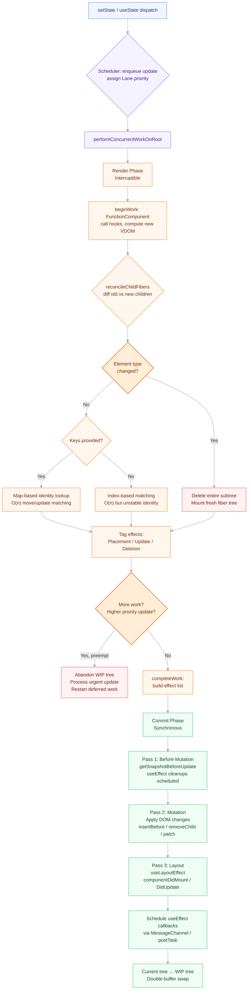
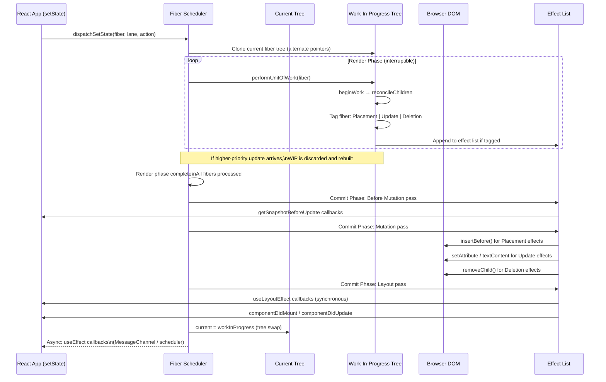

# React Reconciliation and Virtual DOM Diffing Algorithm

## 🎯 Executive Summary

React's reconciliation engine is the performance backbone of every non-trivial React application. At its core, it answers one question: **given a previous tree and a next tree, what is the minimal set of DOM mutations required to transition between them?**

This topic is not a "nice to know" at Staff level — it is table stakes. Interviewers use it as a forcing function to expose whether you reason in terms of **framework contracts and guarantees** or in terms of **symptoms and workarounds**. A Senior dev who says "use keys" is describing a tool. A Lead who explains *why* the fiber work loop needs stable identity anchors across render boundaries — and what happens to component state when that contract breaks — is demonstrating architectural judgment.

Why it matters for Leads specifically:
- Misconfigured reconciliation causes O(n²) subtree re-renders at scale, invisible in local dev, catastrophic in production with large lists or deeply nested trees.
- Key misuse is one of the most common sources of subtle, hard-to-reproduce state bugs in complex UIs.
- Understanding the fiber scheduler is a prerequisite for reasoning about Concurrent Mode, `useTransition`, and `Suspense` — all of which are now mainstream interview topics at FAANG.
- You will be asked to diagnose performance regressions in system design rounds. Without reconciliation internals, your diagnosis will always be one abstraction layer too shallow.

---

## 🧠 Core Technical Deep Dive

### The Naive Problem: Tree Diffing is O(n³)

Classical tree edit distance algorithms (e.g., Zhang-Shasha) run in O(n³) time. For a DOM tree with 1,000 nodes, that's 10⁹ operations per render — completely infeasible at 60fps. React's algorithm achieves O(n) by making **two heuristic bets**:

1. **Elements of different types produce different trees.** When the root element type changes (`div` → `span`), React tears down the entire subtree and mounts a fresh one. No attempt is made to reconcile children.
2. **The developer can signal stable identity across renders using `key` props.** Without keys, React assumes list position implies identity. With keys, it performs a map-based identity lookup instead.

These are heuristics, not correctness guarantees. They trade theoretical optimality for practical performance. Understanding where they break is the Lead's job.

---

### The Fiber Architecture (React 16+)

Before Fiber (React ≤ 15), reconciliation was a **synchronous, recursive stack walk**. Once started, it could not be interrupted. This caused "jank" — long frames where the main thread was blocked processing large trees.

Fiber replaced the call stack with an explicit **linked-list work queue**, where each unit of work is a *fiber node*. A fiber is a plain JavaScript object representing a component instance or DOM element in the work-in-progress tree.

#### Fiber Node Structure (Simplified)

```typescript
type Fiber = {
  // Identity
  type: string | Function | null;         // 'div', MyComponent, etc.
  key: string | null;
  
  // Tree pointers
  child: Fiber | null;       // First child
  sibling: Fiber | null;     // Next sibling
  return: Fiber | null;      // Parent
  
  // Work
  pendingProps: any;
  memoizedProps: any;
  memoizedState: any;        // Hooks state (linked list of hook objects)
  
  // Effect tracking
  effectTag: number;         // Bitmask: Placement | Update | Deletion
  nextEffect: Fiber | null;  // Singly-linked list of dirty fibers
  
  // Double-buffering
  alternate: Fiber | null;   // Points to the current/work-in-progress twin
};
```

#### Double Buffering

React maintains **two fiber trees** simultaneously:

- **Current tree**: represents what is currently rendered on screen.
- **Work-in-progress tree**: the in-progress computation of what the next render will look like.

Every fiber has an `alternate` pointer linking it to its twin in the other tree. When a render completes, the trees are swapped atomically — the WIP tree becomes current. This is how Concurrent Mode achieves interruptibility: the WIP tree can be discarded and rebuilt from scratch without affecting the visible UI.

---

### The Reconciliation Algorithm in Detail

#### Phase 1: Render Phase (Interruptible)

React performs a **depth-first traversal** of the fiber tree, processing one fiber at a time via the `performUnitOfWork` loop. For each fiber, it calls `beginWork`, which determines what changed:

```javascript
// Pseudo-implementation of beginWork dispatch
function beginWork(current, workInProgress, renderLanes) {
  switch (workInProgress.tag) {
    case FunctionComponent:
      return updateFunctionComponent(current, workInProgress, ...);
    case ClassComponent:
      return updateClassComponent(current, workInProgress, ...);
    case HostComponent:          // Native DOM elements
      return updateHostComponent(current, workInProgress);
    case Fragment:
      return updateFragment(current, workInProgress);
    // ...
  }
}
```

For `HostComponent` (DOM elements), the key logic is:

```typescript
function reconcileChildren(
  current: Fiber | null,
  workInProgress: Fiber,
  nextChildren: any,
  renderLanes: Lanes
) {
  if (current === null) {
    // Mounting: no diffing needed, mount everything
    workInProgress.child = mountChildFibers(workInProgress, null, nextChildren, renderLanes);
  } else {
    // Updating: diff old children against new children
    workInProgress.child = reconcileChildFibers(workInProgress, current.child, nextChildren, renderLanes);
  }
}
```

#### The Child Reconciler: Where Keys Matter

`reconcileChildFibers` handles three cases based on the shape of `nextChildren`:

**Single child (object):** Type comparison. Same type → update fiber. Different type → delete old, place new.

**Array of children:** React runs a **two-pass algorithm**:

```typescript
// Pass 1: Iterate new children, match by index against old fiber linked list
// - If types match at same index: reuse (update)
// - If types differ: break early

// Pass 2 (if old children remain): Build a Map<key|index, Fiber> from remaining old children
// Then iterate remaining new children and look up by key
// - Found in map: reuse (move + update), mark as used
// - Not found: create new (Placement effect)
// After iteration: any remaining in map get Deletion effect
```

This is why **key stability is critical for lists**. Without stable keys, React falls back to index-based matching. An insertion at position 0 in a 1,000-item list will cause 1,000 fiber updates instead of 1 insertion + 0 updates.

#### Phase 2: Commit Phase (Synchronous, Non-Interruptible)

Once the render phase completes, React synchronously applies all effects in **three sub-passes**:

1. **Before Mutation**: Calls `getSnapshotBeforeUpdate` on class components, schedules `useEffect` cleanups.
2. **Mutation**: Applies actual DOM mutations — `insertBefore`, `removeChild`, `textContent` updates, attribute patches.
3. **Layout**: Calls `componentDidMount`/`componentDidUpdate`, runs `useLayoutEffect` synchronously.

`useEffect` callbacks are scheduled *after* the commit phase, deferred to a later task via the scheduler (MessageChannel-based in React's implementation).

---

### Bailout Optimization: Skipping Subtrees

React has a bailout path in `beginWork` that can short-circuit processing entire subtrees:

```typescript
// Inside beginWork, before doing any real work:
if (current !== null) {
  const oldProps = current.memoizedProps;
  const newProps = workInProgress.pendingProps;
  
  if (
    oldProps === newProps &&          // Props reference-equal
    !hasContextChanged() &&
    !hasScheduledUpdateOrContext(current, renderLanes)
  ) {
    return bailoutOnAlreadyFinishedWork(current, workInProgress, renderLanes);
  }
}
```

This is what `React.memo`, `PureComponent`, and `shouldComponentUpdate` hook into — they enforce `oldProps === newProps` (by reference) to trigger the bailout. **This is why object/function creation in render props is so costly** — it defeats bailout for all downstream components even when the data hasn't logically changed.

---

### Lanes: Priority Scheduling in Concurrent Mode

React 18 introduced the **Lanes model** (replacing the older ExpirationTime model). Each update is assigned a lane — a bitmask value representing its priority:

```typescript
const SyncLane         = 0b0000000000000000000000000000001;
const InputContinuousLane = 0b0000000000000000000000000000100;
const DefaultLane      = 0b0000000000000000000000000010000;
const TransitionLane1  = 0b0000000000000000000000001000000;
const IdleLane         = 0b0100000000000000000000000000000;
```

`useTransition` marks updates as TransitionLane, allowing React to defer them in favor of SyncLane (user input). The fiber scheduler can **interleave** high-priority updates into a lower-priority render by abandoning the WIP tree, processing the urgent update, then replaying the deferred work.

This has a non-obvious consequence: **render functions may execute multiple times** in Concurrent Mode. Any render-phase side effect (mutation, network call) will execute multiple times. This is not a bug — it is a design contract. The Strict Mode double-invocation in development is explicitly exposing this contract.

---

## 📊 Visual Architecture & Logic

### Diagram 1: Reconciliation Flow (Render → Commit)



---

### Diagram 2: Fiber Double-Buffer Architecture & Effect Chain



---

## 🏢 Interview Context & FAANG Signals

### Where It Appears

| Round Type | How It Shows Up |
|---|---|
| Technical Phone Screen | "Explain why keys matter in lists" (surface-level filter) |
| System Design — Frontend | "Design a real-time dashboard with 10k rows — how do you manage re-render cost?" |
| Frontend Deep Dive | "Walk me through what happens between setState and the DOM update" |
| Debugging/Behavioral | "Tell me about a performance regression you diagnosed and fixed" |
| Architecture Review | "We're moving to Concurrent Mode — what breaks and why?" |

### What Interviewers Are Listening For (Lead Signals)

- **Fiber as the unit of work**: Candidates who still reason about "the virtual DOM" as a monolithic snapshot are pre-Fiber thinkers. Mentioning the fiber work loop, interruptibility, and the double-buffer model signals post-React-16 depth.
- **Effect list, not full-tree scan**: The commit phase doesn't scan the entire tree — it walks a pre-built singly-linked effect list. Knowing this shows you understand the actual implementation, not a simplified mental model.
- **Lanes vs ExpirationTime**: If Concurrent Mode comes up, knowing that the scheduler was rewritten around lane bitmasks (vs the old expiration time model) signals you've read the source, not just the docs.
- **Render phase purity as a contract**: Framing Strict Mode's double-invocation as an **enforcement mechanism for the Concurrent Mode contract** — not just a "debug tool" — signals architectural thinking.
- **Bailout specificity**: Saying "use React.memo" is Senior. Explaining *why* bailout requires referential equality of props, and therefore why unstable references in parent renders defeat memoization downstream, is Lead.

---

## ⚔️ Lead Level vs Senior Level

### Question: "Why do keys matter and when should you use index as a key?"

**Senior Response:**
> "Keys help React identify which items in a list changed. Using index as a key can cause issues when items are reordered because React matches by position, which can cause incorrect state to be associated with the wrong component."

This is correct but shallow. It describes the symptom without the mechanism.

**Staff / Lead Response:**
> "Keys solve an identity-mapping problem during child reconciliation. Without keys, React's reconciler uses list index as a proxy for identity, which means a stable component state is anchored to a *slot*, not to a *value*. When items are reordered or prepended, the component at index 0 retains the state of whatever was at index 0 before the render — the state does not travel with the data.
>
> The reconciler's two-pass algorithm builds a `Map<key, Fiber>` from remaining old children and looks up incoming children by key. A stable, data-derived key causes the fiber — and its memoized state — to be reused for the correct item regardless of position change.
>
> Index as key is specifically correct when: the list is static (no reordering, no insertion, no deletion), and list items are stateless (no controlled inputs, no local component state, no animations). Violating either condition with index keys is a category of bug that doesn't show up in unit tests — it requires runtime state to manifest."

The Lead answer: names the algorithm, explains the state-travel contract, and gives a precise, non-dogmatic answer about when index keys are actually correct.

---

### Question: "How would you prevent unnecessary re-renders in a large component tree?"

**Senior Response:**
> "Use React.memo, useMemo, and useCallback to memoize components and values. Move state down to where it's used."

**Staff / Lead Response:**
> "There are three distinct levers, each addressing a different failure mode:
>
> **1. Bailout enforcement via memoization**: `React.memo` gates reconciliation on `Object.is` prop equality. The failure mode is that *any* unstable reference in a parent render (inline object literals, anonymous functions passed as props) defeats it downstream. The correct pattern is to stabilize references at the source: `useCallback` for handlers, `useMemo` for derived objects, or context value memoization to prevent cascading context consumer re-renders.
>
> **2. State colocation**: The real leverage is architectural — a state update re-renders the subtree from the component that holds the state downward. Moving state closer to its consumers limits blast radius. This is a structural decision, not a hook decision.
>
> **3. Concurrent Mode scheduling**: For non-urgent updates (search filtering, background data refreshes), `useTransition` or `useDeferredValue` moves them to a lower-priority lane. React can interrupt these renders to process user input, making the app feel faster without actually reducing render work.
>
> The first thing I do before reaching for memoization is profile with the React DevTools profiler to identify actual wasted renders — premature memoization adds cognitive overhead and can introduce stale closure bugs that are worse than the performance issue it was meant to solve."

---

## ⚠️ Common Pitfalls & Anti-Patterns

> ### ✕ Using Array Index as Key for Dynamic Lists
> **Why it's wrong:** Index-keyed list items tie fiber identity (and its memoized state) to a position slot, not to the datum. Insertions, deletions, and reorders cause React to reuse the wrong fiber for the wrong data. Controlled inputs (e.g., text fields) will visually show stale values. Animations will fire on the wrong items. These bugs only manifest with runtime state — they are invisible in unit tests.
>
> **✓ Correct Lead Approach:** Use a stable, unique identifier from your data model (`item.id`, `item.uuid`). If your data genuinely has no stable ID (e.g., a list of primitive values with no duplicates), index is acceptable *only* if the list is append-only or fully replaced, and list items carry no local state.

---

> ### ✕ Creating New Object/Function References in Render as Props
> **Why it's wrong:** `<Child style={{ color: 'red' }} onClick={() => doThing(id)} />` creates new object and function references on every parent render. This defeats `React.memo` on `Child` because `Object.is({color:'red'}, {color:'red'})` is `false`. The memoization cost is paid but the bailout never fires.
>
> **✓ Correct Lead Approach:** Stabilize references at the source. Hoist static objects outside the component. Use `useMemo` for computed objects and `useCallback` for handlers that depend on props/state. For event handlers in lists, prefer event delegation or pass stable IDs and look up data in the handler rather than closing over unstable references.

---

> ### ✕ Triggering State Updates in useEffect Without Dependency Discipline
> **Why it's wrong:** `useEffect` that triggers `setState` without a correct dependency array causes a render → effect → setState → render loop. In subtle cases (e.g., deriving state from props), this creates double-renders that are expensive and logically wrong. React's Strict Mode double-invocation exposes this but many teams disable Strict Mode to silence it, hiding the real problem.
>
> **✓ Correct Lead Approach:** State derived from props belongs in the render function or in `useMemo`, not in `useEffect`. If synchronization with an external system requires `useEffect`, ensure the dependency array precisely captures all values the effect reads, and ensure the effect either has a stable output or guards against re-firing with a comparison.

---

> ### ✕ Overusing Context for High-Frequency Updates
> **Why it's wrong:** Every consumer of a Context re-renders when the context value reference changes, regardless of whether the specific slice of data it uses changed. A single context object holding both auth state (rarely changes) and UI state (changes on every keystroke) forces auth-consuming components to re-render on every UI state change.
>
> **✓ Correct Lead Approach:** Split contexts by update frequency. Stable data (auth, theme, feature flags) in one context; volatile data (form state, cursor position, animation values) either in local state or in a purpose-built state manager that supports selective subscription (Zustand, Jotai, or React's own `useSyncExternalStore`). For truly high-frequency updates (60fps animations), consider bypassing React's reconciler entirely via refs and direct DOM mutation or a canvas layer.

---

> ### ✕ Misunderstanding the Render Phase Contract in Concurrent Mode
> **Why it's wrong:** Writing render functions or component bodies with side effects (logging analytics, mutating external refs, network calls) that assume single-execution. In Concurrent Mode, React may invoke the render function multiple times before committing. Teams that disable StrictMode's double-invocation lose the only early-warning system for this class of bug.
>
> **✓ Correct Lead Approach:** Treat the render phase as a pure computation. All side effects belong in `useEffect` (post-commit, async) or `useLayoutEffect` (post-commit, synchronous). Treat StrictMode's double-invocation as a correctness test, not a nuisance to suppress.

---

## 🛠️ Practice Scenarios

---

### Scenario 1: The Invisible State Bug

**Problem Statement:**
A team has a drag-and-drop task board. Each task card has a local `isExpanded` state. After reordering cards via drag-and-drop, the expanded/collapsed state appears to "jump" to the wrong cards. The list is rendered as `tasks.map((t, i) => <TaskCard key={i} task={t} />)`. You are called in to diagnose.

<details>
<summary>📋 Staff-Level Solution</summary>

The root cause is index-as-key. The `isExpanded` state lives in the `TaskCard` component's fiber. When tasks are reordered, React matches new children to old fibers by position (index). The fiber at index 0 — with its `isExpanded: true` state — is reused for whichever task object is now at position 0 after the drag. The state has not moved with the data; it has stayed with the slot.

**Fix:** Replace `key={i}` with `key={task.id}`. This anchors fiber identity to the datum, so `isExpanded` travels with the card regardless of list position.

**Lead insight to surface in interview:** This bug is undetectable in unit tests because unit tests don't maintain persistent component state across renders. It requires a live rendering environment with interaction. This is an argument for integration tests over unit tests for stateful UI components. Additionally, the correct long-term fix may be to lift `isExpanded` into the task data model itself (colocated with the source of truth), making the component stateless and eliminating the fiber-identity dependency entirely.

</details>

---

### Scenario 2: Memoization That Doesn't Work

**Problem Statement:**
An engineer has wrapped a `<DataTable>` component in `React.memo` and is using `useCallback` on all handlers passed to it. In the React DevTools profiler, `DataTable` still shows as re-rendering on every parent render. Identify the likely causes and how you'd diagnose them.

<details>
<summary>📋 Staff-Level Solution</summary>

`React.memo` uses `Object.is` shallow comparison on all props. Common failure modes:

1. **A prop that is an object literal or array created in render**: `<DataTable columns={['id', 'name']} />` — the array is new on every render even if content is the same. Fix: hoist outside component or `useMemo`.

2. **Context consumption inside `DataTable`**: If `DataTable` (or a child of it) consumes a Context that updates, `React.memo` on the outer component doesn't prevent re-renders caused by context changes. React.memo only guards against prop changes, not context changes.

3. **The `useCallback` dependency array is too broad**: If a `useCallback` has a dependency that changes every render (e.g., a derived object), the callback reference changes, which changes the prop, which defeats memo.

4. **React DevTools "profiler" is showing highlights for reasons other than memo bypass**: The yellow highlight in the profiler indicates a render occurred *for any reason*. A parent committing to the DOM can cause DevTools to highlight children even if they bailed out. Verify with the "Why did this render?" feature in the profiler.

**Diagnostic approach:** Use the profiler's "Record why each component rendered" option. This shows exactly which prop or state caused the render. Sort by "Render duration" to find expensive subtrees. Use `why-did-you-render` in development for automated logging.

</details>

---

### Scenario 3: Concurrent Mode Breaks a Feature

**Problem Statement:**
Your team upgrades from React 17 to React 18. After the upgrade, an analytics event (`trackView`) is firing twice for some components in development. The team wants to wrap the call in a `useRef` guard to deduplicate. You are asked to review the approach.

<details>
<summary>📋 Staff-Level Solution</summary>

The double-fire is StrictMode's intentional double-invocation of effects and render functions. The `useRef` guard is a band-aid that will mask legitimate bugs.

**Root problem:** `trackView` is being called in a context that executes more than once in Strict Mode — either in the render function body or in a `useEffect` without proper cleanup.

- If in render body: side effects do not belong there. Move to `useEffect`.
- If in `useEffect`: the effect is firing twice because StrictMode mounts → unmounts → remounts in development to test cleanup. The correct fix is to implement a cleanup function that cancels or marks the event as invalidated.

```typescript
useEffect(() => {
  let cancelled = false;
  
  if (!cancelled) {
    trackView({ componentId, timestamp: Date.now() });
  }
  
  return () => {
    cancelled = true;
    // If your analytics platform supports it: cancelPendingTrackView(componentId)
  };
}, [componentId]);
```

**Lead-level point:** The `useRef` guard would work in production (where StrictMode doesn't double-invoke) but would suppress the real bug signal in development. Evaluating the *why* before patching the symptom is the difference between a senior fix and a lead fix. This is also an opportunity to question whether client-side analytics firing should be tied to the React lifecycle at all — a separate intersection observer or route-change listener may be more appropriate for view tracking.

</details>

---

### Scenario 4: System Design — Real-Time Feed with 50k Items

**Problem Statement:**
Design the frontend architecture for a real-time activity feed that receives WebSocket updates at up to 100 events/second and can have up to 50,000 items in the list. Users can filter and search. Discuss how reconciliation impacts your design decisions.

<details>
<summary>📋 Staff-Level Solution</summary>

At 100 events/second, you cannot allow each event to trigger a React reconciliation cycle — that's 100 `setState` calls/second, each triggering a diff pass over the visible tree.

**Architecture layers:**

**1. Decouple the data stream from the render cycle.**
Buffer incoming WebSocket events in a `useRef`-backed accumulator (or an external store like Zustand). Use a debounced/throttled flush to React state at a controlled rate (e.g., `requestAnimationFrame` or 100ms debounce). This decouples ingestion rate from render rate.

```typescript
const bufferRef = useRef<Event[]>([]);

useEffect(() => {
  const interval = setInterval(() => {
    if (bufferRef.current.length > 0) {
      setEvents(prev => mergeEvents(prev, bufferRef.current));
      bufferRef.current = [];
    }
  }, 100);
  return () => clearInterval(interval);
}, []);
```

**2. Virtualize the list.** Never render 50k DOM nodes. Use `react-window` or `react-virtual` to render only the ~20–50 visible rows. This limits the reconciliation scope to the visible window, not the full list.

**3. Stable keys and immutable data.** Each event must have a stable `id`. Immutable event objects prevent spurious re-renders in memoized row components (since `Object.is` on the same reference always bails out).

**4. `useDeferredValue` for search/filter.** Filter computation is expensive at 50k items. Wrap the filter term in `useDeferredValue` so React can process user keystrokes at SyncLane priority while the filtered list re-renders at a lower TransitionLane priority.

**5. Consider bypassing React for the stream counter/indicators.** Real-time counters ("47 new items") should update via direct DOM manipulation or a ref-forwarded portal, not React state, to avoid triggering reconciliation for a purely visual indicator.

**Lead signal:** The answer distinguishes between what belongs in React's reconciliation model and what should bypass it entirely. React is a tool for describing UI state transitions — it is not the only tool available inside a React app.

</details>

---

### Scenario 5: Diagnosing a Commit-Phase Blocking Scroll Jank

**Problem Statement:**
Users report scroll jank on a page with a large list. You profile it and see long "commit" phase frames in the React DevTools profiler (not render phase). What does this tell you, and how do you fix it?

<details>
<summary>📋 Staff-Level Solution</summary>

Long commit phases indicate expensive synchronous work in `useLayoutEffect`, `componentDidMount`/`componentDidUpdate`, or expensive DOM mutation operations applied in the mutation pass.

**Diagnostic steps:**

1. Check for `useLayoutEffect` usage in list item components. `useLayoutEffect` runs synchronously after DOM mutation, before paint. Any expensive computation here (layout reads, large array operations, synchronous external store updates) blocks the frame.

2. Check for forced layout / reflow triggers inside effects. Reading `offsetHeight`, `getBoundingClientRect`, or `scrollTop` after a write causes browser layout to flush synchronously (layout thrashing). In a list of 100+ items this compounds.

3. Check for DOM-writing effects that read layout first: `element.style.height = element.scrollHeight + 'px'` in a loop is the classic pattern.

**Fix strategy:**
- Migrate non-layout work from `useLayoutEffect` to `useEffect`. `useEffect` is asynchronous and does not block paint.
- For legitimate layout reads (e.g., measuring an element to position a tooltip), batch reads before writes using `ResizeObserver` or a single `useLayoutEffect` at the tree root rather than per-item.
- For list virtualization, ensure the virtualizer's scroll handler is outside React state (it should be — react-virtual uses refs internally for this reason).

**Lead signal:** Distinguishing render phase performance (component re-render cost) from commit phase performance (side-effect and DOM mutation cost) is a filter question. Many engineers only know to optimize re-renders. The commit phase is where layout jank actually lives.

</details>

---

### Scenario 6: Context Architecture Review

**Problem Statement:**
A team has a single `AppContext` containing: `user`, `theme`, `notifications` (array updated every 30s), `sidebarOpen` (boolean, toggled on every click), and `modalStack` (array, changes on navigation). Performance is poor throughout the app. How do you restructure this?

<details>
<summary>📋 Staff-Level Solution</summary>

This is a classic context anti-pattern: high-frequency and low-frequency data sharing a single context value. Every `sidebarOpen` toggle creates a new context value object, causing every `AppContext` consumer — including deeply nested components that only care about `user` — to re-render.

**Restructuring principle: split by update frequency and consumer domain.**

```typescript
// Rarely changes (session lifecycle)
const AuthContext = createContext<User | null>(null);

// Changes on user preference actions  
const ThemeContext = createContext<Theme>(defaultTheme);

// Changes on navigation events
const ModalContext = createContext<ModalStack>([]);

// Changes on server poll (every 30s)
const NotificationContext = createContext<Notification[]>([]);

// Changes on every sidebar toggle — highest frequency
const UIStateContext = createContext<UIState>(defaultUIState);
```

For `sidebarOpen` and other UI state that changes frequently and is consumed by few components, evaluate whether context is the right primitive at all. A Zustand store with selective subscription (`useStore(state => state.sidebarOpen)`) avoids the all-consumers-re-render problem entirely.

**For notifications (server poll):** Consider `useSyncExternalStore` to subscribe components to an external store that only notifies components whose consumed slice has changed, rather than re-rendering all consumers on every poll.

**Lead signal:** The answer proposes a concrete architecture, not just "split your context." It also questions whether React Context is the right tool for high-frequency updates in the first place, and names `useSyncExternalStore` as the correct primitive for subscribing to external stores with granular re-render control.

</details>

---

### Scenario 7: Strict Mode Double Mount Breaking Third-Party Integration

**Problem Statement:**
Your team integrates a third-party charting library that initializes by calling `chart.init(canvasElement)` in a `useEffect`. In React 18 Strict Mode (development), the chart initializes, destroys, and re-initializes — the second initialization throws because the canvas is in an invalid state. The team proposes disabling Strict Mode. Evaluate.

<details>
<summary>📋 Staff-Level Solution</summary>

Disabling Strict Mode silences the symptom but eliminates your only Concurrent Mode compatibility detector. This is a poor trade.

The actual problem is that the effect lacks proper cleanup, and the third-party library's `init` method is not idempotent. The correct fix:

```typescript
useEffect(() => {
  const chartInstance = ChartLibrary.init(canvasRef.current, config);
  
  return () => {
    chartInstance.destroy(); // cleanup: return to pre-init state
  };
}, []); // empty deps: run once per mount lifecycle
```

The cleanup function must return the canvas/DOM element to a state where `init` can safely be called again. If the library doesn't provide a `destroy` method, this is a bug in the library — either patch it, wrap it, or replace it.

**Deeper issue:** If the library mutates the canvas element in a way that cannot be undone (e.g., replaces it with a new element), you may need to key the wrapper component to force a full unmount/remount cycle rather than relying on the effect cleanup:

```typescript
// Force full remount when chartId changes
<ChartWrapper key={chartId} config={config} />
```

**Lead signal:** Correctly identifies that StrictMode is testing a contract (effect idempotence), not introducing a bug. Proposes library-level fixes over React configuration changes. Knows the difference between effect cleanup and component-level remount as solutions to different initialization problems.

</details>

---

### Scenario 8: Key Abuse for Forced Re-mount

**Problem Statement:**
A team uses `<Component key={Math.random()} />` to force a component to fully remount on every parent render because a buggy `useEffect` inside it wasn't correctly cleaning up. A new engineer asks if this is an acceptable pattern. What's your response?

<details>
<summary>📋 Staff-Level Solution</summary>

`key={Math.random()}` is never acceptable as a permanent pattern. Here's the full accounting:

**What it does:** A new key on every render signals to React that this is an entirely new element, not an update to the existing one. React deletes the old fiber (running all cleanup effects) and mounts a fresh fiber. This is the most expensive possible reconciliation outcome for that subtree.

**Why it's masking a bug:** The underlying problem is an effect without correct cleanup. The random key pattern is paying a full unmount/remount cost on every render to work around a cleanup bug that costs nothing to fix correctly.

**The correct fix:** Identify what state the effect is leaving behind that requires a fresh mount. Write the cleanup function to undo that state. If it's a subscription: unsubscribe. If it's a timer: clear it. If it's a DOM mutation: reverse it.

**When forced remount via key IS correct:** Deliberately resetting a component's complete state when a logical identity changes (e.g., switching from viewing user A's profile to user B's profile). In that case, `key={userId}` is the right primitive — it's explicit, intentional, and tied to a semantically meaningful change.

```typescript
// WRONG: forces remount on every render, O(n) DOM destruction per frame
<ProfileEditor key={Math.random()} userId={selectedId} />

// RIGHT: remounts only when the logical subject changes
<ProfileEditor key={selectedId} userId={selectedId} />
```

**Lead signal:** Distinguishes between using key as an identity signal (correct, intentional) vs. using key as a reset escape hatch (masking a bug). Articulates the performance cost in concrete terms. Redirects to fixing the actual problem.

</details>
