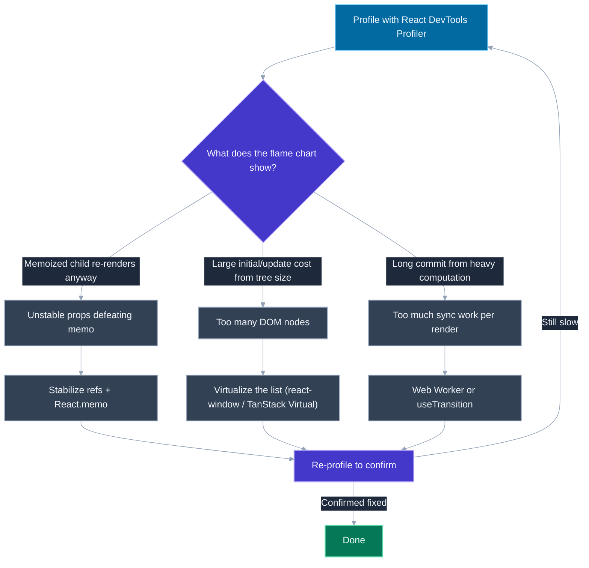
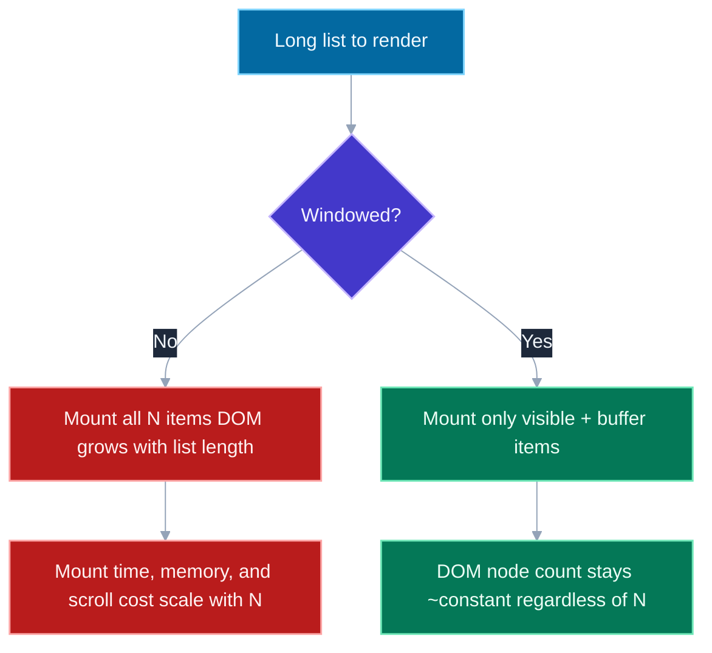

# React Runtime Performance: Profiling, Re-render Prevention, Virtualisation

## 🎯 Executive Summary

React runtime performance work is where three previously-separate skills have to come together under time pressure: reading a profile correctly, knowing which of several *different* fixes actually addresses what the profile showed, and recognizing when the real problem isn't re-renders at all but simply too much DOM. Most engineers know the individual pieces — `useMemo`, `React.memo`, maybe `react-window` — in isolation. What separates a Lead is the *workflow*: profile first, diagnose which layer is actually slow, apply the fix that matches that layer, then re-profile to confirm it worked instead of assuming it did.

This is a MUST-KNOW synthesis topic at Lead/Staff level because interviewers use it to test whether a candidate optimizes by reflex ("just wrap it in `useMemo`") or by evidence. A long, unvirtualized list rendering thousands of DOM nodes will not get faster no matter how aggressively you memoize its rows — memoization prevents re-renders of components that already exist, it does nothing about the cost of having mounted 10,000 of them in the first place. Conflating these two problems, or reaching for memoization as a universal hammer, is one of the most common tells that someone hasn't done this in production.

In interviews this surfaces as a live-coding or take-home exercise with a visibly janky list or table, a "how would you make this feature faster" system-design follow-up, or a direct question about virtualization libraries. The expected answer is rarely "add `React.memo` everywhere" — it's a short, evidence-driven investigation: open the Profiler ([`/topic-detail.html?id=react-devtools-profiler`](/topic-detail.html?id=react-devtools-profiler)), see where time is actually going, and pick the fix — memoization ([`/topic-detail.html?id=react-memoization`](/topic-detail.html?id=react-memoization)), virtualization, or moving work off the render path — that matches the diagnosis.

## 📖 What Is It? (Plain-English Definition)

**In plain terms:** React runtime performance is the discipline of finding out *why* a React app feels slow while it's running (not while it's loading), and applying the one fix out of several plausible ones that actually matches the cause.

There isn't a single "React performance" technique — there's a small toolbox (memoization, virtualization, splitting components, moving work off the main thread, deferring low-priority updates), and each tool fixes a distinct kind of slowness. Picking a tool without first identifying the problem is like tightening every bolt on a wobbly table leg by leg without checking which leg is actually loose — you might get lucky, but you're just as likely to spend effort on something that was never broken.

A useful analogy: imagine a restaurant kitchen that's falling behind during a dinner rush. One diagnosis might be "the same dish is being re-cooked from scratch every time, even when nothing about the order changed" — that's a re-render problem, and the fix is caching/memoizing. A different diagnosis might be "we're preparing every dish on the entire menu for every table, even the ones nobody ordered" — that's a virtualization problem, and the fix is only preparing what's actually being looked at. Both look like "the kitchen is slow," but the fixes don't overlap, and applying the wrong one wastes effort while the real bottleneck keeps costing time.

This topic assumes familiarity with *how* memoization and reconciliation work mechanically — see [`react-memoization`](/topic-detail.html?id=react-memoization) and [`react-reconciliation`](/topic-detail.html?id=react-reconciliation) for those internals. What follows is about combining those tools with profiling and virtualization into a repeatable investigative process.

## 🧠 Core Technical Deep Dive

### The applied workflow: profile, diagnose, fix the right layer, re-profile

The single biggest differentiator in this topic is refusing to optimize blind. The workflow has four steps, and skipping the first or last one is the most common mistake:

1. **Profile first.** Open React DevTools' Profiler tab, record an interaction, and look at the flame chart to see which components actually re-rendered and how long each took. Full mechanics of reading this tool — commit timeline, flame vs. ranked chart, "why did this render" — are covered in [`react-devtools-profiler`](/topic-detail.html?id=react-devtools-profiler); the point for this topic is simply: **do this before writing any optimization code.** Guessing which component is slow is frequently wrong, and "fixing" a component that wasn't actually the bottleneck burns time and adds complexity for zero measured benefit.

2. **Diagnose which layer is responsible.** The profile typically points to one of three distinct problems, and they require different fixes:
   - **Unstable props are defeating memoization** — a memoized child is re-rendering anyway because a parent passes it a new function/object/array reference every render, even though the *values* haven't meaningfully changed.
   - **Too many DOM nodes are mounted** — the component tree itself is enormous (a long list, a huge table), so even a single render pass is expensive purely from DOM size, independent of whether anything is unnecessarily re-rendering.
   - **Too much synchronous work happens per render** — a render (or an event handler feeding into one) does real computational work — sorting, filtering, formatting — that blocks the main thread long enough to feel janky.

3. **Fix the layer the profile actually identified:**
   - Unstable props → memoization: stabilize the references (`useMemo`/`useCallback`) and wrap the child in `React.memo` so it can actually skip re-rendering when props are referentially stable. See [`react-memoization`](/topic-detail.html?id=react-memoization) for the full mechanics and pitfalls (e.g., memoizing a component that receives `children` as JSX, which is a new reference every render regardless).
   - Too many DOM nodes → virtualize: stop mounting elements the user can't currently see (covered in depth below).
   - Too much synchronous work → move it off the critical path: offload genuinely heavy computation to a Web Worker so it doesn't block the main thread at all, or, if the work is React state-driven and can tolerate being deprioritized, wrap it in `startTransition`/`useTransition` so React can interrupt it for more urgent updates (typing, clicks). See [`react-18-features`](/topic-detail.html?id=react-18-features) for how transitions and concurrent rendering work.

4. **Re-profile to confirm.** Record the same interaction again and check that the specific metric you targeted actually improved — commit duration dropped, the previously-wide flame chart bar shrank, the long task disappeared. A fix that "should" help but wasn't verified against a fresh profile is unverified, not done. This closes the loop back to step 1: profiling isn't just the diagnostic step, it's also the acceptance test.

> **Key takeaway:** the three diagnoses above are not interchangeable, and their fixes don't substitute for each other. Memoizing rows inside an unvirtualized 10,000-row list changes nothing about the fact that 10,000 DOM nodes exist — the profiler will still show a large initial mount cost that no amount of `React.memo` touches.

### Virtualization / windowing

Virtualization (also called "windowing") is the technique of rendering DOM nodes only for the list items currently in or near the viewport, instead of rendering every item in a dataset up front. Common libraries: **`react-window`** (a lightweight, purpose-built successor to the older `react-virtualized`), **TanStack Virtual** (headless, framework-agnostic core with a React adapter), and **`react-virtualized`** itself (the original, heavier, still in wide use in older codebases).

**Mechanism.** A virtualized list has two moving parts:

- An **outer scroll container** with a height set to the *total* height the full, un-rendered list would occupy if every item were mounted (either a fixed height × item count for uniform rows, or a running sum of measured heights for variable rows). This is what gives the scrollbar correct, realistic proportions even though almost none of the content behind it actually exists in the DOM.
- An **inner window of currently-visible items**, each absolutely positioned (via `transform: translateY(...)` or `top` offsets) at the vertical position it would occupy in the full list. As the user scrolls, the library recalculates which index range is visible (usually with a small overscan/buffer above and below the viewport to avoid blank flashes on fast scrolling), unmounts items that scrolled out of range, and mounts newly-visible ones at their correct offsets.

The net effect: DOM node count stays roughly constant — bounded by viewport height ÷ average item height, plus buffer — regardless of whether the underlying dataset has 100 items or 1,000,000. Scroll performance, initial mount time, and memory usage all stop scaling with list length.

```javascript
import { FixedSizeList as List } from 'react-window';

function Row({ index, style, data }) {
  const item = data[index];
  return (
    <div style={style} className="row">
      {item.name}
    </div>
  );
}

function VirtualizedList({ items }) {
  return (
    <List
      height={600}          // outer viewport height
      itemCount={items.length}
      itemSize={48}          // fixed row height, drives total scroll height
      width="100%"
      itemData={items}
    >
      {Row}
    </List>
  );
}
```

The `style` prop passed into `Row` is where the absolute positioning happens — `react-window` computes `position: absolute; top: <n>px; height: 48px` for whichever index is currently being rendered, and the library swaps which indices get that treatment as the user scrolls.

**Virtualization vs. memoization — explicitly distinct, and complementary, not alternatives.** This is the single most important distinction in this topic:

- **Memoization** skips *re-rendering* components that already exist in the tree, when their inputs haven't meaningfully changed. The component is mounted; the work being avoided is the wasted re-render.
- **Virtualization** skips *ever mounting* components that aren't currently visible at all. The component doesn't exist in the DOM or the React tree; there's no render to memoize because there's no instance yet.

A long list benefits from both, addressing different costs: virtualization keeps the DOM small so *any* render (including the first one) stays cheap; memoization, applied to the row component that virtualization *does* mount, prevents those visible rows from re-rendering unnecessarily when, say, a sibling's state changes but the row's own data didn't. Using one without the other leaves the other cost fully in place — a memoized-but-unvirtualized list still pays the full DOM-size cost on mount and on any update that touches every row; a virtualized-but-unmemoized list still re-renders every currently-visible row on every parent state change even though only one row's data actually changed.

> **Key takeaway:** "should I memoize or virtualize this list" is usually a false choice — the profiler tells you if either, both, or neither is warranted, and they solve non-overlapping problems.

### Component granularity as a technique distinct from memoization

Splitting one large component into several smaller ones is a structural technique, not a memoization technique, even though the two are frequently used together. The idea: when state updates, React has to re-render the component that owns that state and (by default) all of its descendants. If one giant component owns both a frequently-changing piece of state (e.g., an input's value) and a large, expensive subtree that doesn't actually depend on that state, every keystroke re-renders the expensive subtree too — not because anything is unmemoized, but because the state update's "blast radius" was made large by the component's shape.

```javascript
// Before: one component, large blast radius
function Dashboard() {
  const [query, setQuery] = useState('');
  return (
    <div>
      <input value={query} onChange={e => setQuery(e.target.value)} />
      <ExpensiveChart data={massiveDataset} />   {/* re-renders on every keystroke */}
      <ExpensiveTable rows={massiveDataset} />   {/* re-renders on every keystroke */}
    </div>
  );
}

// After: search state isolated into its own component
function SearchInput({ onQueryChange }) {
  const [query, setQuery] = useState('');
  const handleChange = e => {
    setQuery(e.target.value);
    onQueryChange(e.target.value);
  };
  return <input value={query} onChange={handleChange} />;
}

function Dashboard() {
  return (
    <div>
      <SearchInput onQueryChange={/* ... */} />
      <ExpensiveChart data={massiveDataset} />   {/* no longer re-renders per keystroke */}
      <ExpensiveTable rows={massiveDataset} />
    </div>
  );
}
```

No `useMemo`, no `React.memo`, no `useCallback` appears anywhere in the fix — the improvement comes entirely from moving the frequently-changing state into a component that doesn't also own the expensive subtree, shrinking what has to re-render by construction rather than by skipping renders after the fact. This is frequently a *cheaper* and more robust fix than memoization, because it has no dependency-array correctness burden — there's nothing to get subtly wrong the way a stale `useCallback` dependency array can be wrong.

> **Key takeaway:** before reaching for `React.memo`, ask whether the component could simply be split so the expensive part doesn't share a re-render boundary with the frequently-changing part. Structural fixes have no correctness footguns; memoization does.

### React Compiler (brief mention)

The React Compiler (formerly "React Forget") is a build-time tool that automatically inserts memoization-equivalent optimizations — comparable to hand-written `useMemo`/`useCallback`/`React.memo` — by statically analyzing component code, without the developer writing any of those calls by hand. It's worth being aware this exists and roughly what problem it targets (removing the manual, error-prone bookkeeping of dependency arrays for the *memoization* layer specifically), but it does not replace profiling, and it does nothing for virtualization or component-granularity decisions — those remain explicit architectural choices a Lead still has to make. Deep expertise in its internals is not expected at interview level; knowing it exists and what class of problem it addresses is.

## 📊 Visual Architecture & Logic

### Diagram 1 — The profile → diagnose → fix → re-profile loop



### Diagram 2 — Fully-mounted list vs. virtualized list



## 🏢 Interview Context & FAANG Signals

| Interview Stage | Format |
|---|---|
| Live coding | Given a janky list/table component, asked to diagnose and fix it |
| Take-home review | Reviewing a PR that "optimizes" a component and judging whether the fix matches a real bottleneck |
| System design | Feature involving a large dataset (feed, table, search results) — asked how rendering stays fast at scale |
| Trivia/knowledge check | "What's the difference between memoization and virtualization?" |

**Lead signals interviewers listen for:**

1. Opening with "I'd profile it first" rather than naming an optimization immediately.
2. Correctly separating "re-renders too often" from "too many DOM nodes exist" as different problems with different fixes.
3. Naming virtualization and a real library (`react-window`, TanStack Virtual) unprompted when a list is large, rather than reaching only for `React.memo`.
4. Mentioning component-splitting as a way to shrink a state update's blast radius, independent of memoization.
5. Closing the loop with "and I'd re-profile to confirm" rather than treating the fix as self-evidently correct.

## ⚔️ Lead Level vs Senior Level

**Question: "A table with a few thousand rows feels janky when the user types into a filter box above it. How would you fix it?"**

> **Senior Response:** "I'd wrap the row component in `React.memo` and memoize the filtered data with `useMemo` so we're not recalculating and re-rendering everything on every keystroke."

> **Staff/Lead Response:** "Before changing anything I'd profile it — record a keystroke in the React DevTools Profiler and see what's actually expensive. If the flame chart shows every row re-rendering because the filter function or row callbacks are recreated each render, then yes, stabilizing those references plus `React.memo` on the row is the right fix. But if the table is rendering a few thousand DOM nodes regardless of filtering, the bigger cost is likely just having that many rows mounted at all — memoizing rows doesn't reduce DOM node count, it only skips re-rendering nodes that already exist. In that case I'd virtualize the table with something like TanStack Virtual so only the visible rows are ever mounted, which fixes both the initial cost and the filter-driven update cost at once. I'd also check whether the filtering itself is the expensive part — if it's a non-trivial computation over a large array running synchronously in the input handler, that's a candidate for `useTransition` so typing stays responsive while filtering happens at lower priority. I wouldn't apply any of these without profiling first, and I'd re-profile after to confirm the specific bottleneck I targeted actually went away."

The differentiator: a Senior names memoization as the default answer; a Lead treats "too many rows" and "too many re-renders" as different diagnoses requiring different fixes, and verifies the diagnosis with a profile before touching code.

## ⚠️ Common Pitfalls & Anti-Patterns

> ### ✕ Memoizing everything before profiling
> **Why it's wrong:** Wrapping components in `React.memo` and hooks in `useMemo`/`useCallback` reflexively, without measuring first, adds comparison overhead and dependency-array maintenance burden to code that may not have been slow in the first place — and does nothing if the real cost is DOM size rather than re-renders.
> **✓ Correct Lead Approach:** Profile first. Apply memoization only to components the profiler shows are re-rendering unnecessarily and expensively.

---

> ### ✕ Treating a long list's jank as a memoization problem
> **Why it's wrong:** Memoizing row components in an unvirtualized list of thousands of items prevents unnecessary *re-renders* but does nothing about the cost of having mounted thousands of DOM nodes in the first place — initial mount time and layout cost stay exactly the same.
> **✓ Correct Lead Approach:** When the profiler shows cost scaling with list length rather than with re-render frequency, virtualize the list so DOM node count stays roughly constant regardless of dataset size.

---

> ### ✕ Virtualizing without also memoizing visible rows when needed
> **Why it's wrong:** Virtualization keeps DOM size bounded, but the handful of rows that *are* mounted will still re-render unnecessarily on every parent state change if their props aren't stable — assuming virtualization alone "solved performance" can leave a real re-render problem in place among the visible rows.
> **✓ Correct Lead Approach:** Use both together where the profile warrants it: virtualize to bound DOM size, memoize the row component to avoid wasted re-renders among the rows that remain mounted.

---

> ### ✕ Reaching for `useTransition` to fix DOM-size or unstable-prop problems
> **Why it's wrong:** `useTransition`/`startTransition` deprioritize a state update so more urgent updates (typing, clicks) can interrupt it — they help when the *problem* is that a low-priority update is blocking a high-priority one. They don't reduce DOM node count and don't fix broken memoization; applying them to those problems leaves the underlying cost untouched while adding concurrent-rendering complexity.
> **✓ Correct Lead Approach:** Reserve transitions for genuinely deferrable, computation-heavy state updates identified by profiling — not as a general-purpose performance switch.

---

> ### ✕ Shipping a fix without re-profiling
> **Why it's wrong:** A change that "should" help based on reasoning alone is unverified. Memoization can fail silently (a `children` prop or an inline object still breaks referential equality even after "fixing" it elsewhere), and a fix can address the wrong layer entirely without anyone noticing until a later performance regression report.
> **✓ Correct Lead Approach:** Re-record the same interaction in the Profiler after the fix and confirm the specific metric that was targeted (commit duration, number of components rendered, flame chart width) actually improved.

## 🛠️ Practice Scenarios

### Scenario 1: A memoized row still re-renders on every parent update

**Problem:**
```javascript
const Row = React.memo(function Row({ item, onSelect }) {
  return (
    <div className="row" onClick={() => onSelect(item.id)}>
      {item.label}
    </div>
  );
});

function ItemList({ items }) {
  const [selectedId, setSelectedId] = useState(null);

  // recreated on every ItemList render
  const handleSelect = (id) => setSelectedId(id);

  return (
    <div>
      {items.map(item => (
        <Row key={item.id} item={item} onSelect={handleSelect} />
      ))}
    </div>
  );
}
```
The Profiler shows every `Row` re-rendering whenever `selectedId` changes, even though `React.memo` wraps `Row`. Why, and what would you change?

<details>
<summary>Staff-Level Solution</summary>

`handleSelect` is a new function reference on every `ItemList` render (including the render triggered by `setSelectedId` itself), so `React.memo`'s shallow prop comparison sees a changed `onSelect` prop on every `Row` and re-renders all of them — `React.memo` is working correctly, but the props genuinely aren't stable. The fix is `useCallback(handleSelect, [])` (or with whatever real dependencies exist) to give `handleSelect` a stable identity across renders, so `Row`'s shallow comparison actually sees no changed props for items whose `item` didn't change.

Separately, I'd flag that if `items` itself is large, memoizing rows only prevents wasted re-renders of rows that already exist — if this list is long enough that mount cost matters, virtualization is the complementary fix for that separate problem, not a substitute for stabilizing `onSelect` here.
</details>

---

### Scenario 2: A 5,000-row table with no virtualization

**Problem:**
```javascript
function DataTable({ rows }) {
  return (
    <table>
      <tbody>
        {rows.map(row => (
          <tr key={row.id}>
            <td>{row.name}</td>
            <td>{row.status}</td>
            <td>{row.updatedAt}</td>
          </tr>
        ))}
      </tbody>
    </table>
  );
}

// rendered with rows.length === 5000
```
Initial render takes over a second and scrolling stutters. A teammate suggests wrapping each `<tr>` in `React.memo`. Evaluate that suggestion and propose your own fix.

<details>
<summary>Staff-Level Solution</summary>

`React.memo` on the row wouldn't help the reported symptoms at all — the problem described (slow *initial* render, stuttery scroll) isn't caused by unnecessary re-renders of existing rows; it's caused by 5,000 `<tr>` elements existing in the DOM simultaneously. Memoization has nothing to skip on first mount, and scroll jank from a huge DOM tree is a browser layout/paint cost, not a React re-render cost.

I'd virtualize the table instead — e.g., TanStack Virtual's table adapter, or restructure to `react-window`'s `FixedSizeList` if row height is uniform — so only the rows currently in (and just outside) the viewport are ever mounted, with the outer container sized to the full virtual height so the scrollbar behaves correctly. I'd confirm with the Profiler that the commit for initial mount drops substantially and that DOM node count (visible in the Elements panel) stays roughly constant while scrolling, regardless of `rows.length`. If individual rows also re-render unnecessarily on unrelated state changes once virtualized, memoizing the (much smaller set of) visible row components would be the next, separate optimization — but it isn't the fix for the problem as described.
</details>

---

### Scenario 3: One input field re-renders an entire expensive dashboard

**Problem:**
```javascript
function AnalyticsDashboard({ dataset }) {
  const [searchTerm, setSearchTerm] = useState('');

  return (
    <div>
      <input
        value={searchTerm}
        onChange={e => setSearchTerm(e.target.value)}
        placeholder="Search metrics..."
      />
      <HeavyChart dataset={dataset} />
      <HeavyPivotTable dataset={dataset} />
    </div>
  );
}
```
Typing in the search box is visibly laggy, and `HeavyChart`/`HeavyPivotTable` both do expensive internal computation on every render. What's the cleanest fix?

<details>
<summary>Staff-Level Solution</summary>

`searchTerm` and the two expensive components are siblings under the same component, so every keystroke re-renders `AnalyticsDashboard`, which by default re-renders `HeavyChart` and `HeavyPivotTable` too — even though neither depends on `searchTerm`. The cleanest fix here is component granularity, not memoization: extract the search input into its own component that owns `searchTerm` locally and only calls back upward (via a prop like `onSearch`) when the dashboard actually needs to react to it. That shrinks the re-render's blast radius by construction — `HeavyChart` and `HeavyPivotTable` simply aren't descendants of the component that re-renders on keystroke anymore.

This is preferable to wrapping `HeavyChart`/`HeavyPivotTable` in `React.memo` as the primary fix, because memoization here would be papering over a structural issue — it works, but it depends on getting every prop's referential stability right forever, whereas the restructure removes the coupling entirely. I'd still profile after the change to confirm keystroke commits no longer include the two heavy components, and I'd add `React.memo` to them anyway as a second layer of defense only if the profiler later shows them re-rendering from some other unrelated parent update.
</details>
