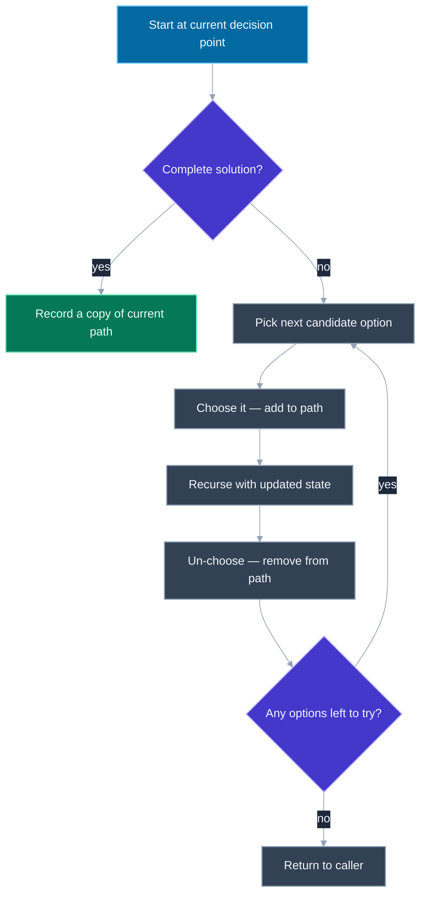
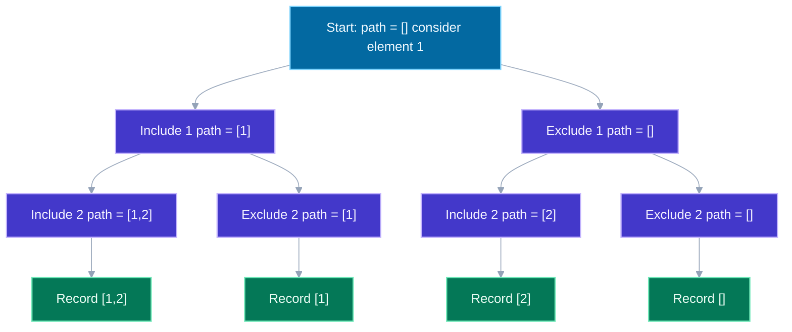

# Recursion and Backtracking Basics

---

## 🎯 Executive Summary

Recursion is the tool that lets a problem be solved in terms of a smaller version of itself, and backtracking is recursion's specific application to "try a choice, explore where it leads, and undo it if it doesn't pan out." Together they cover an enormous share of FAANG coding-round questions that ask for "all" of something — all subsets, all permutations, all valid arrangements, all paths — because generating an exhaustive set of possibilities while pruning dead ends efficiently is exactly what backtracking is built for.

At the Lead level, the bar isn't "can you write a recursive function" — it's whether you can identify the shape of a backtracking problem instantly (the "choose, explore, un-choose" pattern), construct the decision tree it implies before writing code, and reason precisely about complexity that isn't a simple polynomial (branching factor raised to a depth, factorial growth for permutations). It's also one of the few topic areas where a subtle off-by-one in the base case or a missing "un-choose" step produces a solution that looks plausible, sometimes even passes a few test cases, and is still fundamentally broken — so mentally tracing through a small example before declaring victory is a non-negotiable habit, not an optional nicety.

This topic underlies a huge fraction of "generate all X" and "find all valid Y" interview questions — subsets, permutations, combination sum, N-Queens, word search, Sudoku solvers — and it's also the conceptual backbone for divide-and-conquer and dynamic-programming-with-memoization approaches that come up constantly in later-stage Lead interviews. Getting comfortable narrating a recursion tree out loud, including where and why it backtracks, is one of the highest-leverage skills for this entire interview category.

---

## 📖 What Is It? (Plain-English Definition)

**In plain terms:** Recursion is a function calling itself on a smaller version of the same problem, until the problem is small enough to answer directly (the base case). Backtracking is recursion with a twist: it builds up a partial solution step by step, and whenever a choice turns out to be a dead end (or once it's been fully explored), it undoes that choice and tries the next one — never leaving stale state behind for the next branch to trip over.

A simple analogy for recursion: solving a jigsaw puzzle by first solving a smaller region of it, and trusting that if you can do that for a smaller region, you can stitch several smaller regions together into the whole picture. Each smaller region is solved the exact same way, just at a smaller scale, until the "region" is a single piece that needs no further solving — the base case.

Backtracking is like exploring a maze with a piece of chalk: at every junction, you mark a path and walk down it. If it dead-ends, you don't just leave the chalk mark — you erase it (undo the choice) and walk back to try the next path from the same junction. That erasing step, "un-choosing," is what makes backtracking distinct from plain recursive enumeration — without it, later branches would see leftover state from paths that already failed and produce garbage results.

With the mental model in place, the real skill is recognizing which problems want plain recursion versus which specifically want the choose-explore-un-choose backtracking shape — that's the pattern-recognition work below.

---

## 🧠 Core Technical Deep Dive

### Pattern Recognition — How to Spot This Category of Problem

**General recursion tells** (not necessarily backtracking):
- The problem can be explicitly defined in terms of a smaller version of itself (a tree's height in terms of its subtrees' heights, `n!` in terms of `(n-1)!`)
- The input is a tree, graph, or nested/recursive data structure (nested arrays, nested objects) — traversal naturally mirrors the structure's own recursive shape
- The problem is phrased as "divide and conquer" — split the input, solve each half independently, combine the results (merge sort, binary search, computing a value over a balanced structure)

**Backtracking tells specifically** — look for phrasing like:
- "Generate all combinations," "generate all subsets," "generate all permutations," "find all possible..." — anything demanding an exhaustive enumeration of valid configurations, not just one answer
- "Find all valid arrangements" subject to constraints (N-Queens, Sudoku, valid parentheses) — you're building a partial arrangement and need to check constraint violations as you go
- A problem where the natural approach is to build up a partial solution incrementally, and at some point a branch is invalid or exhausted and you need to **undo the last choice** to try a sibling choice — this explicit "undo" requirement is the single strongest signal
- Constraints hinting at manageable exponential search space (small `n`, e.g. `n <= 20` for subsets/permutations, or `n <= 9` for a candidate list with reuse) — a strong hint the intended time complexity is exponential, which only backtracking (with pruning) or brute force can produce, and backtracking is almost always the one actually expected

**The universal backtracking template**, worth having memorized cold:

```javascript
function backtrack(currentPath, remainingChoices, results) {
  if (isCompleteSolution(currentPath)) {
    results.push([...currentPath]); // copy! currentPath will keep mutating
    return;
  }

  for (const choice of getValidChoicesFrom(remainingChoices)) {
    currentPath.push(choice);       // choose
    backtrack(currentPath, updatedRemainingChoices(remainingChoices, choice), results);
    currentPath.pop();              // un-choose (backtrack)
  }
}
```

The `push` / recurse / `pop` triplet is the entire pattern. Every backtracking problem is a variation on what counts as a "valid choice," what the base case looks like, and whether choices can repeat.

### Why the "un-choose" step is not optional

If you omit `currentPath.pop()`, `currentPath` keeps growing across sibling branches that should have been independent — the second branch at a given decision point sees leftover state from the first branch, which is almost always wrong. This is the single most common bug in backtracking code, and it's also the fastest tell that a candidate doesn't fully understand the pattern versus having memorized a specific problem's solution.

### Distinguishing "with repetition" from "without repetition"

A huge share of backtracking variety comes from one design decision: can the same element be reused across a single path (Combination Sum allows reuse of a candidate value), or must each element be used at most once (Permutations, standard Subsets)? This changes exactly one line — whether the recursive call advances the starting index or not:

```javascript
// Without repetition: advance past the current index
function backtrackNoReuse(start, path, nums, results) {
  results.push([...path]);
  for (let i = start; i < nums.length; i++) {
    path.push(nums[i]);
    backtrackNoReuse(i + 1, path, nums, results); // i + 1: never revisit index i
    path.pop();
  }
}

// With repetition: allow the same index to be chosen again
function backtrackWithReuse(start, path, nums, target, results) {
  if (target === 0) { results.push([...path]); return; }
  for (let i = start; i < nums.length; i++) {
    if (nums[i] > target) continue; // prune: can't help, skip
    path.push(nums[i]);
    backtrackWithReuse(i, path, nums, target - nums[i], results); // i, not i + 1: reuse allowed
    path.pop();
  }
}
```

Pruning — the `if (nums[i] > target) continue` line — is what keeps backtracking from degenerating into brute force: cutting off a branch the moment it's provably unable to reach a valid solution, rather than exploring it fully and discarding the result afterward.

---

## 📊 Visual Architecture & Logic

### Diagram 1 — The Generic Backtracking Template



### Diagram 2 — Recursion Tree for Subsets of [1, 2]



---

## 🏢 Interview Context & FAANG Signals

| Interview Stage | Format |
| --- | --- |
| Coding Round | Standalone generation problem — subsets, permutations, combination sum — frequently paired with a follow-up asking for pruning or a variant constraint |
| Coding Round (harder) | N-Queens, word search on a grid, Sudoku solver — backtracking combined with a 2D grid or additional constraint-checking logic |
| Follow-up / Whiteboard Deep Dive | "Now add a constraint" (e.g. "no duplicate subsets" or "each element used at most twice") to test how cleanly the candidate can adapt the template |
| System Design (rarely) | Explaining how an exhaustive search space is pruned in a scheduling/allocation feature, framed at a conceptual level rather than full code |

**Lead signals interviewers listen for:**

1. Recognizes the problem as backtracking (versus plain recursion or iteration) within the first few seconds, citing the "generate all / undo a choice" phrasing as the tell
2. States time complexity in terms of branching factor and depth (e.g. `O(2^n)` for subsets, `O(n!)` for permutations) unprompted, rather than only after being asked
3. Discusses the trade-off of adding pruning (cuts wasted exploration, at the cost of an extra condition checked per branch) versus generating everything and filtering afterward
4. Handles edge cases — empty input, single element, duplicate values, target of zero — before being asked
5. Explicitly narrates the "un-choose" step and why it's necessary, rather than silently including it without acknowledgment

---

## ⚔️ Lead Level vs Senior Level

**Question:** "Generate all possible subsets of a given array of unique integers."

> **Senior Response:** "I'll use recursion — for each element, decide whether to include it or not, and recurse. Eventually I'll have gone through every element and can collect the result." (Writes a mostly-correct recursive solution but struggles to state its complexity when asked, guessing "maybe O(n squared)?")
>
> This gets a working solution in most cases, but stalls on the complexity question — which for a Lead-level bar is a required, not optional, part of the answer.

> **Staff/Lead Response:** "This is the classic backtracking include/exclude pattern — at each of the n elements, I make a binary choice (include or exclude), so the recursion tree has `2^n` leaves, each corresponding to one subset. I'll implement it with the standard choose/recurse/un-choose template, pushing a copy of the current path into the results array whenever I reach the end of the input. Time complexity is `O(2^n * n)` — `2^n` subsets, and copying each one into the results array costs up to `O(n)` — and space is `O(n)` for the recursion depth plus whatever the output requires to store all subsets. If the array had duplicate values and we needed unique subsets only, I'd sort first and add a same-level skip check to avoid generating duplicate branches — worth flagging now in case that's a follow-up."

What separates them: the Lead candidate states the branching-factor-and-depth complexity precisely and unprompted, and proactively surfaces the duplicate-handling variant before being asked, rather than only reacting to a follow-up question.

---

## ⚠️ Common Pitfalls & Anti-Patterns

> ### ✕ Forgetting to Copy the Path Before Recording a Result
>
> **Why it's wrong:** Pushing the mutable `path` array reference directly into `results` (instead of a copy) means every recorded "solution" is actually the same array object — later mutations to `path` (subsequent pushes/pops) silently change every previously recorded result too, since they all point to the same underlying array.
>
> **✓ Correct Lead Approach:** Always push a shallow copy — `results.push([...path])` — when recording a solution, never the live reference that will keep mutating as the recursion continues.

---

> ### ✕ Omitting the "Un-choose" (Backtrack) Step
>
> **Why it's wrong:** Without popping the choice back off after the recursive call returns, state from one branch leaks into sibling branches — the next iteration of the loop starts with stale, incorrect state instead of a clean slate matching the parent's actual state at that point.
>
> **✓ Correct Lead Approach:** Treat `push` / recurse / `pop` as an atomic triplet — every choice made must be undone immediately after its subtree has been fully explored, before moving to the next sibling choice.

---

> ### ✕ Confusing "With Reuse" and "Without Reuse" Loop Bounds
>
> **Why it's wrong:** Using `i + 1` as the next recursive call's start index when the problem allows reusing elements (like Combination Sum) silently makes reuse impossible; using `i` when reuse should be disallowed (like standard Permutations or Subsets) causes duplicate/invalid results or infinite-feeling redundant exploration.
>
> **✓ Correct Lead Approach:** Explicitly decide up front whether an element can be reused within a single path, and let that decision directly dictate whether the next recursive call passes `i` (reuse allowed) or `i + 1` (no reuse) — state this decision out loud before coding.

---

> ### ✕ Not Pruning Obviously Dead Branches
>
> **Why it's wrong:** Exploring every branch fully — even ones that can be proven invalid early (e.g., a partial sum that already exceeds the target in Combination Sum) — wastes exponential time on work that could have been skipped with a single early check, and at scale can be the difference between passing and timing out.
>
> **✓ Correct Lead Approach:** Add a cheap validity check before recursing into a branch (skip candidates that can't possibly lead to a valid solution, e.g. `if (nums[i] > remainingTarget) continue`), cutting off entire subtrees before they're ever explored.

---

> ### ✕ Treating Recursion Depth as Free
>
> **Why it's wrong:** Backtracking solutions are often described as "O(1) extra space" because no large auxiliary array is allocated, ignoring that the recursion call stack itself grows to the depth of the path being built, which counts toward space complexity.
>
> **✓ Correct Lead Approach:** Always include call-stack depth in the space complexity — typically `O(n)` for a path that can grow up to `n` elements deep — in addition to whatever space the output itself requires.

---

## 🛠️ Practice Problems

### Problem 1: Generate All Subsets (Power Set)

**Problem:**
```javascript
/**
 * Given an array of unique integers, return all possible subsets (the power
 * set). The order of subsets in the output, and the order of elements within
 * each subset, does not matter.
 *
 * @param {number[]} nums - array of unique integers
 * @returns {number[][]} all possible subsets, including the empty set and the full set
 */
function subsets(nums) {
  // your implementation
}
```

There are `2^n` possible subsets for an array of length `n`, since each element is either included or excluded independently.

**Examples:**
```
Input: nums = [1,2,3]
Output: [[],[1],[2],[1,2],[3],[1,3],[2,3],[1,2,3]]
(order of subsets, and order within a subset, may vary between valid implementations)
```
```
Input: nums = [0]
Output: [[],[0]]
```

**Edge cases to handle:**
- Empty input array (`nums = []`) — should return `[[]]` (the power set of the empty set contains exactly the empty set)
- Single-element array — should return exactly two subsets: `[]` and `[element]`
- Negative or zero-valued elements — should be treated like any other value (no special-casing needed)

<details>
<summary>💡 Hint 1</summary>

Think about processing the elements one at a time, and at each element making an independent binary decision that doesn't depend on what you decided for any other element.

</details>

<details>
<summary>💡 Hint 2</summary>

Use backtracking: for each index, recurse twice — once having included `nums[index]` in the current path, once having excluded it — then move to the next index either way.

</details>

<details>
<summary>💡 Hint 3</summary>

Write a recursive helper that takes the current index and the current partial path. Base case: once the index reaches the end of the array, record a copy of the current path as one complete subset, and return. Otherwise: push `nums[index]` onto the path, recurse on `index + 1`, pop it back off (backtrack), then recurse again on `index + 1` without having pushed anything — covering the "exclude" branch.

</details>

<details>
<summary>✅ Reveal Solution</summary>

```javascript
function subsets(nums) {
  const results = [];
  const path = [];

  function backtrack(index) {
    if (index === nums.length) {
      results.push([...path]); // record a snapshot, not the live array
      return;
    }

    // Include nums[index]
    path.push(nums[index]);
    backtrack(index + 1);
    path.pop(); // un-choose

    // Exclude nums[index]
    backtrack(index + 1);
  }

  backtrack(0);
  return results;
}
```

**Why it works:** Every element gets exactly one "include" branch and one "exclude" branch, exactly as described in Hint 2, and the base case at `index === nums.length` (Hint 3) fires once per complete path through the decision tree — there are `2^n` such complete paths, one per subset. The `path.pop()` after the include branch is the un-choose step that lets the exclude branch start from a clean, correct partial path.

**Time complexity:** O(2^n * n) — there are 2^n leaves in the recursion tree (one per subset), and copying each path into results costs up to O(n).
**Space complexity:** O(n) for the recursion stack depth (bounded by array length) plus O(2^n * n) for the output itself, which is unavoidable since that's the size of the answer.

</details>

---

### Problem 2: Permutations

**Problem:**
```javascript
/**
 * Given an array of distinct integers, return all possible permutations
 * (orderings) of the array. Order of the permutations in the output does
 * not matter. Assume all input elements are distinct — duplicate values are
 * treated as distinct items to permute (not deduplicated).
 *
 * @param {number[]} nums - array of distinct integers
 * @returns {number[][]} all permutations of nums
 */
function permute(nums) {
  // your implementation
}
```

There are `n!` permutations of an array of length `n`.

**Examples:**
```
Input: nums = [1,2,3]
Output: [[1,2,3],[1,3,2],[2,1,3],[2,3,1],[3,1,2],[3,2,1]]
(all 6 orderings of the 3 elements; exact order of the outer array may vary)
```
```
Input: nums = [0,1]
Output: [[0,1],[1,0]]
```

**Edge cases to handle:**
- Single-element array — should return exactly one permutation, the array itself
- Two-element array — should return exactly 2 permutations
- (As stated in the problem) duplicate values in the input are treated as distinct positions/items, so `[1,1]` would produce `[[1,1],[1,1]]` — two entries, not deduplicated, since this problem assumes distinct inputs and doesn't require dedup logic

<details>
<summary>💡 Hint 1</summary>

Think about building a permutation one position at a time: at each position, you need to pick from whatever elements haven't been placed yet in this particular path.

</details>

<details>
<summary>💡 Hint 2</summary>

Use backtracking with a "used" tracker — either a boolean array parallel to `nums`, or (a common alternative) swap the chosen element into place within `nums` itself and swap it back afterward. The boolean-array approach is usually easier to reason about correctly.

</details>

<details>
<summary>💡 Hint 3</summary>

Maintain a `path` array (the permutation being built) and a `used` boolean array of the same length as `nums`. At each recursive call, loop over every index; skip any index already marked used. For each unused index: mark it used, push its value onto `path`, recurse, then pop the value off `path` and mark the index unused again (the un-choose step). Base case: when `path.length === nums.length`, record a copy of `path`.

</details>

<details>
<summary>✅ Reveal Solution</summary>

```javascript
function permute(nums) {
  const results = [];
  const path = [];
  const used = new Array(nums.length).fill(false);

  function backtrack() {
    if (path.length === nums.length) {
      results.push([...path]);
      return;
    }

    for (let i = 0; i < nums.length; i++) {
      if (used[i]) continue; // skip elements already placed in this path

      used[i] = true;
      path.push(nums[i]);

      backtrack();

      path.pop();      // un-choose
      used[i] = false; // un-choose
    }
  }

  backtrack();
  return results;
}
```

**Why it works:** The `used` array (Hint 2) tracks exactly which indices are already committed to the current path, so the loop in Hint 3 naturally only offers unplaced elements at each position. Every complete path of length `nums.length` is recorded once at the base case, and since every position independently offers all not-yet-used elements, the total number of complete paths generated is `n * (n-1) * ... * 1 = n!`, matching the expected count.

**Time complexity:** O(n! * n) — there are n! permutations, and copying each one into results costs O(n).
**Space complexity:** O(n) for the recursion stack, `path`, and `used` array combined (each bounded by n), plus O(n! * n) for the output itself.

</details>

---

### Problem 3: Combination Sum

**Problem:**
```javascript
/**
 * Given an array of distinct positive integers (candidates) and a target
 * integer, return all unique combinations of candidates that sum to target.
 * The SAME candidate number may be reused an unlimited number of times
 * within a single combination. Combinations are considered unique if the
 * frequency of at least one chosen number differs.
 *
 * @param {number[]} candidates - distinct positive integers
 * @param {number} target - target sum
 * @returns {number[][]} all unique combinations summing to target
 */
function combinationSum(candidates, target) {
  // your implementation
}
```

Order within a combination doesn't matter for uniqueness (e.g. `[2,2,3]` and `[2,3,2]` count as the same combination, so only one should appear in the output).

**Examples:**
```
Input: candidates = [2,3,6,7], target = 7
Output: [[2,2,3],[7]]
Explanation: 2+2+3 = 7 (2 is reused), and 7 alone = 7.
```
```
Input: candidates = [2,3,5], target = 8
Output: [[2,2,2,2],[2,3,3],[3,5]]
```

**Edge cases to handle:**
- No combination sums to the target — should return `[]`
- A candidate value exactly equal to the target — that candidate alone should appear as a valid single-element combination
- `target = 0` — should return `[[]]` (the empty combination sums to zero) unless the problem's constraints guarantee a positive target, in which case this should be stated as an assumption rather than silently handled either way

<details>
<summary>💡 Hint 1</summary>

Think about building a combination by repeatedly choosing a candidate to add, where — unlike Permutations or standard Subsets — you're allowed to choose the same candidate again right after choosing it.

</details>

<details>
<summary>💡 Hint 2</summary>

Use backtracking with pruning. Track the running remaining target (target minus whatever's been added so far) instead of recomputing a sum each time, and allow the recursive call to reconsider the same candidate index — this is what permits reuse.

</details>

<details>
<summary>💡 Hint 3</summary>

Sort the candidates first (makes pruning cleaner, though not strictly required). Write a recursive helper taking a start index and the remaining target. Base case: if remaining target hits exactly 0, record a copy of the current path. If remaining target drops below 0, stop this branch (it overshot). Otherwise, loop from the start index to the end of candidates; for each candidate, if it's larger than the remaining target, skip it (prune); otherwise push it onto the path, recurse passing the SAME index (not index + 1, to allow reuse) and the reduced remaining target, then pop it back off.

</details>

<details>
<summary>✅ Reveal Solution</summary>

```javascript
function combinationSum(candidates, target) {
  const results = [];
  const path = [];
  const sorted = [...candidates].sort((a, b) => a - b);

  function backtrack(start, remaining) {
    if (remaining === 0) {
      results.push([...path]);
      return;
    }
    if (remaining < 0) {
      return; // overshot — dead branch
    }

    for (let i = start; i < sorted.length; i++) {
      if (sorted[i] > remaining) break; // sorted, so every later candidate is also too big — prune the rest

      path.push(sorted[i]);
      backtrack(i, remaining - sorted[i]); // pass i, not i + 1 — allows reusing the same candidate
      path.pop(); // un-choose
    }
  }

  backtrack(0, target);
  return results;
}
```

**Why it works:** Passing `i` (not `i + 1`) into the recursive call, as flagged in Hint 2, is exactly what allows a candidate to be chosen again on the very next step — the loop's start index for the next level never advances past the current candidate. The `remaining < 0` and `remaining === 0` checks from Hint 3 are the base cases: one records a valid combination, the other cuts off a branch that's already overshot. Sorting first lets the `break` (rather than `continue`) safely prune all remaining, larger candidates in one step, since none of them could possibly fit either once the first too-large one is hit.

**Time complexity:** O(2^target) in the worst case (loose bound driven by the branching depth of possible sums), though in practice it's bounded much tighter by the number of valid combinations and the pruning; copying each result costs O(target / min(candidates)) for the deepest possible path length.
**Space complexity:** O(target / min(candidates)) for the recursion stack depth in the worst case — a path can only grow as deep as repeatedly adding the smallest candidate before exceeding target — plus the space needed for the output itself.

</details>

---

*Document version: September 2026 | Audience: Staff/Principal Frontend Engineer candidates | Topic ID: recursion-backtracking*
