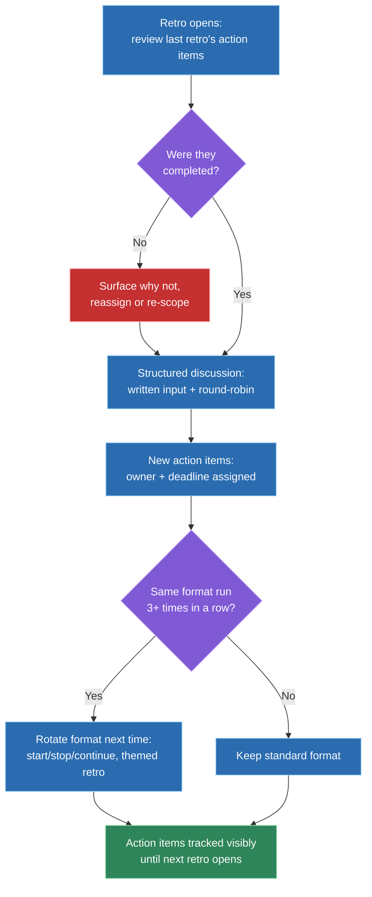
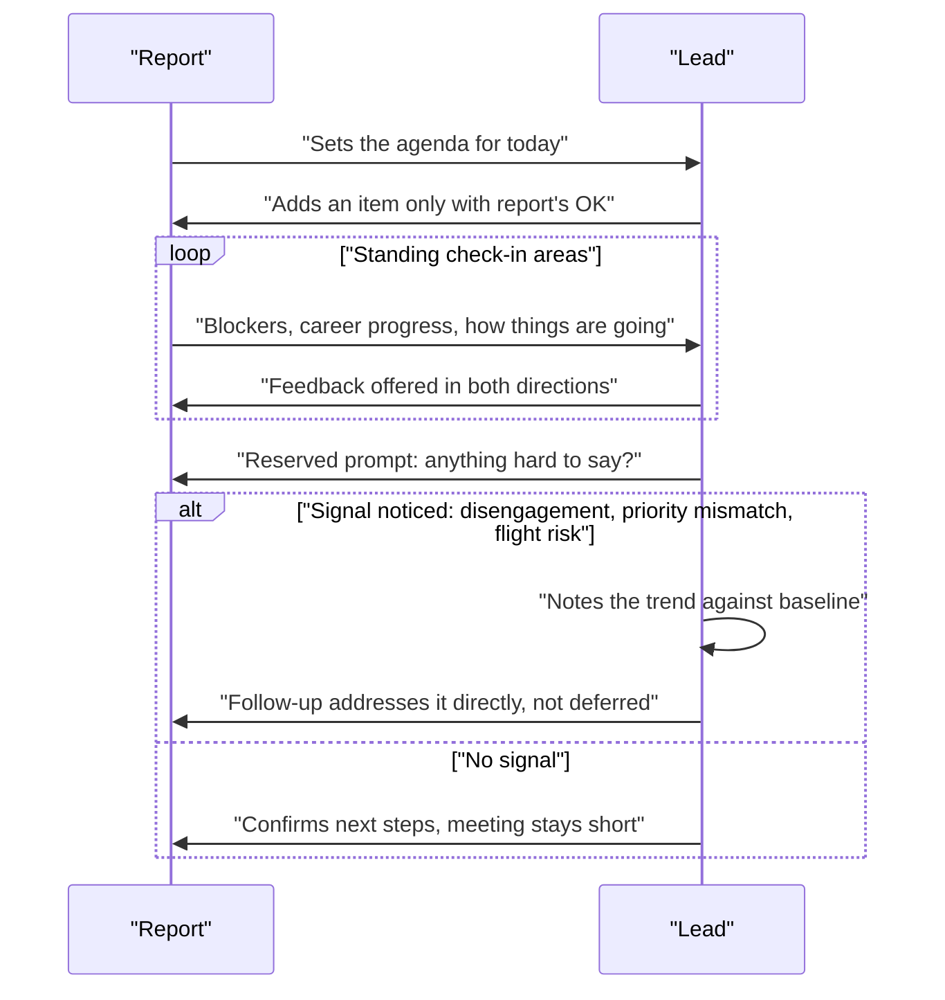

# Running effective retros and 1:1s

## 🎯 Executive Summary

"Do you run retros and 1:1s" is a yes/no question every candidate passes. The actual Lead signal is what structurally happens *between* meetings — whether last retro's action items get tracked and revisited, whether a 1:1 has a mechanism forcing the hard stuff to surface instead of drifting into status updates. Cadence alone (`I have weekly 1:1s`) is table stakes, not a differentiator.

Both formats fail the same way when they fail: they run on schedule, feel productive in the room, and produce nothing that persists. This topic builds two concrete, whiteboard-able structures — one for retros, one for 1:1s — that close that gap, plus the specific signals a Lead should be reading for in each.

## 🧠 Core Technical Deep Dive

### 1. Why most retros fail: no accountability loop

The intuitive explanation for a bad retro is "we didn't discuss the right things," but that's rarely the actual failure. Teams that run retros badly almost always *did* surface real problems — slow CI, an on-call gap, a recurring miscommunication with another team. The problem is what happened after the meeting ended.

Three failure modes account for nearly every bad retro, and none of them is "insufficient discussion":

| Failure mode | What it looks like | Root cause |
|---|---|---|
| Venting with no output | Real frustration gets aired, nothing converts into a decision | No structure forcing "what do we do about this" |
| Same three people talk | Facilitator asks an open question, the loudest voices answer first every time | No mechanism collecting input from quieter members |
| Action items evaporate | Items get written on a board, never appear again | No visible tracking carried into the next retro |

All three converge on the same fix: an explicit, visible accountability loop. A retro isn't a discussion format problem — it's a follow-through problem wearing a discussion format's clothes.

> **Key takeaway:** the single highest-leverage fix for a broken retro isn't a better discussion technique, it's making last retro's action items impossible to silently forget — that's an accountability-loop problem, not a facilitation problem.

### 2. A retro structure that closes the loop

A retro that actually works has four parts, run in this order, every time:

1. **Review last retro's action items first**, before any new discussion. Each item gets a status: done, in progress, or dropped (and why). This alone eliminates the "action items evaporate" failure mode, because skipping it is now visible to the whole team.
2. **Collect input before discussing it.** Anonymous written input (sticky notes, a shared doc, a quick async form) submitted before the meeting, then read aloud or clustered live. This surfaces what quieter team members actually think before the loudest voice in the room anchors the conversation.
3. **Structure the discussion** — what went well, what didn't, what should change — using round-robin so each person is explicitly invited to speak, not just permitted to.
4. **Generate action items with an owner and a deadline**, not a vague intention. "We should improve CI" is not an action item; "Priya reduces flaky-test rate on `checkout` by Friday" is.

| Anti-pattern | Why it fails | Fix |
|---|---|---|
| No review of prior action items | Team learns items don't matter, stops taking the meeting seriously | Open every retro with a status check on the last round |
| Open-floor discussion only | Loudest voices dominate, quieter signal is lost | Anonymous written input collected before live discussion |
| Action items with no owner | Diffuse responsibility means nobody actually does it | Every item gets exactly one owner and a deadline |
| Facilitator is also the most senior person in the room | People self-censor around their manager | Rotate facilitation, or have someone else run it |
| Retro doubles as a performance-review input | People stop being honest about mistakes | Explicitly separate retro content from performance conversations |

> **Key takeaway:** a retro's structure isn't really about the discussion format — the two moves that matter most are opening with the previous round's action-item status and closing with owned, deadlined items, because those are the two points where accountability either gets built in or silently drops.

### 3. Rotating formats to avoid retro fatigue

A team that runs the identical "what went well / what didn't" format for two straight years stops getting real signal from it — not because the format is bad, but because people stop engaging with something that feels rote. The fix isn't a new permanent format; it's a deliberate rotation.

| Format | When to use it | What it surfaces that the standard format doesn't |
|---|---|---|
| Standard (went well / didn't / actions) | Default, most sprints | Baseline continuous-improvement signal |
| Start / Stop / Continue | Team feels stale on the standard format | Forces concrete behavioral asks instead of general sentiment |
| Themed retro (post-incident, post-launch) | Right after a specific event worth dedicated attention | Deep signal on one thing, instead of diluted signal on everything |
| Timeline retro (walk the sprint chronologically) | Team disagrees on what actually happened | Shared, ordered facts before opinions get attached to them |

The rotation should be scheduled, not improvised in the moment — a Lead deciding on the day of the retro tends to default back to whatever's easiest to facilitate, which is usually the standard format the team is already tired of.

> **Key takeaway:** format variety isn't cosmetic — a stale format produces stale, low-signal answers, and scheduling the rotation in advance is what actually makes the variety happen instead of defaulting back to habit.

### 4. Why status-update 1:1s fail as a leadership tool

A 1:1 that's just "what did you work on this week, what's next" is a meeting that shouldn't exist — an async update in Slack or a standup covers that at a fraction of the cost. When a 1:1 gets used for status, it's not neutral; it actively crowds out the things only a 1:1 can do.

A 1:1's actual value is everything that doesn't fit anywhere else: career growth conversations, unblocking something the report wouldn't escalate any other way, feedback flowing in both directions, and catching a problem — disengagement, a mismatch in priorities, a flight risk — early enough to do something about it. None of that happens if the full 30 minutes goes to status.

The tell that a 1:1 has degraded into a status meeting: the manager is doing most of the talking, or the agenda is identical every week, or the meeting could be cancelled with zero loss by posting the same content in a channel instead.

> **Key takeaway:** the test for whether a 1:1 is working isn't "did it happen" — it's "did anything happen in it that couldn't have happened async," and if the honest answer is no, the meeting has quietly become the wrong tool for the job.

### 5. A 1:1 structure that protects that value

The single structural decision that does the most work here: **the report owns the agenda, not the manager.** A manager-driven agenda defaults to status and priorities the manager cares about; a report-driven agenda defaults to whatever's actually on the report's mind, which is the entire point of the meeting.

A workable recurring shape, without being rigid about it:

| Area | Cadence | Purpose |
|---|---|---|
| Career / growth | Every few weeks, not every meeting | Keeps growth from being an annual-review-only conversation |
| Blockers / unblocking | As needed, report-driven | Surfaces what wouldn't otherwise get escalated |
| Feedback (both directions) | Ongoing, explicit ask both ways | Prevents feedback from being one-directional and top-down only |
| How they're actually doing | Every meeting, briefly | The earliest and most reliable disengagement/flight-risk signal |
| Reserved hard-to-say space | Every meeting, explicit prompt | Creates an opening for things a report wouldn't volunteer unprompted |

That last row matters enough to be explicit rather than assumed: a direct question like "what's one thing I could be doing better as your manager" has to be asked on purpose, repeatedly, because it will never come up on its own if the report has to volunteer it cold.

> **Key takeaway:** the report owning the agenda is the mechanism, not a nice-to-have — a manager-driven 1:1 structurally can't protect space for career, feedback, and hard-to-say things, because the manager's priorities will always fill the time first.

### 6. Reading the signals a 1:1 is meant to catch

A 1:1's real job, once the structure is in place, is pattern recognition over time — not any single meeting, but what changes across several. Three signals matter most:

| Signal | What it looks like across meetings | What a Lead does with it |
|---|---|---|
| Disengagement | Shorter answers, less initiative volunteered, "how are you doing" gets a flat non-answer repeatedly | Ask directly and specifically, don't wait for it to resolve itself |
| Stated vs. actual priority mismatch | Report says X matters, their actual time consistently goes to Y | Name the gap explicitly — it's often a signal the *stated* priority is wrong, not the report |
| Early flight risk | Questions about other teams/companies, disengagement from planning further out than a sprint, sudden interest in unrelated skills | Address the underlying cause directly and early — by the time it's an exit conversation, it's already too late to act on |

None of these signals is actionable from a single data point; they're only visible because the 1:1 happens regularly and consistently enough to notice a change from baseline. That's the actual reason cadence matters — not as an end in itself, but as the precondition for catching a trend before it becomes a resignation letter.

> **Key takeaway:** the value of consistent 1:1 cadence isn't the meeting itself, it's that it establishes a baseline a Lead can notice deviating from — disengagement, priority mismatch, and flight risk are all trend signals, invisible in any single conversation.

## 📊 Visual Architecture & Logic

### Diagram 1 — The retro accountability loop

### Diagram 2 — A 1:1 that protects its actual purpose

## 🏢 Interview Context & FAANG Signals

Retros and 1:1s both show up under "how do you run your team," "tell me about improving a team process," and "tell me about developing someone on your team" — all standard behavioral/leadership prompts, not niche follow-ups. They also surface indirectly in "tell me about a time you caught a problem early" and "tell me about giving difficult feedback."

**Lead signals interviewers listen for:**

- A structural mechanism named specifically — the accountability loop that reviews prior action items, the report owning the 1:1 agenda — rather than "I run regular retros and 1:1s" as if cadence alone were the answer.
- Evidence of adapting format to team state (rotating retro formats, adjusting 1:1 structure per report) instead of one rigid template applied uniformly.
- A concrete example of a signal caught in a 1:1 and acted on, not just "I have good relationships with my reports."
- Explicit facilitation technique for quieter voices (anonymous input, round-robin), not just "I try to make sure everyone talks."
- Honesty about a retro or 1:1 that didn't work and what specifically was changed, not a uniformly polished narrative.

## ⚔️ Lead Level vs Senior Level

A **Senior** response describes attendance and cadence: "I run a retro every sprint and 1:1s every week with my reports."

A **Staff/Lead** response describes the mechanism that makes those meetings actually work. What specifically happens to a retro action item between one retro and the next — is there a visible tracking step, or does it just get written down and forgotten? Who owns a 1:1's agenda, and what's the concrete method for surfacing something a report wouldn't volunteer unprompted? What's a specific instance of a disengagement or priority-mismatch signal noticed in a 1:1, and what was actually done about it — not as a hypothetical, but as something that happened. The differentiator isn't running the meetings; it's the structure that makes them produce something durable.

## ⚠️ Common Pitfalls & Anti-Patterns

> ### ✕ Running a retro with no review of prior action items
> **Why it's wrong:** Skipping this step is invisible in the moment but corrosive over time — the team learns action items don't actually get tracked, and stops taking the "action items" part of the meeting seriously, which is the exact accountability gap that makes retros feel pointless.
> **✓ Correct Lead Approach:** Open every retro with a status check on the previous round's items — done, in progress, or dropped and why — before any new discussion starts.

> ### ✕ Treating 1:1 cadence itself as the leadership signal
> **Why it's wrong:** "I have weekly 1:1s" describes scheduling, not substance — a status-update 1:1 held every week produces less value than a well-structured one held every two weeks, and an interviewer who only hears cadence has learned nothing about judgment.
> **✓ Correct Lead Approach:** Describe the structure that protects the 1:1's real purpose — who owns the agenda, what reserved space exists for hard-to-say things — not just how often it happens.

> ### ✕ Letting the manager drive the 1:1 agenda by default
> **Why it's wrong:** A manager-driven agenda structurally crowds out career, feedback, and hard-to-say topics with whatever the manager already cares about, even with good intentions — the report never gets the chance to set direction.
> **✓ Correct Lead Approach:** Make the report own the agenda explicitly, with the manager adding items only with the report's agreement, and protect a recurring slot for things that are hard to raise unprompted.

> ### ✕ Running the same retro format indefinitely
> **Why it's wrong:** A format the team has run dozens of times stops generating real engagement — people go through the motions, and the signal quality of the retro degrades even though the meeting still happens on schedule.
> **✓ Correct Lead Approach:** Schedule deliberate format rotation in advance (start/stop/continue, themed retros after specific events) instead of defaulting to the same template out of habit.

> ### ✕ Waiting for a report to volunteer a hard problem instead of asking directly
> **Why it's wrong:** Disengagement, a priority mismatch, or a flight risk rarely gets raised unprompted — by the time it surfaces on its own, it's often already at the resignation-letter stage, well past the point where a Lead could have acted on it.
> **✓ Correct Lead Approach:** Ask directly and specifically, on a recurring basis — "how are you actually doing" and "what's one thing I could do better" are prompts that have to be asked on purpose, not assumed to surface organically.

## 🛠️ Practice Scenarios

### Scenario 1 — A Retro Has Turned Into a Blame Session

Retros have started devolving into finger-pointing about whose code caused the last incident, and people have started dreading the meeting.

Staff-Level Solution

Separate the symptom from the cause: a retro turning into blame usually means there's no structure converting frustration into a forward-looking action, so venting is the only thing left to do with the energy in the room. Reintroduce structure directly — anonymous written input collected before discussion (so people aren't naming names live), and a facilitation rule that every raised issue gets converted into a system or process fix, not a person to blame.

Explicitly separate retro content from performance evaluation, and say so out loud if the team doesn't already trust that boundary — people stop being honest the moment they suspect what they say in a retro could show up in a review. If blame has been recurring, address it as its own item in a future retro, using the same structure rather than an ad hoc lecture on culture.

### Scenario 2 — Retro Action Items Never Get Followed Up On

The team consistently generates a solid list of action items each retro, but almost none of them are done by the time the next retro rolls around.

Staff-Level Solution

This is the accountability-loop gap directly, not a discipline problem with individual engineers. Fix the structure, not the people: every action item gets exactly one named owner and a deadline at the moment it's created, and the next retro opens by reviewing each item's status before any new discussion starts.

Make the tracking visible between retros too, not just at the bookend meetings — a shared board or doc that anyone can check mid-sprint turns "did we do this" from a surprise at the next retro into an ambient, ongoing visibility. If an item consistently doesn't get done, that's itself worth a retro item: is it not actually a priority, or is it blocked on something bigger.

### Scenario 3 — One Team Member Never Speaks Up in Retros

A capable, senior engineer has attended every retro for months but almost never volunteers anything, even though 1:1s suggest they have real opinions about process.

Staff-Level Solution

Open-floor discussion structurally favors people comfortable speaking first and loudest — this isn't necessarily about that person's engagement, it's a facilitation gap. Introduce anonymous written input collected before the meeting, so their perspective enters the discussion without requiring them to speak up live, and pair it with round-robin during the live discussion so they're explicitly invited rather than just permitted to talk.

If the pattern continues even with those changes, raise it directly in a 1:1 — not as a complaint, but as a genuine question about what would make it easier to contribute in that setting specifically. There may be a dynamic in the room (a dominant voice, a trust issue) worth addressing separately.

### Scenario 4 — A 1:1 Has Turned Into Pure Status Reporting

Looking back at the last several 1:1s with a report, every single one has been "what did you work on, what's next" with nothing else discussed.

Staff-Level Solution

Name the problem directly with the report rather than silently trying to redirect it: the 1:1 has become something async updates already cover, and that's crowding out the things only this meeting can do. Hand the agenda over explicitly — "from now on, this time is yours to set" — and seed it initially with the standing areas (career, blockers, feedback, how things are actually going) until it becomes habit.

Move status reporting itself somewhere cheaper — a written async update — so the 1:1's full time is protected for what's left. If status-only 1:1s have been the norm for a while, expect the first few meetings under the new structure to feel awkward as the report recalibrates what's appropriate to bring; that's expected, not a sign the change isn't working.

### Scenario 5 — A Report Is Clearly Disengaged but Won't Say Why

A previously strong performer has become noticeably quieter and less proactive over the last month, but deflects every direct question about how they're doing.

Staff-Level Solution

Don't accept the deflection as the end of the conversation, but also don't force it in the same meeting where it first gets deflected — trust usually needs more than one attempt. Keep asking directly and specifically across subsequent 1:1s rather than dropping it, and vary the framing ("is there anything making work harder than it should be right now" lands differently than a repeated "how are you doing").

Look for corroborating signal beyond the 1:1 itself — a stated-vs-actual priority mismatch, withdrawal from planning conversations, changes in collaboration patterns — since disengagement often shows up in behavior before it shows up in words. If it doesn't resolve, consider whether something structural changed recently (a reorg, a project they didn't want, a conflict with a peer) that's worth investigating directly rather than assuming it's purely personal.

### Scenario 6 — Delivering Hard Feedback in a 1:1

A report's recent work has real quality issues, and the feedback needs to land clearly without damaging the relationship or derailing the meeting.

Staff-Level Solution

Use the reserved space intentionally rather than burying hard feedback inside status discussion — name upfront that this is feedback, specifically, so it doesn't get missed as a passing comment. Anchor it in specific, observable examples rather than a general characterization ("the last two PRs missed the edge cases we discussed in review" instead of "your quality has slipped").

Pair it with what good looks like and ask what support would help close the gap, so the conversation ends on a concrete next step rather than just the criticism. Explicitly invite feedback back — the same "what's one thing I could be doing better" prompt applies here too, since hard feedback conversations are exactly where a report is least likely to volunteer their own side unprompted.

### Scenario 7 — Running a Retro for a Fully Remote, Async-First Team

The team is distributed across time zones with minimal overlap, and a synchronous, live-discussion retro format doesn't work for most of the team.

Staff-Level Solution

Keep the same underlying structure — review prior action items, structured input, owned action items — but change the delivery, not the substance. Written input becomes the primary mode rather than a supplement to live discussion: a shared async doc open for a defined window, with the facilitator clustering themes afterward instead of live.

Where a synchronous component is still valuable (working through a genuinely contentious item), keep it short, targeted, and scheduled to rotate across time zones fairly rather than defaulting to whichever region is most convenient for the facilitator. The accountability loop matters even more here, not less — action items should be tracked in the same async-visible place the written input lived, since there's no live meeting moment to catch a dropped item informally.

### Scenario 8 — A Report Raises a Concern About the Lead's Own Leadership

In a 1:1, a report says directly that they've felt micromanaged on recent projects and it's affecting how much initiative they take.

Staff-Level Solution

Treat this as exactly the kind of signal the reserved "hard to say" space in a 1:1 is meant to surface, and resist the instinct to explain it away in the moment. Listen for the specific behavior behind the word "micromanaged" — is it review frequency, decision-making being pulled back, something else — since the fix depends entirely on what's actually happening, not the label.

Thank the report for raising it directly, since it's a genuinely difficult thing to say to the person who evaluates them, and follow through visibly afterward — a changed behavior the report can actually observe, not just an acknowledgment in the room. Revisit it explicitly in a future 1:1 rather than assuming it's resolved once discussed, since checking back is itself part of demonstrating the feedback landed.

