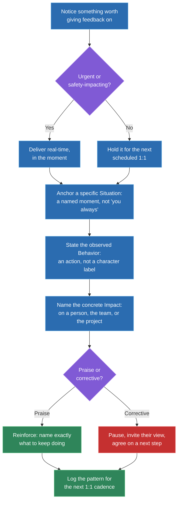
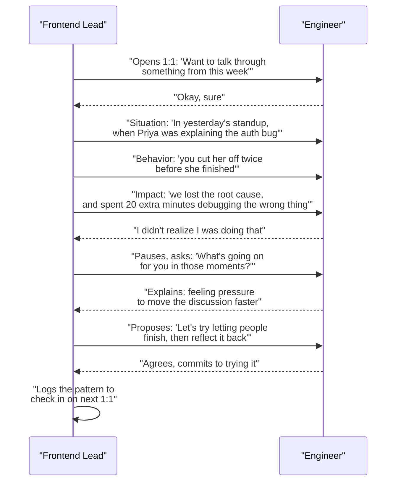

# SBI feedback model for 1:1 conversations

## 🎯 Executive Summary

Every Frontend Lead candidate claims to "give direct feedback." Almost none of them can produce a structure for it under follow-up questioning — the answer collapses into a vague anecdote about a "tough conversation" with no reusable shape to it. SBI (Situation-Behavior-Impact) is that structure: a three-part model for turning a vague impression into a specific, factual, actionable statement, and it's the single most common framework interviewers expect a Lead to be able to whiteboard when asked about feedback.

This matters because feedback quality is one of the few Lead-competency signals that's actually checkable in an interview — the interviewer can ask "what exactly did you say" and a candidate with a real structure answers immediately, while one without it starts paraphrasing. The goal here is to know SBI well enough to construct a real example on the spot, know when to bend it (real-time vs. scheduled, upward vs. downward, praise vs. correction), and recognize the ways people think they're using it while actually reverting to vague, character-based judgments.

## 🧠 Core Technical Deep Dive

### 1. What SBI actually is, and why it beats vague feedback

SBI breaks a piece of feedback into three deliberately separated parts, each answering a different question. **Situation** anchors a specific moment — "in yesterday's 10am standup," not "you always." **Behavior** describes only what was observed — an action, not an inferred motive or character trait. **Impact** names the concrete, real consequence — on a person, the team, or the project — that the behavior actually caused.

The reason this beats the two most common alternatives comes down to what each one optimizes for.

| Dimension | SBI | Feedback sandwich (praise-criticize-praise) | "You" statements ("you always...", "you're too...") |
|---|---|---|---|
| Specificity | High — a named moment and observed action | Low — the criticism is often softened into vagueness to fit between two compliments | Low — generalizes a pattern into a permanent trait |
| Actionability | High — a concrete behavior is easy to repeat or stop | Low — the real message is often diluted or missed entirely | Low — "stop being disorganized" isn't a behavior anyone can act on |
| Defensiveness triggered | Lower — describes an action, not a character judgment | Medium — the insincerity of the bracketing compliments often reads as manipulative | High — attacks identity, not behavior, which triggers a defensive response almost automatically |
| What it optimizes for | Clarity and changeability | The deliverer's comfort, not the receiver's understanding | Venting, not correction |
| Typical failure mode | None if executed correctly — the main risk is skipping the Impact | The real feedback gets lost between two positives, or the recipient only remembers the praise | The recipient argues about whether the label is fair instead of addressing the behavior |

> **Key takeaway:** SBI isn't a softer way to say something hard — it's a more precise one. Separating a factual situation, a factual behavior, and a factual impact removes the character judgment that both the sandwich and "you" statements smuggle in, which is exactly what makes it easier for the other person to actually hear and act on.

### 2. A worked example: same situation, two deliveries

Take a common Frontend Lead scenario: an engineer, Sam, has merged three PRs in two weeks without test coverage, and it's starting to cause regressions.

**Vague version (what most people actually say):** "Hey, you've been kind of careless with testing lately — you need to slow down and be more thorough." This names no specific instance, uses a character label ("careless"), and gives Sam nothing concrete to change tomorrow.

**SBI version:** "In the last two sprints, three of your PRs — the cart-total fix, the checkout redirect, and the auth-token refresh — merged without new test coverage. Two of those caused regressions we caught in QA, and one shipped to production and got reverted. I want to understand what's making tests harder to prioritize right now, and agree on what changes before your next PR."

The second version names specific PRs (Situation), describes an observed pattern rather than a trait (Behavior), and states the real cost (Impact: two regressions caught late, one production incident). It also opens the door to Sam's side of the story instead of ending the conversation with a verdict.

> **Key takeaway:** the difference between the two versions isn't tone or diplomacy — it's information density. The SBI version gives Sam something to specifically agree, disagree, or explain, while the vague version only gives Sam something to feel bad about.

### 3. Adapting SBI to the situation

SBI's three parts stay fixed, but how and when you deliver them changes a lot depending on context.

| Context | What changes | Example adjustment |
|---|---|---|
| Real-time / in-the-moment | Compressed, delivered fast, often just Behavior + Impact with Situation implied by "just now" | "Just now, when you cut Priya off mid-explanation — we lost the root cause and now we're debugging the wrong thing." |
| Scheduled 1:1 | Full structure, more room to pause and invite the other person's perspective before agreeing on a next step | Deliver all three parts, then explicitly ask "what's your read on this?" before proposing a fix |
| Delivering upward (to a peer or more senior person) | Same structure, but framed as observation + impact on shared goals rather than a directive; more collaborative language | "When the launch date moved without a heads-up to the team, three of us had already reprioritized around the old date — can we agree on a notice window going forward?" |
| Genuinely hard / negative feedback | Slow down, don't soften the Behavior or Impact to protect their feelings — vagueness here is the actual harm | State the pattern plainly, then pause; resist the urge to fill silence with reassurance that undercuts the message |
| Positive reinforcement | Same structure, same specificity — SBI isn't just for correction | "In yesterday's incident, when you posted a root-cause hypothesis within ten minutes of the alert, it cut our time-to-mitigation roughly in half — that's exactly the instinct I want more of on this team." |

> **Key takeaway:** the most common gap isn't misusing SBI for corrective feedback — it's forgetting it applies to praise too. Vague praise ("great job this week") is just as low-information as vague criticism, and reinforcing a specific behavior with SBI makes it more likely to be repeated deliberately rather than accidentally.

### 4. Failure modes: "SBI" that isn't actually SBI

Most people who think they're doing SBI are actually doing one of a few disguised versions of the old pattern. These are the ones worth being able to name and self-catch.

| What it looks like | Why it's not real SBI |
|---|---|
| "The impact was that it made the team feel like you don't care about quality" | This is a judgment wearing an Impact costume — a feeling attributed to "the team" without a concrete, checkable consequence. A real Impact is a fact: a regression count, a missed deadline, a specific person's reaction they told you about directly. |
| "The behavior was that you were unprofessional in the meeting" | "Unprofessional" is a character label, not an observed action. The real behavior is what a camera would have recorded — "you interrupted three times," "you raised your voice." |
| "You've been doing this a lot lately" as the Situation | This isn't a situation, it's a pattern claim with no anchor — it invites "when specifically?" and if you can't answer, you don't actually have a Situation yet. |
| Bundling three unrelated behaviors into one piece of feedback | Even if each individual behavior is factual, stacking them turns the conversation into a laundry list the recipient can't process or act on — pick the one that matters most right now. |
| Delivering all three parts but skipping the pause for the other person's perspective | SBI describes what you say, not the whole conversation — treating it as a monologue instead of an opening turns feedback into a lecture, and a lecture doesn't get you agreement on what changes next. |

> **Key takeaway:** the tell that someone is faking SBI is almost always in the Behavior or Impact line — if either one could be argued with as an opinion rather than checked as a fact, it hasn't actually been separated from judgment yet.

### 5. Feedback as a system, not a one-off skill

The version of this that actually shows up in a Lead's day-to-day job isn't a single hard conversation — it's a cadence. Feedback that only happens when something goes wrong trains a team to associate 1:1s with bad news, and it means the Lead is always reacting instead of noticing patterns early. A Lead who's actually good at this delivers small, specific SBI observations regularly — in scheduled 1:1s, not just incident-driven escalations — so a hard conversation, when it does happen, isn't a surprise.

This also means tracking patterns across time, not just single incidents: is this the first time, or the fourth? A single missed test isn't a performance conversation; a pattern across six weeks is, and knowing the difference requires actually keeping notes between 1:1s rather than relying on memory. This is the same discipline that shows up in running good retros and 1:1 cadences generally — feedback is one input into a repeatable operating rhythm, not an isolated skill that only gets used in emergencies.

> **Key takeaway:** the Staff/Lead signal here isn't "I know how to have a hard conversation" — it's "I have a system that makes most conversations easy because nothing sits unaddressed long enough to become hard."

## 📊 Visual Architecture & Logic

### Diagram 1 — Constructing and delivering a piece of SBI feedback

### Diagram 2 — A hard feedback conversation delivered with SBI in a 1:1

## 🏢 Interview Context & FAANG Signals

This shows up in two places almost every FAANG loop includes: **behavioral rounds** ("tell me about giving difficult feedback" or "tell me about a time you had to correct someone's behavior") and **leadership-competency rounds** that probe how a candidate develops the people on their team, not just how they ship code. It's rarely asked as "do you know SBI" by name — it's asked as an open story prompt, and the interviewer is listening for whether a structure emerges on its own.

**Lead signals interviewers listen for:**

- A repeatable structure, not just a war story — can the candidate name the actual Situation, Behavior, and Impact they used, on demand, months or years later?
- Specificity in the Behavior line — an observed action, not a character judgment retold as if it were fact.
- A real, checkable Impact — a number, a concrete consequence, a specific downstream effect — not a vague "it wasn't great for morale."
- Evidence the feedback was a cadence, not a one-off — did this come up in a regular 1:1, or only after an escalation forced the conversation?
- Handling both directions — can they describe giving feedback upward or across peers, not only downward to reports?
- Follow-through — what happened after the conversation, and how did they know it landed?

## ⚔️ Lead Level vs Senior Level

A **Senior** response is usually a single strong anecdote: "I had an engineer who wasn't testing their code, so I pulled them aside and told them it needed to change, and it did." It's honest and it may even be well-told, but it's one data point with no visible structure behind it — a good follow-up question ("what exactly did you say?") often exposes that the actual delivery was vaguer than the retelling suggests.

A **Staff/Lead** response treats that anecdote as one instance of a repeatable system. They can reconstruct the actual Situation/Behavior/Impact they used, not just the outcome. They can describe how they adapted it — real-time vs. a scheduled 1:1, corrective vs. reinforcing, downward vs. upward to a peer or their own manager. And critically, they can describe the cadence around it: how the pattern was tracked before it became a conversation, and what changed about the 1:1 rhythm afterward so the next instance of drift gets caught earlier, not just corrected once.

## ⚠️ Common Pitfalls & Anti-Patterns

> ### ✕ Labeling a character trait and calling it the Behavior
> **Why it's wrong:** "You were unprofessional" or "you were careless" describes an inferred trait, not an observed action — it invites the recipient to argue about whether the label is fair instead of addressing what actually happened, and it's the single fastest way to trigger defensiveness.
> **✓ Correct Lead Approach:** Describe only what a camera would have recorded — "you interrupted twice," "three PRs merged without tests" — and let the Impact carry the weight of why it matters.

> ### ✕ Writing a vague or feeling-based Impact
> **Why it's wrong:** "It made the team feel like you don't care" attributes an unverifiable feeling to an undefined group — it's a judgment dressed as an Impact, and it gives the recipient nothing concrete to weigh against their own account of events.
> **✓ Correct Lead Approach:** State a real, checkable consequence — a regression count, a missed deadline, a specific person's reaction they told you about directly — so the Impact is a fact, not an opinion.

> ### ✕ Burying corrective feedback inside a praise sandwich
> **Why it's wrong:** Opening and closing with compliments to soften a correction usually backfires — the recipient either only remembers the praise, or recognizes the pattern and discounts the compliments as insincere padding around the real message.
> **✓ Correct Lead Approach:** Deliver the SBI directly, and give genuine praise separately, on its own terms, when it's actually warranted — don't use it as packaging.

> ### ✕ Saving everything for the next scheduled 1:1 or, worse, a performance review
> **Why it's wrong:** Letting small issues accumulate silently means the first time an engineer hears about a pattern, it's already a serious conversation — and it means they never had the chance to self-correct earlier, which reads as the Lead having withheld information they needed.
> **✓ Correct Lead Approach:** Build a lightweight cadence of small, specific SBI observations — including real-time ones — so patterns get named while they're still easy to name.

> ### ✕ Only reaching for SBI when something is wrong
> **Why it's wrong:** Treating SBI as a corrective-only tool means the team never hears specific, structured praise — vague positive feedback ("great job this week") is just as low-information as vague criticism, and it wastes an opportunity to make good behavior more likely to repeat.
> **✓ Correct Lead Approach:** Use the same structure for reinforcement — name the specific Situation, Behavior, and Impact of something that went well, as deliberately as you would for a correction.

## 🛠️ Practice Scenarios

### Scenario 1 — An Engineer Keeps Merging PRs Without Tests

Sam has merged three PRs in two sprints without test coverage, and two caused regressions caught late.

Staff-Level Solution

Open with the Situation naming the specific PRs, not a general impression: "In the last two sprints, three of your PRs — the cart-total fix, the checkout redirect, and the auth-token refresh — merged without new test coverage." Follow with the Behavior stated as fact, not judgment, and the Impact as a real consequence: "Two of those caused regressions we caught in QA, and one shipped and got reverted."

Then pause and ask before proposing a fix: "What's making tests harder to prioritize right now?" — the answer might be a real constraint (unclear test infra, time pressure from a deadline) rather than carelessness, and the next step should be agreed on together, not dictated. Close by naming what changes starting with the next PR, and note it to check on in the following 1:1 rather than letting it drop.

### Scenario 2 — An Engineer Dominates Every Standup

One engineer consistently talks over teammates and extends standup well past its time box, and quieter teammates have stopped trying to contribute.

Staff-Level Solution

Use a scheduled 1:1, not a public correction, since the goal is behavior change, not embarrassment. "In the last three standups, you've taken roughly half the total time each time, and twice you started talking before Jordan finished their update." Impact: "Jordan and Priya have both stopped volunteering blockers — I noticed neither of them spoke up yesterday even though we found out afterward Priya was stuck for two days."

Pause for their perspective — the drive might come from genuine enthusiasm or a habit of thinking out loud, not a wish to dominate. Agree on a concrete next step together, like timeboxing their own update or explicitly deferring detailed technical discussion to after standup, and follow up in two weeks to see if quieter teammates are speaking up again.

### Scenario 3 — A Senior Engineer Publicly Dismisses a Junior's Idea in a Design Review

Mid-meeting, a senior engineer cuts off a junior teammate's proposal with "that won't work" and moves on without explanation, visibly shutting the junior down in front of the group.

Staff-Level Solution

This calls for real-time SBI, compressed, delivered right after the meeting rather than in front of the group where it would repeat the same public-correction dynamic. "Just now, when you said 'that won't work' and moved on without explaining why — Alex didn't get a chance to make their case, and I noticed they didn't propose anything else for the rest of the meeting."

Keep it short given the real-time format, then ask directly: "Was there a real concern with the approach, or did it just need more time?" If there was a legitimate technical objection, coach them on separating the objection from the dismissal next time — "you can say 'I think there's a problem with X, can you walk me through how you'd handle it' instead of a flat no." Follow up separately with Alex to make sure they still feel safe proposing ideas.

### Scenario 4 — Giving Upward Feedback to Your Own Manager

Your manager committed the team to a launch date change in a stakeholder meeting without telling the team first, and by the time you heard about it, three engineers had already reprioritized their week around the old date.

Staff-Level Solution

Frame it collaboratively rather than as a directive, since this is feedback delivered upward: "In yesterday's stakeholder sync, when the launch date moved up a week — by the time I found out and told the team, three of us had already planned this week's work around the old date, and now we're re-prioritizing mid-sprint." State it as a shared-goal problem, not a personal grievance.

Propose a concrete fix rather than just naming the friction: "Could we agree that any date change gets a heads-up to the team before it's said out loud externally, even a quick Slack message?" This keeps the conversation focused on a process gap rather than reading as a complaint about the decision itself, which is more likely to land well with someone more senior.

### Scenario 5 — A Pattern of Missed Deadlines Has Become a Performance Concern

An engineer has missed three sprint commitments in a row, each time citing a different reason, and it's now affecting the team's ability to plan.

Staff-Level Solution

This is the "genuinely hard" case — resist the urge to soften the Behavior or Impact to spare feelings, since vagueness here is the actual harm. "Over the last three sprints, the auth refactor, the checkout redirect, and the notifications work each slipped past their committed date. Each time we replanned the sprint around it late, and it's now affecting how much the team can commit to with confidence."

Pause, genuinely, before proposing anything — there may be a real underlying cause (unclear scoping, an unspoken personal issue, a skill gap on a specific area) that changes what the right next step is. Whatever surfaces, agree explicitly on what happens differently starting with the next sprint, and set a shorter check-in cadence than usual so the pattern doesn't run another full sprint before it's revisited.

### Scenario 6 — Reinforcing Excellent Incident Response

An engineer posted a correct root-cause hypothesis within ten minutes of a production alert, which materially shortened the incident.

Staff-Level Solution

Apply the same structure to praise instead of defaulting to a generic "great job." "In yesterday's incident, when you posted your root-cause hypothesis in the channel about ten minutes after the alert fired, it was correct, and it cut our time-to-mitigation roughly in half compared to our last incident of this type."

Be specific about what to keep doing, not just what happened: "That instinct to post a hypothesis early, even before you're fully sure, is exactly what I want more of — it gives the rest of us something to react to instead of everyone independently starting from zero." Specific reinforcement like this is what makes the behavior repeatable on purpose, rather than the engineer not being sure which part of their response actually helped.

### Scenario 7 — Giving Feedback Asynchronously After a Code Review Tone Problem

An engineer left a review comment that reads as sharp and dismissive ("this is just wrong, redo it") on a teammate's PR, and there's no scheduled 1:1 for a few days.

Staff-Level Solution

Don't let SBI's structure get lost just because the medium is async — a DM still carries all three parts, just written more carefully since tone is harder to control in text. "On the checkout PR yesterday, the comment 'this is just wrong, redo it' — I don't think that's how you meant it, but for context, Jamie mentioned it discouraged them from asking follow-up questions before making the change."

Keep it short and non-public, and invite a response rather than delivering a verdict: "Want to talk through it, or would a quick rephrase in the thread help?" If it's a recurring pattern rather than a one-off, that's worth escalating to a real-time or scheduled conversation instead of staying async indefinitely — text is fine for a first, light touch, not for a pattern that needs a real dialogue.

### Scenario 8 — The Engineer Gets Visibly Defensive Mid-Conversation

Partway through delivering SBI feedback in a 1:1, the engineer's body language shifts, they start interrupting to explain, and the conversation is at risk of becoming an argument instead of a dialogue.

Staff-Level Solution

Don't abandon the structure or backpedal into vagueness to defuse the tension — that teaches the engineer that pushback makes feedback go away. Instead, explicitly name what's happening and slow down: "I can see this landed harder than I meant it to — I want to make sure I've got the Situation right, so tell me if I'm missing something."

Genuinely listen to the correction if one comes; sometimes the Situation or Behavior really was incomplete, and updating it in real time builds trust rather than undermining the feedback. If the facts hold up after hearing them out, restate the Impact calmly and return to the same question — what should change — rather than either escalating or quietly dropping the topic to avoid discomfort.

