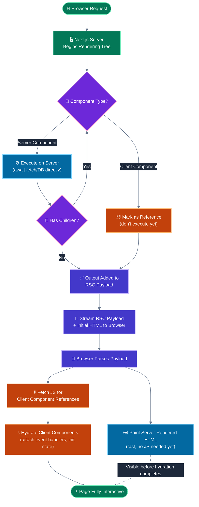
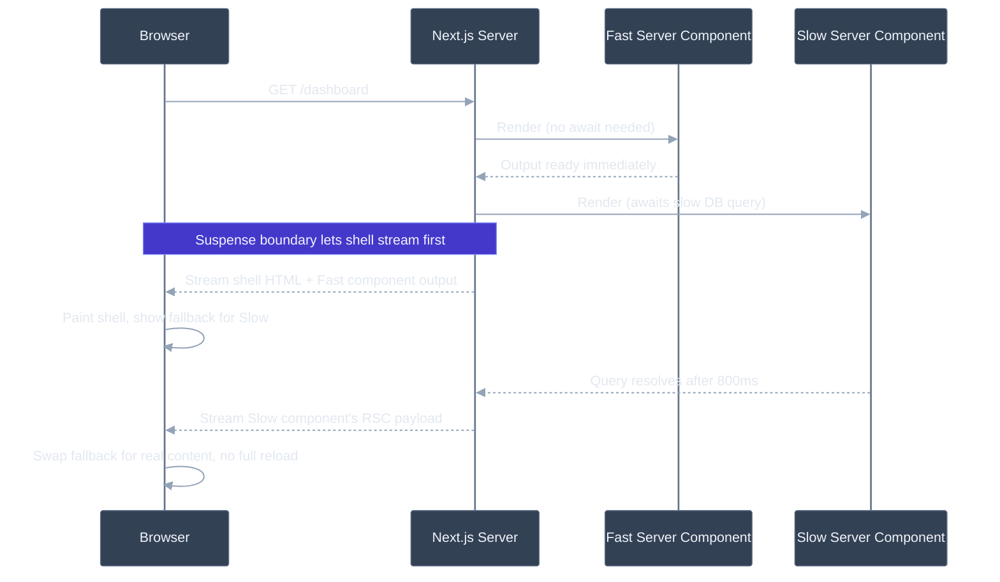

# Server components vs client components (Next.js App Router)

## 🎯 Executive Summary

React Server Components (RSC) are not "SSR with extra steps" — they're a third rendering primitive alongside Client Components and traditional SSR, with their own execution model, serialization format, and bundle-size implications. In the Next.js App Router, every component is a Server Component by default; `"use client"` is an opt-out, not an opt-in.

The core shift a Lead must internalize: Server Components never ship their JavaScript to the browser. They execute once, on the server, and their *output* — not their source — crosses the network as a serialized payload. This means the client/server boundary is now a **per-component architectural decision**, not a per-page one, and where you draw that boundary directly determines your JS bundle size, your data-fetching waterfall shape, and your hydration cost.

Why it's a must-know at Lead level: this is the single most consequential frontend architecture decision teams are making in 2026. Getting the boundary wrong — pushing `"use client"` too high in the tree — silently reintroduces the exact bundle bloat and waterfall problems RSC was built to solve, and it does so in a way that passes code review because it *works*, it's just slow. Interviewers use this topic to distinguish engineers who've shipped App Router in production from engineers who've only read the docs.

---

## 🧠 Core Technical Deep Dive

### Two rendering environments, one component tree

Next.js App Router components run in one of two environments, and the environment is determined statically per-file:

| | Server Component (default) | Client Component (`"use client"`) |
|---|---|---|
| Executes | Server only (build time or per-request) | Server (initial HTML) **and** browser (hydration + re-renders) |
| JS shipped to browser | None | Full component code + dependencies |
| Can use hooks (`useState`, `useEffect`, `useContext`) | No | Yes |
| Can be `async` and `await` data directly | Yes | No (must use `use()` or client-side fetching) |
| Can access backend-only resources (DB clients, `fs`, secrets) | Yes | No — would leak secrets into the bundle |
| Re-renders on state change | Never (it already ran) | Yes, normal React re-render |
| Props it receives | Anything (server-side values) | Must be serializable (see below) |

> **Key takeaway:** the default in App Router is Server. You are opting *into* client execution, not opting out of server execution — design your tree with that inversion in mind.

### The RSC payload isn't HTML

A Server Component's output isn't rendered to an HTML string and handed to the client as-is. It's serialized into the **React Server Component payload** ("Flight" format) — a compact, streamable description of the element tree that encodes:

- Rendered output of Server Components, inline.
- References to Client Component modules the client needs to fetch and hydrate — not their rendered output, a pointer to the module plus the serialized props to hydrate it with.
- Suspense boundary markers, so the client knows which parts are still streaming in.

The browser receives this payload (alongside the actual HTML for first paint), and React reconstructs the element tree from it. This is why Server Components can't be passed functions or class instances as props to Client Components — the payload has to serialize across the wire, and functions aren't serializable. Only plain objects, arrays, strings, numbers, and specific React-aware exceptions (Promises for streaming with `use()`, and React elements themselves) survive the crossing.

> **Key takeaway:** think of the server/client boundary as a serialization boundary first, a bundling boundary second. If it can't survive `JSON.stringify`-like serialization, it can't cross into a Client Component as a prop.

### Composition rules: the part everyone gets backwards

| Direction | Allowed? | Why |
|---|---|---|
| Server Component imports/renders a Client Component | ✅ Yes | Server renders it once; client hydrates the reference |
| Client Component imports a Server Component directly | ❌ No — silently becomes a Client Component | `"use client"` marks the module boundary; anything imported *into* that module is bundled and executed client-side, defeating the Server Component |
| Server Component passed as `children`/prop **into** a Client Component | ✅ Yes | The Server Component is rendered server-side first; its already-rendered output is what crosses the boundary, not its source |

That third row is the escape hatch most teams miss. You cannot `import ServerComp from './ServerComp'` inside a `"use client"` file — but you *can* accept `children` in a Client Component (e.g., a client-side `<Modal>` that needs `useState` for open/close) and have a parent Server Component pass server-rendered content into that slot. The Client Component never touches the Server Component's source; it just renders whatever pre-rendered node was handed to it.

> **Key takeaway:** when you need server-rendered content inside an interactive shell, restructure as composition (`children`/slots), not as an import.

### Data fetching and the waterfall problem

Server Components can be `async` functions that `await fetch()` or a DB call directly in the component body — no `useEffect`, no loading state boilerplate for the initial render. Next.js extends `fetch` with request memoization (dedupes identical requests within a single render pass) and its own caching layer (`cache: 'force-cache' | 'no-store'`, `next: { revalidate }`).

The failure mode: nested Server Components that each `await` sequentially create a request waterfall identical to nested `useEffect` chains — just moved server-side, and now blocking TTFB instead of a client spinner.

```typescript
// Waterfall: each component blocks the next from starting
async function Page() {
  const user = await getUser();        // 200ms
  return <Profile userId={user.id} />;
}
async function Profile({ userId }: { userId: string }) {
  const posts = await getPosts(userId); // starts only after getUser resolves
  return <PostList posts={posts} />;
}
```

```typescript
// Parallelized: kick off both requests before either resolves
async function Page() {
  const userPromise = getUser();
  const postsPromise = getPosts(); // starts immediately, doesn't wait on userPromise
  const [user, posts] = await Promise.all([userPromise, postsPromise]);
  return <Profile user={user} posts={posts} />;
}
```

`<Suspense>` boundaries let you stream around slow segments instead of blocking the whole page on the slowest fetch — the shell and fast segments paint immediately, slow segments pop in as their data resolves.

> **Key takeaway:** `async`/`await` in Server Components gives you SQL-query-like ergonomics, but it inherits the exact same waterfall risk as `useEffect` chains — parallelize with `Promise.all` at the highest common ancestor, and use `Suspense` to unblock the parts that don't need to wait.

### `"use server"` is a different thing entirely

`"use client"` marks a *module* as client-executed. `"use server"` marks a *function* as a **Server Action** — callable from a Client Component (e.g., a form `action` prop) without hand-rolling an API route. It's a mutation mechanism, not a rendering mechanism, and confusing the two directives is a common mid-level mistake.

---

## 📊 Visual Architecture & Logic

### Diagram 1 — Request Lifecycle: From Request to Interactive



### Diagram 2 — Streaming with Suspense: A Slow Data Dependency



---

## 🏢 Interview Context & FAANG Signals

### Where This Appears

| Interview Stage | Format |
|---|---|
| **Technical Round** | "Where would you draw the client/server boundary in this component tree?" — a live tree diagram, expects reasoning not memorization |
| **System Design / Perf Round** | "This Next.js app has a 400KB client bundle on a page that's mostly static — diagnose" |
| **Coding Round** | Refactor a component that has `"use client"` at the top of the file for no functional reason |
| **Architecture Deep Dive** | "How do Server Actions change your API layer design?" |

### Lead Signals Interviewers Are Looking For

1. **Boundary placement as a first-class design decision** — do you talk about pushing `"use client"` to leaves, not just knowing the directive exists?
2. **Serialization awareness** — do you know *why* you can't pass a function prop across the boundary, not just that you can't?
3. **Waterfall diagnosis** — can you spot a sequential-await chain in Server Components and fix it with `Promise.all` + `Suspense`?
4. **Migration judgment** — from Pages Router (`getServerSideProps`), what changes structurally, not just syntactically?
5. **Bundle-size framing** — connecting the RSC boundary decision to actual INP/TTI numbers, not treating it as an abstract pattern.

---

## ⚔️ Lead Level vs Senior Level

### Scenario: "Our dashboard's client JS bundle is 380KB. Where do you start?"

**Senior Response:**
> "I'd run the bundle analyzer, find the biggest chunks, and probably lazy-load some of the heavier components with `dynamic()` imports."

Correct instinct, but treats it as a bundling problem, not an architecture problem.

---

**Staff/Lead Response:**
> "Before reaching for lazy-loading, I'd check whether those chunks need to be Client Components at all. In App Router, the bundle analyzer tells you what's shipping, but the RSC boundary tells you *why* it's shipping. My first pass is auditing every `"use client"` directive in the dashboard tree and asking: does this specific file need state, effects, or browser APIs — or did it just inherit the directive from a parent that does?
>
> A common anti-pattern I'd look for is a single `"use client"` near the root — often on a layout or a context provider — that's dragging every child underneath it into the client bundle, including presentational components that never needed to be interactive. Moving the interactive piece (say, a dropdown) down to a leaf component and letting everything else stay server-rendered usually recovers more bundle size than lazy-loading ever would, because it's not deferred weight, it's weight that was never supposed to ship.
>
> Only after that boundary audit would I look at genuinely necessary client-side code — third-party chart libraries, rich text editors — as candidates for `dynamic()` import with `ssr: false`."

The Lead answer treats bundle size as a downstream symptom of boundary placement, not a bundling configuration problem — and proposes a structural fix before a tooling fix.

---

## ⚠️ Common Pitfalls & Anti-Patterns

> ### ✕ Client Component Creep
> **Why it's wrong:** Adding `"use client"` to a high-level layout or provider component (often to wrap the app in a context provider) forces every component beneath it in that subtree to be bundled and hydrated client-side, even fully static children that never touch React state. This silently reintroduces the bundle bloat RSC was built to eliminate.
> **✓ Correct Lead Approach:** Isolate the interactive piece into its own small Client Component and pass everything else in as `children` from a Server Component parent. Context providers specifically should be thin, leaf-level `"use client"` wrappers — not applied at the root layout unless genuinely everything below needs that context.

---

> ### ✕ Importing a Server Component Into a Client Component
> **Why it's wrong:** `import ServerComp from './ServerComp'` inside a `"use client"` file doesn't error — it silently makes `ServerComp` a client-executed component too, because the import is now part of the client module graph. Any server-only code inside it (DB calls, secrets) either breaks at runtime or, worse, gets bundled and shipped to the browser.
> **✓ Correct Lead Approach:** Restructure as composition — accept the Server Component as `children` or a named slot prop from a Server Component ancestor, so it's rendered server-side before it ever reaches the Client Component boundary.

---

> ### ✕ Passing Non-Serializable Props Across the Boundary
> **Why it's wrong:** Functions, class instances, and Symbols can't survive the RSC payload serialization. Passing an `onClick` handler or a Date-wrapping custom class from a Server Component into a Client Component throws at build/runtime, and the error message is often unhelpful.
> **✓ Correct Lead Approach:** Keep the prop contract JSON-serializable. If a Client Component needs behavior in response to a server-known value, pass the raw data and construct the handler client-side, or use a Server Action for the mutation path instead of trying to thread a function through.

---

> ### ✕ Sequential Awaits Creating Server-Side Waterfalls
> **Why it's wrong:** Nested `async` Server Components that each `await` their own data create a request chain identical to nested client-side `useEffect`s — except now it blocks TTFB instead of showing a client spinner, which can make the perceived regression worse, not better.
> **✓ Correct Lead Approach:** Kick off independent data requests with `Promise.all` at the highest common ancestor, and wrap genuinely slow, non-blocking segments in `<Suspense>` so the rest of the page can stream immediately.

---

> ### ✕ Treating Server Actions as a Direct Replacement for API Routes
> **Why it's wrong:** Server Actions are convenient for form-driven mutations tightly coupled to a specific UI, but treating every mutation as a Server Action can couple business logic to the component tree and make it hard to reuse across a mobile client, a public API, or a webhook consumer that isn't a React form submission.
> **✓ Correct Lead Approach:** Use Server Actions for UI-coupled mutations where the caller is always your own App Router frontend. Keep a real API layer for anything that needs to be called from outside that context.

---

## 🛠️ Practice Scenarios

---

### Scenario 1 — The Accidental Client Bundle

**Problem:**
```typescript
// app/dashboard/layout.tsx
"use client";
import { ThemeProvider } from './theme-context';

export default function DashboardLayout({ children }: { children: React.ReactNode }) {
  return <ThemeProvider>{children}</ThemeProvider>;
}
```
Every page under `/dashboard` — including fully static marketing-style pages — now ships significant client JS. Diagnose and fix.

<details>
<summary>Staff-Level Solution</summary>

**Root cause:** `"use client"` on the layout file makes the *entire* layout module client-executed, and because `children` is passed through render props at the JSX call site (not imported), the pages themselves stay server components — but the layout wrapper itself, along with anything it directly imports and renders (like `ThemeProvider`'s internals), ships to the client. If `ThemeProvider` is small this may be fine; the actual risk is when engineers start adding more logic directly into this file because "it's already a client component."

**Fix:** Keep `ThemeProvider` as the only client boundary, isolated in its own file, and don't let the layout accumulate more `"use client"`-requiring logic over time. The `children` composition pattern already means the actual page content stays server-rendered — the fix here is more about review discipline than a code change: audit new additions to this file against "does this specific piece need the client runtime?"

</details>

---

### Scenario 2 — The Waterfall Nobody Noticed

**Problem:**
```typescript
async function OrderPage({ params }: { params: { id: string } }) {
  const order = await getOrder(params.id);        // 150ms
  return <OrderDetails order={order} />;
}

async function OrderDetails({ order }: { order: Order }) {
  const shipping = await getShippingStatus(order.id);  // 300ms, starts after order resolves
  const recommendations = await getRecommendations(order.userId); // 250ms, starts after shipping resolves
  return (/* render all three */);
}
```
TTFB for this page is consistently 700ms+. Diagnose and fix.

<details>
<summary>Staff-Level Solution</summary>

**Root cause:** Three sequential awaits (150 + 300 + 250 = 700ms) where only the first genuinely depends on a prior result — `getShippingStatus` and `getRecommendations` don't need each other, and `getRecommendations` only needs `order.userId`, which is available right after the first fetch.

**Fix:**
```typescript
async function OrderPage({ params }: { params: { id: string } }) {
  const order = await getOrder(params.id);
  return <OrderDetails order={order} />;
}

async function OrderDetails({ order }: { order: Order }) {
  const [shipping, recommendations] = await Promise.all([
    getShippingStatus(order.id),
    getRecommendations(order.userId),
  ]);
  return (/* render all three */);
}
```
This drops the chain to 150 + max(300, 250) = 450ms. For further improvement, wrap `recommendations` (non-critical, below-the-fold) in its own `<Suspense>` boundary so the order + shipping details stream immediately and recommendations pop in independently.

**Lead framing:** "The instinct to reach for `Promise.all` is right, but the bigger question is which of these three pieces of data actually needs to block the initial paint. Shipping status is probably load-bearing for the page's purpose; recommendations almost certainly aren't — that's a Suspense boundary, not just a parallelized await."

</details>

---

### Scenario 3 — Migrating `getServerSideProps` to the App Router

**Problem:**
A team's Pages Router app uses `getServerSideProps` at the page level to fetch all data for a page, then passes it down through props to a dozen child components. They're migrating to App Router and ask: "Do we just move this fetch into the top-level `page.tsx`?"

<details>
<summary>Staff-Level Solution</summary>

**Why the naive migration is a missed opportunity:** Keeping a single page-level fetch and prop-drilling through a dozen components preserves the exact structural problem `getServerSideProps` had — one large fetch blocking the entire page, and tight coupling between the page and every child's data shape.

**Correct approach:** Push data fetching down to the Server Components that actually need it. Each server-rendered child can `await` its own data directly, colocated with where it's used, benefiting from Next.js's automatic request memoization if multiple components fetch overlapping data. This also means individual segments can be independently wrapped in `<Suspense>` for streaming, which a single page-level fetch can never offer — with `getServerSideProps`, the entire page waits on the slowest piece of data by definition.

**Lead framing:** "The migration isn't just an API swap — `getServerSideProps` structurally forces a single blocking fetch per page. App Router's per-component fetching is the actual unlock; if we just relocate the same monolithic fetch into `page.tsx`, we've adopted the new API without getting any of the architectural benefit, and we've kept the prop-drilling maintenance cost too."

</details>

---

### Scenario 4 — The Prop That Wouldn't Serialize

**Problem:**
```typescript
// app/page.tsx (Server Component)
import InteractiveChart from './InteractiveChart'; // "use client"

export default async function Page() {
  const data = await getChartData();
  return (
    <InteractiveChart
      data={data}
      onPointClick={(point) => console.log('clicked', point)}
    />
  );
}
```
This throws a build error about passing functions to Client Components. Explain and fix.

<details>
<summary>Staff-Level Solution</summary>

**Root cause:** `onPointClick` is a function defined in a Server Component's scope. Server Component output has to serialize into the RSC payload to cross to the client, and functions aren't serializable — there's no server-side closure the client can reference, since the server component's execution is already finished by the time this reaches the browser.

**Fix:** Move the click-handling logic entirely inside the Client Component, since click handling is inherently a client-side concern:
```typescript
// InteractiveChart.tsx
"use client";
export default function InteractiveChart({ data }: { data: ChartPoint[] }) {
  const handlePointClick = (point: ChartPoint) => {
    console.log('clicked', point);
    // any further logic (analytics, navigation) lives here, client-side
  };
  return <Chart data={data} onPointClick={handlePointClick} />;
}
```
If the click needs to trigger a server-side mutation (not just a client-side log), use a Server Action invoked from within the Client Component's handler instead of trying to pass a server-defined function down.

**Lead framing:** "This isn't a workaround — it's the correct model. Event handling is fundamentally a client-side runtime concern; the fact that the framework enforces this at the type/serialization level is a feature, because it stops a whole class of 'why doesn't my server-defined callback fire' bugs before they ship."

</details>

---

### Scenario 5 — Third-Party Library That Assumes `window`

**Problem:**
A team adds a charting library that reads `window.innerWidth` at module load time. Importing it anywhere in the App Router tree throws `window is not defined` during the server render pass, even inside a `"use client"` component.

<details>
<summary>Staff-Level Solution</summary>

**Root cause:** `"use client"` doesn't mean "never runs on the server" — Client Components still get server-rendered for the initial HTML (that's what makes first paint fast without waiting for JS). The library's module-level `window` access runs during that server pass, before any browser exists.

**Fix:** Defer the library's usage to strictly after mount, or disable SSR for that specific component:
```typescript
import dynamic from 'next/dynamic';
const Chart = dynamic(() => import('./Chart'), { ssr: false });
```
`ssr: false` tells Next.js to skip server-rendering this component entirely and only render it client-side after hydration — appropriate for libraries with hard browser dependencies, at the cost of a blank slot until JS loads.

**Lead framing:** "The mental model gap here is common — `"use client"` marks *where a component can use client-only APIs*, not *only run in the browser*. For genuinely browser-dependent libraries, `ssr: false` is the correct, explicit opt-out, not a workaround. I'd flag this in the library evaluation stage next time — module-level `window` access is a red flag for App Router compatibility."

</details>

---

### Scenario 6 — Context Provider at the Root Layout

**Problem:**
A team wraps their entire `app/layout.tsx` in five different context providers (theme, auth, feature flags, analytics, i18n), each requiring `"use client"`. A code reviewer flags this as a performance concern. Is the reviewer right?

<details>
<summary>Staff-Level Solution</summary>

**Partially — it depends on what's underneath.** Wrapping the root layout in providers doesn't automatically make every page's *content* a Client Component — Server Component children passed in via `{children}` still render server-side, because they're composed in, not imported. The providers themselves, and any component that directly consumes their context via a hook, are the only things paying the client-JS cost.

**Where the reviewer's concern is valid:** if any of those five providers do meaningful client-side work at initialization (e.g., analytics SDK setup, feature-flag fetching against an API), that work now blocks/executes on every single page load, and the provider code itself is part of the shared client bundle for the entire app.

**Correct approach:** Consolidate genuinely-global providers (auth, theme) at the root since they're needed everywhere, but push page-specific or heavy providers (analytics with a large SDK, feature flags with a network round-trip) down to the layouts or pages that actually need them, so pages that don't need analytics don't pay for its bundle.

**Lead framing:** "The reviewer's instinct is right in spirit but the mechanism is slightly off — root-level providers don't automatically taint page content, because of the composition escape hatch. The real audit question is per-provider: is this needed on every route, and does it do non-trivial work at mount? That's what actually determines the cost, not the mere presence of `"use client"` at the root."

</details>
