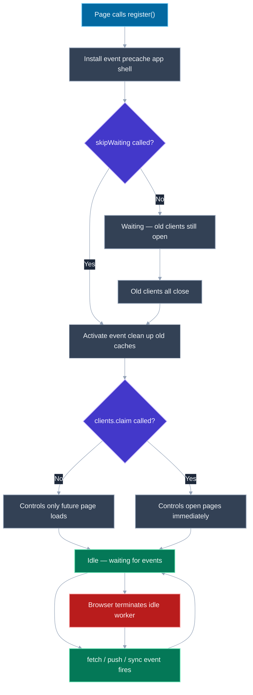
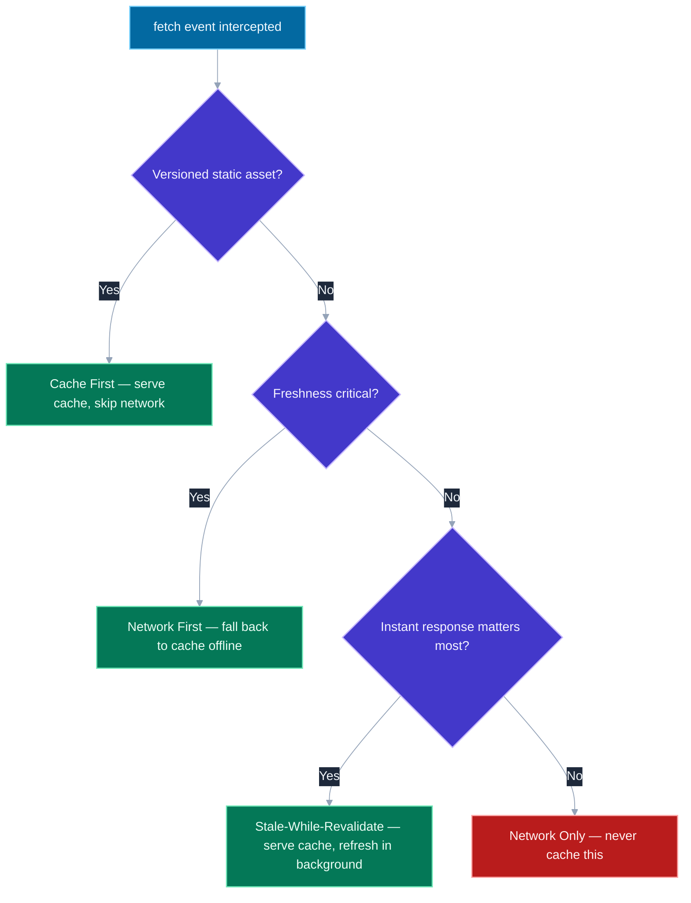

# Service Workers and PWA Fundamentals

## 🎯 Executive Summary

A service worker is the single piece of technology that turns a website into something that can survive a flaky network, push a notification while the tab is closed, and get installed on a home screen like a native app. It's also one of the most misunderstood parts of the platform: candidates who've "added a service worker" via a framework's PWA plugin often can't explain what it actually intercepts, when it runs, or why users sometimes see stale content for days after a deploy — because the framework hid the lifecycle from them.

This is a must-know topic at Lead level because service workers sit at the intersection of three things Leads are expected to reason about simultaneously: an unusual concurrency model (a script that runs independently of any page, with no DOM access, that the browser can kill and restart at will), a caching strategy decision (which of several fundamentally different strategies fits a given resource), and a rollout/versioning problem (how do you safely ship a new version of code that controls how old versions of your app fetch its own updates). Getting any one of these wrong produces a specific, well-known class of production incident — the "why won't this update" bug — that a Lead is expected to diagnose from a bug report alone.

At FAANG, this rarely appears as "explain service workers." It appears as a system design follow-up ("how would you make this feed readable offline"), a debugging scenario ("users report they don't see today's content"), or a follow-up to a caching-strategy discussion that assumes you already know this layer exists underneath HTTP caching.

## 📖 What Is It? (Plain-English Definition)

**In plain terms:** a service worker is a small JavaScript file that the browser runs in the background, separately from any web page, that can intercept every network request your site makes and decide what to do with it — serve something from a local cache, let it hit the real network, or make something up entirely — even when there's no internet connection at all.

Think of it as a programmable proxy server that lives inside the browser, sitting between your page and the network for exactly one origin. Once installed, it doesn't go away when you close the tab; the next time you visit, it's already there, silently deciding how every image, script, and API call gets fetched, before a real network request is ever made. That's what makes offline support, instant repeat-visit loading, and background push notifications possible — none of those are "browser features" in the way `localStorage` is; they're all things *your own code* implements, running inside this background script.

A Progressive Web App (PWA) is the marketing name for what you get when a site has a service worker plus a small manifest file describing its name and icons: a website that qualifies to be installed like a native app, launched from a home screen icon, with no browser chrome. The service worker is the actual engineering; the PWA "installability" is just the browser rewarding you for having built one properly.

Here's the mechanism that makes all of this possible, and the lifecycle that trips almost everyone up at least once.

---

## 🧠 Core Technical Deep Dive

### Registration: how a page and its service worker find each other

A service worker isn't automatically attached to a page — the page has to explicitly register one, and the *scope* of that registration determines which requests it's even allowed to see:

```javascript
if ('serviceWorker' in navigator) {
  navigator.serviceWorker.register('/sw.js', { scope: '/' })
    .then(reg => console.log('Registered with scope:', reg.scope))
    .catch(err => console.error('Registration failed:', err));
}
```

**The scope rule that catches people:** a service worker's default scope is the directory its script lives in, and it can *only* be widened by moving the file, never by the `scope` option alone — `/sw.js` can control the whole origin (`scope: '/'`), but `/app/sw.js` can only ever control paths under `/app/`, no matter what scope string you pass. This is a deliberate security boundary: a script served from `/app/` can't silently intercept requests made by an entirely different section of the site.

**Requirements to register at all:** HTTPS is mandatory (the one exception is `localhost`, for development) — a plaintext-HTTP origin cannot register a service worker under any circumstances, because a script with this much interception power over an origin is too dangerous to allow over a connection that can be tampered with in transit.

### The lifecycle: install → waiting → activate → idle → terminated

This is the part of the spec that produces the most production bugs, because the lifecycle exists specifically to protect users from having their *currently open* page's behavior changed out from under them mid-session — and that protection is exactly what makes "why isn't my update showing up" a recurring support ticket.

1. **Install**: fires once, the first time a service worker with new byte content is found. This is where you precache your app shell — the HTML/CSS/JS needed for the offline-first experience:
   ```javascript
   const CACHE_NAME = 'app-shell-v3';
   self.addEventListener('install', event => {
     event.waitUntil(
       caches.open(CACHE_NAME).then(cache => cache.addAll([
         '/', '/styles.css', '/app.js', '/offline.html',
       ]))
     );
   });
   ```
   `event.waitUntil()` is the mechanism the whole lifecycle is built on: it tells the browser "don't consider this event finished until this promise resolves," which is what lets an inherently asynchronous, event-driven worker do multi-step async work without the browser tearing it down mid-task.

2. **Waiting**: by default, a newly installed service worker does **not** take over immediately — it sits in a "waiting" state as long as any page controlled by the *previous* version is still open. This is the browser protecting an in-flight session from suddenly having a different version of your caching logic underneath it. This is also the #1 source of "I deployed but users still see the old version" tickets: the new worker installed successfully, but it's waiting for every open tab of the old version to close before it can activate.

3. **Activate**: fires once the old version's clients are gone (or `skipWaiting()` was called). This is where you clean up caches from previous versions — forgetting this step is how service-worker-managed origins slowly accumulate gigabytes of stale cache entries:
   ```javascript
   self.addEventListener('activate', event => {
     event.waitUntil(
       caches.keys().then(keys =>
         Promise.all(keys.filter(k => k !== CACHE_NAME).map(k => caches.delete(k)))
       )
     );
   });
   ```

4. **Idle, and fetch/push/sync events**: once activated, the worker sits idle between events. The browser can — and routinely does — **terminate an idle service worker to free memory**, and simply restarts it the next time an event needs handling. This is the detail that breaks people coming from a traditional server-process mental model: **you cannot rely on any in-memory variable surviving between events.** State that needs to persist belongs in IndexedDB or the Cache API, never a module-level `let`.

5. **`skipWaiting()` and `clients.claim()`**: the two escape hatches from the default, safety-first lifecycle. `self.skipWaiting()` (called during install) makes the new worker activate immediately instead of waiting for old clients to close. `self.clients.claim()` (called during activate) makes it take control of *already-open* pages immediately, instead of waiting for their next navigation. Used together, they make updates apply as fast as possible — at the cost of the exact protection the default behavior exists to provide: a page that was mid-session under the old worker's assumptions can suddenly have its fetches served by new logic without a reload. This is a real trade-off, not a strictly-better setting to always flip on.

### Fetch interception and caching strategies

Once active, a service worker can intercept every request in its scope via the `fetch` event, and decide how to answer it — this is the actual caching-strategy decision Leads are expected to make deliberately per resource type, not apply uniformly:

| Strategy | Behavior | Best for |
|---|---|---|
| **Cache First** | Check cache; if present, return it and never touch the network. Only fetch from network on a cache miss. | Immutable, versioned assets (hashed JS/CSS bundles, fonts, icons) |
| **Network First** | Try the network; on success, cache the response and return it. On failure (offline), fall back to cache. | Frequently-changing content where freshness matters more than speed (a news feed, an API response) |
| **Stale-While-Revalidate** | Return the cached response immediately (fast!), *and* simultaneously fire a network request to update the cache in the background for next time. | Content where slightly-stale-but-instant beats fresh-but-slow (an avatar image, a rarely-changing settings blob) |
| **Network Only** | Never touch the cache; always hit the network, and let it fail if offline. | Anything where a stale response would be actively wrong or dangerous (a payment endpoint, a real-time balance check) |
| **Cache Only** | Never touch the network; assumes the resource was precached during install. | The app shell itself, once precached |

```javascript
// Cache First, the most common pattern for versioned static assets
self.addEventListener('fetch', event => {
  event.respondWith(
    caches.match(event.request).then(cached => cached || fetch(event.request).then(response => {
      const clone = response.clone(); // a Response body can only be read once
      caches.open(CACHE_NAME).then(cache => cache.put(event.request, clone));
      return response;
    }))
  );
});
```

**The detail that separates a working answer from a correct one:** `event.respondWith()` must be called *synchronously*, within the fetch handler's initial execution — you can pass it a Promise that resolves later, but you can't decide asynchronously whether to call it at all. This is why every real implementation branches on `event.request.url` or `event.request.destination` up front to pick a strategy, rather than trying to inspect the response first.

### The Cache API is not the HTTP cache

A genuinely common point of confusion: the Cache Storage API (`caches.open()`, `cache.put()`, `cache.match()`) that service workers use is a **completely separate mechanism** from the browser's built-in HTTP cache governed by `Cache-Control` headers. The Cache API is fully programmatic — nothing expires automatically, nothing is evicted based on headers, and a response you `cache.put()` stays there, verbatim, until your own code deletes it. This is precisely why forgetting the activate-event cleanup step is a real bug and not just tidiness: unlike the HTTP cache, there is no browser-managed expiry backstopping a mistake.

### The manifest and installability

A PWA's `manifest.json` describes how the app should look and behave once installed — not the offline behavior, which is entirely the service worker's job:

```json
{
  "name": "My App",
  "short_name": "MyApp",
  "start_url": "/?source=pwa",
  "display": "standalone",
  "theme_color": "#111827",
  "background_color": "#ffffff",
  "icons": [
    { "src": "/icon-192.png", "sizes": "192x192", "type": "image/png" },
    { "src": "/icon-512.png", "sizes": "512x512", "type": "image/png" }
  ]
}
```

For a browser to consider a site installable at all, it generally requires: HTTPS, a linked manifest with the fields above, a service worker registered with at least a `fetch` handler, and icons at the specified sizes. `display: "standalone"` is what removes the browser's URL bar and toolbar chrome once launched from the home screen — the detail that actually makes it *feel* like a native app rather than a bookmark.

### Background Sync and Push

Two capabilities specifically enabled by the service worker's ability to run independently of any open page:

- **Background Sync** lets a page register a deferred task (`registration.sync.register('sync-messages')`) that the browser guarantees to fire — even if the user has closed the tab — the next time connectivity is available. This is the correct mechanism for "the user hit send while offline; retry it for them," rather than a client-side retry loop that only works while the tab happens to stay open.
- **Push API** lets a backend send a message to a service worker *while no page is open at all*, via the browser vendor's push service, which the worker can turn into a visible notification (`self.registration.showNotification(...)`). This requires a subscription (`pushManager.subscribe()`) with VAPID keys, and is the only way a web app can notify a user without a native app wrapper.

Neither of these is "a service worker feature" in the sense of always being available the instant you register one — both require their own explicit registration/subscription step and browser permission.

---

## 📊 Visual Architecture & Logic

### Diagram 1: The Service Worker Lifecycle



### Diagram 2: Deciding a Fetch Strategy



---

## 🏢 Interview Context & FAANG Signals

| Interview Stage | Format |
|---|---|
| **System Design** | "Design a feed/reader that works offline" — service worker + Cache API is the expected foundation of the answer |
| **Debugging Round** | "Users report the site doesn't reflect our latest deploy" — a lifecycle/`skipWaiting` diagnosis |
| **Coding Round** | Implement a specific caching strategy (usually Cache First or Stale-While-Revalidate) against the fetch event |
| **Behavioral/Architecture** | "How would you roll out a breaking change to cached assets safely" — versioned cache names, activate-time cleanup |

**Lead signals interviewers are listening for:**

1. **Precision about the lifecycle** — naming install/waiting/activate/idle explicitly, and correctly identifying that the default behavior is the safe one, with `skipWaiting`/`clients.claim` as deliberate trade-offs, not "the right settings to always use."
2. **Choosing a caching strategy per resource, not globally** — recognizing that a hashed JS bundle and a live API response should never share the same strategy.
3. **Knowing the Cache API and HTTP cache are unrelated mechanisms** — this single distinction resolves most confusion about "why isn't `Cache-Control` affecting my service worker."
4. **Debugging fluency** — knowing to check the browser's Application/Service Workers panel, that "Update on reload" exists specifically to bypass the waiting-worker problem during development, and that an unregistered/updated worker often needs a hard reload or explicit `unregister()` to fully clear.
5. **Correctly scoping what a service worker can't do** — no DOM access, no synchronous XHR, state doesn't persist between events without explicit storage.

## ⚔️ Lead Level vs Senior Level

**Question:** "We shipped a fix an hour ago, but support says several users still see the old, broken version. What's going on?"

**Senior Response:**
> Probably a caching issue — they should try a hard refresh or clear their cache.

Not wrong, but it treats the symptom as a browser-cache problem and reaches for a workaround instead of diagnosing the actual mechanism.

---

**Staff/Lead Response:**
> If we're using a service worker, this is almost certainly the default lifecycle working exactly as designed: the new worker installed successfully but is sitting in "waiting" because those users still have a tab open from before the deploy — it won't activate until they close every such tab, or until we explicitly call `skipWaiting()` and `clients.claim()`.
>
> Before I tell them to hard-refresh, I'd check the Application panel's Service Workers section for their reported version, confirm whether we're calling `skipWaiting()` in this codebase, and separately check whether our cache-name versioning actually changed with this deploy — if the cache name didn't bump, activate's cleanup step might have nothing to remove and stale entries survive too.
>
> If this keeps happening, the actual fix isn't telling users to hard-refresh — it's either accepting the wait-for-close behavior and shipping a "new version available, refresh to update" banner, or deliberately adopting `skipWaiting`/`clients.claim` with the understanding that it can change behavior under a user mid-session.

The Lead answer names the exact mechanism, offers a real diagnostic path, and proposes an architectural fix instead of a support-ticket workaround.

## ⚠️ Common Pitfalls & Anti-Patterns

> ### ✕ Never Bumping the Cache Name on Deploy
> **Why it's wrong:** If `CACHE_NAME` stays `'app-shell-v1'` forever, the activate event's cleanup (`keys().filter(k => k !== CACHE_NAME)`) has nothing to delete, and `cache.addAll()` during install may silently skip requests already present under that name — old, broken assets can persist indefinitely.
> **✓ Correct Lead Approach:** Bump the cache name (or better, derive it from a build hash) on every deploy that changes what should be cached, so activate's cleanup step always has real, stale entries to remove.

---

> ### ✕ Assuming `skipWaiting` + `clients.claim` Is Strictly Better
> **Why it's wrong:** These bypass the lifecycle's core safety guarantee — that an open page's behavior won't change mid-session. A page can have in-flight requests re-routed by entirely new fetch logic without any reload, which can produce confusing, hard-to-reproduce bugs.
> **✓ Correct Lead Approach:** Default to the safe behavior; only adopt `skipWaiting`/`clients.claim` deliberately, usually paired with a "new version available" UI prompt so the update is at least visible to the user.

---

> ### ✕ Caching a `Response` Object Twice Without Cloning
> **Why it's wrong:** A `Response` body is a stream that can only be read once. Returning a fetched response to the page *and* passing the same object to `cache.put()` throws — the second read finds an already-consumed body.
> **✓ Correct Lead Approach:** Always `response.clone()` before doing anything with a response body a second time — one clone for the cache, the original for the page.

---

> ### ✕ Treating the Service Worker as a Place to Store Session State
> **Why it's wrong:** The browser can terminate an idle service worker at any point and simply re-run the script fresh on the next event — any module-level variable holding "state" is silently reset, producing bugs that only appear after the worker has been idle long enough to be killed.
> **✓ Correct Lead Approach:** Persist anything that needs to survive between events in IndexedDB or the Cache API, never a plain in-memory variable.

---

> ### ✕ Registering a Service Worker on Plain HTTP in "Production" and Being Surprised It Silently No-Ops
> **Why it's wrong:** `navigator.serviceWorker.register()` fails outright on a non-HTTPS origin (`localhost` excepted) — a common source of "it works on my machine" bugs when a staging environment isn't served over TLS yet.
> **✓ Correct Lead Approach:** Treat HTTPS as a hard prerequisite for any environment where service worker behavior needs to be verified, staging included.

## 🛠️ Practice Scenarios

### Scenario 1: The Stuck Update

**Problem:** A team ships a critical security fix. QA confirms it on a fresh incognito window, but the on-call engineer, who has had the app open in a regular tab all day, still sees the vulnerable version after refreshing several times. Explain what's happening and how to resolve it both immediately and structurally.

<details>
<summary>Staff-Level Solution</summary>

**Diagnosis:** the new service worker almost certainly installed successfully and is sitting in the "waiting" phase because the on-call engineer's long-lived tab is still controlled by the old worker — a plain refresh doesn't close the page's controlling relationship the way navigating away and back, or closing the tab entirely, would.

**Immediate fix:** have them close every tab for the origin (not just refresh) and reopen, or use the Application panel's Service Workers section to click "skipWaiting" manually against the waiting worker for this one session.

**Structural fix:** for security-relevant deploys specifically, ship with `self.skipWaiting()` in the install handler and `clients.claim()` in the activate handler, paired with a lightweight "app updated, refresh to apply" toast so users aren't confused by behavior changing under them — trading the default safety guarantee for guaranteed-fast rollout is the right call specifically for security fixes, not as a permanent default.

**Lead framing:** "The bug report is really 'our default lifecycle correctly protected an open session' — the incident isn't that it happened, it's that we don't yet have a deliberate policy for when to override that protection. That policy needs to exist before the next critical fix, not decided ad hoc during one."

</details>

---

### Scenario 2: Cache API vs. `Cache-Control`

**Problem:** A developer sets `Cache-Control: no-cache` on an API response, then reports that "the service worker is ignoring it" because users still see old data offline. Explain what's actually happening.

<details>
<summary>Staff-Level Solution</summary>

**Root cause:** `Cache-Control` governs the browser's built-in HTTP cache, an entirely separate mechanism from the Cache Storage API a service worker's fetch handler explicitly reads from and writes to. If the fetch handler is implementing Network First (or any strategy that falls back to a manually-populated cache entry), that cached entry has no expiry of its own and will be served until the service worker's own logic overwrites or deletes it — `Cache-Control` headers never enter into that decision at all.

**Fix:** the freshness policy has to be expressed in the service worker's own strategy — e.g., store a timestamp alongside the cached response and treat entries older than some threshold as a cache miss, or simply choose Network First so a cache hit only ever happens as an offline fallback, not as the default path.

**Lead framing:** "This is the most common category confusion in this whole topic: `Cache-Control` and the Cache API are two unrelated cache layers that happen to share the word 'cache.' Any time someone says a service worker is 'ignoring' an HTTP header, the actual bug is almost always that the service worker's own explicit logic — which has no idea the header exists — is what's serving the response."

</details>

---

### Scenario 3: Designing Offline Support for a News Feed

**Problem:** Design the caching approach for a news-reading app: article list, article images, and the app's own JS/CSS bundle. Justify a strategy per resource type.

<details>
<summary>Staff-Level Solution</summary>

- **JS/CSS bundle (hashed filenames per build):** Cache First. The filename itself changes whenever the content changes, so a cache hit is always correct by construction — there's no freshness question to answer.
- **Article list/content:** Network First with a cache fallback. Freshness matters (a stale headline is a real UX problem), but offline reading is the entire point of the feature, so a cached last-known-good state beats an error screen when the network is unavailable.
- **Article images:** Stale-While-Revalidate. An image being one revision behind is rarely noticeable and never harmful, so serving the cached version instantly while quietly refreshing it in the background gets both speed and eventual freshness without making the user wait.

**Lead framing:** "The interview signal here isn't naming three strategies — it's justifying each one from the actual cost of being wrong for that specific resource. A stale bundle is a real bug; a stale thumbnail is invisible. Treating all three the same is the mistake this question is designed to surface."

</details>
