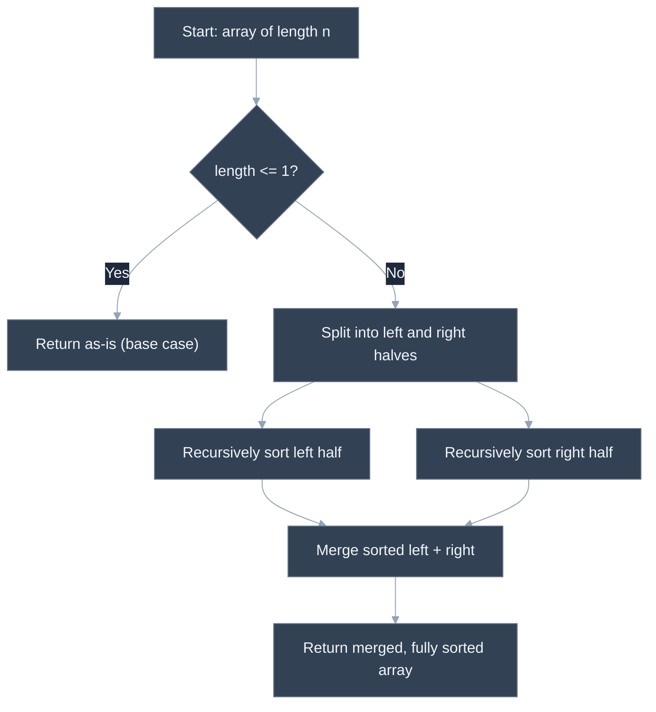
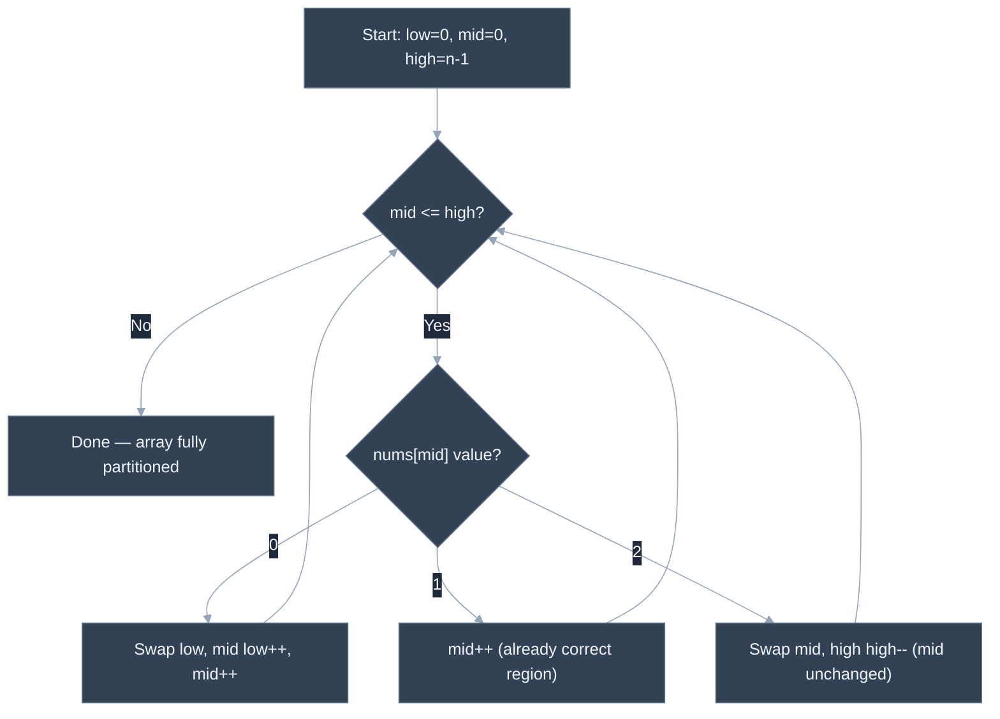

# Sorting Algorithms: When to Use Which

---

## 🎯 Executive Summary

Sorting rarely shows up in a Lead interview as "implement bubble sort from memory" — the built-in sort is right there, and reimplementing it for no reason is itself a mild red flag. What actually gets tested is **judgment**: given a specific constraint (stability required, nearly-sorted data, tight memory budget, a known small integer range), can you name the right algorithm and explain the trade-off you're making by choosing it over the alternatives? Sorting is also a recurring *building block* inside harder problems — "sort, then two-pointer" or "sort, then greedy" patterns appear constantly — so fluency with the complexity and stability characteristics of each algorithm pays off well beyond questions that are explicitly about sorting.

The handful of times an interviewer *does* want an algorithm implemented from scratch — merge sort, quicksort, or a specialized single-pass partition like the Dutch National Flag problem — they're testing whether you understand divide-and-conquer recursion, in-place partitioning, and recursion depth/stack trade-offs at a mechanical level, not whether you've memorized a textbook. A Lead should be able to implement any of the three cleanly, from the actual mental model of how the algorithm works, not from rote recall of a specific code template.

**Why this is a must-know for Leads:** system design and code review both surface sorting-adjacent decisions constantly — "should this list re-sort be stable across re-renders," "is this custom sort going to blow the stack on production-sized input," "should we use a counting sort here since IDs are bounded integers." A Lead who can reason from the constraints to the right algorithm choice, rather than reaching for whatever's memorized, is exactly the signal this topic is meant to surface.

---

## 📖 What Is It? (Plain-English Definition)

**In plain terms:** sorting algorithms are different strategies for putting a collection into order, and they differ in how much extra memory they need, whether they preserve the relative order of equal elements, and how they perform on data that's already partially ordered.

Think of sorting a deck of cards. **Merge sort** is like splitting the deck into single cards, then re-merging pairs back together in order, over and over, until the whole deck is one sorted pile — reliable and predictable, but it needs a second stack of cards on the table to do the merging into. **Quicksort** is like picking one card as a reference point and shuffling the rest of the deck so everything smaller ends up on one side and everything bigger on the other, then repeating that trick on each side — usually fast and needs no extra deck, but a bad reference-card choice on already-sorted or adversarial input can make it slow. **Insertion sort** is like how most people actually sort a hand of playing cards — picking up each new card and sliding it into its correct place among the cards already sorted in your hand — inefficient in general, but genuinely fast when the hand is already almost in order.

The practical skill isn't reimplementing all of these from scratch on demand (that's rare); it's knowing which one fits a given situation and being able to say why in one sentence.

---

## 🧠 Core Technical Deep Dive

### Pattern Recognition — Which Algorithm to Choose Given Constraints

Here, "pattern recognition" means matching a constraint in the problem to the algorithm designed for it, rather than spotting a coding technique:

- **Need stability** (equal elements must keep their original relative order — e.g., sorting rows by one column after already having sorted them by another): reach for **merge sort** or another stable algorithm. Naive in-place **quicksort** and **heapsort** are not stable by default — their swapping can reorder equal elements — so don't reach for them when stability is a stated or implied requirement.
- **Nearly-sorted or small input**: **insertion sort** runs close to O(n) on data that's already almost in order (each element only needs to move a short distance to its correct spot), and its low constant-factor overhead makes it genuinely competitive — even faster than O(n log n) algorithms — for small `n`. This is also why production sort implementations (like V8's Timsort) fall back to insertion sort for small sub-arrays inside a larger merge-sort-style pass.
- **Limited auxiliary memory**: merge sort's standard implementation needs O(n) extra space for the merge step. If memory is tightly constrained, **quicksort** (O(log n) auxiliary space for recursion, sorts in place) or **heapsort** (O(1) auxiliary space) are the better fit.
- **Known small integer range**: if the values being sorted are integers within a known, small range (e.g., ages 0–120, or scores 0–100), **counting sort** achieves O(n + k) time — genuinely faster than any comparison-based sort's O(n log n) lower bound — by counting occurrences of each value directly instead of comparing elements pairwise.
- **General-purpose default**: reach for the language's built-in sort (`Array.prototype.sort` in JavaScript, which is required by spec to be stable as of ES2019, and is typically implemented as Timsort — a hybrid of merge sort and insertion sort). **Reimplementing a general sort by hand is rarely the right interview answer unless explicitly asked** — it signals not knowing when to use the tool already provided, exactly the kind of unnecessary-reinvention judgment call a Lead is expected to make correctly in production code too.

### The comparison-sort lower bound, and why counting sort escapes it

Any sorting algorithm that only compares pairs of elements (no assumptions about the values themselves) cannot do better than O(n log n) in the worst case — this is a provable information-theoretic lower bound, not an implementation limitation. Counting sort escapes this bound because it isn't comparison-based at all: it uses the *values themselves* as array indices to count occurrences directly, which only works when the value range is known and reasonably small (an O(n + k) algorithm becomes worse than a comparison sort if `k` is very large relative to `n`).

```javascript
function countingSort(nums, maxValue) {
  const counts = new Array(maxValue + 1).fill(0);
  for (const n of nums) counts[n]++;

  const result = [];
  for (let value = 0; value <= maxValue; value++) {
    for (let i = 0; i < counts[value]; i++) result.push(value);
  }
  return result;
}
```

### Merge sort — divide and conquer, stable, predictable

Merge sort recursively halves the input until each piece is trivially sorted (length 0 or 1), then merges sorted halves back together in linear time per merge level. It's stable if the merge step always takes from the left half on ties.

```javascript
function mergeSort(arr) {
  if (arr.length <= 1) return arr;
  const mid = Math.floor(arr.length / 2);
  const left = mergeSort(arr.slice(0, mid));
  const right = mergeSort(arr.slice(mid));
  return merge(left, right);
}

function merge(left, right) {
  const result = [];
  let i = 0, j = 0;
  while (i < left.length && j < right.length) {
    if (left[i] <= right[j]) { result.push(left[i]); i++; } // <= preserves stability
    else { result.push(right[j]); j++; }
  }
  while (i < left.length) result.push(left[i++]);
  while (j < right.length) result.push(right[j++]);
  return result;
}
```

Guaranteed O(n log n) in every case (best, average, worst) — no input shape makes it degrade, which is a genuine advantage over quicksort's worst case.

### Quicksort — in-place, usually fast, unstable, pivot-sensitive

Quicksort picks a pivot, partitions the array so everything smaller is on one side and everything larger on the other, then recurses on each side. The partitioning happens in place, which is why quicksort typically outperforms merge sort in practice despite having a worse worst-case bound — better cache locality and no separate merge buffer.

```javascript
function quickSort(arr, low = 0, high = arr.length - 1) {
  if (low < high) {
    const pivotIndex = partition(arr, low, high);
    quickSort(arr, low, pivotIndex - 1);
    quickSort(arr, pivotIndex + 1, high);
  }
  return arr;
}

function partition(arr, low, high) {
  const pivot = arr[high]; // Lomuto scheme: pivot is the last element
  let i = low - 1; // boundary of the "smaller than pivot" region
  for (let j = low; j < high; j++) {
    if (arr[j] <= pivot) {
      i++;
      [arr[i], arr[j]] = [arr[j], arr[i]];
    }
  }
  [arr[i + 1], arr[high]] = [arr[high], arr[i + 1]];
  return i + 1;
}
```

Average case O(n log n), but worst case O(n²) — an already-sorted (or reverse-sorted) array with a naive "always pick the last element" pivot strategy triggers the worst case, since every partition splits off only one element instead of roughly half. Randomizing the pivot choice (or picking the median of three candidates) defeats this specific adversarial pattern, which is worth naming as the practical mitigation.

### The Dutch National Flag partition — a specialized single-pass three-way sort

Some problems don't need general sorting at all — sorting an array of exactly three distinct values (like 0s, 1s, and 2s) can be done in one pass with three pointers, no comparisons against a pivot needed, O(1) extra space.

```javascript
function sortColors(nums) {
  let low = 0, mid = 0, high = nums.length - 1;
  while (mid <= high) {
    if (nums[mid] === 0) {
      [nums[low], nums[mid]] = [nums[mid], nums[low]];
      low++; mid++;
    } else if (nums[mid] === 1) {
      mid++;
    } else {
      [nums[mid], nums[high]] = [nums[high], nums[mid]];
      high--; // do not advance mid — the swapped-in value from high hasn't been checked yet
    }
  }
  return nums;
}
```

The subtlety worth naming explicitly: `mid` advances after a `0` or `1` swap, but **not** after a `2` swap, because the element swapped in from the `high` end hasn't been classified yet and needs to be checked on the next iteration.

---

## 📊 Visual Architecture & Logic

### Diagram 1 — Merge Sort Divide-and-Conquer Recursion



### Diagram 2 — Dutch National Flag Three-Pointer Partition



---

## 🏢 Interview Context & FAANG Signals

| Interview Stage | Format |
| --- | --- |
| Coding Round (fundamentals check) | Implement merge sort or quicksort from scratch, tracing correctness on a small example and stating complexity |
| Coding Round (applied) | A problem that requires choosing and justifying a sorting strategy given constraints (stability, memory, known value range) rather than implementing one from scratch |
| System Design / Deep Dive | "Why would you choose Timsort/merge sort over quicksort for this use case?" — tests judgment about stability and worst-case guarantees in a real system context |

**Lead signals interviewers listen for:**

1. **Constraint-driven algorithm choice** — picking merge sort for stability, insertion sort for nearly-sorted data, counting sort for bounded integer ranges, rather than defaulting to "quicksort because it's usually fastest" without checking whether the constraints actually call for something else.
2. **Unprompted complexity and stability statements** — naming best/average/worst-case time complexity, auxiliary space, and stability for whichever algorithm is proposed, without being asked.
3. **Trade-off articulation** — explicitly comparing the chosen algorithm against at least one alternative and stating why the alternative loses on this specific constraint (e.g., "quicksort would be faster on average but isn't stable, and this problem needs stability").
4. **Knowing when *not* to hand-roll a sort** — recognizing that the built-in sort is the right default for general-purpose sorting, and reserving a from-scratch implementation for when the interviewer explicitly asks for one or the problem has a specialized shape (like three known values) that a general sort would be overkill for.
5. **Correct handling of degenerate input before being asked** — empty arrays, single-element arrays, and all-duplicate arrays addressed proactively while explaining the approach.

---

## ⚔️ Lead Level vs Senior Level

**Question:** "You need to sort a list of user records by last-login timestamp, but the list was already sorted alphabetically by name, and ties in timestamp should keep their alphabetical order. What sort would you use, and why?"

> **Senior Response:** "I'd just use the built-in sort with a comparator on timestamp. It's O(n log n) and simple to write."

This is a reasonable starting instinct, but it skips the actual constraint in the question — "ties should keep their alphabetical order" — which is explicitly asking about stability, and the response doesn't confirm the built-in sort actually guarantees that.

> **Staff/Lead Response:** "The requirement that ties preserve their existing alphabetical order is a stability requirement — I need a stable sort, one that never reorders elements considered equal by the comparator. JavaScript's `Array.prototype.sort` has been required to be stable since ES2019, so the built-in sort with a `(a, b) => a.lastLogin - b.lastLogin` comparator actually satisfies this correctly, and it's implemented as Timsort under the hood — a hybrid that's efficient on partially-ordered data, which fits well since the array is already sorted by name. If I were in an environment where the built-in sort's stability wasn't guaranteed, I'd either implement merge sort explicitly, since it's naturally stable, or make the comparator tie-break on the original index explicitly, which forces stability regardless of the underlying sort's own guarantee. I'd avoid a naive quicksort here specifically because its in-place swapping isn't stable by default."

The Lead response identifies the hidden requirement (stability) that the question is actually testing, confirms the built-in sort's actual guarantee rather than assuming it, and names two concrete fallback strategies if that guarantee weren't available — showing depth beyond "call sort and move on."

---

## ⚠️ Common Pitfalls & Anti-Patterns

> ### ✕ Reimplementing a General-Purpose Sort When the Built-in Sort Would Do
>
> **Why it's wrong:** Hand-rolling quicksort or merge sort for an ordinary "just sort this array" requirement, when not explicitly asked to implement a sort, adds unnecessary code, unnecessary bug surface, and signals a habit of reinventing well-solved problems rather than using the right tool.
>
> **✓ Correct Lead Approach:** Default to the language's built-in sort for general-purpose sorting, and reserve a from-scratch implementation for when the interviewer explicitly asks for one, or the problem has a specialized shape (bounded value range, three known values, a custom merge step fused with other logic) that genuinely benefits from a hand-written approach.

---

> ### ✕ Assuming Quicksort Is Always Faster Without Checking for Stability or Worst-Case Needs
>
> **Why it's wrong:** Quicksort's average-case speed advantage doesn't matter if the problem needs stability (which naive quicksort doesn't provide) or has adversarial/sorted input that triggers its O(n²) worst case with a naive pivot strategy — choosing it reflexively, without checking these constraints, can produce a solution that's either incorrect (unstable when stability was required) or slow in exactly the input shape most likely to appear in test cases.
>
> **✓ Correct Lead Approach:** Check for a stability requirement and for whether the input could be adversarially ordered before defaulting to quicksort; if either concerns apply, prefer merge sort (stable, guaranteed O(n log n)) or a randomized/median-of-three pivot strategy (defeats the sorted-input worst case).

---

> ### ✕ Off-by-One Errors in Partition Boundaries (Quicksort/Dutch National Flag)
>
> **Why it's wrong:** Both quicksort's partition step and the Dutch National Flag three-pointer partition are unusually easy to get subtly wrong at the boundaries — using `<=` instead of `<` in a loop condition, or advancing a pointer that shouldn't move yet (like advancing `mid` after a swap with `high` in the Dutch flag algorithm, before the swapped-in value has been checked), silently produces incorrect output rather than crashing.
>
> **✓ Correct Lead Approach:** Hand-trace the partition logic against a small, concrete example (3-6 elements including at least one duplicate) before trusting it, paying specific attention to which pointer moves after each branch and why — especially the "don't advance `mid` after a swap with `high`" rule, since the newly swapped-in element hasn't been classified yet.

---

> ### ✕ Forgetting That Merge Sort's Standard Implementation Costs O(n) Extra Space
>
> **Why it's wrong:** Presenting merge sort as a strictly superior choice without naming its O(n) auxiliary space requirement for the merge buffers omits a real trade-off — in a memory-constrained environment, that extra space can matter as much as, or more than, the time complexity.
>
> **✓ Correct Lead Approach:** State merge sort's space cost alongside its guarantees: "O(n log n) time in every case, stable, but O(n) auxiliary space for the merge step" — and if memory is a stated constraint, propose an in-place alternative (quicksort, heapsort) and name the trade-off being made in the other direction (losing the worst-case time guarantee, or losing stability).

---

> ### ✕ Using a General Comparison Sort When a Counting Sort Fits the Constraints
>
> **Why it's wrong:** When the values being sorted are integers within a known, small range, defaulting to an O(n log n) comparison sort leaves real performance on the table — counting sort achieves O(n + k), which is faster whenever the range `k` is small relative to `n` — and not recognizing this tell suggests memorized algorithm knowledge rather than constraint-driven selection.
>
> **✓ Correct Lead Approach:** Explicitly check whether the values have a known, bounded range before defaulting to a comparison sort; if they do, and `k` isn't excessively large relative to `n`, propose counting sort and state the trade-off (extra O(k) space for the count array, and it only works for discrete, boundable values — not general comparable objects).

---

## 🛠️ Practice Problems

### Problem 1: Implement Merge Sort

**Problem:**
```javascript
/**
 * Given an array of numbers `arr`, return a new array containing the same
 * elements sorted in ascending order, implemented via merge sort (recursive
 * divide-and-conquer with an explicit merge step) — not via the built-in sort.
 * @param {number[]} arr
 * @returns {number[]} a new, sorted array
 */
function mergeSort(arr) {
  // your implementation
}
```

The implementation must not mutate the input array, and must not call `Array.prototype.sort` internally.

**Examples:**
```
Input: arr = [5, 2, 4, 6, 1, 3]
Output: [1, 2, 3, 4, 5, 6]
```
```
Input: arr = [1, 1, 1]
Output: [1, 1, 1]
Explanation: Duplicates are handled correctly; the result has the same length and values as the input.
```

**Edge cases to handle:**
- Empty array (`[]`) — should return `[]`
- Single-element array — should return it unchanged
- Array already fully sorted (should still return a correctly sorted copy, without errors)

<details>
<summary>💡 Hint 1</summary>

Think recursively: if you could assume two *already-sorted* halves of the array, what's the minimum work needed to combine them into one fully sorted array?

</details>

<details>
<summary>💡 Hint 2</summary>

This is divide-and-conquer: split the array in half, recursively sort each half, then merge the two sorted halves together. The recursion's base case is an array of length 0 or 1, which is trivially already sorted.

</details>

<details>
<summary>💡 Hint 3</summary>

Write two functions. `mergeSort(arr)` handles the base case (length <= 1, return as-is), otherwise splits the array at the midpoint and recursively calls itself on each half, then passes both sorted halves to a `merge(left, right)` helper. `merge` walks both halves with two pointers, always taking the smaller of the two current elements and appending it to the result, then appends whatever's left over from whichever half wasn't fully consumed.

</details>

<details>
<summary>✅ Reveal Solution</summary>

```javascript
function mergeSort(arr) {
  if (arr.length <= 1) return arr.slice(); // base case: already sorted, return a copy

  const mid = Math.floor(arr.length / 2);
  const left = mergeSort(arr.slice(0, mid));
  const right = mergeSort(arr.slice(mid));
  return merge(left, right);
}

function merge(left, right) {
  const result = [];
  let i = 0, j = 0;
  while (i < left.length && j < right.length) {
    if (left[i] <= right[j]) {
      result.push(left[i]);
      i++;
    } else {
      result.push(right[j]);
      j++;
    }
  }
  while (i < left.length) result.push(left[i++]);
  while (j < right.length) result.push(right[j++]);
  return result;
}
```

**Why it works:** the recursion (Hint 2) bottoms out at single-element or empty arrays, which are trivially sorted, and every level back up combines two already-sorted halves via `merge`, which only needs a single linear pass comparing the fronts of each half (Hint 3) because both halves are already internally ordered. `arr.slice()` on the base case and the use of `slice()` to split ensure the original input is never mutated.

**Time complexity:** O(n log n) — the array is halved at each of the `log n` recursion levels, and each level does O(n) total work across all the merges at that level.
**Space complexity:** O(n) — the merge step allocates a new result array at every level of recursion, and the call stack itself adds O(log n), dominated by the O(n) merge buffers.

</details>

---

### Problem 2: Implement Quicksort

**Problem:**
```javascript
/**
 * Given an array of numbers `nums`, sort it in ascending order in place using
 * quicksort with a Lomuto partition scheme (pivot = last element of the
 * current range). Return the same array reference, now sorted.
 * @param {number[]} nums
 * @param {number} [low]
 * @param {number} [high]
 * @returns {number[]} the same array, sorted in place
 */
function quickSort(nums, low = 0, high = nums.length - 1) {
  // your implementation
}
```

The sort must happen in place (O(1) extra space aside from the recursion stack) — do not build a new array.

**Examples:**
```
Input: nums = [5, 2, 4, 6, 1, 3]
Output: [1, 2, 3, 4, 5, 6]
```
```
Input: nums = [3, 3, 3, 1]
Output: [1, 3, 3, 3]
Explanation: Duplicate values are handled correctly by the partition step (using <= against the pivot).
```

**Edge cases to handle:**
- Empty array (`[]`) — should return `[]` without error
- Single-element array — should return it unchanged
- Array with all identical elements — must terminate correctly and not infinite-loop or stack-overflow

<details>
<summary>💡 Hint 1</summary>

Instead of splitting the array in half blindly like merge sort, think about picking one element as a reference point and rearranging everything else around it — so that after the rearrangement, that one element is already in its final sorted position.

</details>

<details>
<summary>💡 Hint 2</summary>

This is a partition-based approach. Pick the last element of the current range as the pivot. Walk through the range, and move every element smaller than or equal to the pivot into a growing region at the front. When you're done, swap the pivot into place right after that region — it's now exactly where it belongs.

</details>

<details>
<summary>💡 Hint 3</summary>

Maintain an index `i` marking the boundary of the "elements known to be <= pivot" region, starting one before the range's start. Walk `j` from the range's start to just before the pivot; whenever `nums[j] <= pivot`, increment `i` and swap `nums[i]` with `nums[j]`. After the walk, swap the pivot (at `high`) into position `i + 1` — that's the pivot's final sorted index. Recurse on the sub-range to the left of that index and the sub-range to the right.

</details>

<details>
<summary>✅ Reveal Solution</summary>

```javascript
function quickSort(nums, low = 0, high = nums.length - 1) {
  if (low < high) {
    const pivotIndex = partition(nums, low, high);
    quickSort(nums, low, pivotIndex - 1);
    quickSort(nums, pivotIndex + 1, high);
  }
  return nums;
}

function partition(nums, low, high) {
  const pivot = nums[high];
  let i = low - 1;
  for (let j = low; j < high; j++) {
    if (nums[j] <= pivot) {
      i++;
      [nums[i], nums[j]] = [nums[j], nums[i]];
    }
  }
  [nums[i + 1], nums[high]] = [nums[high], nums[i + 1]];
  return i + 1;
}
```

**Why it works:** `i` always marks the last known index that belongs to the "<= pivot" region (Hint 3); every time `j` finds another qualifying element, that region grows by one and the qualifying element is swapped into it. After the scan, everything from `low` to `i` is <= pivot and everything from `i + 1` to `high - 1` is > pivot, so swapping the pivot into `i + 1` places it exactly at the boundary — its correct final sorted position — letting the two sides recurse independently.

**Time complexity:** O(n log n) average case — each partition step is O(n) and, on average, splits the range roughly in half, giving O(log n) levels; worst case O(n²) if the pivot choice repeatedly produces a highly unbalanced split (e.g., already-sorted input with this last-element pivot strategy).
**Space complexity:** O(log n) average case for the recursion call stack (O(n) worst case on the same unbalanced-split inputs) — no extra array is allocated since partitioning happens in place.

</details>

---

### Problem 3: Sort Colors (Dutch National Flag)

**Problem:**
```javascript
/**
 * Given an array `nums` containing only the values 0, 1, and 2, sort it
 * in place so that all 0s come first, then all 1s, then all 2s — in a
 * single pass, using O(1) extra space.
 * @param {number[]} nums
 * @returns {number[]} the same array, sorted in place
 */
function sortColors(nums) {
  // your implementation
}
```

Do not use a general-purpose sort or count-then-overwrite in two passes — the intended solution is a single-pass, three-pointer partition.

**Examples:**
```
Input: nums = [2, 0, 2, 1, 1, 0]
Output: [0, 0, 1, 1, 2, 2]
```
```
Input: nums = [0]
Output: [0]
Explanation: A single-element array is trivially already sorted.
```

**Edge cases to handle:**
- Array with all the same value (e.g., all 1s)
- Array already sorted (e.g., `[0, 1, 2]`)
- Array in fully reverse order (e.g., `[2, 1, 0]`)

<details>
<summary>💡 Hint 1</summary>

There are only three distinct values here, which is a much stronger constraint than general sorting — think about whether you actually need comparisons against a pivot at all, or whether you could just classify each element directly and place it in the right region as you go.

</details>

<details>
<summary>💡 Hint 2</summary>

Use three pointers to track the boundaries of three regions being built simultaneously: a region of 0s at the front, a region of 2s at the back, and an unexamined middle region in between. As you scan, swap each element directly into the region it belongs to.

</details>

<details>
<summary>💡 Hint 3</summary>

Maintain `low`, `mid`, and `high`, with `mid` scanning through the array. If `nums[mid]` is 0, swap it with `nums[low]` and advance both `low` and `mid` (the swapped-in element at `mid` is now known to be a 1 or the old `nums[low]`, either of which is safe to move past — wait, more precisely: everything before `low` is already known to be a placed 0). If `nums[mid]` is 1, it's already in the correct middle region, so just advance `mid`. If `nums[mid]` is 2, swap it with `nums[high]` and decrement `high` — but do not advance `mid`, since the element just swapped in from `high` hasn't been classified yet.

</details>

<details>
<summary>✅ Reveal Solution</summary>

```javascript
function sortColors(nums) {
  let low = 0, mid = 0, high = nums.length - 1;

  while (mid <= high) {
    if (nums[mid] === 0) {
      [nums[low], nums[mid]] = [nums[mid], nums[low]];
      low++;
      mid++;
    } else if (nums[mid] === 1) {
      mid++;
    } else {
      [nums[mid], nums[high]] = [nums[high], nums[mid]];
      high--;
      // mid is NOT advanced here — the newly swapped-in value must still be classified
    }
  }
  return nums;
}
```

**Why it works:** the invariant maintained throughout is: everything before `low` is a placed 0, everything from `low` to `mid - 1` is a placed 1, everything from `mid` to `high` is unclassified, and everything after `high` is a placed 2. Each branch either grows the 0-region or 1-region and safely advances `mid` (Hint 3), or swaps an unclassified element out to the 2-region without advancing `mid`, since the value swapped in from `high` still needs to be checked on the next loop iteration.

**Time complexity:** O(n) — `mid` only ever moves forward or stays put (on a 2-swap), and `high` only ever moves backward, so the total number of pointer movements is bounded by the array length, giving a single effective pass.
**Space complexity:** O(1) — only three index variables are used; all rearrangement happens via in-place swaps.

</details>

---

*Document version: September 2026 | Audience: Staff/Principal Frontend Engineer candidates | Topic ID: sorting-algorithms*
