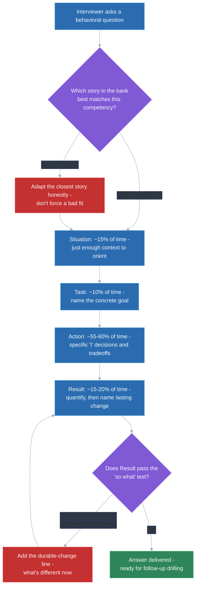
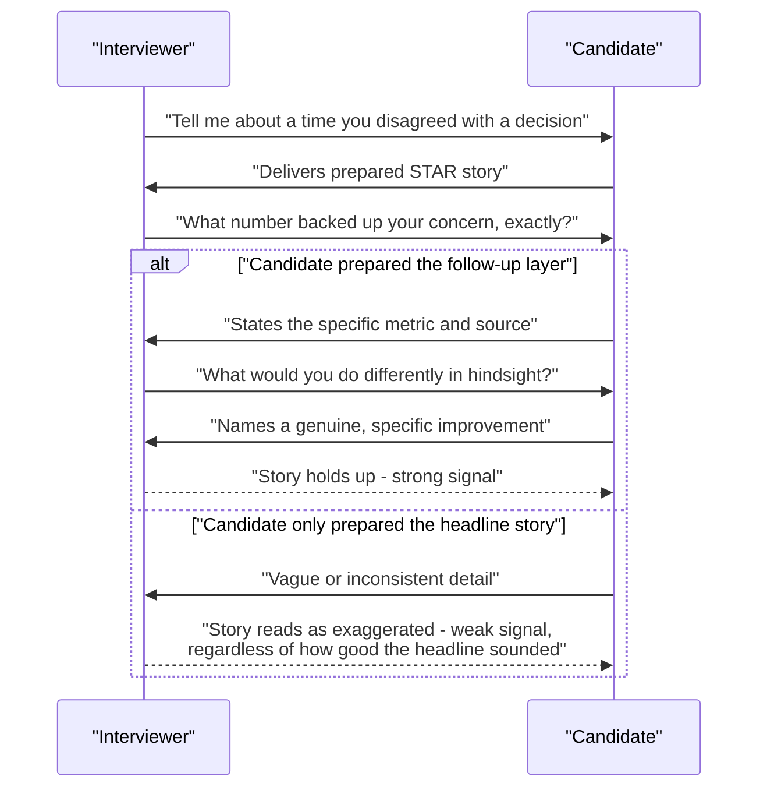

# STAR method — structure and common pitfalls

## 🎯 Executive Summary

STAR (Situation, Task, Action, Result) is the structural skeleton every other behavioral topic in this study plan assumes you already have — the SBI feedback stories, the Amazon Leadership Principle stories, the failure/ownership stories all get told *through* STAR. Getting this structure wrong doesn't cost you one answer; it quietly undermines every behavioral answer in the loop, because the same structural failure (too much context, too little of what *you* actually did, a vague ending) repeats across every question if it's not fixed at the source.

This is a must-know topic because interviewers pattern-match on structure within the first thirty seconds of an answer, often before the content even matters — a rambling Situation signals an unprepared candidate regardless of how good the underlying story is. The Lead-level bar isn't "know the acronym," it's having a repeatable system for building and delivering STAR stories under real interview pressure, including the follow-up questions that expose a story that wasn't actually as solid as it sounded.

## 🧠 Core Technical Deep Dive

### 1. What each letter actually needs to contain

The acronym is simple; getting each component's *job* right is where most candidates go wrong. Each letter has one specific purpose, and padding it with the wrong content is the single most common structural mistake:

| Component | Its actual job | Most common mistake |
|---|---|---|
| **Situation** | Just enough context for the Action to make sense | Rambling into a two-minute scene-setting monologue before saying anything about the actual problem |
| **Task** | The specific goal or responsibility — what needed to be true at the end | Restating the Situation instead of naming a concrete objective |
| **Action** | What *you specifically* did — decisions, tradeoffs, the actual work | Describing what "the team" did, hiding the candidate's individual contribution entirely |
| **Result** | A concrete, ideally quantified outcome, plus what changed afterward | Vague ("it went well") or unquantified when a real number was available and just wasn't included |

> **Key takeaway:** each STAR component has a distinct job — the two most common failures are letting Situation eat the time budget that Action should have, and letting Result stay vague when a real, specific outcome was available.

### 2. The "I" vs "we" problem

Interviewers are evaluating one specific person, not the team that person happened to be on — a story told entirely in "we" gives them nothing to actually score. This is subtle because most real engineering work genuinely is collaborative, so avoiding "we" can feel like overclaiming or erasing teammates.

The fix isn't lying about sole ownership — it's precision about the boundary between what the team did and what you specifically did within it. "We shipped the migration" tells an interviewer nothing; "the team owned the migration, and I specifically drove the rollback strategy after our first attempt caused a regression" tells them exactly what to evaluate, while still being honest about the collaborative context. A story with zero "I" statements in the Action section is a structural red flag before the content is even assessed.

> **Key takeaway:** "we" is fine for context, but the Action section needs "I" statements naming specific decisions — an interviewer can only score the individual they're actually interviewing.

### 3. Time-budgeting the four components

A story with perfect content still fails if the time allocation is wrong — the most common live-delivery mistake is spending 70% of the answer on Situation and rushing Action and Result in the final fifteen seconds. A rough, whiteboard-able budget for a 2-3 minute answer:

| Component | Target share of the answer | Why |
|---|---|---|
| Situation | ~15% | Just enough to orient the listener |
| Task | ~10% | One or two sentences naming the concrete goal |
| Action | ~55-60% | This is what's actually being evaluated — the decisions, the tradeoffs, the "I" statements |
| Result | ~15-20% | Concrete outcome, closed firmly, not trailed off |

This isn't a rule to recite word-for-word in an interview — it's a rehearsal discipline. Practicing a story out loud with a timer is the fastest way to discover that the Situation is eating three times its budget, which is nearly always where a rambling answer actually goes wrong.

> **Key takeaway:** if a story runs long, the fix is almost never "talk faster" — it's cutting Situation down to what's structurally necessary and reclaiming that time for Action, which is what's actually being scored.

### 4. Making Result pass the "so what" test

A Result that states an outcome without stating why it mattered leaves the interviewer to do the work of connecting it to anything they care about — and a good interviewer won't do that work for you, they'll just score the answer as weaker. Quantify wherever a real number exists (latency improved by X%, an incident rate dropped, a metric moved) — even a rough, honestly-labeled estimate beats a vague qualitative claim.

Beyond the number, a strong Result closes the loop on lasting change: what's different now because of this, not just what happened once. "We fixed the bug" is weaker than "we fixed the bug, and I added a regression test and a lint rule so the same class of bug can't reappear" — the second version demonstrates the same durable-fix instinct covered in this plan's failure-handling topic, and it's a pattern worth using across every Result, not just failure stories specifically.

> **Key takeaway:** a Result needs both a concrete outcome and an explicit answer to "so what changed as a result" — an outcome with no lasting effect reads as a one-off, not a demonstration of judgment.

### 5. Building a story bank instead of improvising live

Trying to invent a fresh story per question live in the interview is both risky and inefficient — the reliable system is a pre-built story bank of roughly 6-10 real stories, each pre-analyzed for which competencies it can honestly support (ownership, conflict, failure/ownership, technical depth, mentoring, ambiguous decisions). This is the same story-bank approach this plan's Amazon Leadership Principles topic uses for principle-tagging — build the bank once here, then tag each story against whatever competency framework a specific interview loop uses.

A good bank entry isn't just a bullet-point memory — it's the story pre-structured into STAR, with the Action's specific "I" statements and the Result's number already identified, so recall under pressure is retrieval, not invention. Building it this way also surfaces gaps early (a candidate who realizes they have four "technical decision" stories and zero "conflict" stories can fix that before the interview, not discover it live).

> **Key takeaway:** prepare a small bank of real stories pre-structured into STAR and pre-tagged by competency, rather than trying to freshly construct a story live under interview pressure — retrieval is reliable, improvisation isn't.

### 6. Why stories collapse under follow-up questions, and how to prevent it

A good interviewer doesn't just listen to the prepared answer — they probe it with specific follow-ups ("what exact number was it," "what did you actually say in that meeting," "what would you do differently"), and a story that was exaggerated or vague at the edges falls apart under that pressure in a way that's obvious and costly. This is the real reason specific, honest stories with real friction in them outperform impressive-sounding polished ones: the polish is exactly what a follow-up question exposes as thin.

The fix is preparing the follow-up layer, not just the headline story — know the actual numbers, know what you'd genuinely do differently in hindsight, and don't manufacture a cleaner version of events than what actually happened. A story that includes a real complication or a real mistake and how it was handled is more convincing than a frictionless success story, precisely because it survives being poked at.

> **Key takeaway:** prepare for the follow-up questions, not just the headline answer — specificity and honest friction are what make a story survive drilling, and a suspiciously smooth story is what invites more drilling in the first place.

## 📊 Visual Architecture & Logic

### Diagram 1 — Structuring and time-budgeting a STAR answer

### Diagram 2 — A story surviving (or failing) follow-up drilling

## 🏢 Interview Context & FAANG Signals

STAR structure underlies almost every behavioral round across every FAANG loop, and it's the mechanic other frameworks in this plan build on directly — the SBI feedback stories, the ownership/failure stories, and every Amazon Leadership Principle story all need to be told through this structure. It also shows up implicitly inside technical rounds whenever an interviewer asks "walk me through a technical decision you made" — the same structure applies even when the question isn't explicitly labeled "behavioral."

**Lead signals interviewers listen for:**

- A tight Situation/Task that doesn't eat the time budget Action needs.
- Explicit "I" statements in Action, not a story told entirely as "we."
- A Result that's quantified where possible and names what changed lastingly, not just what happened once.
- A story that survives specific follow-up drilling without contradicting itself or turning vague.
- A visibly prepared story bank — the candidate isn't inventing a story live, they're retrieving and adapting one.

## ⚔️ Lead Level vs Senior Level

A **Senior** response usually has the right shape technically — Situation, Task, Action, Result all present — but the Action section leans heavily on individual technical execution, and the Result stops at the immediate outcome.

A **Staff/Lead** response uses the same structure but the *content* of Action skews toward decisions with leverage beyond the candidate's own hands — influencing others, setting a technical direction, navigating a tradeoff with real organizational stakes — and the Result closes with a durable, structural change (a new process, a guardrail, a convention) rather than a one-off fix. The differentiator isn't the acronym, which both levels know — it's what kind of Action and what kind of Result the story actually contains.

## ⚠️ Common Pitfalls & Anti-Patterns

> ### ✕ Letting Situation run long
> **Why it's wrong:** Every extra sentence of scene-setting is time stolen from Action, which is the only section actually being evaluated — a two-minute Situation followed by a rushed fifteen-second Action inverts the time budget that should exist.
> **✓ Correct Lead Approach:** Rehearse with a timer, and cut Situation down to the minimum context needed for Action to make sense — if in doubt, cut it shorter, not longer.

> ### ✕ Telling the whole story in "we"
> **Why it's wrong:** An interviewer is scoring one specific person, and a story with no individual "I" statements gives them nothing to actually evaluate, regardless of how good the team's outcome was.
> **✓ Correct Lead Approach:** Keep "we" for genuine team context, but make sure Action contains explicit, specific statements of what the candidate personally decided or did.

> ### ✕ Ending on a vague or unquantified Result
> **Why it's wrong:** "It went well" or "the team was happy" gives an interviewer nothing to weigh, especially when a real number or a real lasting change was available and simply wasn't mentioned.
> **✓ Correct Lead Approach:** Close with a specific, ideally quantified outcome, and add what changed afterward as a result — the durable effect, not just the immediate one.

> ### ✕ Preparing only the headline story, not the follow-up layer
> **Why it's wrong:** A good interviewer drills into specifics ("what number," "what did you actually say"), and a story that was exaggerated or under-detailed collapses exactly there — which reads far worse than if the story had simply been less impressive to begin with.
> **✓ Correct Lead Approach:** Know the real numbers and the real complications behind every story in the bank, and be honest about what didn't go perfectly — specificity and real friction survive drilling better than a polished, frictionless version.

> ### ✕ Inventing a story live instead of drawing from a prepared bank
> **Why it's wrong:** Live improvisation under interview pressure reliably produces exactly the failure modes above — rambling Situation, no clear "I," a Result that trails off — because there's no time to structure it well while also trying to remember it accurately.
> **✓ Correct Lead Approach:** Build a small bank of 6-10 real stories in advance, pre-structured into STAR and pre-tagged by the competencies they can honestly support, so interview-time work is retrieval and light adaptation, not invention.

## 🛠️ Practice Scenarios

### Scenario 1 — Fixing a Story That's All Situation, No Action

A candidate's practice answer to "tell me about a challenging project" spends ninety seconds on background and finishes Action and Result in twenty seconds combined.

Staff-Level Solution

Time the story out loud first — the fix is almost never "talk faster," it's identifying exactly which sentences in Situation aren't structurally necessary and cutting them. A useful test: could a listener understand the Action section without a given Situation sentence? If yes, that sentence is padding.

Rebuild the answer aiming for the ~15% Situation / ~10% Task / ~55-60% Action / ~15-20% Result budget, and rehearse it against a timer until Action is clearly the largest section by a wide margin, since that's the part actually being evaluated.

### Scenario 2 — A Story Told Entirely in "We"

A candidate describes a successful project entirely as "we decided," "we built," "we shipped," with no individual contribution named anywhere in the Action section.

Staff-Level Solution

Go through the Action section sentence by sentence and ask, for each "we" statement, "specifically, what did I do within that?" — the honest answer is almost always recoverable even in genuinely collaborative work (who proposed the approach, who made the final call on a tradeoff, who caught the issue that changed the plan).

Rewrite Action with explicit "I" statements for the candidate's specific contribution, while keeping "we" for genuinely shared context — the goal isn't erasing the team, it's giving the interviewer something specific to actually score.

### Scenario 3 — A Result That Stops at "It Went Well"

A story's Result section is a single vague sentence with no number and no mention of what changed afterward.

Staff-Level Solution

Go back to the actual event and find the real number, even an approximate one, honestly labeled as an estimate if the exact figure isn't remembered — "it went well" almost always has a real metric behind it that just wasn't surfaced (a latency number, an incident count, a delivery date hit).

Then add the second half of a strong Result: what's structurally different now because of this — a new process, a guardrail, a convention adopted afterward — turning a one-off outcome into a demonstration of lasting judgment, not just a single good result.

### Scenario 4 — Preparing for "Walk Me Through a Technical Decision You Made"

A candidate realizes this question isn't explicitly labeled "behavioral" but still expects a structured answer.

Staff-Level Solution

Apply the same STAR structure even though the question is framed technically: Situation (the constraint or context that made this a real decision, not an obvious one), Task (what needed to be true at the end), Action (the actual reasoning process and the specific call made, including what was ruled out and why), Result (the outcome plus what would be done differently with hindsight, if anything).

Treat the "what would you do differently" follow-up as expected, not a trap — having a genuine answer ready (not "nothing, it was perfect") signals more maturity than a defensively perfect-sounding story.

### Scenario 5 — Building a Story Bank From Scratch

A candidate has years of experience but no organized set of interview stories, and two weeks until their loop.

Staff-Level Solution

Start by listing real projects/moments across a small set of competency categories (ownership, conflict, failure, ambiguous decision, mentoring, technical depth) rather than trying to write a unique story per possible question — most real interview loops sample from these same handful of underlying competencies with different phrasing.

For each story, pre-structure it into STAR explicitly (write it down, don't just remember the gist), identify the specific "I" statements for Action and the real number for Result, and note which competencies it can honestly support. Aim for 6-10 stories total — fewer risks gaps, more becomes hard to keep straight under pressure.

### Scenario 6 — A Story Collapses Under a Follow-Up Question in Mock Practice

During mock interview practice, a candidate's confident-sounding story falls apart the moment a practice partner asks "what was the actual number?"

Staff-Level Solution

Treat this as the practice session doing its job, not a failure — better to discover a thin spot now than live. Go back to the real event and either find the actual number/detail, or if it's genuinely not recoverable, adjust the claim to something honestly defensible instead of a specific-sounding guess.

Build the habit of pressure-testing every bank story with a partner asking exactly this kind of follow-up before relying on it live — a story that's only ever been told once, uninterrupted, hasn't actually been tested.

### Scenario 7 — Adapting One Story to Answer Two Different Questions

An interviewer asks a question that doesn't perfectly match any story in the candidate's prepared bank.

Staff-Level Solution

Look for the closest honest match rather than forcing a bad fit or inventing something new under pressure — most stories can honestly support more than one competency if the emphasis in Action shifts (the same project might demonstrate both "ambiguous decision" and "influencing upward," depending on which part of Action gets emphasized).

Adapt by re-weighting which part of Action gets told in more detail, not by changing the facts of what happened — the Situation and Result can usually stay the same while Action's emphasis shifts to match what's actually being asked.

### Scenario 8 — Delivering STAR Concisely When Time Is Cut Short

An interviewer says "I have five minutes left, give me your best example of X" — far less time than a full prepared answer.

Staff-Level Solution

Compress by cutting Situation and Task down to a single combined sentence each, and protect Action's share of the remaining time as much as possible — Result still needs a real number and a closing line, even if brief, rather than getting dropped entirely.

Having pre-identified, for each bank story, which sentences are truly load-bearing versus which are elaboration, makes this compression fast and clean under real time pressure instead of an improvised, messier cut.

