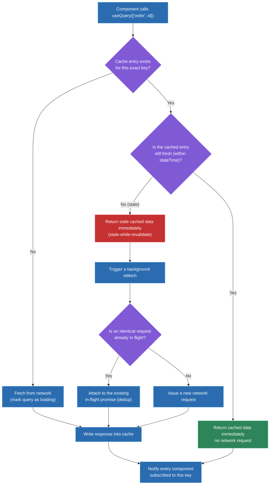
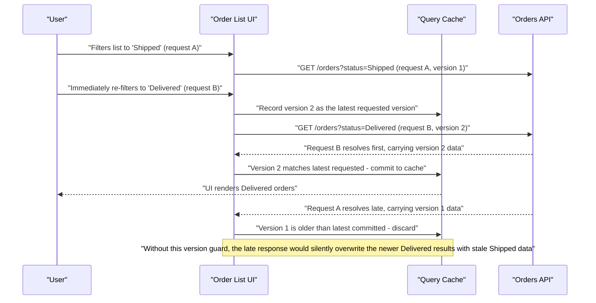

# State management at scale: server state vs client state

## 🎯 Executive Summary

Most state-management pain at scale doesn't come from picking the wrong library — it comes from treating fundamentally different categories of state as if they were the same thing. **Server state** (data owned by a remote source of truth, fetched over the network, shared across users, and constantly at risk of going stale) and **client state** (UI-local, synchronous, ephemeral — is this modal open, what's typed in this box) need different guarantees, different tools, and different mental models entirely.

This is a must-know topic for a Lead because the cost of getting this taxonomy wrong doesn't show up in a code review — it shows up months later as stale-data bugs, race conditions between tabs, cache invalidation spaghetti, and a Redux store nobody can safely modify anymore. The deeper signal interviewers are after is whether a candidate reaches for "what category of state is this, and what does it actually need" before reaching for a library at all.

## 🧠 Core Technical Deep Dive

Most state-management pain at scale traces back to one mistake: treating every piece of state as the same kind of thing. A team that puts `orders` (fetched from a server, shared across users) and `isOrderModalOpen` (local to one tab) into the same Redux store, updated through the same dispatch pipeline, eventually hits bugs like these:

- A rep edits an order's status, navigates back to the list, and sees the old status — nothing told the list slice its data was now wrong.
- Two support reps in two browser tabs both open the same order; one's edit silently disappears because the other tab's stale background poll overwrites it.
- The store's `orders` slice keeps every page ever fetched, forever, because nothing ever decided when a cached page stops being needed — the tab is visibly leaking memory hours into a shift.

None of these are bugs in Redux itself. They're symptoms of a category error: `orders` is **server state** — owned by a remote source of truth, shared across clients, allowed to go stale — and it was being managed with the exact same primitives as `isOrderModalOpen`, which is **client state** that only one tab knows or cares about.

> **Key takeaway:** almost every "state management is hard" complaint at scale is an unexamined category error — the fix starts with naming what kind of state each piece of data is, before picking any tool.

### 1. The state taxonomy — five categories, not two

| Category | Owned by | Lifetime | Sync need | Typical tool |
|---|---|---|---|---|
| **Server state** | Backend / remote source of truth | Until invalidated or refetched | Cache, dedupe concurrent requests, invalidate on mutation, background refresh | React Query, SWR, RTK Query, Apollo Client |
| **Client / UI state** | The component or app instance | Session or component lifetime | None — single source of truth is local memory | `useState`, `useReducer`, Zustand |
| **URL state** | The browser's address bar | Survives reload, shareable, bookmarkable | Stay in sync with UI without an extra round trip | Router search params |
| **Form state** | The component, transient | Until submit or cancel | High-frequency keystroke updates need an isolated re-render scope | React Hook Form, Formik |
| **Persisted / cross-tab state** | The device (localStorage/IndexedDB) | Cross-session, cross-tab | Needs cross-tab sync, but no network reconciliation | Storage-backed store + `storage` event listener |

Sorting real state into these categories is usually revealing. A filters field that lived in component state was a mistake in the *other* direction — refreshing the page or sharing a link silently lost a rep's filter, when it should have lived in the URL all along. An auth token and a theme preference are persisted, cross-tab state — they don't need cache invalidation from a server, but every open tab does need to notice when one tab logs out.

> **Key takeaway:** the taxonomy has at least five practical categories, not two — collapsing everything into "global state" is what causes the pain above, and the fix is naming the category before choosing where the data lives.

### 2. How a server-state cache actually works

Understanding a library like React Query means understanding what it's actually doing under a query key like `['order', orderId]`, because the mental model — not just the API — is what prevents the next round of bugs.

The first time a component calls `useQuery(['order', '482'])`, there's no cache entry, so it fetches over the network and marks the query as loading. The response gets written into the cache under that exact key, and every component subscribed to `['order', '482']` re-renders with the new data.

The interesting part happens on the *second* mount — say a rep closes a detail panel and reopens it thirty seconds later. The cache entry still exists but is past its `staleTime`; this is where **stale-while-revalidate** earns its name: the component gets the stale cached data back *immediately*, with no loading spinner, while a background refetch quietly starts in parallel. If a second component elsewhere on the page subscribes to the exact same key at the exact same moment, the library **deduplicates** the request — one network call in flight, both components attached to the same promise.

Mutations are the other half of the lifecycle: when a rep changes an order's status, the mutation doesn't just update `['order', '482']` — it needs to explicitly invalidate `['orders', 'list']` too, or the list view (queried under a different key) never finds out anything changed. This is a deliberate, declared relationship, not something the cache infers on its own.

> **Key takeaway:** a server-state cache is keyed data with a freshness policy, not a place you put fetched JSON — the value comes from staleness, deduplication, and invalidation being explicit, declared relationships between queries and mutations.

### 3. Race conditions: out-of-order responses vs staleness

A rep filters an order list by "Shipped," and before that request resolves, immediately re-filters to "Delivered." Two requests are now in flight. If the *first* (Shipped) request resolves *after* the second (Delivered) one — a completely normal thing for a network to do — and nothing accounts for request ordering, the UI briefly shows Delivered orders and then flickers back to Shipped, because the older response arrived later and got treated as the newest truth.

This is an **out-of-order response** race condition, and it's a different failure mode from staleness — the cache entry isn't stale, it's just been overwritten by a response that was newer in wall-clock arrival time but *older* in request-intent time. The fix is a version guard: each request for a given query key gets a monotonically increasing id when issued, and a response only gets committed if its id is still the most recent one issued for that key. The alternative fix — cancelling the stale request outright with `AbortController` the moment a newer one fires — solves the same problem from the other direction.

Well-built server-state libraries do this internally per query key; hand-rolled `fetch` + `useEffect` data fetching almost never does, which is why this bug is such a common one to find in code review.

> **Key takeaway:** stale-while-revalidate solves *staleness*; it does nothing about *request ordering* — those are two separate race conditions, and a Lead-level answer distinguishes them instead of reaching for one fix and assuming it covers both.

### 4. Scaling across teams: governance, cache models, and offline

Once thirty engineers across four teams are writing `useQuery` calls against the same underlying resources, nothing stops two teams from inventing two different key shapes — `['order', id]` in one file, `['orders', 'detail', id]` in another — for what is conceptually the same cached entity. Invalidating one never invalidates the other, and the stale-list bug comes back wearing a different disguise.

The fix is governance, not more library features: a small, shared query-key factory (`orderKeys.detail(id)`, `orderKeys.list(filters)`) that's the only sanctioned way to construct a key for that resource, so a mutation's invalidation call and a component's read call are structurally guaranteed to agree. This is the same discipline a normalized cache (Apollo's `__typename` + `id` identity model) gives you automatically, at the cost of more upfront schema design — React Query's per-query-key cache is lighter-weight but pushes that consistency discipline onto the team instead of the library.

Offline and reconnect behavior is the other scaling axis worth having an opinion on. `refetchOnReconnect` gets a dashboard back in sync the moment a rep's laptop reconnects to WiFi. Persisting the cache to IndexedDB, rather than only `localStorage` (which is synchronous and size-limited), is what makes a genuinely offline-tolerant experience possible for field reps who lose connectivity mid-shift.

> **Key takeaway:** at organizational scale, the hard problem stops being "how does the cache work" and becomes "how do thirty people agree on what a cache key means" — that's a governance and convention problem wearing a technical costume, same as most state-management pain at this level.

### 5. Sharing state across micro-frontends

Everything above assumes one app. Once an app is split across team-owned micro-frontends, some state still has to flow between them — a shared cart, a logged-in user, a checkout session — and the right mechanism depends heavily on whether those micro-frontends actually share a JS realm.

**Custom event bus (pub-sub).** The lowest-coupling option: apps communicate via `CustomEvent`s dispatched on a shared target, rather than sharing any state object directly.

```typescript
// shared/eventBus.ts — a tiny typed wrapper around EventTarget
const bus = new EventTarget();

export function publish<T>(type: string, detail: T) {
  bus.dispatchEvent(new CustomEvent(type, { detail }));
}

export function subscribe<T>(type: string, handler: (detail: T) => void) {
  const listener = (e: Event) => handler((e as CustomEvent<T>).detail);
  bus.addEventListener(type, listener);
  return () => bus.removeEventListener(type, listener);
}

// Cart MFE, after a successful add:
publish('cart:updated', { itemCount: 3, total: 79.97 });

// Checkout MFE:
subscribe('cart:updated', ({ itemCount, total }) => {
  updateHeaderBadge(itemCount);
});
```

This works across framework boundaries — an Angular MFE can talk to a React MFE — and, using `postMessage` instead of `CustomEvent`, even across iframes. The cost: there's no single source of truth. Every listener independently reconstructs its own view of the state, events fired before a listener mounts are simply missed, and debugging "what changed and when" means tracing event firings rather than inspecting one store.

**Shared Redux store (federated singleton).** For apps that share a JS realm (Module Federation or single-spa — not iframes, which can't share a store instance across the realm boundary), the store itself can be shared the same way React is shared: instantiated once and exposed as a singleton dependency.

```javascript
// shell/webpack.config.js — the store lives in the shell, exposed to remotes
new ModuleFederationPlugin({
  name: 'shell',
  exposes: { './store': './src/store' },
  shared: { redux: { singleton: true }, react: { singleton: true } },
});

// cart/webpack.config.js — consumes the shell's store instead of creating its own
new ModuleFederationPlugin({
  name: 'cart',
  remotes: { shell: 'shell@https://cdn.meridian.com/shell/remoteEntry.js' },
  shared: { redux: { singleton: true }, react: { singleton: true } },
});
```

```typescript
// Cart MFE — dispatches into the shell's store, not a local copy
import { useDispatch } from 'react-redux';
import { addItem } from 'shell/store';

const dispatch = useDispatch();
dispatch(addItem({ sku: 'ABC123', qty: 1 }));
```

This gives a genuine single source of truth — one store, standard Redux DevTools time-travel debugging works app-wide, and every consumer's selectors stay in sync automatically. The cost is exactly the singleton-governance risk from Module Federation itself: every consuming app has to match the shell's Redux (and often React) version, and a drifted `requiredVersion` range silently produces two store instances instead of one — the same failure mode as the classic "Invalid Hook Call" bug, just for state instead of hooks.

**Other approaches worth knowing:**

- **Shared external store (Zustand, or `useSyncExternalStore`)** — a lighter-weight singleton than Redux, exposed the same way via Module Federation's `shared` scope. Same realm-sharing requirement and version-governance risk as a shared Redux store, with a smaller API surface.
- **`BroadcastChannel`** — a browser API purpose-built for cross-context messaging that works even across iframes and separate browsing contexts, unlike a shared store. Good fit for infrequent, coarse-grained sync (auth state, theme, "cart total changed") rather than high-frequency UI state.
- **URL or `localStorage` as the source of truth** — for state simple enough to serialize (a selected filter, an auth token), skip synchronization entirely: each MFE reads and writes the same URL param or storage key directly, avoiding cross-app messaging altogether.

| Approach | Works across iframes? | Single source of truth? | Coupling cost | Best fit |
|---|---|---|---|---|
| Custom event bus / pub-sub | Yes, via `postMessage` | No — each app reconstructs its own view | Low — just an event-name contract | Loosely-coupled apps, occasional cross-app notifications |
| Shared Redux store (federated singleton) | No — needs a shared JS realm | Yes | High — every consumer must match store/version | Tightly-integrated apps needing real shared state (e.g. Cart + Checkout) |
| Shared external store (Zustand / `useSyncExternalStore`) | No — needs a shared JS realm | Yes | Medium — smaller API, same realm requirement | Same as above, when a lighter-weight store is preferred |
| `BroadcastChannel` | Yes | No — each context keeps its own copy, synced via messages | Low | Cross-tab/cross-frame sync of infrequent, coarse-grained state |
| URL / `localStorage` as source of truth | Yes | Yes (single flat store) | Low | Small, serializable state (filters, auth token, feature flags) |

> **Key takeaway:** pick based on the isolation boundary first — do these apps even share a JS realm? — then on how tightly the state genuinely needs to stay in sync. Reaching for a shared Redux store by default recreates Module Federation's singleton-governance problem for your state layer, not just your framework.

## 📊 Visual Architecture & Logic

### Diagram 1 — Stale-while-revalidate cache resolution flow



### Diagram 2 — Out-of-order response race condition and its fix



## 🏢 Interview Context & FAANG Signals

State management surfaces constantly across the loop: **frontend system design rounds** (design the data layer for a dashboard, feed, or collaborative editor), **coding rounds** (implement a `useQuery`-style hook with caching and deduplication from scratch), **debugging rounds** (diagnose a stale-data or race-condition bug in an existing codebase), and **architecture/technical leadership discussions** ("how did you get thirty engineers to agree on how server state gets fetched and cached").

**Lead signals interviewers listen for:**

- Naming the state category *before* proposing a tool — "is this server state, client state, URL state, or persisted state" as the first move, not the third.
- Distinguishing staleness from race conditions as genuinely separate problems, each needing its own fix.
- A concrete invalidation strategy for mutations, not "just refetch everything on every write."
- Awareness of the org-scale problem: query-key or cache-identity conventions that keep dozens of engineers from fragmenting the cache for the same resource.
- Calibrated judgment about when a full server-state library is overkill and plain `fetch` + `useState` is the right call.
- Offline/reconnect and cross-tab synchronization as explicit design considerations, not afterthoughts.

## ⚔️ Lead Level vs Senior Level

A **Senior** answer typically lands on tool selection and stops: "I'd use React Query for the API data so we get caching and loading states for free, and Redux or Context for the UI state."

A **Staff/Lead** answer treats that as the easy 20% and spends the rest of the time on what breaks at scale: what's the query-key convention that keeps four teams from fragmenting the cache for the same resource? What's the explicit invalidation contract between a mutation and every query it needs to affect, and who owns keeping that contract correct as the schema evolves? How are race conditions between rapidly-superseded requests handled — a version guard, request cancellation, or both? What's the offline story when a field rep's connection drops mid-session, and does the cache persist across a reload or start cold every time? And, just as importantly: is a heavyweight normalized cache like Apollo's actually justified by this app's data shape, or is that solving a relational-consistency problem this dashboard doesn't have yet, at a complexity cost the team will pay for regardless.

## ⚠️ Common Pitfalls & Anti-Patterns

> ### ✕ Managing server state with `useState`/Redux and hand-rolled loading booleans
> **Why it's wrong:** Every fetch reinvents caching, deduplication, and staleness from scratch, and the `isLoading`/`isError`/`data` triplet multiplies across every slice that fetches anything, with no consistent invalidation story tying mutations back to reads.
> **✓ Correct Lead Approach:** Recognize server state as its own category the moment data crosses the network, and manage it with a purpose-built library (React Query, SWR, RTK Query, Apollo) that models staleness and invalidation as first-class concepts.

> ### ✕ Invalidating "everything" on every mutation
> **Why it's wrong:** A blunt `invalidateQueries()` with no key scoping triggers a refetch storm across the entire app on every write, defeating the point of caching and creating its own performance problem.
> **✓ Correct Lead Approach:** Treat each mutation's invalidation list as a deliberate, reviewed contract — this mutation affects exactly these query keys, expressed through a shared key factory so the relationship is enforced structurally, not by convention.

> ### ✕ Optimistic updates with no version guard or rollback path
> **Why it's wrong:** An optimistic update that isn't reconciled against request ordering is exactly the out-of-order response race condition described above — a late, stale response can silently overwrite a newer optimistic (or server-confirmed) state, and without a rollback path a failed mutation leaves the UI showing data that never actually happened.
> **✓ Correct Lead Approach:** Pair every optimistic update with both a version/request-id guard against out-of-order responses and an explicit rollback to the pre-mutation cache snapshot if the mutation ultimately fails.

> ### ✕ Leaving filters, pagination, and tab selection in component state
> **Why it's wrong:** State that should be shareable and survive a reload — search filters, the active tab, the current page — silently resets or can't be linked to, because it only ever lived in a `useState` call that vanishes on refresh.
> **✓ Correct Lead Approach:** Treat anything a user would expect a bookmark or the back button to restore as URL state, synced through router search params, not component state.

> ### ✕ No shared query-key convention across teams
> **Why it's wrong:** Two teams inventing two different key shapes for the same underlying resource means invalidating one never invalidates the other — the exact stale-list-after-edit bug described above, reintroduced at organizational scale.
> **✓ Correct Lead Approach:** Provide a small, shared key-factory module per resource as the only sanctioned way to construct that resource's query keys, so reads and invalidations are structurally guaranteed to agree.

## 🛠️ Practice Scenarios

### Scenario 1 — Categorizing State for a New Dashboard

Design the state architecture for an order-management dashboard: an order list with filters, an order detail panel, a "create order" modal, and the logged-in user's profile.

<details>
<summary>Staff-Level Solution</summary>

Sort every piece of state by category before naming a tool. The order list and order detail are server state — fetched, shared across users, subject to staleness — and belong in a server-state library keyed by something like `orderKeys.list(filters)` and `orderKeys.detail(id)`. The filters themselves are URL state, synced through router search params, so a filtered view is bookmarkable and survives a reload. Whether the "create order" modal is open is pure client state, local to the component tree, needing nothing more than `useState`. The logged-in user's profile is a hybrid: the identity/token is persisted, cross-tab state (needs a `storage` event listener so logging out in one tab logs out every tab), while profile *details* (display name, avatar) are server state like anything else fetched from the API.

Explicitly reject a single global store for all of this — the categories have different lifetimes and different sync requirements, and forcing them into one shape is exactly the mistake the taxonomy above is meant to prevent.

</details>

### Scenario 2 — Debugging Stale Data After a Mutation

After a user edits an order's status and returns to the list view, the list still shows the old status until a manual page refresh.

<details>
<summary>Staff-Level Solution</summary>

This is a missing or incomplete invalidation contract. The mutation is almost certainly only updating its own query key (`orderKeys.detail(id)`) and never invalidating the list's key (`orderKeys.list(filters)`), so the two caches drift independently. The fix is making the mutation's `onSuccess` (or equivalent) explicitly invalidate every query key that could be affected by this write — both the specific detail key and any list keys that might contain this order — rather than assuming the cache infers the relationship.

If the list has many possible filter permutations, invalidate by key *prefix* (`['orders', 'list']`, matching all filter variants) rather than trying to enumerate every possible filtered list key by hand — that's both more correct and lower-maintenance as filters evolve.

</details>

### Scenario 3 — Flickering Data on Rapid Filter Changes

Rapidly switching between two filter tabs causes the list to briefly show the wrong data before settling — a visible flicker between two states.

<details>
<summary>Staff-Level Solution</summary>

This is the out-of-order response race condition, not a staleness problem — the first (now-stale-in-intent) request is resolving after the second, newer request, and its response is overwriting the correct one. Diagnose by checking whether the data-fetching layer tracks request ordering at all; hand-rolled `fetch`-in-`useEffect` code almost never does.

Fix with either a monotonically increasing request-id guard per query key (only commit a response if its request id is still the latest issued for that key) or outright cancellation of the superseded request via `AbortController` the moment a new one fires for the same key. A mature server-state library handles this internally per query key — if the bug is showing up, it's a strong signal the data fetching isn't actually going through one.

</details>

### Scenario 4 — Designing for a Connectivity-Poor Field App

Design the data layer for a field-service technician app that frequently loses connectivity mid-session and must remain usable offline.

<details>
<summary>Staff-Level Solution</summary>

Persist the query cache to IndexedDB rather than only keeping it in memory, so a reload or app restart while offline still has the last-known data available immediately rather than showing a blank/loading state with no network to resolve it. Configure `refetchOnReconnect` so the moment connectivity returns, every stale query in view refetches automatically without requiring a manual pull-to-refresh.

For writes made while offline, queue mutations locally (a persisted mutation queue, not just an in-memory one) and replay them in order once connectivity returns, with explicit conflict handling for the case where the server-side record changed while the technician was offline — silently overwriting the server's version with a stale local edit is its own class of bug worth designing against explicitly, not an edge case to leave unhandled.

</details>

### Scenario 5 — Optimistic UI for a High-Traffic "Like" Button

Design the optimistic-update strategy for a "like" button on a social feed used by millions of concurrent users, including failure handling.

<details>
<summary>Staff-Level Solution</summary>

Update the UI immediately on click — increment the count and flip the button state before the network call resolves — since a like action has low stakes if it needs to be corrected, and the perceived responsiveness is worth far more than waiting for round-trip confirmation. Snapshot the pre-mutation cache state before applying the optimistic update, so a failed request has an exact, correct rollback target rather than an approximated one.

Guard against double-submission from rapid repeated taps with either request deduplication or debouncing the actual network call while keeping the UI instantly responsive to every tap. At this traffic scale, also consider that the "true" like count from the server may differ from the client's optimistic math if many users are liking concurrently — treat the server's count as authoritative on the next real fetch rather than trying to keep the client-side increment perfectly accurate in real time.

</details>

### Scenario 6 — Migrating Off "Redux for Everything"

A large, actively-developed app has years of accumulated Redux state mixing server and client state together. Design a migration strategy to a proper server-state library without a big-bang rewrite.

<details>
<summary>Staff-Level Solution</summary>

Migrate by resource, not by layer — pick one server-state slice (say, `orders`), move its fetching and caching to the new library, and leave every other slice untouched and functioning exactly as before. Both systems coexist for the duration of the migration; that's the entire point of avoiding a big-bang rewrite.

Sequence resources by where the current pain is worst (the slice causing the most stale-data or race-condition bugs migrates first, since that's where the ROI is immediate and visible), and use each migration to establish the shared query-key convention described above before the next team starts their own slice — retrofitting a convention after five teams have already invented five different key shapes is far more expensive than establishing it at resource one.

</details>

### Scenario 7 — Cross-Tab State Synchronization

A user logs out in one browser tab. Design how every other open tab reflects that immediately, without a manual refresh.

<details>
<summary>Staff-Level Solution</summary>

This is persisted, cross-tab state, not server state — there's no cache staleness or invalidation involved, just the need for every tab to observe a change made by a sibling tab. Use the `storage` event, which fires in every *other* tab (not the one that made the change) whenever `localStorage` is written to — clearing the auth token in one tab fires that event in every sibling tab, which can then redirect to a logged-out state or clear its own in-memory session data.

For state that needs richer cross-tab coordination than a simple key-value signal (leader election for a shared background sync, for instance), `BroadcastChannel` is the more direct primitive — but for something as simple as "did auth state change," the `storage` event alone is usually sufficient and requires no additional API surface.

</details>

### Scenario 8 — When Not to Use a Server-State Library

An interviewer asks: "When would you deliberately *not* reach for React Query or similar, even for data that comes from an API?"

<details>
<summary>Staff-Level Solution</summary>

A single fetch-once, display-once screen with no revisits, no mutations, and no shared cache benefit — a one-time report download, a static confirmation page reading a value once — doesn't need staleness tracking, background refetch, or deduplication, because none of those problems exist for data that's fetched exactly once and never revisited. Plain `fetch` inside a `useEffect` (or better, a framework-level loader) is simpler, has a smaller dependency footprint, and is easier for a new engineer to read without first learning a caching library's mental model.

The judgment call mirrors the taxonomy's underlying logic: adopt the complexity of a server-state library when the actual problems it solves — staleness, deduplication, cross-component cache sharing, invalidation — are real problems this screen has. Reaching for it reflexively on every fetch, including ones that will never be revisited or shared, is complexity added without a matching benefit, which is exactly the kind of over-application a Lead is expected to catch before it ships.

</details>
