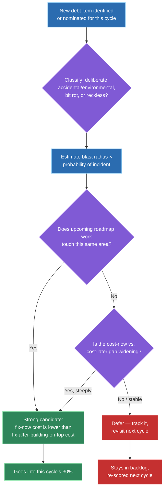
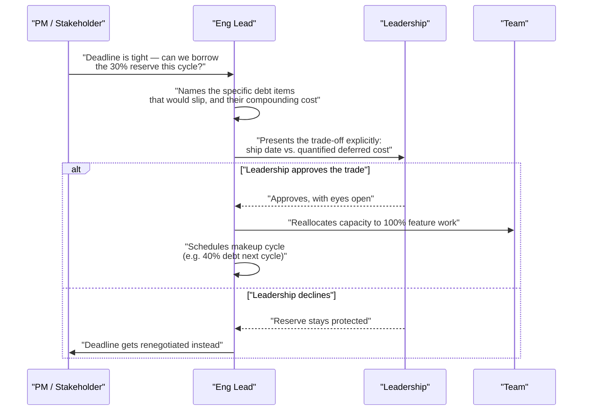

# Managing tech debt while shipping features (70/30 model)

## 🎯 Executive Summary

"How do you balance feature work and tech debt" is one of the most common Lead-level prompts across both behavioral and system-design-adjacent rounds, and most candidates answer it with a values statement — "I try to leave room for it" — instead of a mechanism. The Staff/Lead signal is a concrete capacity-allocation model, a prioritization framework for *which* debt gets addressed, and a business case for why that allocation survives contact with a roadmap-driven PM.

This topic covers a structure built around a standing 70/30 capacity split: roughly 70% of a team's cycles on committed feature work, 30% reserved for tech debt, infra, and quality work — defended as policy, not re-litigated every sprint. It also covers how to classify debt, prioritize within the reserved capacity, defend it against pressure, and measure whether the paydown work is actually working.

## 🧠 Core Technical Deep Dive

### 1. Tech debt is a categorization problem before it's a scheduling problem

Not all debt is the same, and treating it as one undifferentiated backlog is the first mistake — a deliberate shortcut taken under a real deadline has almost nothing in common with dependency drift that accumulated silently over two years. Before deciding *when* to pay something down, a Lead first classifies *what kind* of debt it is, because the category determines both urgency and how it should be paid off.

| Debt type | Origin | Typical risk if ignored | Repayment urgency |
|---|---|---|---|
| **Deliberate/strategic** | A conscious shortcut taken to hit a real deadline, with intent to repay | Grows quietly if the "intent to repay" is never tracked — becomes permanent by default | Medium — schedule the repayment when it's incurred, don't leave it implicit |
| **Accidental/environmental** | Code that was reasonable when written, but the surrounding context (scale, requirements, adjacent systems) changed | Compounds as more code gets built on top of the now-mismatched assumption | High once identified — the longer it sits, the more is built on top of it |
| **Bit rot** | Dependency, tooling, or platform drift — no one wrote bad code, the ecosystem moved | Security exposure, eventual forced migration under worse conditions (a vendor deprecation deadline instead of a chosen one) | Low until it isn't — spikes sharply near end-of-life/deprecation dates |
| **Reckless/unintentional** | Code written without understanding the pattern or system it should have used | Actively increases the rate of new bugs and slows every adjacent change | High — this is the type most likely to be actively harmful right now |

The classification matters because the fix differs by type: strategic debt needs a tracked repayment ticket created *at the moment the shortcut is taken*, not rediscovered later. Bit rot needs a monitoring signal (a dependency-freshness dashboard), not a one-time cleanup sprint.

> **Key takeaway:** the first Lead-level move isn't scheduling debt work — it's classifying it, because "deliberate shortcut with a tracked repayment plan" and "nobody understood the system when they wrote this" require completely different responses even though both get called "tech debt."

### 2. The 70/30 capacity-allocation model

The core mechanism: roughly 70% of a team's capacity goes to committed feature/roadmap work, and roughly 30% is a standing reservation for tech debt, quality, and infrastructure work. The number itself is a starting point to tune per team and domain — a platform team carrying heavy operational risk might run closer to 60/40; a team on a young, low-debt codebase might run 80/20 — but the *mechanism*, not the exact ratio, is the thing worth defending.

The reason a standing allocation beats an ad-hoc promise is structural, not moral: a percentage baked into sprint planning as a line item is something a PM plans *around*, the same way they plan around a team's total capacity. An ad-hoc "we'll get to it after this launch" is instead something that has to be actively re-won every single planning cycle, and it loses to a well-argued feature almost every time because features have a visible advocate and debt doesn't.

| Approach | How it's decided | What happens under pressure |
|---|---|---|
| **Standing 30% allocation** | Set once, as policy, revisited quarterly | Survives — it's already accounted for in capacity math, not something being asked for |
| **Ad-hoc "we'll fit it in"** | Negotiated fresh every sprint | Loses almost every time — always the easiest line item to cut when a deadline slips |
| **"Debt sprint" once a quarter** | Batched into a dedicated sprint | Better than nothing, but debt accumulates for a full quarter unaddressed, and the sprint itself is an easy target to cancel wholesale |

> **Key takeaway:** the 70/30 split works because it's structural — defended once as a standing policy rather than negotiated per sprint — and the exact ratio is a tuning parameter per team, not the part of the framework worth being dogmatic about.

### 3. Deciding which debt earns the 30% in a given cycle

A reserved 30% doesn't allocate itself — a Lead still has to decide which debt item gets it this cycle, and "whatever's most annoying to the person complaining loudest" is not a defensible framework. The prioritization axis that holds up under scrutiny is a simple expected-cost model: **blast radius if it causes an incident, multiplied by the probability it actually does, weighed against the cost to fix now versus the cost of fixing it later** (which is almost always higher, since more gets built on top of it in the meantime).

| Factor | Question it answers |
|---|---|
| **Blast radius** | If this debt causes a failure, how much of the system/how many users are affected? |
| **Probability** | How likely is that failure in the next quarter, given current trajectory (traffic growth, upcoming feature work touching this area)? |
| **Cost to fix now** | Engineer-weeks required today, with current context still fresh |
| **Cost to fix later** | Engineer-weeks required after more code depends on it, or after the original author has moved on |
| **Coupling** | Does upcoming roadmap work touch this exact area? (Fixing debt right before you build on top of it is far cheaper than fixing it after.)|

Debt with high blast radius, rising probability, and a growing cost-now-vs-later gap goes first — that's usually the accidental/environmental category from section 1, since it's actively compounding. Bit rot with a distant deprecation deadline can wait even if it's technically "worse" code, because the cost curve isn't steep yet.

> **Key takeaway:** the prioritization question isn't "what's most annoying" — it's an expected-cost comparison (blast radius × probability, now-cost vs. later-cost), and coupling with upcoming roadmap work is often the deciding factor between two items that otherwise look equally urgent.

### 4. Making the business case to a skeptical stakeholder

A PM who sees the 30% as "30% less feature velocity" isn't wrong about the immediate tradeoff — they're missing the compounding cost of *not* paying it. The case that lands with a skeptical stakeholder is a business case, not an engineering-values appeal: this connects conceptually to the same "translate technical cost into business terms" skill used in influencing upward generally, just applied to a specific recurring negotiation.

| Cost of paying the 30% | Cost of not paying it |
|---|---|
| Visible, immediate: fewer feature points this quarter | Invisible until it isn't: slower feature velocity *every* future quarter as debt compounds |
| Easy to point to and criticize | Shows up as incident risk, on-call load, and slipped roadmap dates — harder to attribute back to the root cause, but real |
| A known, bounded tradeoff | An unbounded, growing tax — every new feature built on shaky ground costs more than it should |

The strongest version of this argument uses the team's own history: point to a specific incident, a specific feature that took three times longer than estimated because of a known-bad area, or a specific new hire's ramp time that was inflated by undocumented, tangled code. A hypothetical "debt slows us down" is easy to wave away; a named, dated example from this team's own recent past is not.

> **Key takeaway:** the winning argument isn't "debt is bad practice" — it's a specific, ideally team-sourced example converting technical debt into the business terms a PM already thinks in: future velocity, incident risk, and ramp cost.

### 5. When the 30% gets raided during a crunch

Under real deadline pressure, the reserved 30% is the first thing someone proposes cutting — and a Lead needs a playbook for this moment, because letting it evaporate silently every time there's pressure is how the standing allocation quietly becomes fiction. The playbook isn't "never touch it" — sometimes spending it on the crunch is the right call — the playbook is making that trade-off *visible and deliberate* instead of letting it happen by default.

1. **Name the trade-off explicitly.** State out loud (and in writing) that shipping the deadline means the 30% drops to 0% this cycle — don't let it happen implicitly where nobody has to own the decision.
2. **Quantify what's being deferred.** Which specific debt items slip, and what's the compounding cost of that slip per section 3's model — this keeps the conversation concrete instead of abstract.
3. **Get the trade-off approved above the team, not just accepted by it.** If leadership signs off on spending the reserve knowing the cost, that's a legitimate, informed decision. If it just quietly happens because no one pushed back, that's an erosion of the policy.
4. **Schedule the makeup.** A crunch that spends the 30% should come with an explicit plan to restore it — a following cycle at 40% debt work, not a vague "we'll catch up eventually" that never materializes.

> **Key takeaway:** protecting the 30% doesn't mean refusing to ever spend it under pressure — it means the decision to spend it is named, quantified, and approved rather than silently absorbed, with an explicit plan to restore it afterward.

### 6. Measuring whether the paydown work is actually working

"Tickets closed" is a vanity metric — it rewards closing easy, low-impact tickets over the high-blast-radius ones from section 3, and it says nothing about whether the system is actually healthier. The metrics that hold up are ones that reflect real downstream cost, and that move in a direction PMs and executives already understand as "better."

| Metric | What it actually reflects | Why it beats "tickets closed" |
|---|---|---|
| **Incident rate / severity in a given subsystem** | Whether the highest-risk debt is actually being retired | Directly tied to the blast-radius argument from section 3 |
| **PR review time / cycle time in a debt-heavy area** | Whether the code is getting easier or harder to safely change | Debt paydown should make *future* work faster, not just look cleaner |
| **Time-to-onboard a new engineer into that subsystem** | Whether tribal knowledge is being replaced by legible structure | A direct, felt cost stakeholders already care about |
| **Tickets/story points closed** | Activity, not outcome | Trivially gamed by picking easy items first |

Track a baseline *before* the paydown work starts — the same discipline as any other "does this actually work" measurement — and report the trend, not a single before/after snapshot, since debt-related outcomes are noisy on any single data point.

> **Key takeaway:** measure the paydown effort by things that actually reflect system health under future load — incident rate, review time, onboarding time — not activity counts like tickets closed, which can improve while the system gets objectively worse.

## 📊 Visual Architecture & Logic

### Diagram 1 — Deciding which debt item gets the reserved 30%

### Diagram 2 — The 30% gets raided during a crunch

## 🏢 Interview Context & FAANG Signals

"How do you balance feature work and tech debt" is asked constantly at Lead level — both as a direct behavioral question and as a follow-up inside system-design rounds ("how would you plan the roadmap for this system"). It's common enough that a vague answer stands out immediately, because most candidates have at least a values-level opinion; the differentiator is whether that opinion comes with a mechanism.

**Lead signals interviewers listen for:**

- A concrete allocation mechanism (something like the 70/30 split) rather than "I try to leave time for it."
- Acknowledgment that the exact ratio is tunable per team/domain, not dogma — shows judgment over rule-following.
- A real prioritization framework for *which* debt gets addressed, not just "whatever's most annoying."
- A business case framed in terms a PM/exec already cares about — future velocity, incident risk, onboarding cost — not just an engineering-values appeal.
- A specific plan for what happens when the reserve gets pressured, rather than assuming it's untouchable or admitting it always evaporates.
- Metrics that reflect actual system health (incident rate, review time, ramp time) rather than vanity activity counts.

## ⚔️ Lead Level vs Senior Level

A **Senior** response usually stops at the values statement: "tech debt is important, I try to make time for it when I can, and I push back when I see it piling up."

A **Staff/Lead** response names the mechanism specifically — a standing capacity allocation, defended as policy rather than negotiated per sprint — and can explain *why* that structure survives pressure better than a promise does. They can walk through how they'd decide which of three competing debt items gets addressed first, using an actual framework rather than intuition. They can make the business case to a skeptical PM in the PM's own terms, not just assert that debt matters. And critically, they have an honest answer for what happens when the reserve gets raided during a crunch — not a claim that it never happens, but a playbook for making that trade-off visible, quantified, and approved rather than silently absorbed.

## ⚠️ Common Pitfalls & Anti-Patterns

> ### ✕ Treating all tech debt as equally urgent
> **Why it's wrong:** A deliberate shortcut with a tracked repayment plan and an unmonitored dependency six versions out of date are both called "tech debt," but they carry completely different risk profiles and need different responses — collapsing them into one backlog means the loudest complaint wins instead of the highest-risk item.
> **✓ Correct Lead Approach:** Classify debt by origin (deliberate, accidental/environmental, bit rot, reckless) before deciding urgency, and match the response to the type — a tracked ticket for deliberate debt, a monitoring signal for bit rot, immediate triage for accidental debt with rising blast radius.

> ### ✕ Negotiating debt-work capacity fresh every sprint instead of reserving it structurally
> **Why it's wrong:** An ad-hoc "we'll fit it in after this launch" has to be re-won every planning cycle, and it loses almost every time because a specific feature always has a louder advocate than debt does — the promise quietly stops being honored and nobody notices until the codebase is unworkable.
> **✓ Correct Lead Approach:** Set a standing capacity allocation (e.g. 70/30) as policy, baked into sprint-capacity math the same way total team capacity is, so it survives prioritization pressure structurally instead of being re-argued each time.

> ### ✕ Prioritizing debt work by "what's most annoying" instead of expected cost
> **Why it's wrong:** Annoyance correlates poorly with actual risk — a mildly irritating pattern with low blast radius can dominate the backlog conversation while a high-blast-radius, high-probability failure mode sits untouched because nobody's complaining about it loudly yet.
> **✓ Correct Lead Approach:** Use an expected-cost framework — blast radius × probability of incident, weighed against cost-to-fix-now vs. cost-to-fix-later — and weight items where upcoming roadmap work will build directly on top of them.

> ### ✕ Making the case for debt paydown purely on engineering values
> **Why it's wrong:** "This is bad practice" or "we should have higher code quality" doesn't translate into terms a roadmap-driven PM or exec is optimizing against, so it reads as a preference to be traded away rather than a real cost to be managed.
> **✓ Correct Lead Approach:** Translate the cost into business terms the stakeholder already tracks — slower future feature velocity, incident risk, onboarding cost — ideally anchored to a specific, named example from the team's own recent history.

> ### ✕ Measuring debt-paydown success with "tickets closed"
> **Why it's wrong:** It's trivially gamed by closing easy, low-impact items first, and it can trend upward while the system's actual risk profile gets worse, because it measures activity rather than outcome.
> **✓ Correct Lead Approach:** Track outcome metrics — incident rate in the affected subsystem, PR review/cycle time, time-to-onboard a new engineer — against a baseline captured before the paydown effort started.

## 🛠️ Practice Scenarios

### Scenario 1 — Defending the 30% Against a Roadmap-Driven PM

A PM pushes back on the standing 30% allocation, arguing it's costing the team a full quarter's worth of extra feature capacity with nothing concrete to show for it.

Staff-Level Solution

Reframe the conversation away from "debt work vs. feature work" and toward the actual comparison: bounded, visible cost now (fewer feature points this quarter) vs. unbounded, compounding cost later (every future quarter's velocity slows further as more gets built on shaky ground). Use a specific, dated example from this team's own history if one exists — a feature that took three times the estimate because of a known-bad area, or an incident traced back to deferred debt — since a named example lands harder than an abstract argument.

Offer transparency as the trade, not just assertion: commit to reporting what the 30% bought each quarter (incident rate, review time, or onboarding time trending in the right direction, per the framework in section 6), so the PM isn't asked to trust the allocation blindly — they're shown it's earning its keep with the same rigor a feature would be held to.

### Scenario 2 — Triaging Three Competing Debt Items

The team has three debt items competing for this cycle's reserved capacity: a flaky test suite, an unowned legacy auth module nobody fully understands, and an outdated internal library three major versions behind.

Staff-Level Solution

Run each through the classification and expected-cost framework rather than picking by gut feel. The flaky test suite is accidental/environmental — annoying and slows every PR, but bounded blast radius (it doesn't cause production incidents, it costs engineer time). The unowned auth module is the highest-priority: high blast radius (security-sensitive), likely rising probability if any upcoming roadmap work touches auth, and a steep cost-now-vs-later gap since the one person who understood it may already be gone. The outdated library is bit rot — real risk, but probably not urgent unless it's approaching an end-of-life/deprecation date.

Pick the auth module first on blast-radius-times-probability grounds, explicitly note the flaky tests as a strong second-priority item (high frequency cost even if low blast radius), and leave the library tracked with a monitoring trigger (its deprecation timeline) rather than working it this cycle.

### Scenario 3 — A Debt Item Caused an Incident Nobody Had Prioritized Fixing

A known, previously-deprioritized debt item just caused a production incident. Leadership wants to know why it wasn't addressed sooner.

Staff-Level Solution

Don't get defensive about the prioritization call if it was made reasonably with the information available at the time — instead, walk through what changed: the probability or blast-radius estimate that was used to deprioritize it was wrong, or the situation shifted (more traffic, more code built on top of it) without the priority score being revisited. That's the actual gap to fix, not "we should have known."

Fix the process, not just the code: patch the immediate incident, then explicitly re-run the prioritization framework across the rest of the deferred backlog with updated probability estimates, since this incident is new evidence that some of those estimates may be stale. Propose a recurring re-scoring cadence (not just at incident time) so the next miss is caught by the process instead of by an outage.

### Scenario 4 — Convincing a Skeptical Executive to Fund a Dedicated Debt Initiative

An exec is unconvinced that a proposed multi-quarter debt-paydown initiative, beyond the standing 30%, is worth dedicated headcount.

Staff-Level Solution

Don't lead with "this is bad code" — lead with the business case built the same way as the standing 30% argument, but scaled: quantify the compounding cost with real numbers if available (ramp time for new hires in this area, incident frequency trend, story-point estimates that have been inflating over time for changes in this subsystem). Compare that trajectory, extrapolated forward, against the one-time cost of the initiative.

Propose a bounded pilot with a defined success metric before asking for open-ended headcount — the same discipline used for any other unproven initiative — and commit to reporting the outcome metrics from section 6 (incident rate, review time, onboarding time) so the exec has a checkpoint to evaluate before extending further investment.

### Scenario 5 — Inheriting a Codebase With Years of Undocumented Debt

A Lead joins a new team and inherits a codebase with years of accumulated, largely undocumented tech debt and no existing allocation policy.

Staff-Level Solution

Resist the urge to declare a debt-paydown crusade in week one — start by classifying what's actually there, since "years of undocumented debt" is really a mix of deliberate shortcuts nobody tracked, accidental debt from requirements that shifted, and plain bit rot, and the response differs by type. Run a lightweight audit (incident history, longest-cycle-time PRs, most-avoided files) to surface the highest blast-radius items rather than trying to catalog everything at once.

Introduce the standing allocation model going forward as policy, even at a conservative ratio to start (e.g. 80/20, tuning up as the team gets used to it), and be explicit that this is a structural change being introduced deliberately, not an implicit promise — get it acknowledged by the PM/stakeholders up front so it doesn't need re-litigating in month two.

### Scenario 6 — A Debt-Paydown Effort Has Stalled and Needs Re-Energizing

A debt-paydown initiative that started with good intentions six months ago has quietly stopped happening — the reserved capacity keeps getting absorbed into feature work, and no one formally decided to end it.

Staff-Level Solution

Name what actually happened plainly: this is the section 5 failure mode — the reserve got silently absorbed cycle after cycle instead of being explicitly and visibly traded away, so the policy died by attrition rather than by decision. Don't relaunch it quietly the same way; that just repeats the failure.

Re-establish it as a visible, tracked line item in sprint planning (not a soft goal), report the current state honestly (what was deferred, what it's likely costing now using the section 3 framework), and get explicit sign-off from the same level of stakeholder who let it lapse — so reverting to old habits requires an active decision again, not just inertia.

### Scenario 7 — A PM Proposes Cutting the 30% "Just This Once" for an Urgent Launch

A genuinely high-stakes launch is at risk, and the PM proposes suspending the reserved capacity for one cycle to hit the date.

Staff-Level Solution

Apply the section 5 playbook directly rather than reflexively refusing or silently agreeing. Name the trade-off explicitly: which specific debt items slip, and what they cost per the expected-cost framework. If the launch is genuinely high-stakes, agree to spend the reserve — but only with the trade-off named in writing and approved by leadership, not just quietly accepted between two peers.

Schedule the makeup cycle immediately as part of the agreement (e.g., the following cycle runs at 40% debt work to restore the balance), so "just this once" doesn't quietly become the new normal the way it did in Scenario 6.

### Scenario 8 — Explaining This Framework Cold in a Behavioral Interview

An interviewer asks directly: "How do you think about balancing feature work and tech debt on your team?"

Staff-Level Solution

Lead with the mechanism, not the values statement: describe the standing capacity-allocation model (roughly 70/30, explicitly noting the ratio is tuned per team rather than universal), and why a structural reservation survives prioritization pressure better than an ad-hoc promise. Follow immediately with the prioritization framework for *which* debt gets the reserved time — blast radius × probability vs. cost-now-vs-later — so the answer isn't just "we set aside time," it's "we set aside time and have a real way to decide what fills it."

Close with the two things that separate this from a rehearsed answer: an honest account of what happens when that capacity gets pressured (naming the trade-off rather than claiming it's untouchable), and how paydown success gets measured (incident rate, review time, onboarding time — not tickets closed). A candidate who can hold all three pieces together, with a concrete example for at least one of them, is giving the answer an interviewer is actually listening for.

