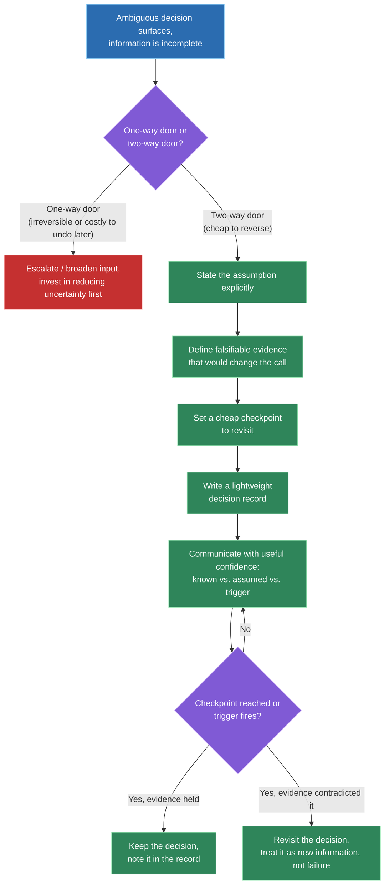
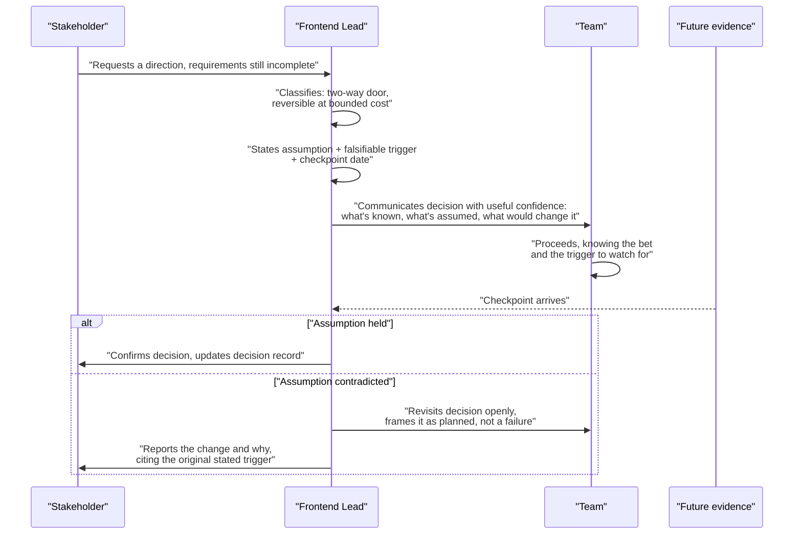

# Driving technical decisions with incomplete information

## 🎯 Executive Summary

ICs are mostly shielded from this problem. Ambiguous, high-stakes calls with no clean right answer tend to get escalated upward before they land on an individual contributor's desk — someone more senior absorbs the ambiguity and hands back a decision. A Lead is that someone. The job explicitly includes moving the team forward when the data is incomplete, the requirements are half-written, and waiting for certainty isn't actually an option.

The trap most candidates fall into is treating "let's gather more data" as a free, safe default. It isn't — every day spent gathering data is a day the team isn't shipping, and that delay has a real cost that competes directly with the cost of being wrong. The Staff/Lead signal here isn't "I made a bold call under pressure" — it's a repeatable structure for deciding *how much* certainty a given decision actually needs, making the call explicitly, and leaving a trail that lets the team recover cleanly if it turns out wrong.

## 🧠 Core Technical Deep Dive

### 1. Why this is a distinct leadership skill, not just confidence

Being decisive isn't the skill being tested here — plenty of people are decisive and wrong in expensive, poorly-recovered ways. The actual skill is calibrating *how much* rigor a decision deserves before committing, and doing that calibration explicitly rather than by gut feel or default caution.

"Let's gather more data" sounds like the responsible answer, and sometimes it is. But it's a decision with its own cost — schedule slip, a team blocked waiting on direction, a competitor shipping first — and that cost needs to be weighed against the cost of being wrong, not treated as a consequence-free way to avoid commitment. A Lead who reflexively defers every ambiguous call is failing at the job just as concretely as one who reflexively guesses.

> **Key takeaway:** the distinct Lead-level skill isn't decisiveness or caution in isolation — it's treating "gather more data" as a decision with a real cost that must be weighed against the cost of an early, wrong call, instead of a free default.

### 2. Classifying the decision: one-way doors vs. two-way doors

The first move on any ambiguous decision is classifying it, because the amount of process a decision deserves should scale with how expensive it is to undo — not with how uncomfortable the ambiguity feels. Amazon's "one-way door / two-way door" framing (from Jeff Bezos's 2015 shareholder letter) is the canonical version of this idea and worth citing by name in an interview: most decisions are reversible (two-way doors) and should be made quickly by small groups; a few are truly irreversible (one-way doors) and deserve slow, careful, broadly-consulted deliberation.

| | One-way door (irreversible) | Two-way door (reversible) |
|---|---|---|
| **Definition** | Hard or costly to undo once made | Cheap to reverse if it turns out wrong |
| **Examples** | Choosing a primary datastore, a public API contract, a data model baked into millions of production rows | Picking a component library, a default config value, an internal-only code convention |
| **Who should decide** | Requires broad input, often needs sign-off above the Lead | The Lead (or even an IC) should decide alone, quickly |
| **How much analysis is warranted** | Deep — worth the delay to get it closer to right | Shallow — analysis paralysis here is a bigger risk than being wrong |
| **Default bias** | Toward caution and consultation | Toward speed and action |

The trap is misclassifying a decision in either direction. Treating a two-way door like a one-way door produces slow-moving teams paralyzed by unnecessary process on low-stakes calls. Treating a one-way door like a two-way door produces expensive, hard-to-undo mistakes made too fast — this is the more dangerous failure and the one interviewers probe for specifically.

> **Key takeaway:** the amount of analysis and consensus a decision deserves is a function of how reversible it is, not how uncertain it feels — classify the door type first, deliberately, before deciding how to decide.

### 3. Making the call: the four-part structure for deciding under real uncertainty

This is the actual whiteboard-able framework, and it applies once a decision has been classified as reversible enough to make now rather than escalate or defer. It has four parts, and skipping any one of them is what separates a defensible bet from a guess that got lucky.

1. **State the assumption explicitly.** Write down, in one sentence, what you're assuming to be true that you don't actually know — "I'm assuming traffic stays under 10K concurrent users for the next two quarters." An unstated assumption is invisible and can't be challenged, revisited, or credited when it turns out to matter.
2. **Define what evidence would change your mind.** This has to be falsifiable, not a vague gesture at "if things change." Name the specific signal — "if concurrent users cross 10K, this choice needs revisiting" — so the decision can be checked against reality rather than defended indefinitely by whoever made it.
3. **Set a cheap checkpoint to revisit, not a blind long-term commitment.** Pick a concrete trigger — a date, a metric threshold, a milestone — to actively re-examine the decision, rather than letting it silently calcify into "how we've always done it." This is what keeps a reversible decision reversible in practice, not just in theory.
4. **Write a lightweight decision record.** A few sentences: what was decided, the assumption it rests on, the evidence that would change it, and the checkpoint date. This isn't bureaucracy — it's what makes the decision auditable later, so a team six months out can tell whether it was a bad decision or a good decision that hit bad luck.

> **Key takeaway:** a defensible decision under uncertainty is a stated assumption plus a falsifiable trigger plus a scheduled checkpoint plus a written record — remove any one piece and it degrades into an unexamined guess that's hard to learn from later.

### 4. Communicating the decision: false confidence vs. useful confidence

How a Lead communicates a decision made under uncertainty matters almost as much as the decision itself, because the team's trust in future calls depends on it.

| | False confidence | Useful confidence |
|---|---|---|
| **What it sounds like** | "We're doing X, it's the right call" | "We're doing X, based on assuming Y — if Z happens, we'll revisit" |
| **What it hides** | The uncertainty itself, and the fact that a real bet was made | Nothing — the assumption and the trigger are stated out loud |
| **What happens when it's wrong** | Trust erodes — the team feels misled, not just unlucky | Trust holds — the team saw the bet being made and watched the checkpoint work as designed |
| **What it signals about the Lead** | Either overconfidence or a belief that the team can't handle ambiguity | Comfort naming what isn't known, and confidence in the *process*, not the specific outcome |

False confidence is a natural instinct — leaders often feel that projecting certainty is what keeps a team moving. It backfires precisely when the decision turns out wrong, because the team discovers after the fact that a guess was dressed up as a sure thing. Useful confidence sounds less impressive in the moment but survives being wrong, because everyone already knew what the bet was.

> **Key takeaway:** the goal isn't to sound certain — it's to be clearly confident about what's known, explicit about what's assumed, and specific about what would change the call, so trust in the Lead's judgment survives even when a given decision doesn't pan out.

### 5. When incomplete information means "don't decide yet"

Not every ambiguous decision should be made now — sometimes the incomplete information is itself the signal that the call needs to wait, or needs a small investment to reduce the ambiguity before committing. The skill is telling genuine two-way doors apart from decisions that *look* reversible but aren't.

The classic trap is a data-model or schema choice: it's technically changeable — nothing stops you from writing a migration — but the actual cost of that migration once production data and downstream consumers exist can be enormous. It reads like a two-way door in the moment and behaves like a one-way door in six months. The same pattern shows up in public API contracts, third-party integrations with lock-in, and anything that accumulates dependents over time.

The fix is asking a second question beyond "can this be undone" — "what will it cost to undo this *after* the team, the data, and the dependents around it have grown for six months." If that answer is much worse than the cost of undoing it today, treat it as a one-way door regardless of how it looks on day one, and either escalate it or spend a bounded amount of time reducing the uncertainty before committing.

> **Key takeaway:** classify reversibility by its cost to undo *after the decision has had time to accumulate dependents*, not by whether undoing it is theoretically possible today — a lot of decisions that look cheap to reverse in isolation aren't once real usage builds up around them.

### 6. Worked example: choosing a state-management approach before requirements are final

Say a Lead has to pick a state-management approach for a new product surface, with only a rough sense of the eventual feature set and no data yet on real usage patterns. Run it through the framework directly:

- **Classify**: this looks like a two-way door — swapping state libraries later is real work but bounded, especially if the choice is isolated behind a clean data-access layer. Not a one-way door as long as that isolation is maintained.
- **State the assumption**: "I'm assuming the product stays single-page with moderate shared state complexity for the next two quarters — not a multi-surface app needing cross-tab sync."
- **Define the falsifying evidence**: "If we add a second major surface sharing this state, or if we need offline sync, this choice needs revisiting."
- **Set the checkpoint**: revisit at the next planning cycle, or immediately if either trigger above fires — whichever comes first.
- **Write the record**: three sentences in the team's decision log — what was picked, the assumption, the trigger, the checkpoint date.
- **Communicate with useful confidence**: tell the team "we're using X because it fits what we know now; if the surface count grows we'll revisit," not "X is definitely the right long-term choice."

> **Key takeaway:** the worked example isn't about which state-management library is "correct" — it's that running even a small, everyday decision through the same four-part structure is what makes the difference between a defensible bet and an arbitrary preference.

## 📊 Visual Architecture & Logic

### Diagram 1 — Classifying and making a decision under incomplete information

### Diagram 2 — A Lead making and communicating a call under deadline pressure

## 🏢 Interview Context & FAANG Signals

This surfaces in two distinct interview formats, and it's worth recognizing both. First, the classic behavioral prompt: "tell me about a decision you made without complete data," which is almost always looking for the four-part structure from section 3, not just a good outcome story. Second, and less obviously, it shows up **inside system-design rounds** — a strong interviewer will deliberately withhold requirements (traffic scale, browser support matrix, real-time constraints) specifically to watch whether the candidate names the gap, states an assumption, and moves forward, versus stalling to ask for numbers that won't be given.

**Lead signals interviewers listen for:**

- Naming the reversibility classification explicitly — "this was a two-way door, so I didn't over-invest in analysis" — rather than describing effort spent proportional to how anxious the ambiguity felt.
- A stated assumption and a falsifiable trigger, not just "I made my best guess and it worked out."
- Evidence of a checkpoint that was actually revisited, not a decision made once and never re-examined.
- Communicating uncertainty honestly to the team/stakeholders rather than projecting false confidence to seem authoritative.
- In system-design rounds specifically: proactively stating an assumption when a requirement is missing, instead of freezing or over-asking clarifying questions past the point of diminishing return.
- Distinguishing decisions that look reversible from ones that aren't once real usage accumulates around them.

## ⚔️ Lead Level vs Senior Level

A **Senior** response to this prompt typically centers on one specific technical choice and defends why it was right in hindsight: "I chose library X because of Y, and it worked out." The reasoning may be sound, but it's retrospective and outcome-focused — it explains why the bet paid off, not the structure used to make it responsibly before the outcome was known.

A **Staff/Lead** response leads with the structure, not the outcome. Which classification did they apply, and why — reversible or not, and what would it cost to undo after six months of accumulated dependents? What assumption did they state at the time, and what falsifiable evidence would have changed the call? Did they set a real checkpoint, or did the decision just silently become permanent? How did they communicate it to the team — with useful confidence naming what was assumed, or false confidence hiding the bet? And critically: can they describe a time this structure led them to a decision that turned out wrong, and how the checkpoint and decision record made that recoverable rather than a crisis? A Lead who can only describe decisions that worked out is missing the harder, more credible half of the story.

## ⚠️ Common Pitfalls & Anti-Patterns

> ### ✕ Treating "let's gather more data" as a free, safe default
> **Why it's wrong:** Every day spent gathering data is a day the team isn't moving — that delay has a real cost (schedule slip, blocked teammates, a competitor shipping first) that has to be weighed against the cost of being wrong, not treated as risk-free caution.
> **✓ Correct Lead Approach:** Classify the decision's reversibility first; for two-way doors, default to deciding now with a stated assumption and a checkpoint rather than deferring by default.

> ### ✕ Misclassifying a one-way door as a two-way door
> **Why it's wrong:** Moving fast on a decision that's actually expensive to undo once dependents accumulate — a data model, a public contract — produces exactly the kind of costly, hard-to-reverse mistake this framework exists to prevent.
> **✓ Correct Lead Approach:** Ask not just "can this be undone" but "what will it cost to undo after six months of real usage" — if that answer is much worse than undoing it today, treat it as irreversible regardless of how it looks on day one.

> ### ✕ Making the bet but never stating the assumption or the trigger
> **Why it's wrong:** An unstated assumption can't be challenged, revisited, or credited later — the decision becomes unfalsifiable, and six months later nobody can tell whether it was a good decision that hit bad luck or a bad decision all along.
> **✓ Correct Lead Approach:** State the assumption and the falsifying evidence explicitly, in writing, at the time the decision is made — not reconstructed from memory after it's already been questioned.

> ### ✕ Projecting false confidence to seem authoritative
> **Why it's wrong:** Hiding the uncertainty behind a decision buys short-term comfort but erodes trust hard when the decision turns out wrong — the team discovers after the fact that a guess was presented as a sure thing.
> **✓ Correct Lead Approach:** Communicate with useful confidence — clear about what's known, explicit about what's assumed, specific about what would change the call — so trust in the Lead's judgment survives being wrong on any single decision.

> ### ✕ Setting a checkpoint and then never actually revisiting it
> **Why it's wrong:** A checkpoint that exists only on paper doesn't keep a decision reversible in practice — it silently calcifies into "how we've always done it," and the whole point of choosing a two-way door was to preserve the option to change course.
> **✓ Correct Lead Approach:** Treat the checkpoint as a real commitment — put it on a calendar or tie it to a metric alert, and actually re-examine the decision against the stated evidence when it arrives.

## 🛠️ Practice Scenarios

### Scenario 1 — Choosing a Frontend Stack Before Scale Is Known

A new product needs a technical foundation decided this week, but nobody knows if it'll have 100 users or 100,000 within a year.

Staff-Level Solution

Classify first: most stack choices at this stage are two-way doors if the team keeps clean boundaries (a well-isolated data layer, no premature framework-specific coupling deep in business logic) — the real one-way-door risk is a data model or API contract, not the framework itself. Decide the stack now rather than stalling for a scale number that won't exist for months.

State the assumption explicitly ("assuming moderate scale for the first two quarters, not immediate hypergrowth"), name the falsifying evidence (a specific traffic or team-size threshold that would justify revisiting), and set a checkpoint at the next planning milestone. Communicate to the team with useful confidence: this is the right choice for what's known now, not a permanent bet on this exact scale.

### Scenario 2 — Picking a Rendering Strategy Before Traffic Patterns Are Known

A new page needs to ship, and the choice between SSR, static generation, and client-rendering hinges on traffic and SEO needs that won't be clear until after launch.

Staff-Level Solution

This is a genuine two-way door as long as the rendering layer stays reasonably decoupled from the rest of the app — treat it as reversible and decide now rather than delaying launch to gather traffic data that can only exist post-launch. State the assumption ("assuming SEO matters less than time-to-interactive for this page's actual users") and the falsifying evidence (organic search becomes a meaningful traffic source, or Core Web Vitals regress under real load).

Set a checkpoint for 4-6 weeks post-launch once real analytics exist, and write a short decision record so the choice isn't relitigated from scratch every time someone questions it. Communicate to stakeholders that this is the right starting bet given what's knowable pre-launch, not a permanent architectural commitment.

### Scenario 3 — Shipping With an Incomplete Migration Plan Under Deadline Pressure

A framework migration is 70% done, a hard deadline is approaching, and finishing the remaining 30% properly would blow the date.

Staff-Level Solution

Classify precisely what's actually irreversible here: shipping a partial migration behind a compatibility shim is usually a two-way door (it can be finished later); silently declaring the migration "done" and letting new code build on the unfinished state is closer to a one-way door, because dependents accumulate on the wrong foundation. Decide to ship the working 70% behind a clear boundary, not to quietly call it finished.

State the assumption explicitly to the team ("the remaining 30% doesn't block this release, but new code must not build on the old pattern"), name the falsifying evidence (a bug traced to the incomplete boundary, or the deadline slipping again), and set a hard checkpoint — a specific sprint — to finish the remainder rather than letting "later" become never. Communicate this to stakeholders with useful confidence: what shipped, what's deliberately deferred, and when it gets closed out — not a claim that the migration is complete.

### Scenario 4 — A Security-vs-Velocity Tradeoff With No Clear Data

A proposed feature needs a security review that would take two weeks the team doesn't have, and there's no hard data on how likely the actual risk is to materialize.

Staff-Level Solution

Classify by worst-case cost, not by how likely the risk feels — a security gap that could expose user data is a one-way door candidate (a breach isn't undoable), even if the probability feels low, and deserves the deeper diligence rather than being waved through under deadline pressure. Don't let "we don't have data on the likelihood" become an excuse to skip the analysis; instead, scope a bounded, faster review (a few days, targeted at the highest-risk surface) rather than either the full two weeks or nothing.

State the assumption explicitly if a reduced-scope decision is made ("assuming this specific flow doesn't touch PII, so we're deferring full review on it"), define what would change the call (any indication PII is actually in scope), and set a checkpoint before the feature reaches broader rollout. Communicate the tradeoff honestly to stakeholders — this is a deliberate, bounded risk acceptance, not a shortcut nobody signed off on.

### Scenario 5 — Disagreeing With a Decision Made Above You Under the Same Uncertainty

A VP has made a technical call — same ambiguity, same incomplete information the Lead would have used — but the Lead disagrees with the outcome.

Staff-Level Solution

First separate disagreement with the *decision* from disagreement with the *process* — if the VP classified the decision, stated an assumption, and set a checkpoint, the disagreement is about a judgment call under genuine uncertainty, which deserves a different conversation than if none of that happened. Raise the concern directly and specifically: name the alternative assumption being made, and what falsifying evidence would resolve which view is right, rather than arguing preference against preference.

If the decision is genuinely a two-way door, commit to it once raised and heard — this is Amazon's "disagree and commit" in practice, and re-litigating a reversible decision repeatedly costs the team more than being wrong occasionally does. If it looks like a one-way door being treated too casually, escalate that specific concern (the reversibility classification, not just "I disagree") before it's locked in.

### Scenario 6 — A Decision Made Under Uncertainty Turned Out Wrong

A call made six months ago — state management, a data model, a vendor choice — turned out to be the wrong bet once real usage patterns emerged.

Staff-Level Solution

Pull up the decision record if one exists — this is exactly the moment it earns its keep, showing the assumption made, the evidence that would have changed the call, and whether that evidence actually fired. If the checkpoint caught it as designed, this isn't a failure story, it's the framework working; say so plainly rather than treating being wrong as something to apologize for.

If no decision record exists, that's the real lesson to name — the decision may have been reasonable at the time, but without a stated assumption it's now impossible to tell whether it was bad judgment or bad luck. Fix forward: reclassify and re-decide using the same four-part structure, and use the postmortem to reinforce writing the record next time, not to punish the original call.

### Scenario 7 — Interviewer Deliberately Withholds Requirements in a System-Design Round

Mid-way through a system-design interview, the interviewer refuses to answer "what's the expected traffic" or "what's the consistency requirement" when asked directly.

Staff-Level Solution

Recognize this as a deliberate test of exactly this skill, not a gap in the prompt — stop asking for numbers that clearly aren't coming, and instead state an explicit assumption out loud: "I'll assume moderate read-heavy traffic and eventual consistency is acceptable here; I'll flag where that assumption would change the design." This demonstrates the four-part structure live: assumption stated, and implicitly, what would change it.

Continue the design under that stated assumption, and periodically call out the specific points where a different requirement would materially change the architecture — this shows the interviewer both technical range (multiple architectures considered) and the judgment to not let ambiguity stall progress, which is the actual signal being tested.

### Scenario 8 — Reporting a Decision Made Under Uncertainty to an Executive

An executive asks for an update on a technical direction chosen weeks ago with incomplete information, and wants a confident-sounding answer.

Staff-Level Solution

Resist the pull toward false confidence even though it's what the room implicitly wants — state clearly what's known, what was assumed at decision time, and what the checkpoint is watching for. This reads as more credible, not less, because it shows the decision was made deliberately rather than by guessing and hoping.

If the checkpoint hasn't fired yet, say so and give the date it will. If early signal already suggests the assumption might be wrong, surface that proactively rather than waiting for the scheduled checkpoint to force the conversation — an executive who hears about a wobble from the Lead directly trusts future updates more than one who finds out independently later.

