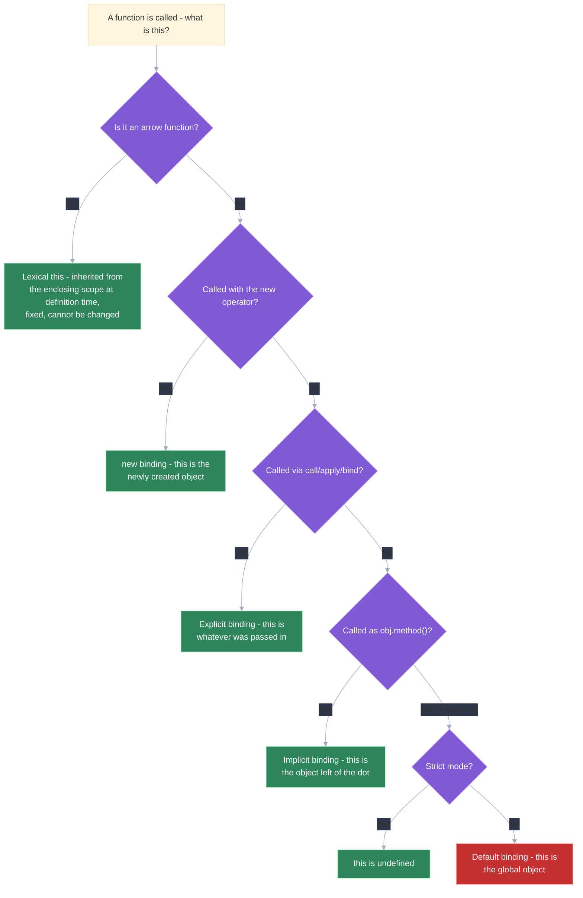
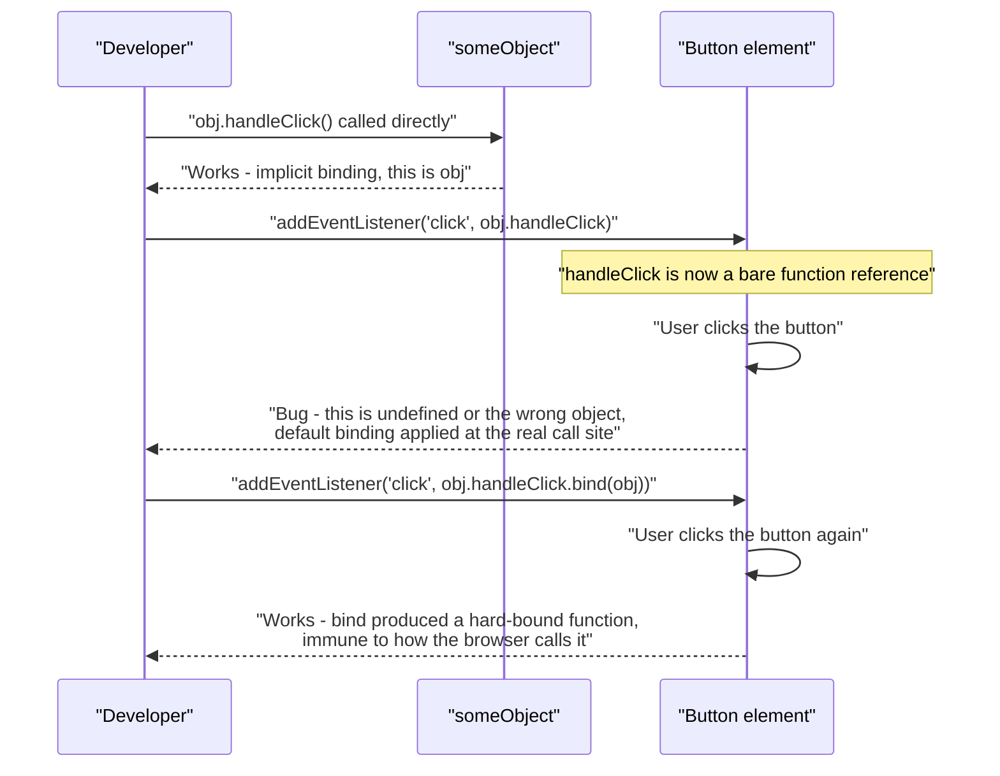

# The `this` keyword: binding rules, call/apply/bind, and common gotchas

## 🎯 Executive Summary

If you've ever debugged your way to `.bind(this)` without being able to say precisely *why* that fixed it, you're not alone — and this topic is written for exactly that moment. `this` is one of the most reliably tested pieces of JavaScript trivia in an interview, and also one of the most commonly half-understood: most engineers can pattern-match a handful of memorized examples without being able to state the actual rules that produce them. The mechanism is simpler than the folklore around it suggests, once you see it stated precisely: `this` is determined entirely by *how* a function is called, never by where it's defined, and exactly four rules — plus arrow functions' total exemption from all of them — decide what it resolves to, every single time.

This is a must-know topic because it's foundational to reading and writing correct JavaScript at all — a wrong assumption about `this` produces bugs that are notoriously confusing to chase down (a callback silently reading `undefined` instead of throwing something useful), and because it's the mechanical foundation this repo's [prototypal inheritance](/topic-detail.html?id=prototypal-inheritance) topic already leans on. The Lead-level signal is precision: naming the exact precedence order and explaining *why* each rule exists, not just recognizing the pattern from having seen it before.

## 🧠 Core Technical Deep Dive

### `this` is decided at the call-site, not the definition-site

```javascript
function whoAmI() {
  return this;
}

const obj = { whoAmI };
const detached = obj.whoAmI;

obj.whoAmI(); // ?
detached();   // ?
```

Same function, byte for byte. Two calls. Two different answers — and if that feels unsettling rather than obvious, good, that means you're actually reasoning about it instead of pattern-matching. `obj.whoAmI()` returns `obj`. `detached()` does not — it returns the global object (or `undefined` in strict mode), even though `detached` and `obj.whoAmI` are, quite literally, the same function value.

Here's the single fact that resolves that, and almost every other `this` question you'll ever be asked: a function's `this` is not baked in when the function is written — it's assigned fresh, every time the function is *called*, based on how that specific call was made. Nothing about `this` is stored inside the function itself; it's not a property, not a closure variable, nothing. It's decided at the moment of the call and forgotten immediately after.

This is exactly why extracting a method from its object and calling it separately — a callback, an event handler, a destructured reference — is such a reliable source of bugs: the function never remembered what it was attached to, because there was never anything to remember in the first place.

> **Key takeaway:** the question "what is `this` here" is never answerable by looking at where a function is defined — it's only answerable by looking at how it's actually called.

### The four binding rules, in precedence order

So if "how it's called" is what matters, the obvious next question is: how many different *ways* of calling actually change the answer? Exactly four — and when more than one could plausibly apply to the same call, a fixed precedence order decides which one wins, no ambiguity left over:

| Rule | How `this` gets set | Example |
|---|---|---|
| **1. `new` binding** (highest) | A brand-new object is created and `this` is bound to it | `new Foo()` |
| **2. Explicit binding** | `this` is set directly via `call`, `apply`, or `bind` | `fn.call(obj)` |
| **3. Implicit binding** | `this` is the object the function was called *as a method of* | `obj.method()` |
| **4. Default binding** (lowest) | `this` falls back to the global object (non-strict) or `undefined` (strict mode) | `bareFunction()` |

Default binding is the fallback that applies when none of the other three rules are in play — a plain, unattached function call. The strict-mode difference here is a real, practical gotcha: in non-strict code, `this` defaults to the global object, so an accidental bare call inside a method (`this.count++` inside a function that got detached and called bare) silently creates or mutates a global property instead of throwing — strict mode's `this === undefined` at least fails loudly.

> **Key takeaway:** these four rules have a fixed precedence — `new` beats explicit binding, explicit binding beats implicit, implicit beats default — and most "what does this log" questions are really just asking which rule wins.

### Explicit binding: `call`, `apply`, and `bind`

Rules one, three, and four all *derive* `this` from the shape of the call. Explicit binding is different in spirit — instead of hoping the call site implies the right `this`, you just say what it is. All three methods below let you do that, but they differ in when the function actually runs and how arguments get passed, and mixing them up is a common source of "why didn't this get invoked" confusion:

| Method | Invokes immediately? | Argument format | Returns |
|---|---|---|---|
| `fn.call(thisArg, a, b, c)` | Yes | Individual arguments | The function's return value |
| `fn.apply(thisArg, [a, b, c])` | Yes | A single array of arguments | The function's return value |
| `fn.bind(thisArg, a, b)` | No | Individual arguments (partially applicable) | A new, permanently-bound function |

`call` and `apply` are functionally identical apart from argument format — `apply` is the natural choice when you already have an array of arguments (or a variable-length one) rather than needing to spread it. `bind` is different in kind, not just format: it doesn't invoke the function at all, it returns a brand-new function with `this` (and optionally some leading arguments) permanently locked in, which is exactly the tool for fixing the "callback loses its `this`" problem — `element.addEventListener('click', this.handleClick.bind(this))` hands the listener a function that will always run with the right `this`, regardless of how the browser itself ends up calling it.

A binding produced by `bind` is genuinely "hard" — calling `.call()` or `.apply()` on an already-bound function cannot override the `this` it was bound with. `new`-ing a bound function is the one documented exception: the spec has the `new` operator ignore the bound `this` and construct a fresh object as normal, which is why `new` still sits above explicit binding in the precedence table despite `bind` otherwise being unoverridable.

> **Key takeaway:** `call`/`apply` invoke immediately and differ only in argument format; `bind` is a different operation entirely — it produces a new, permanently-bound function without calling anything, which is the correct tool whenever a function is being handed off to run somewhere else later.

### Arrow functions: not a fifth rule, an exemption from all of them

Here's a natural place to get this wrong: it's tempting to think of arrow functions as "a `this` rule that just picks the surrounding object." They're not — and the distinction matters more than it sounds like it should. Arrow functions don't participate in this rule system *at all*. They have no `this` binding of their own to be set by `new`, `call`/`apply`/`bind`, or implicit call-site rules — none of the four rules above have anything to attach to. Instead, an arrow function's `this` is resolved lexically, exactly like a closure variable: it looks up `this` in the enclosing scope at the time it was *defined*, and that's permanently fixed, regardless of how the arrow function is later called.

```javascript
const obj = {
  label: 'outer',
  regular: function () {
    const arrow = () => console.log(this.label); // captures `this` from `regular`'s call-site
    arrow(); // 'outer' — this came from the enclosing regular function's this
  },
};
obj.regular();
```

This is precisely the mechanism [prototypal inheritance](/topic-detail.html?id=prototypal-inheritance)'s arrow-function-class-fields section relies on: an arrow function assigned as a class field captures the instance's `this` once, at construction time, which is exactly why it survives being extracted and passed around as a callback — there's no call-site rule left to break. The corollary gotcha: an arrow function used as a shorthand method inside a plain object literal does *not* get that object as `this`, since object literals don't create their own scope — the arrow captures whatever `this` was in scope where the object literal itself was written, usually not the object at all.

> **Key takeaway:** arrow functions aren't "a `this` rule that picks the enclosing object" — they have no dynamic `this` mechanism whatsoever, which is exactly why `call`, `apply`, `bind`, and `new` are all unable to change one.

### Every "gotcha" you've ever hit is one of these four rules in disguise

Once the four rules and the arrow-function exemption are actually locked in, something clicks: the "weird `this` bugs" that used to feel like JavaScript being unpredictable turn out to be completely mechanical, every time. Here are the two that show up most often in real code.

A nested ordinary function inside a method loses the outer method's `this`, because calling it bare triggers default binding, not implicit binding from the outer call — this was the classic pre-arrow-function bug, historically worked around with `const self = this;` closed over by the nested function, or `.bind(this)`. Arrow functions solve it structurally: a nested arrow function has no default-binding fallback to fall into, since it was never eligible for it in the first place.

A method passed directly as a callback (`setTimeout(obj.method, 1000)`, `<button onClick={this.handleClick}>` in a class component) loses its implicit binding the instant it's passed as a bare reference — by the time it's invoked, the call is bare, so default binding applies. The fix is always one of: `.bind(this)` at the point of extraction, wrapping in an arrow function at the call site (`() => obj.method()`), or defining the method as an arrow function class field in the first place so it never had implicit binding to lose.

> **Key takeaway:** every one of these "gotchas" is the same underlying fact wearing a different disguise — a function reference remembers nothing about where it came from, so any time a function is extracted and called somewhere else, its binding rule silently changes to whatever that new call site implies.

## 📊 Visual Architecture & Logic

### Diagram 1 — Resolving `this` for a given function call



### Diagram 2 — A method losing (and regaining) its binding as a callback



**→ Play with it:** [`resources/this-binding-playground.html`](resources/this-binding-playground.html) runs every rule above against real, live JavaScript — the four binding rules, a `call`/`apply`/`bind` sandbox, the arrow-function exemption, the lost-`this` bug and its fixes, and the `new`-escapes-a-hard-binding precedence showdown. Predict each result before clicking Run.

## 🏢 Interview Context & FAANG Signals

This surfaces constantly in **coding rounds** ("what does this code log," "implement your own `bind`"), **debugging rounds** (a real callback-loses-`this` bug in a class component or event handler), and as a quick warm-up question before a deeper JavaScript-fundamentals conversation. It's also a common follow-up inside system design and framework-internals discussions whenever class-based code or manual event wiring comes up.

**Lead signals interviewers listen for:**

- Stating the four-rule precedence order precisely (`new` > explicit > implicit > default), not just recognizing examples individually.
- Explaining `call`/`apply`/`bind` by mechanism (invokes now vs. later, argument format, return value), not just "they all set `this`."
- Correctly identifying arrow functions as having *no* dynamic `this` mechanism at all, rather than describing them as "another binding rule."
- Diagnosing a lost-`this` bug by naming exactly which call-site changed and which rule now applies, not just reflexively suggesting `.bind()` without explaining why it's needed.
- Knowing the strict-mode default-binding difference and why it matters (loud `undefined` vs. silent global pollution).

## ⚔️ Lead Level vs Senior Level

A **Senior** response usually gets the mechanics right for common cases: "arrow functions inherit `this` from where they're defined, regular functions get `this` from how they're called, and you can use `.bind()` to fix a callback."

A **Staff/Lead** response can state the full precedence order unprompted, explain the one documented exception where `new` overrides even a hard-bound function's `this`, and reason about *why* the rules are designed this way — dynamic dispatch based on call-site is what makes methods reusable across different objects (`Array.prototype.slice.call(arguments)`-style borrowing, before rest params made it less necessary), and arrow functions' exemption from all of it is a deliberate design choice specifically to make lexical closures available for `this` the same way they're already available for ordinary variables. They can also immediately spot which of the four rules is silently changing when a bug report describes a method "randomly" reading the wrong `this`.

## ⚠️ Common Pitfalls & Anti-Patterns

> ### ✕ Passing a method as a bare callback reference
> **Why it's wrong:** `setTimeout(obj.method, 1000)` or `<button onClick={this.handleClick}>` extracts the function from its object — by the time it's invoked, the call is bare, so implicit binding is gone and default binding (or `undefined` in strict mode) applies instead.
> **✓ Correct Lead Approach:** Bind at the point of extraction (`obj.method.bind(obj)`), wrap in an arrow function at the call site, or define the method as an arrow function class field from the start so there's no implicit binding to lose.

> ### ✕ Treating arrow functions as "another way to bind `this` to the object"
> **Why it's wrong:** An arrow function used as a shorthand method inside a plain object literal does not receive that object as `this` — object literals don't create a new scope, so the arrow captures whatever `this` was already in scope where the literal was written, which is usually not the object at all.
> **✓ Correct Lead Approach:** Use ordinary methods (or `class` methods) for anything that needs implicit binding to the object it's attached to; reserve arrow functions for cases that specifically want to inherit the *enclosing* scope's `this`, like a class field or a nested callback inside a method.

> ### ✕ Assuming `.bind()` can always be overridden by a later `.call()`
> **Why it's wrong:** A hard-bound function's `this` cannot be changed by a subsequent `.call()` or `.apply()` — code that assumes it can silently gets the originally-bound `this` instead, which is a confusing bug to trace back to a `.bind()` call that happened somewhere else entirely.
> **✓ Correct Lead Approach:** Treat `.bind()` as permanent once applied — if a function genuinely needs its `this` to vary per call, don't pre-bind it; pass `this` explicitly at each call site instead.

> ### ✕ Not knowing the strict-mode default-binding difference
> **Why it's wrong:** In non-strict mode, a bare function call defaults `this` to the global object, so `this.value = 5` inside an accidentally-detached method silently creates or overwrites a global property instead of failing — a bug that can go unnoticed for a long time because nothing throws.
> **✓ Correct Lead Approach:** Write and reason about code as if it's always in strict mode (ES modules and `class` bodies are strict by default) — a bare call producing `this === undefined` fails loudly and immediately, which is the safer default to expect and design around.

> ### ✕ Debugging a lost-`this` bug by adding `.bind()` everywhere reflexively
> **Why it's wrong:** Sprinkling `.bind(this)` on every method without understanding which specific call site changed treats the symptom, not the cause, and can mask a design problem — a component or module handing out its own methods as loose references to many different callers, each needing separate binding.
> **✓ Correct Lead Approach:** Trace the actual call site that lost implicit binding, fix that specific extraction point, and consider whether a class field arrow function (bound once, permanently) is a cleaner structural fix than binding at every usage site.

## 🛠️ Practice Scenarios

### Scenario 1 — Predicting `this` Across Four Call Styles

Given a single method defined once, predict what `this` resolves to when it's called as `obj.method()`, `const fn = obj.method; fn()`, `obj.method.call(otherObj)`, and `new obj.method()` (assuming it's written as a regular function).

<details>
<summary>Staff-Level Solution</summary>

Walk through each using the precedence table directly: `obj.method()` is implicit binding, `this` is `obj`. `const fn = obj.method; fn()` is a bare call with no implicit or explicit binding in play, so it's default binding — `this` is the global object in non-strict mode, `undefined` in strict mode. `obj.method.call(otherObj)` is explicit binding, `this` is `otherObj` regardless of how `method` is normally attached. `new obj.method()` is `new` binding, the highest-precedence rule — a fresh object is created and `this` is bound to it, completely ignoring both the `obj.` prefix and anything explicit binding would have set.

The key point to state explicitly: the same function produces four different `this` values purely based on call syntax, which is exactly the "call-site, not definition-site" rule in action.

</details>

### Scenario 2 — Implementing `bind` From Scratch

Implement `Function.prototype.myBind` without using the native `.bind()`.

<details>
<summary>Staff-Level Solution</summary>

```javascript
Function.prototype.myBind = function (thisArg, ...boundArgs) {
  const originalFn = this; // the function myBind was called on
  return function (...callArgs) {
    return originalFn.apply(thisArg, [...boundArgs, ...callArgs]);
  };
};
```

This captures the original function via `this` inside `myBind` itself (since `myBind` is called as `someFn.myBind(...)`, implicit binding makes `this` the function being bound). The returned function closes over `originalFn`, `thisArg`, and `boundArgs`, and uses `.apply()` to invoke the original with the bound `this` plus any bound arguments followed by whatever arguments the eventual call supplies — supporting partial application exactly like the native version. A complete implementation would also handle the `new`-overrides-bound-`this` edge case, which requires checking whether the returned function was itself invoked with `new` (via `new.target` or a prototype-chain check) and falling back to normal `new` semantics if so.

</details>

### Scenario 3 — Debugging a React Class Component's Lost `this`

`<button onClick={this.handleClick}>` throws `Cannot read properties of undefined` inside `handleClick` when it tries to read `this.state`.

<details>
<summary>Staff-Level Solution</summary>

`this.handleClick` is a bare function reference by the time it's passed as a prop — extracting it from `this.handleClick()` (an implicit-binding call) loses that binding entirely, and React invokes it later with no `this` context at all, triggering default binding (`undefined` in the class body's implicit strict mode).

Fix with one of three standard options: bind in the constructor (`this.handleClick = this.handleClick.bind(this)`, runs once per instance), define `handleClick` as an arrow function class field (`handleClick = () => {...}`, captures `this` lexically at construction, no separate bind step needed), or wrap it inline at the JSX call site (`onClick={() => this.handleClick()}`, works but allocates a new function every render, worth flagging as the weaker option in a render-frequency-sensitive tree).

</details>

### Scenario 4 — Explaining Why an Arrow Function Method Doesn't Work

A teammate writes `const obj = { label: 'x', getLabel: () => this.label }` and is confused why `obj.getLabel()` doesn't return `'x'`.

<details>
<summary>Staff-Level Solution</summary>

Explain that arrow functions have no implicit-binding mechanism at all — `getLabel` being defined inside an object literal doesn't give it that object as `this`, because object literals don't create a scope. The arrow function instead captures whatever `this` was already in scope at the point the object literal itself was written — typically the enclosing module or function scope, not `obj`.

The fix is using an ordinary method shorthand instead (`getLabel() { return this.label; }`), which participates in implicit binding normally, since `obj.getLabel()` is a genuine `obj.method()` call. Reserve arrow functions for cases that specifically want the *enclosing* scope's `this` — inside a class method or another function — not as a general-purpose method-definition shorthand.

</details>

### Scenario 5 — A Hard-Bound Function Being "Re-bound" Has No Effect

Code calls `boundFn.call(differentObj)` expecting `this` to change, but it doesn't — `boundFn` was created via `.bind()` earlier in a different file.

<details>
<summary>Staff-Level Solution</summary>

This is expected behavior, not a bug: a function produced by `.bind()` is hard-bound, and neither `.call()` nor `.apply()` can override the `this` it was created with — only `new`-ing it (which the spec special-cases to construct a fresh object regardless) escapes the hard binding.

The actual fix depends on intent: if `this` genuinely needs to vary per call, the original function shouldn't have been pre-bound at all — pass `this` explicitly via `.call()`/`.apply()` at each call site instead of binding it once upstream. If the binding was intentional and this is a design conflict, trace back to why the code two layers away expected to be able to override it, since that assumption is what's actually wrong.

</details>

### Scenario 6 — Diagnosing a Silent Global Variable Leak

A production bug traces back to a global variable that nobody intentionally created, eventually found to originate from `this.count++` inside a function.

<details>
<summary>Staff-Level Solution</summary>

This is the non-strict default-binding gotcha: the function was called bare at some point (likely extracted from its object and passed as a callback, then invoked without any implicit or explicit binding), so `this` defaulted to the global object instead of throwing. `this.count++` on the global object silently created (or incremented) a global `count` property — no error, no warning, just quiet corruption.

Fix the immediate bug the same way as any lost-`this` case — trace the actual call site and restore correct binding. As a systemic fix, ensure the codebase runs in strict mode everywhere (ES modules are strict by default; verify any non-module scripts or eval'd code aren't opting out), so the same mistake fails loudly with `this === undefined` instead of silently polluting global state.

</details>

### Scenario 7 — `call` vs `apply`: Choosing the Right One

Given a function that needs to be invoked with `this` set to a specific object and an array of arguments whose length isn't known in advance, choose between `call` and `apply` and justify it.

<details>
<summary>Staff-Level Solution</summary>

`apply` is the correct choice specifically because the arguments already exist as an array of unknown length — `call` requires each argument listed individually, which would require spreading the array anyway (`fn.call(thisArg, ...argsArray)`), making `apply` the more direct fit for this exact shape of input.

Note that with the rest/spread operator available in modern JavaScript, `fn.call(thisArg, ...argsArray)` and `fn.apply(thisArg, argsArray)` are functionally interchangeable today — `apply`'s historical advantage (avoiding manual argument-list construction before spread existed) is less decisive than it used to be, but reaching for `apply` when an array is already on hand is still the more direct, readable choice.

</details>

### Scenario 8 — Predicting Output With Nested Regular and Arrow Functions

Given a method containing a nested regular function and a nested arrow function, both reading `this.value`, predict which one logs the correct value and which doesn't, and why.

<details>
<summary>Staff-Level Solution</summary>

The nested regular function, if called bare inside the method (not as someone's method call), gets default binding — it was never eligible for implicit binding just by virtue of being physically nested inside another function, since nesting has no effect on binding rules; only the call syntax does. It logs `undefined` (or throws, in strict mode, if `.value` is then accessed on `undefined`).

The nested arrow function has no default-binding fallback to fall into at all — it lexically captures the enclosing method's `this` at definition time, so it correctly logs the actual value. This is precisely why arrow functions became the standard fix for the pre-ES6 `const self = this` workaround: they structurally can't lose the binding the way a nested regular function can.

</details>
