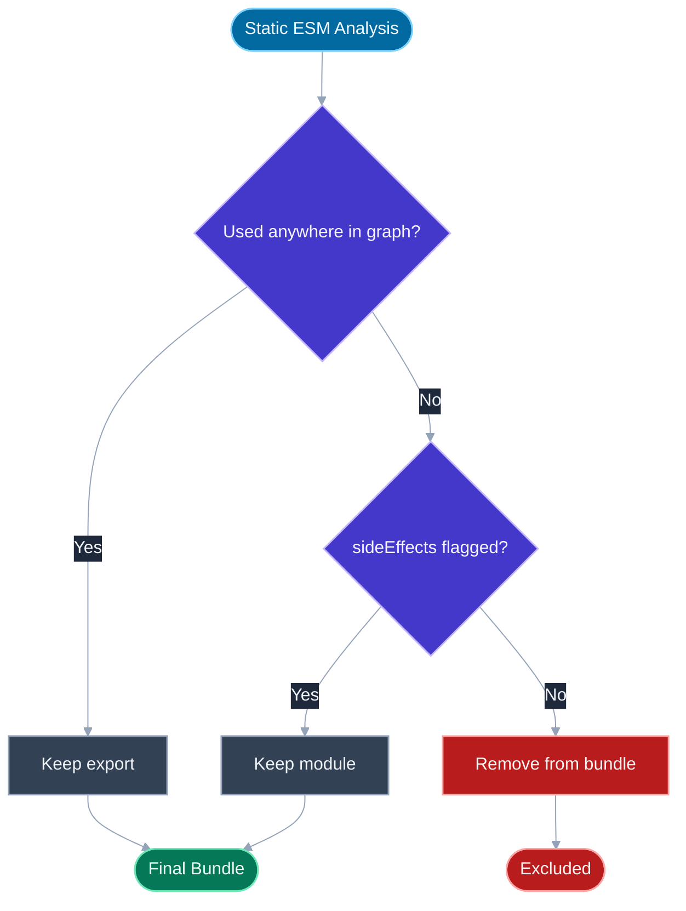
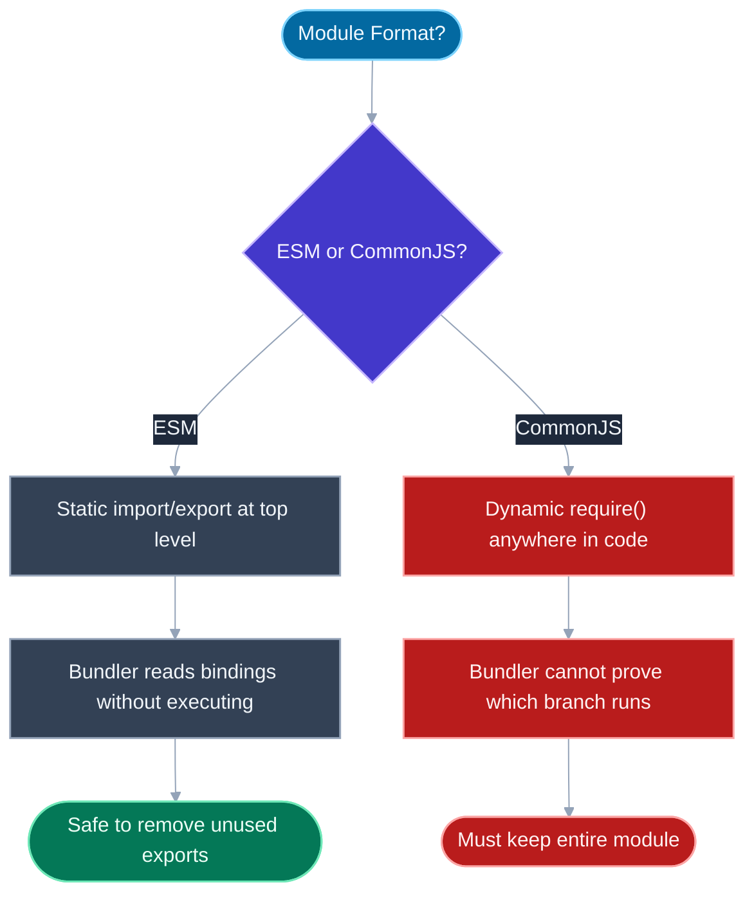

# Tree Shaking and Dead Code Elimination

## 🎯 Executive Summary

Tree shaking is static-analysis-driven dead code removal: a bundler walks the module graph, determines which exported bindings are actually imported and used anywhere in the reachable code, and excludes everything else from the final output. It's the mechanism that turns "I imported one function from a 200KB utility library" into "I shipped 2KB," rather than the whole library, and it's one of the highest-leverage, lowest-effort levers a team has over initial JS payload — assuming it's actually working, which is the part most engineers never verify.

At Lead/Staff level, this stops being trivia about a webpack flag and becomes an architectural responsibility: you're the one who decides a package is safe to mark `"sideEffects": false`, reviews whether a new internal shared package is written as ESM or CommonJS, and gets paged when a "tiny" utility import somehow adds 40KB to a bundle. Interviewers use tree shaking to probe whether a candidate understands *why* a mechanism works (static analyzability of ES modules) rather than just knowing it exists — the distinction between "I know tree shaking is a thing bundlers do" and "I know why `require()` breaks it" is exactly the Senior/Lead line.

It surfaces constantly in real debugging: a barrel file quietly pulls in an entire component library, a `sideEffects: false` package silently drops a needed CSS import, or `import _ from 'lodash'` balloons a bundle that `import debounce from 'lodash/debounce'` wouldn't have. A Lead is expected to diagnose these from a bundle analyzer output, not just recite the definition.

---

## 📖 What Is It? (Plain-English Definition)

**In plain terms:** tree shaking is a bundler figuring out which pieces of your imported code you actually use, and throwing away the rest before shipping to the browser.

Imagine a friend hands you a 500-page reference book but you only ever read three pages of it. Tree shaking is like a smart librarian who watches which pages you actually flip to, then photocopies only those three pages for you to carry around — instead of making you lug the whole book. The bundler doesn't run your code to figure this out; it *reads* it, tracing which named things get imported and referenced, without ever executing a line.

The reason this is possible at all — and the reason it doesn't work on every kind of JavaScript module — comes down to whether the import/export structure can be figured out just by reading the text, before anything runs. That distinction is the crux of the whole topic, and it's covered in detail below.

---

## 🧠 Core Technical Deep Dive

### Why ES modules are shakeable and CommonJS isn't

ES module `import`/`export` declarations are **static**: they appear only at the top level of a file, with literal string specifiers and literal binding names, and they cannot be conditionally executed. A bundler can read `import { debounce } from './utils'` and know, without running any code, exactly which binding is being pulled in.

```javascript
// ESM — statically analyzable
export function debounce(fn, ms) { /* ... */ }
export function throttle(fn, ms) { /* ... */ }
// A bundler can prove `throttle` is unused if nothing imports it.
```

CommonJS `require()`/`module.exports` are **dynamic** — ordinary function calls and object mutations that can happen conditionally, inside loops, with computed keys, or reassigned at runtime:

```javascript
// CommonJS — NOT statically analyzable in the general case
if (condition) {
  module.exports = require('./a');
} else {
  module.exports = require('./b');
}
// or:
module.exports[someRuntimeKey] = value;
```

A bundler cannot safely prove which branch runs, or what `someRuntimeKey` evaluates to, without actually executing the module — and bundlers don't execute code at build time, they only parse and analyze it. So the conservative, correct choice is to keep everything. This is *the* real-world trivia fact interviewers reach for: "why doesn't tree shaking work on this CommonJS package I depend on?" The answer is never "the bundler is bad at it" — it's that CommonJS's dynamism makes safe removal undecidable in general, not just unimplemented.

> **Key takeaway:** tree shaking isn't a feature bundlers "support" or "don't support" — it's a direct consequence of whether the module format is statically analyzable. ESM is; CommonJS, in general, is not.

### The `sideEffects` field: telling the bundler what's safe to drop

Even with ESM, a bundler needs one more piece of information: is it safe to remove a module *entirely* if nothing imports a binding from it? Not always — some modules are imported purely for their side effects:

```javascript
import './polyfills';       // runs code, exports nothing
import './styles.css';      // registers styles as a side effect of import
```

The `sideEffects` field in `package.json` tells the bundler which files in a package have effects beyond their exports, so it knows not to remove them even though nothing "uses" their exports:

```json
{
  "name": "my-design-system",
  "sideEffects": ["**/*.css", "./src/polyfills.js"]
}
```

Setting `"sideEffects": false` tells the bundler *every* file in the package is pure — safe to drop entirely if unused. This is a common and dangerous gotcha: a maintainer sets `sideEffects: false` for a nice bundle-size win, but one file in the package actually does something on import (registers a web component, patches a global, imports CSS) — and the bundler silently drops that file from consumers' bundles because the field promised it wouldn't cause an issue. The bug doesn't show up at build time; it shows up as "why did this global registration stop working after a dependency bump" days later.

> **Key takeaway:** `sideEffects: false` is a promise you're making to every consumer's bundler, not a description of intent — verify it's true for every file in the package, not just the ones you had in mind when you set it.

### Named exports, default exports, and namespace re-exports

Tree shaking works cleanly on named exports because each binding has an identifiable name a bundler can trace usage of. Default exports are shakeable too, in that unused modules can still be dropped, but they don't get the same fine-grained "which of these ten things in this file do you actually use" treatment — a default export is typically one indivisible unit.

`export * from './module'` (namespace re-exports) is the trickiest case: it re-exports everything from a module under a wildcard, which some bundlers historically handled conservatively by keeping the whole re-exported module unless they could prove every individual binding was unused across the entire graph.

### Barrel files: the most common real-world blocker

A barrel file is an `index.js` that re-exports everything from a directory for import convenience:

```javascript
// components/index.js — a barrel file
export * from './Button';
export * from './Modal';
export * from './DataTable';
export * from './Chart';
```

```javascript
// consumer code
import { Button } from './components';
```

Even though the consumer only wants `Button`, whether `Modal`, `DataTable`, and `Chart` get shaken out depends entirely on the bundler's analysis depth and the package's `sideEffects` configuration. Weaker or misconfigured setups pull in the entire barrel's dependency graph — this is one of the single most common causes of "why is my bundle so much bigger than I expected" in real codebases using component libraries or internal shared packages.

> **Key takeaway:** barrel files are a convenience/tree-shakability trade-off, not a free abstraction — for large, heterogeneous directories (a component library, a utilities folder), prefer direct imports (`from './components/Button'`) over the barrel when bundle size matters, or verify with a bundle analyzer that the barrel isn't leaking unused modules.

### Dead code elimination: a separate, later step

Tree shaking removes unused *exports* from the module graph. Dead code elimination (DCE) is a related but distinct step, typically performed by a minifier (Terser, esbuild's minifier) *after* bundling, which removes unreachable code *within* a single file — branches that can be statically proven to never execute:

```javascript
if (process.env.NODE_ENV !== 'production') {
  console.log('Verbose debug info', someExpensiveComputation());
  runDevOnlyValidation();
}
```

During a production build, a bundler replaces `process.env.NODE_ENV` with the literal string `'production'` (via a define/replace plugin step), which turns the condition into `if ('production' !== 'production')` — a provably-false branch. The minifier's DCE pass then removes the entire block, including any function calls inside it, so dev-only logging and validation code never ships to production users at all, not even as unreachable-but-present bytes.

> **Key takeaway:** tree shaking operates at the module/export level; DCE operates at the statement/branch level inside a file. Both matter, and dev-only code (`NODE_ENV` guards) is eliminated by DCE, not tree shaking — mixing up which mechanism does which is a common imprecision that separates a hand-wavy answer from a precise one.

### The "importing the whole library" blocker

```javascript
// Pulls in the entire lodash library's module graph
import _ from 'lodash';
_.debounce(fn, 300);

// Only pulls in the debounce module
import debounce from 'lodash/debounce';
debounce(fn, 300);

// Or: use lodash-es, which ships ESM builds designed for shaking
import { debounce } from 'lodash-es';
```

Classic CommonJS `lodash` exports everything off a single object (`module.exports = { debounce, throttle, ... }`), so importing the default export pulls in the whole thing regardless of what you destructure afterward — the bundler can't statically prove which properties of that object you'll access. `lodash-es` re-implements the library as genuine ES modules with per-function named exports, restoring shakeability.

### Verifying it actually worked

None of the above matters if you don't check the output. See [Bundle Analysis](/topic-detail.html?id=bundle-analysis) for the full workflow — the short version: run a treemap visualizer (webpack-bundle-analyzer, rollup-plugin-visualizer) after any dependency change and confirm the shipped bundle doesn't contain modules or exports you expected to be shaken out. Assuming tree shaking worked because you used ESM syntax is not the same as verifying it did.

---

## 📊 Visual Architecture & Logic

### Diagram 1 — Is This Export Removable?



### Diagram 2 — Why ESM Enables Static Analysis and CommonJS Doesn't



---

## 🏢 Interview Context & FAANG Signals

| Interview Stage | Format |
|---|---|
| **Trivia/Fundamentals Round** | "Why doesn't tree shaking work on this CommonJS dependency?" — direct test of ESM-vs-CommonJS understanding |
| **Performance Round** | "This bundle is bigger than expected after adding one utility function — where do you look?" |
| **Code Review Round** | Reviewing a PR that sets `"sideEffects": false` on an internal package, or adds a barrel-file import |
| **System Design** | "Design the build pipeline for a shared component library consumed by multiple teams" — tree shaking + `sideEffects` correctness at scale |

**Lead signals interviewers listen for:**
1. Can you explain *why* ESM is shakeable and CommonJS isn't, in terms of static vs. dynamic analyzability — not just "ESM supports it and CommonJS doesn't"?
2. Do you know the `sideEffects` field is a bundler-trust contract that can silently break things if set incorrectly, not just a bundle-size knob?
3. Do you recognize barrel files and default-namespace imports (`import _ from 'lodash'`) as real, common tree-shaking blockers, from direct debugging experience?
4. Do you distinguish tree shaking (module/export-level) from minifier dead code elimination (statement/branch-level), and know which one strips `NODE_ENV` guards?
5. Do you verify tree shaking worked via a bundle analyzer rather than assuming ESM syntax alone guarantees it?

---

## ⚔️ Lead Level vs Senior Level

**Question:** "We migrated a utility package to have `sideEffects: false` for a bundle-size win, and now a CSS import inside it stopped working for consumers. What happened?"

> **Senior Response:**
> "Maybe the CSS import got tree-shaken out since nothing directly references it? I'd try removing the `sideEffects: false` flag and see if that fixes it."

> **Staff/Lead Response:**
> "`sideEffects: false` tells the bundler every file in the package is safe to drop if nothing imports a named binding from it — but a bare `import './styles.css'` has no bindings to trace, it's imported purely for its side effect of registering styles. If the package claims no side effects anywhere, the bundler takes that as license to drop that file entirely from any consumer that doesn't reference an export from it, which is exactly what happened here.
>
> The fix isn't just reverting the flag globally — that gives up the tree-shaking win for the whole package. The correct fix is scoping `sideEffects` to an array listing exactly the files that do have side effects — the CSS files and any polyfill-style modules — so the bundler keeps those specifically while still shaking the rest of the package cleanly. I'd also add this as a checklist item for any future package that adopts `sideEffects: false`: audit every file for side-effectful imports first, don't just flip the flag because it sounds like a free optimization."

What separates them: the Senior response treats it as a mystery to poke at reactively; the Lead response names the exact mechanism (side-effect-only imports have no traceable binding), proposes a targeted fix that preserves the original optimization intent, and converts the incident into a preventive process.

---

## ⚠️ Common Pitfalls & Anti-Patterns

> ### ✕ Setting `sideEffects: false` Without Auditing Every File
> **Why it's wrong:** It's a blanket promise to every consumer's bundler that nothing in the package does anything on import beyond its exports. If even one file registers a global, patches a prototype, or imports CSS, that file gets silently dropped from bundles that don't reference its exports — a bug with no build-time signal.
> **✓ Correct Lead Approach:** Audit every file in the package before setting the flag, or scope it to an explicit array of the files that are genuinely side-effect-free rather than defaulting to `false` for the whole package.

---

> ### ✕ Assuming ESM Syntax Alone Guarantees Tree Shaking
> **Why it's wrong:** Writing `import`/`export` doesn't automatically mean unused code is removed — barrel files, missing `sideEffects` configuration, or a bundler with shallow re-export analysis can all leave dead code in the final bundle despite fully ESM source.
> **✓ Correct Lead Approach:** Verify with a bundle analyzer after dependency or import-structure changes rather than assuming ESM syntax is sufficient on its own.

---

> ### ✕ Reflexively Reaching for Barrel Files on Large Shared Directories
> **Why it's wrong:** A barrel file re-exporting an entire component library or utilities directory means a single named import can pull in the whole directory's dependency graph if the bundler or package configuration doesn't shake it cleanly — this is one of the most common real-world sources of unexpected bundle bloat.
> **✓ Correct Lead Approach:** For large, heterogeneous directories where bundle size matters, prefer direct module imports over the barrel, or verify the barrel is genuinely shaking cleanly before relying on it.

---

> ### ✕ Confusing Tree Shaking with Minifier Dead Code Elimination
> **Why it's wrong:** They operate at different levels — tree shaking removes unused module exports from the graph; DCE (in a minifier, after bundling) removes unreachable statements and branches within a file, which is what actually strips `if (process.env.NODE_ENV !== 'production')` blocks. Treating them as the same mechanism leads to wrong diagnoses when dev-only code unexpectedly ships, or doesn't.
> **✓ Correct Lead Approach:** Know which pipeline stage is responsible for which kind of removal, so a bug report points you at the right configuration (bundler resolution/`sideEffects` vs. minifier settings) immediately.

---

> ### ✕ Importing Default Exports from Multi-Utility CommonJS Libraries
> **Why it's wrong:** `import _ from 'lodash'` (or any default-export import of a CommonJS-style "bag of utilities") pulls in the entire library's module graph, because the bundler can't statically prove which properties you'll access off the default object afterward — regardless of how little you actually destructure and use.
> **✓ Correct Lead Approach:** Use path-specific imports (`lodash/debounce`) or an ESM-native equivalent of the library (`lodash-es`) that exposes genuine named exports per function.

---

## 🛠️ Practice Scenarios

### Scenario 1: The Barrel File Bloat

**Problem:**
```javascript
// design-system/index.js
export * from './Button';
export * from './Modal';
export * from './DataTable';
export * from './RichTextEditor';

// app/Toolbar.jsx
import { Button } from 'design-system';

function Toolbar() {
  return <Button label="Save" />;
}
```
A bundle analyzer shows `RichTextEditor` and its 90KB of dependencies present in `Toolbar`'s chunk, even though `Toolbar` only imports `Button`. Why, and what's the fix?

<details>
<summary>Staff-Level Solution</summary>

The barrel file (`design-system/index.js`) re-exports everything with `export *`, and unless the design-system package declares an accurate `sideEffects` array (or the bundler's re-export analysis is deep enough to prove `RichTextEditor`'s exports are unused across the whole graph), the safe/conservative behavior is to keep the entire re-exported surface reachable through the barrel, pulling in `RichTextEditor` and its dependency tree along with it.

Fix: either import directly from the component's own path (`import { Button } from 'design-system/Button'`) to bypass the barrel entirely, or ensure the design-system package's build correctly marks itself side-effect-free and is built/tested to confirm the bundler's re-export analysis actually shakes unused named exports out of `export *` chains — then re-verify with the analyzer that `RichTextEditor` disappears from `Toolbar`'s chunk.

</details>

---

### Scenario 2: The Silent CSS Regression

**Problem:**
```json
{
  "name": "@acme/ui-kit",
  "sideEffects": false,
  "main": "dist/index.js"
}
```
```javascript
// dist/index.js
import './reset.css';
export { Button } from './Button';
export { Modal } from './Modal';
```
After a minor version bump of `@acme/ui-kit`, consuming apps report the design system's base styles are missing in production builds, but everything looks fine in local dev. What happened, and how do you fix it?

<details>
<summary>Staff-Level Solution</summary>

`"sideEffects": false` tells the bundler that no file in `@acme/ui-kit` does anything beyond its exports — but `./reset.css` is imported purely for its side effect (injecting styles), with no exported binding for the bundler to trace usage of. In a production build with tree shaking enabled, the bundler takes the package at its word and drops the CSS import entirely from any consumer bundle, since nothing appears to use it. Local dev often uses a dev server config that doesn't run the same aggressive tree-shaking pass, which is why it isn't caught there.

Fix: scope `sideEffects` to an explicit array naming the side-effectful files — `"sideEffects": ["*.css", "./dist/reset.css"]` — so the bundler keeps CSS imports while still shaking unused component exports normally. Add a build-time check (or a visual regression test against a real production bundle) that would have caught missing base styles before this shipped to consumers.

</details>

---

### Scenario 3: The lodash Default Import

**Problem:**
```javascript
import _ from 'lodash';

function useDebouncedSearch(onSearch) {
  return _.debounce(onSearch, 300);
}
```
A bundle analyzer reveals `lodash` contributes 71KB (minified) to the bundle even though this file only calls `_.debounce`. Diagnose and fix.

<details>
<summary>Staff-Level Solution</summary>

Classic `lodash` exports everything off a single default object (`module.exports = { debounce, throttle, map, ... }` under the hood), so `import _ from 'lodash'` gives the bundler no statically provable way to know which of the dozens of properties on `_` this file will access at runtime — it has to include the whole object and its full dependency graph to be safe.

Fix: use a path-specific import that pulls in only the `debounce` module and its actual dependencies —
```javascript
import debounce from 'lodash/debounce';
```
— or migrate to `lodash-es`, which ships genuine per-function ES module exports designed to be shaken cleanly (`import { debounce } from 'lodash-es'`). Re-run the bundle analyzer to confirm the contribution drops from tens of KB to roughly the size of `debounce` alone plus its minimal internal dependencies.

</details>
