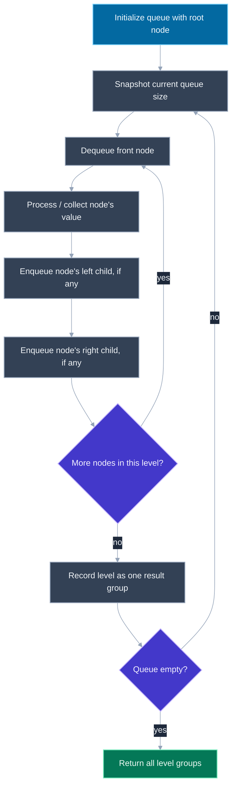
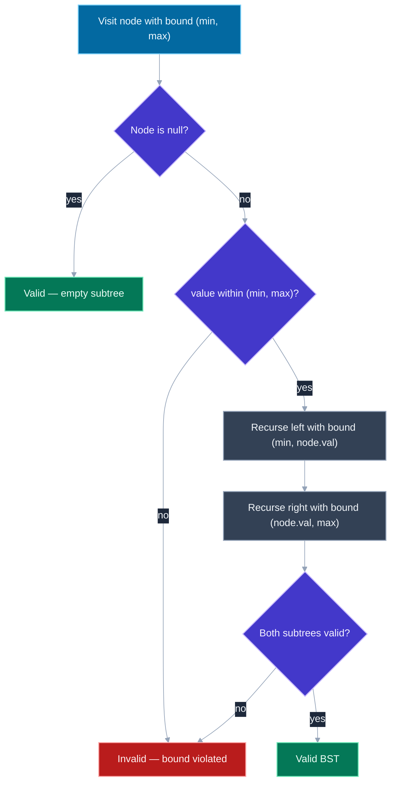

# Trees: BFS, DFS, Binary Search Trees

---

## 🎯 Executive Summary

Tree problems are the single most common coding-round category in FAANG interviews because a binary tree is the smallest structure that forces a candidate to reason about recursion, traversal order, and state-passing all at once. Whether the interviewer calls it a "warm-up" or the main event, almost every tree question reduces to one of three moves: walk it level by level (BFS), walk it depth-first and reason about paths/subtrees (DFS), or exploit the sorted invariant of a Binary Search Tree (BST) to prune the search space. A Lead-level candidate is expected to recognize which of these three moves a problem is asking for within the first ten seconds of reading it, not after several minutes of trial and error.

At the Lead level, tree questions are rarely graded on "did you get the right answer" alone — they're a proxy for how you reason about state under recursion. Do you know when to carry information down the call stack (a `min`/`max` bound, a running path, a depth counter) versus bubble information up (a computed height, a boolean "found" flag, a max path sum)? Do you know why BFS needs a queue and DFS needs a stack (or the implicit call stack via recursion), and can you convert between the recursive and iterative forms of DFS on demand — interviewers frequently ask for the iterative version as a follow-up specifically to test this.

This topic also functions as the foundation for graph traversal (a tree is just a connected, acyclic graph), so getting BFS/DFS mechanics rock-solid on trees pays off directly in graph and matrix problems later in a loop. It surfaces constantly: as a standalone coding question, as the traversal primitive inside a harder system-design-adjacent question (e.g., "traverse this component tree and compute a derived value"), and as a warm-up before a much harder DP-on-trees or LCA (lowest common ancestor) follow-up.

---

## 📖 What Is It? (Plain-English Definition)

**In plain terms:** A tree is a structure where each node has at most a fixed number of children (two, for a binary tree) and there's exactly one path from the root to any other node — no cycles, no shortcuts. Traversing a tree just means visiting every node in some deliberate order, and the order you choose (level-by-level vs. as-deep-as-possible-first) changes both what's easy to compute and what tool you reach for.

Think of a tree like a company org chart. BFS is like announcing something floor-by-floor in an office building — you finish everyone on floor 1 before moving to floor 2, so you always know exactly how "deep" you currently are. DFS is like following one reporting chain all the way down to an individual contributor before backtracking to check the next chain — you go deep before you go wide, and you naturally end up holding the full path from the root to wherever you currently are.

A Binary Search Tree adds one extra rule on top of the tree shape: for every node, everything in its left subtree is smaller, and everything in its right subtree is larger. That single invariant is what turns an otherwise unremarkable tree into a structure that supports fast (`O(log n)` on a balanced tree) search, insert, and delete — and it's also what an in-order traversal (left, node, right) exploits to visit every value in sorted order for free.

With the shape and the invariant established, here's how to actually recognize and implement each of the three core techniques.

---

## 🧠 Core Technical Deep Dive

### Pattern Recognition — How to Spot This Category of Problem

The fastest way to fail a tree question is picking DFS when the problem wants BFS, or missing that a "validate/search" phrasing means you should be exploiting the BST invariant instead of doing a generic traversal. Train yourself to scan for these tells:

**Reach for BFS (queue-based, level order) when the problem says:**
- "Level order," "level by level," "per level," or asks for output grouped by depth (e.g., `[[3],[9,20],[15,7]]`)
- "Shortest path" or "minimum number of steps" in an **unweighted** structure — BFS guarantees the first time you reach a node is via the shortest path
- "Minimum depth," "closest," "nearest," or anything implying you want the *first* qualifying node discovered, since BFS explores in increasing distance-from-root order
- "Zigzag traversal," "right side view," "average of each level" — all level-scoped aggregations

**Reach for DFS (recursive or explicit stack) when the problem says:**
- "All paths," "all root-to-leaf paths," "every possible route" — DFS naturally enumerates full paths because it holds the current path on the call stack as it descends
- "Maximum depth," "diameter," "maximum path sum," "sum of all paths" — anything requiring you to fully explore a subtree before you can compute a value about it (post-order aggregation)
- "Ancestor," "descendant," "lowest common ancestor" — these are inherently about the path structure from root to node, which DFS is naturally tracking
- Anything phrased recursively already ("a tree is balanced if its left and right subtrees are balanced and...") — this is a direct invitation to define the DFS recursively, mirroring the problem's own definition

**Reach for a BST-specific technique when the problem says (or implies) the data is sorted:**
- "This is a Binary Search Tree" stated explicitly, or the constraints guarantee sorted structure
- "Validate," "is this a valid BST" — signals you need range-bound checking (a `(min, max)` window passed down through recursion), **not** just comparing a node to its immediate children (a very common bug — see the Pitfalls section)
- "Kth smallest," "closest value," "in sorted order," "convert to sorted array/list" — signals an in-order traversal, since in-order on a BST visits nodes in ascending order for free
- "Search," "insert," "delete" with a BST guarantee in the prompt — signals you can discard half the remaining subtree at each step, achieving `O(h)` (height) time rather than `O(n)`

A quick self-check: if the question can be answered by looking at one level at a time, it's BFS. If it needs the full path down to a node (or the full subtree below a node) before it can produce an answer, it's DFS. If sorted order or fast search/insert/delete is mentioned, it's a BST problem layered on top of one of the first two.

### BFS mechanics: the queue-driven level walk

BFS uses a **queue** (FIFO) precisely because it must finish all nodes at the current depth before touching any node at the next depth — a queue naturally preserves "discovered order," which for a tree is exactly "depth order."

```javascript
function levelOrderTraversal(root) {
  if (!root) return [];
  const result = [];
  const queue = [root];

  while (queue.length > 0) {
    const levelSize = queue.length; // snapshot: exactly this many nodes belong to the current level
    const currentLevel = [];

    for (let i = 0; i < levelSize; i++) {
      const node = queue.shift(); // dequeue
      currentLevel.push(node.val);
      if (node.left) queue.push(node.left);
      if (node.right) queue.push(node.right);
    }

    result.push(currentLevel);
  }

  return result;
}
```

The key trick that separates "I know BFS" from "I can actually implement level-grouped BFS": snapshotting `queue.length` *before* the inner loop starts. Without that snapshot, you'd have no way to tell where one level ends and the next begins, since children get pushed onto the same queue you're currently draining.

### DFS mechanics: recursive vs. iterative, and the three orders

DFS has three canonical orderings, distinguished by *when* you process the current node relative to recursing into its children:

```javascript
function preOrder(node, result = []) {
  if (!node) return result; // base case: nothing to do past a null child
  result.push(node.val);    // process BEFORE children — root, left, right
  preOrder(node.left, result);
  preOrder(node.right, result);
  return result;
}

function inOrder(node, result = []) {
  if (!node) return result;
  inOrder(node.left, result);
  result.push(node.val);    // process BETWEEN children — left, root, right
  inOrder(node.right, result);
  return result;
}

function postOrder(node, result = []) {
  if (!node) return result;
  postOrder(node.left, result);
  postOrder(node.right, result);
  result.push(node.val);    // process AFTER children — left, right, root
  return result;
}
```

In-order is the one worth memorizing cold: on a BST, it produces values in ascending sorted order, because it always fully exhausts the smaller (left) subtree before touching the current node, and the current node before the larger (right) subtree.

The iterative form (interviewers love this as a follow-up, since it tests whether you actually understand what recursion is doing under the hood, not just that you can write `function foo() { foo(); }`):

```javascript
function preOrderIterative(root) {
  if (!root) return [];
  const result = [];
  const stack = [root]; // explicit stack replaces the call stack

  while (stack.length > 0) {
    const node = stack.pop();
    result.push(node.val);
    // push right FIRST so left is processed first (LIFO)
    if (node.right) stack.push(node.right);
    if (node.left) stack.push(node.left);
  }

  return result;
}
```

The recursive call stack *is* an implicit stack — converting to the iterative form is just making that stack explicit, which is exactly why DFS naturally maps to "explicit stack" while BFS naturally maps to "explicit queue": they mirror the data structure each one is implicitly built on.

### BST mechanics: exploiting the sorted invariant

The single most valuable BST skill is passing down a shrinking valid range instead of only comparing a node to its direct children — this is covered in depth in the Pitfalls section and the second diagram below, because it's the most common way this topic goes wrong at the Lead level.

```javascript
function searchBST(root, target) {
  if (!root) return null;
  if (root.val === target) return root;
  // Exploit the invariant: discard half the tree at every step
  return target < root.val
    ? searchBST(root.left, target)
    : searchBST(root.right, target);
}
```

This runs in `O(h)` where `h` is tree height — `O(log n)` on a balanced tree, degrading to `O(n)` on a skewed one (e.g., a tree built by inserting an already-sorted sequence) — a trade-off worth naming unprompted.

---

## 📊 Visual Architecture & Logic

### Diagram 1 — BFS Level-Order Traversal Mechanism



### Diagram 2 — BST Validation via Range-Passing



---

## 🏢 Interview Context & FAANG Signals

| Interview Stage | Format |
| --- | --- |
| Coding Round | Standalone tree problem — level order, max depth, validate BST, path sum — often the first or second question in a loop |
| Coding Round (harder) | Tree problem combined with DP or backtracking, e.g. max path sum, all root-to-leaf paths matching a target |
| Follow-up / Whiteboard Deep Dive | "Now do it iteratively" or "now do it for an N-ary tree" as a live follow-up to test genuine understanding vs. memorization |
| System Design (rarely) | Traversing a component/DOM/file tree to compute a derived aggregate, framed as an implementation detail inside a larger design |

**Lead signals interviewers listen for:**

1. Names the pattern (BFS vs. DFS vs. BST-specific) within the first few seconds of reading the problem, and explains *why* that pattern fits before writing code
2. States time and space complexity unprompted, including the space cost of the recursive call stack for DFS (`O(h)`) versus the queue for BFS (`O(w)`, the tree's maximum width)
3. Discusses the trade-off between recursive and iterative implementations, and can convert between them on request without re-deriving from scratch
4. Handles edge cases — null root, single node, a skewed/unbalanced tree — before being asked, rather than only after a bug surfaces
5. For BST problems specifically, catches the "compare only to immediate children" trap unprompted and reaches for range-passing instead

---

## ⚔️ Lead Level vs Senior Level

**Question:** "Validate whether this binary tree is a valid Binary Search Tree."

> **Senior Response:** "For each node, I'll check that the left child is smaller and the right child is larger, recursively. If that holds everywhere, it's a valid BST."
>
> This is a plausible-sounding first instinct, but it's wrong: it only checks each node against its *immediate* children, not against every ancestor's bound. A node could be locally consistent with its parent while still violating a bound set several levels up.

> **Staff/Lead Response:** "A node's value isn't just constrained by its immediate parent — it's constrained by every ancestor's decision to send it left or right. So I'll do a DFS that carries a `(min, max)` valid range down as an argument: the root starts unconstrained, and every time I go left I tighten the max to the current node's value, every time I go right I tighten the min. A node is valid only if it falls strictly within the range it inherited. This is `O(n)` time since I visit every node once, and `O(h)` space for the recursion stack — worst case `O(n)` if the tree is a degenerate chain. I'd also flag upfront: are duplicate values allowed? I'll treat the BST as strict (`left < node < right`), so a duplicate anywhere in a subtree makes it invalid, and I'll say that assumption out loud rather than silently picking one."

What separates them: the Lead candidate identifies that local parent-child comparison is insufficient *before* writing any code, proactively states the complexity trade-off of the recursive approach, and surfaces the duplicate-value ambiguity as an explicit assumption rather than an implicit, unstated choice.

---

## ⚠️ Common Pitfalls & Anti-Patterns

> ### ✕ Validating a BST by Comparing Only Immediate Children
>
> **Why it's wrong:** Checking `node.left.val < node.val < node.right.val` at every node passes for trees that are locally sorted but globally invalid — e.g., a right child's *left* subtree containing a value smaller than the root, several levels down, which no immediate-child comparison ever catches.
>
> **✓ Correct Lead Approach:** Pass a shrinking `(min, max)` valid range down through the recursion, updating it every time you descend left (tighten the max) or right (tighten the min), and reject the moment a node falls outside its inherited range.

---

> ### ✕ Forgetting the Level-Size Snapshot in BFS
>
> **Why it's wrong:** If you loop over `queue.length` directly inside a `while` loop without snapshotting it first, the length keeps growing as you enqueue children mid-iteration, silently merging multiple levels into one, or causing an infinite/incorrect loop.
>
> **✓ Correct Lead Approach:** Capture `const levelSize = queue.length` immediately before draining the current level, and loop exactly `levelSize` times — this is the one line that makes level-grouped BFS work at all.

---

> ### ✕ Treating Tree Height and Depth as Interchangeable
>
> **Why it's wrong:** Depth is measured top-down (root to a given node); height is measured bottom-up (a given node to its deepest leaf). Conflating them produces off-by-one errors in balance checks, diameter calculations, and "maximum depth" problems, especially at the base case (is an empty tree's height `0` or `-1`?).
>
> **✓ Correct Lead Approach:** Explicitly state the convention being used (e.g., "an empty tree has height 0, a single node has height 1") before writing the recursive formula, and keep it consistent across every recursive call.

---

> ### ✕ Ignoring the Recursion Call-Stack Cost When Stating Complexity
>
> **Why it's wrong:** Candidates often state DFS as "O(n) time, O(1) space" because they don't allocate extra data structures, forgetting that the recursive call stack itself consumes space proportional to the tree's height.
>
> **✓ Correct Lead Approach:** Always state DFS space complexity as `O(h)` where `h` is height — `O(log n)` for a balanced tree, `O(n)` worst case for a skewed one — and name that distinction unprompted.

---

> ### ✕ Assuming a Tree Is Balanced Without Checking the Constraints
>
> **Why it's wrong:** Silently assuming `O(log n)` height leads to wildly wrong complexity claims and, in production code, unbounded recursion depth risk (stack overflow) on adversarial or naturally skewed input (e.g., inserting an already-sorted sequence into a BST with no self-balancing).
>
> **✓ Correct Lead Approach:** State complexity in terms of height `h` first, then note the balanced-case simplification to `log n` only if the problem's constraints actually guarantee balance (e.g., "this is a self-balancing tree" or randomized insertion order).

---

## 🛠️ Practice Problems

### Problem 1: Binary Tree Level Order Traversal

**Problem:**
```javascript
/**
 * Given the root of a binary tree, return the level order traversal of its
 * nodes' values (i.e., grouped from left to right, level by level).
 *
 * @param {TreeNode|null} root - root of the binary tree, or null for an empty tree
 * @returns {number[][]} array of arrays, one per level, top to bottom
 */
function levelOrder(root) {
  // your implementation
}
```

Each inner array should contain the values at one depth of the tree, in left-to-right order, with the outer array ordered from the root's level down to the deepest level.

**Examples:**
```
Input: root = [3,9,20,null,null,15,7]  (tree: 3 at root, 9 and 20 as children, 15 and 7 as children of 20)
Output: [[3],[9,20],[15,7]]
```
```
Input: root = [1,2,3,4,5]  (1 at root; 2,3 as its children; 4,5 as children of 2)
Output: [[1],[2,3],[4,5]]
Explanation: node 1 is level 0; nodes 2 and 3 are level 1; nodes 4 and 5 (children of 2) are level 2.
```

**Edge cases to handle:**
- Empty tree (`root` is `null`) — should return `[]`, not `[[]]`
- A single node — should return `[[value]]`
- An unbalanced tree where every node only has a left child (a straight chain) — each level should still correctly contain exactly one node

<details>
<summary>💡 Hint 1</summary>

Think about what data structure naturally lets you process everything at "distance 1 from the root" before anything at "distance 2" — you want first-discovered, first-processed behavior.

</details>

<details>
<summary>💡 Hint 2</summary>

Use a queue (FIFO) seeded with the root. The tricky part isn't the queue itself — it's knowing where one level ends and the next begins as you enqueue children into the same queue you're draining.

</details>

<details>
<summary>💡 Hint 3</summary>

Before draining nodes for the current level, record how many nodes are currently in the queue — that count is exactly how many nodes belong to this level. Loop that many times, dequeuing each node, collecting its value, and enqueuing its non-null children. Once that fixed number of iterations completes, push the collected values as one level and repeat until the queue is empty.

</details>

<details>
<summary>✅ Reveal Solution</summary>

```javascript
function levelOrder(root) {
  if (!root) return [];

  const result = [];
  const queue = [root];

  while (queue.length > 0) {
    const levelSize = queue.length;
    const currentLevel = [];

    for (let i = 0; i < levelSize; i++) {
      const node = queue.shift();
      currentLevel.push(node.val);

      if (node.left) queue.push(node.left);
      if (node.right) queue.push(node.right);
    }

    result.push(currentLevel);
  }

  return result;
}
```

**Why it works:** The queue snapshot (`levelSize`) is exactly the fix hinted at in Hint 3 — it prevents children enqueued during the current level's processing from bleeding into the current level's count. Each pass of the outer `while` loop corresponds to exactly one depth, matching Hint 2's FIFO reasoning: nodes are dequeued in the same order they were discovered, which for a tree is strictly non-decreasing depth order.

**Time complexity:** O(n) — every node is enqueued and dequeued exactly once, regardless of tree shape.
**Space complexity:** O(w) — where w is the tree's maximum width (widest level), since that's the largest the queue ever gets; worst case O(n) for a very wide, shallow tree, and the output array itself also holds all n values.

</details>

---

### Problem 2: Maximum Depth of Binary Tree

**Problem:**
```javascript
/**
 * Given the root of a binary tree, return its maximum depth — the number of
 * nodes along the longest path from the root down to the farthest leaf.
 *
 * @param {TreeNode|null} root - root of the binary tree, or null for an empty tree
 * @returns {number} maximum depth (an empty tree has depth 0)
 */
function maxDepth(root) {
  // your implementation
}
```

A leaf node has no children; the depth of a single-node tree is 1.

**Examples:**
```
Input: root = [3,9,20,null,null,15,7]
Output: 3
Explanation: the longest path is 3 -> 20 -> 15 (or 3 -> 20 -> 7), which has 3 nodes.
```
```
Input: root = [1,null,2]  (root 1, only a right child 2)
Output: 2
```

**Edge cases to handle:**
- Empty tree (`root` is `null`) — should return `0`
- A single node with no children — should return `1`
- A long skewed chain (every node has exactly one child, no branching) — depth should equal the total node count

<details>
<summary>💡 Hint 1</summary>

This is naturally defined in terms of itself: the depth of a tree is 1 (for the current node) plus whatever the deepest of its subtrees turns out to be. That recursive framing is usually the fastest path to the code.

</details>

<details>
<summary>💡 Hint 2</summary>

Use DFS (plain recursion is simplest here — no need for an explicit stack). Compute the depth of the left subtree and the depth of the right subtree independently, then combine them.

</details>

<details>
<summary>💡 Hint 3</summary>

Base case: a `null` node has depth `0` (this is what lets a single leaf correctly compute to depth `1` — `1 + max(0, 0)`). Recursive case: return `1 + Math.max(depth of left subtree, depth of right subtree)`. No explicit level tracking or queue needed — the recursion naturally unwinds bottom-up, combining child results into a parent result as each call returns.

</details>

<details>
<summary>✅ Reveal Solution</summary>

```javascript
function maxDepth(root) {
  if (!root) return 0; // base case: an empty subtree contributes 0 depth

  const leftDepth = maxDepth(root.left);
  const rightDepth = maxDepth(root.right);

  return 1 + Math.max(leftDepth, rightDepth);
}
```

**Why it works:** Every call answers "what's my depth?" using only its own children's answers, exactly the self-referential definition from Hint 1. The `null` base case (Hint 3) is what makes a leaf resolve correctly: both of its recursive calls return `0`, so the leaf itself computes `1 + max(0, 0) = 1`. Depth then accumulates by one at each level as the recursion unwinds back up to the root.

**Time complexity:** O(n) — each node is visited exactly once, and the work done per node (a max and an addition) is O(1).
**Space complexity:** O(h) — the recursive call stack grows to the height of the tree; O(log n) for a balanced tree, O(n) worst case for a fully skewed chain, since call-stack depth mirrors tree height exactly.

</details>

---

### Problem 3: Validate Binary Search Tree

**Problem:**
```javascript
/**
 * Given the root of a binary tree, determine if it is a valid Binary Search
 * Tree (BST). A valid BST: for every node, all values in its left subtree
 * are strictly less than the node's value, all values in its right subtree
 * are strictly greater, and both subtrees must themselves also be valid BSTs.
 *
 * @param {TreeNode|null} root - root of the binary tree, or null for an empty tree
 * @returns {boolean} true if the tree is a valid BST
 */
function isValidBST(root) {
  // your implementation
}
```

This BST definition disallows duplicate values anywhere in the tree — a node equal to an ancestor's value is treated as invalid, not merely "equal is fine on one side."

**Examples:**
```
Input: root = [2,1,3]
Output: true
```
```
Input: root = [5,1,4,null,null,3,6]  (5 at root; 1 as left child; 4 as right child; 4's children are 3 and 6)
Output: false
Explanation: node 4 is the right child of 5, so every value under 4 must be strictly greater than 5. Node 3
(4's left child) satisfies the local check against its immediate parent (3 < 4), but it violates the bound
inherited from the root (3 is not greater than 5) — exactly the ancestor-bound trap that immediate-child-only
comparisons miss.
```

**Edge cases to handle:**
- A single node — always valid regardless of its value
- Duplicate values anywhere in the tree (e.g., a node equal to an ancestor) — treated as invalid under this strict `<` / `>` convention
- A node several levels deep that violates a distant ancestor's bound while still satisfying its immediate parent's comparison (the exact trap in Example 2)

<details>
<summary>💡 Hint 1</summary>

Think about what information a node actually needs to be sure it's valid. Is comparing it only to its direct parent enough, or does it need to know something about *every* ancestor above it?

</details>

<details>
<summary>💡 Hint 2</summary>

Use DFS, but pass down an accumulated valid range — a `(min, max)` pair — rather than just the parent's value. Every node must fall strictly within the range it inherits from all its ancestors combined, not just its immediate parent.

</details>

<details>
<summary>💡 Hint 3</summary>

Start the root with an unbounded range (`-Infinity`, `Infinity`). At each node, first check it falls strictly between its inherited `(min, max)` — if not, return `false` immediately. Otherwise, recurse left with the range `(min, node.val)` — tightening the upper bound — and recurse right with `(node.val, max)` — tightening the lower bound. The tree is valid only if both recursive calls return `true`, and a `null` node is trivially valid (base case).

</details>

<details>
<summary>✅ Reveal Solution</summary>

```javascript
function isValidBST(root) {
  function validate(node, min, max) {
    if (!node) return true; // an empty subtree is trivially valid

    if (node.val <= min || node.val >= max) {
      return false; // violates an inherited ancestor bound
    }

    return (
      validate(node.left, min, node.val) &&   // left subtree: tighten the max
      validate(node.right, node.val, max)     // right subtree: tighten the min
    );
  }

  return validate(root, -Infinity, Infinity);
}
```

**Why it works:** Each recursive call carries the accumulated constraint from *every* ancestor, not just the immediate parent — exactly the gap identified in Hint 1. Tracing Example 2's `[5,1,4,null,null,3,6]`: node 4 is 5's right child, so it's validated with range `(5, Infinity)`. Node 3 is 4's left child, so it inherits 4's min (5) while tightening the max down to 4, giving range `(5, 4)`. The check `node.val <= min` evaluates `3 <= 5`, which is true, so `validate` returns `false` immediately — correctly catching a violation that comparing 3 only against its immediate parent (4) would have missed entirely.

**Time complexity:** O(n) — every node is visited exactly once in the worst case (a fully valid tree requires visiting all nodes to confirm validity).
**Space complexity:** O(h) — the recursion stack depth equals tree height; O(log n) balanced, O(n) worst case for a skewed tree.

</details>

---

*Document version: September 2026 | Audience: Staff/Principal Frontend Engineer candidates | Topic ID: trees-traversal*
