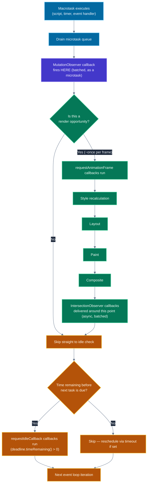
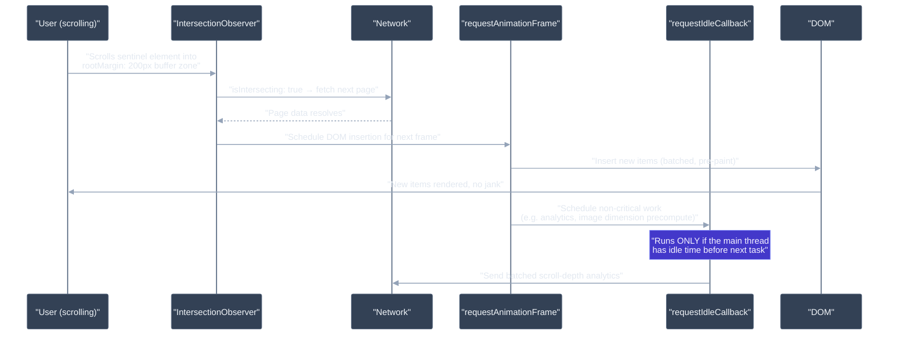

# Web APIs: requestAnimationFrame, requestIdleCallback, IntersectionObserver, MutationObserver

---

## 🎯 Executive Summary

These four APIs are the browser's answer to a single recurring problem: **how do you do expensive work without fighting the render pipeline?** Each one is a different scheduling primitive, tied to a different point in the browser's frame lifecycle — and the interview signal isn't "do you know the method names," it's **do you know exactly when each callback fires relative to the event loop, and can you pick the right one under a specific performance constraint.**

- **`requestAnimationFrame` (rAF)** — runs once per frame, right before the browser recalculates style, layout, and paints. The only place to safely read/write the DOM for visual updates without risking a dropped frame.
- **`requestIdleCallback` (rIC)** — runs only when the main thread has genuinely nothing more important to do before the next frame. For low-priority work you're willing to defer indefinitely.
- **`IntersectionObserver`** — asynchronously reports when an element crosses a visibility threshold, without ever forcing a synchronous layout calculation — the direct fix for the classic "scroll listener + `getBoundingClientRect()`" performance disaster.
- **`MutationObserver`** — asynchronously (as a microtask) reports DOM tree changes, replacing the old synchronous Mutation Events that could tank performance by firing once per mutation, on the main thread, blocking everything.

**Why this is a must-know for Leads:** every one of these APIs exists because someone at a browser vendor watched real production code do something catastrophically slow (layout thrashing from scroll handlers, synchronous mutation events, jank from unthrottled visual updates) and built a scheduling primitive specifically to make the correct approach the easy one. A Lead who can place all four of these precisely on the event loop timeline — and explain *why* React's own Scheduler deliberately avoids `requestIdleCallback` — is demonstrating exactly the kind of systems-level browser fluency this level of interview is designed to filter for.

---

## 🧠 Core Technical Deep Dive

### The one picture that unifies all four APIs

Before touching each API individually, the mental model that matters most: **the browser's event loop doesn't just alternate between tasks and microtasks — it has a rendering step, and these four APIs each hook into a different point around it.**

```
┌─── One iteration of the event loop ───────────────────────────────────────┐
│                                                                             │
│  1. Execute ONE macrotask (a script, a timer callback, an event handler)  │
│                                                                             │
│  2. Drain the ENTIRE microtask queue                                      │
│     — Promise .then() callbacks                                           │
│     — MutationObserver callbacks  ◄── batched here, once per checkpoint   │
│                                                                             │
│  3. If it's time to render this frame (browser decides, ~once per         │
│     display refresh):                                                     │
│       a. Run requestAnimationFrame callbacks  ◄── rAF fires HERE          │
│       b. Recalculate style                                                │
│       c. Layout                                                           │
│       d. Paint                                                            │
│       e. Composite                                                        │
│       f. (IntersectionObserver callbacks are queued around this point —   │
│           delivered async, batched, without forcing extra layout work)    │
│                                                                             │
│  4. If time remains before the next task is due:                         │
│       Run requestIdleCallback callbacks  ◄── rIC fires HERE, maybe        │
│                                                                             │
└─────────────────────────────────────────────────────────────────────────┘
```

The single most important fact this diagram encodes: **`MutationObserver` is a microtask** (runs after every task, deterministically, before rendering), **`rAF` is tied to the render step** (runs once per frame, guaranteed if the tab is visible), **`IntersectionObserver`** is delivered asynchronously by the browser's own internal scheduling (not on a fixed cadence you control), and **`rIC`** is the only one of the four with **no timing guarantee at all** — it might not run for seconds if the main thread stays busy.

### `requestAnimationFrame` — the only correct place for visual DOM updates

rAF callbacks run **synchronously, on the main thread, once per frame**, immediately before the browser performs style recalculation and layout. This timing is exactly why it's the correct primitive for animations and any DOM read/write that needs to be visually consistent within a single frame.

**Frame budget:** at a 60Hz display, you have ~16.6ms per frame for all of: JS execution (including your rAF callback), style, layout, paint, and composite. On a 120Hz ProMotion display, that budget halves to ~8.3ms — the browser calls rAF callbacks more frequently to match, which is a real, underappreciated performance cliff: code that felt fine at 60Hz can start dropping frames on high-refresh-rate hardware simply because it now has half the time per frame.

**Batching within a frame:** if you call `requestAnimationFrame` again *from inside* a rAF callback, that new callback is scheduled for the **next** frame, not the current one — this is what makes rAF safe for recursive animation loops without runaway synchronous recursion.

**The FLIP technique — the canonical rAF interview pattern:**
```javascript
// FLIP: First, Last, Invert, Play — animate layout changes performantly
function flipMove(element, applyLayoutChange) {
  // First: record starting position
  const first = element.getBoundingClientRect();

  // Last: apply the actual layout change synchronously
  applyLayoutChange();
  const last = element.getBoundingClientRect();

  // Invert: compute the delta, apply it as a transform (compositor-only, cheap)
  const deltaX = first.left - last.left;
  const deltaY = first.top - last.top;
  element.style.transform = `translate(${deltaX}px, ${deltaY}px)`;
  element.style.transition = 'none';

  // Play: on the next frame, remove the invert transform and let it transition
  requestAnimationFrame(() => {
    element.style.transition = 'transform 300ms ease';
    element.style.transform = '';
  });
}
```
The `requestAnimationFrame` here isn't decorative — without it, setting `transition` and clearing `transform` in the same synchronous block would never trigger a visible transition, because the browser batches the style changes and never gets a chance to paint the "before" state. The rAF forces a frame boundary between "snap to the inverted position" and "animate to the true position."

**Layout thrashing — the failure mode rAF exists to prevent:**
```javascript
// BAD: interleaved reads and writes force a synchronous layout on every iteration
elements.forEach(el => {
  const height = el.offsetHeight; // READ — forces layout if a previous write is pending
  el.style.height = height * 2 + 'px'; // WRITE — invalidates layout again
});

// GOOD: batch all reads, then all writes — one layout pass total
const heights = elements.map(el => el.offsetHeight); // all READS first
elements.forEach((el, i) => {
  el.style.height = heights[i] * 2 + 'px'; // all WRITES second
});
```
This read/write batching principle is exactly what rAF-based scheduling libraries (like `fastdom`) automate: queue all DOM reads into one rAF-adjacent phase, all writes into another, so the browser only performs one layout pass per frame instead of one per element.

### `requestIdleCallback` — genuinely low-priority, genuinely unreliable

rIC callbacks run during idle periods — after the browser has finished a task and has nothing else scheduled before the next expected work, and (per spec) after rendering has been performed for the frame if a render was due. The callback receives a `deadline` object:

```javascript
requestIdleCallback((deadline) => {
  while (deadline.timeRemaining() > 0 && tasksRemaining()) {
    performUnitOfWork();
  }
  if (tasksRemaining()) {
    requestIdleCallback(continueWork); // reschedule for the next idle period
  }
}, { timeout: 2000 }); // force execution within 2s even if the thread is never idle
```

`deadline.timeRemaining()` returns how much idle time is left in this callback invocation (never guaranteed to be more than a few milliseconds), and `timeRemaining()` returns `0` immediately if a higher-priority task becomes pending — the browser can cut your idle time short mid-callback. The `timeout` option is the only guarantee rIC offers: without it, a busy main thread can starve your callback indefinitely.

**Why React's Scheduler does NOT use `requestIdleCallback`:** this is one of the highest-signal facts a Lead can bring up unprompted. React needs **predictable, frequent, short time slices** (roughly 5ms chunks) to implement cooperative time-slicing for Concurrent Mode/Fiber — interrupting rendering work to let high-priority updates (like user input) through. `requestIdleCallback` fails this requirement on two counts: idle periods are **infrequent and unpredictable** (the browser might not consider the thread idle for a long stretch under load, exactly when React most needs to yield), and **it was never reliably implemented across browsers** (notably unsupported in Safari for years). React's `scheduler` package instead builds its own frame-rate-aware scheduler on top of a `MessageChannel` — posting a message creates a **macrotask** that runs after the current task and after paint, at a controllable/frequent cadence, giving React predictable yield points independent of the browser's own idle-time heuristics.

### `IntersectionObserver` — visibility detection without touching layout

The performance case for `IntersectionObserver` is precise: a scroll handler calling `element.getBoundingClientRect()` **forces a synchronous layout recalculation** on every single scroll event (which can fire dozens of times per frame without throttling), because `getBoundingClientRect()` needs up-to-date layout to answer correctly — this is the textbook "layout thrashing" scenario. `IntersectionObserver` sidesteps this entirely: the browser computes intersection asynchronously, using layout information it's already computing for rendering anyway, and delivers batched results without your code ever forcing an extra layout pass.

```javascript
const observer = new IntersectionObserver(
  (entries) => {
    entries.forEach(entry => {
      if (entry.isIntersecting) {
        loadImage(entry.target);
        observer.unobserve(entry.target); // stop observing once handled
      }
    });
  },
  {
    root: null, // viewport
    rootMargin: '200px', // start "intersecting" 200px before it's actually visible — pre-fetch buffer
    threshold: 0.01, // fire as soon as even 1% is visible
  }
);

images.forEach(img => observer.observe(img));
```

`rootMargin` is the detail most candidates miss: it lets you treat the intersection root as artificially larger than the real viewport, which is what makes IntersectionObserver-based lazy loading feel instant — the fetch starts *before* the element scrolls into view, not the moment it does. `threshold` can also be an array (`[0, 0.25, 0.5, 0.75, 1]`) to get a callback at every quartile of visibility crossed — the mechanism behind ad-viewability tracking ("at least 50% visible for 1 continuous second" style requirements).

### `MutationObserver` — microtask-timed, batched, and the fix for a deprecated disaster

`MutationObserver` replaced the old **Mutation Events** (`DOMSubtreeModified`, `DOMNodeInserted`, etc.), which were **synchronous** — every single DOM mutation fired an event immediately, on the main thread, potentially triggering more mutations that fired more events, all before the triggering operation could even complete. They were formally deprecated specifically because of the performance damage this caused at scale.

`MutationObserver` fixes this by being explicitly asynchronous and batched: mutations are collected into a queue, and the callback is invoked **once, as a microtask**, with an array of all `MutationRecord`s accumulated since the last microtask checkpoint — not once per mutation.

```javascript
const observer = new MutationObserver((mutationsList) => {
  for (const mutation of mutationsList) {
    if (mutation.type === 'childList') {
      console.log('Nodes added:', mutation.addedNodes.length);
    } else if (mutation.type === 'attributes') {
      console.log('Attribute changed:', mutation.attributeName);
    }
  }
});

observer.observe(targetNode, {
  childList: true,
  attributes: true,
  subtree: true,
  attributeFilter: ['class', 'data-state'], // narrow to specific attributes — reduces callback volume
});

// Must be explicitly torn down — there is no automatic disconnect on element removal
observer.disconnect();
```

Because delivery is a microtask, a `MutationObserver` callback is guaranteed to run **before the next paint and before any pending macrotask**, but *after* the current synchronous block of code finishes — this is precisely why a common bug is expecting the callback to fire "immediately" inside the same synchronous function that triggered the mutation; it never does, by design.

### Comparison table — the summary a Lead should be able to produce from memory

| API | Fires as | Guaranteed? | Forces layout? | Typical use case |
| --- | --- | --- | --- | --- |
| `requestAnimationFrame` | Once per frame, pre-render | Yes, if tab is visible | No (unless you read layout properties inside it without batching) | Animations, visual DOM sync, FLIP transitions |
| `requestIdleCallback` | During idle periods only | **No** — `timeout` is the only guarantee | No | Low-priority background work, analytics batching, prefetch |
| `IntersectionObserver` | Async, browser-batched | Delivered eventually, timing not controlled by you | **No** — this is its entire purpose | Lazy loading, infinite scroll, viewability tracking |
| `MutationObserver` | As a microtask, batched | Yes — deterministic per spec | No | Detecting third-party/uncontrolled DOM changes, a11y live regions |

---

## 📊 Visual Architecture & Logic

### Diagram 1 — Where Each API Fires in the Frame Lifecycle



---

### Diagram 2 — Cooperative Infinite Scroll: IntersectionObserver + rAF + rIC Working Together



---

## 🏢 Interview Context & FAANG Signals

### Where this topic appears in the loop

- **Coding Round:** "Implement infinite scroll" or "implement lazy-loaded images" — expects `IntersectionObserver`, not a scroll listener, as the default reach.
- **Technical Deep Dive:** "Walk me through exactly when a `requestAnimationFrame` callback fires relative to a `Promise.then()`" — a precise event-loop-ordering question with only one correct answer.
- **System Design:** "Design a system that tracks ad viewability" or "design a virtualized, infinitely-scrolling feed" — expects these four APIs to appear as load-bearing architecture, not an afterthought.
- **Debugging Round:** A scroll-jank or memory-leak snippet using `getBoundingClientRect()` in a scroll handler, or an observer that's never disconnected.

### Lead signals interviewers are listening for

| Signal | What they want to hear |
| --- | --- |
| **Precise event-loop placement** | Can state, without hedging, that MutationObserver is a microtask, rAF runs pre-render, IntersectionObserver is async/batched, and rIC has no timing guarantee |
| **Performance-first defaults** | Reaches for IntersectionObserver over scroll+getBoundingClientRect without being prompted; names layout thrashing by name |
| **Reliability awareness** | Knows rIC lacks a hard guarantee and cross-browser consistency, and can explain why React's Scheduler avoids it in favor of MessageChannel |
| **Resource lifecycle discipline** | Always pairs `observe()` with `unobserve()`/`disconnect()`, treating observers as a leak risk like event listeners |
| **Cross-API synthesis** | Can describe a system (e.g. infinite scroll) where multiple of these APIs cooperate, each doing the piece it's actually suited for |

---

## ⚔️ Lead Level vs Senior Level

### Scenario: "Implement infinite scroll for a product listing page. How do you approach it?"

**Senior response:**

> "I'd add a scroll event listener on the container, check `scrollTop + clientHeight >= scrollHeight - threshold`, and when that's true, fetch the next page and append it to the DOM. I'd throttle the scroll handler to avoid firing too often."

This works, but it's built on the exact pattern the platform has moved away from — a scroll listener plus geometry math, even throttled, still runs on every scroll tick and risks layout-forcing reads.

**Staff/Lead response:**

> "I'd avoid scroll listeners entirely and use an `IntersectionObserver` watching a sentinel element placed near the end of the list, with `rootMargin: '400px'` so the fetch starts well before the user physically reaches the bottom — that buffer is tuned against our median fetch latency so new content is ready before it's needed, not after.
>
> DOM insertion of the new page happens inside a `requestAnimationFrame` callback, batched with any other pending visual updates, so it lands cleanly on a frame boundary instead of interleaving with whatever else is running.
>
> For anything non-critical hanging off this flow — scroll-depth analytics, precomputing image `srcset` candidates for the next page — I'd defer that into `requestIdleCallback` with an explicit `timeout`, so it happens when the thread is free but never gets starved indefinitely if the user keeps scrolling aggressively.
>
> If the list itself grows large, I'd pair this with virtualization — react-window or similar — so DOM node count stays bounded regardless of how many pages get loaded; IntersectionObserver handles *when* to fetch, virtualization handles *how much* actually stays mounted. And I'd put a real regression guard on this: a Lighthouse CI check or a synthetic scroll test that fails the build if we ever reintroduce a forced-layout read in the hot scroll path."

The key differences: **replacing the scroll+geometry pattern outright rather than optimizing it, explicit rootMargin tuning against real latency data, correct API-to-responsibility mapping across all three async primitives, and pairing with virtualization plus a regression guard** — architecture and prevention, not just the immediate fix.

---

## ⚠️ Common Pitfalls & Anti-Patterns

> ### ✕ Scroll Listener + `getBoundingClientRect()` for Visibility Detection
>
> **Why it's wrong:** Scroll events can fire many times per frame without native throttling, and `getBoundingClientRect()` forces a synchronous layout recalculation on every call if any style/DOM change is pending — this is textbook layout thrashing, and at scale (long lists, many observed elements) it single-handedly tanks scroll performance.
>
> **✓ Correct Lead Approach:** Use `IntersectionObserver` for any visibility-based logic. It's asynchronous, browser-batched, and never forces an extra layout pass — the API exists specifically to eliminate this anti-pattern.

---

> ### ✕ Treating `requestIdleCallback` as a Reliable Scheduling Guarantee
>
> **Why it's wrong:** rIC has no cross-browser guarantee of ever firing promptly — idle periods depend entirely on how busy the main thread is, it's historically unsupported in Safari, and it gets deprioritized or throttled in background tabs. Code that depends on rIC running "soon" for anything user-facing will intermittently fail in exactly the high-load scenarios where it matters most.
>
> **✓ Correct Lead Approach:** Reserve rIC strictly for genuinely low-priority, delay-tolerant work, always pass an explicit `timeout`, and never gate user-visible behavior on it firing. For anything requiring predictable scheduling (like React's time-slicing), build on `MessageChannel`-based macrotask scheduling instead.

---

> ### ✕ Interleaving DOM Reads and Writes Inside Loops
>
> **Why it's wrong:** Alternating `el.offsetHeight` (read) with `el.style.height = ...` (write) across a collection forces the browser to recompute layout on every single iteration, since each write invalidates the layout the next read needs — turning an O(1)-per-element operation into effectively O(n) forced layouts.
>
> **✓ Correct Lead Approach:** Batch all reads first, then all writes — or route the write phase through `requestAnimationFrame` so it's naturally batched with the browser's own render step. Libraries like `fastdom` automate exactly this separation.

---

> ### ✕ Never Disconnecting Observers
>
> **Why it's wrong:** `IntersectionObserver` and `MutationObserver` both keep strong internal references to observed targets and their callback closures. Failing to call `unobserve()`/`disconnect()` when a component unmounts or an element is removed leaks the closure's entire captured scope for the life of the observer — compounding over every mount/unmount cycle in a long-lived SPA, identical in shape to the classic uncleaned-event-listener leak.
>
> **✓ Correct Lead Approach:** Treat every `observe()` call as paired with a required teardown, the same discipline as event listeners — `disconnect()` in a `useEffect` cleanup function or equivalent lifecycle hook, without exception.

---

> ### ✕ Using `requestAnimationFrame` for Non-Visual, Recurring Background Work
>
> **Why it's wrong:** rAF callbacks are skipped entirely when the tab isn't visible (the browser has no reason to render), which silently pauses any logic riding on it — a common surprise for polling or "heartbeat" logic mistakenly implemented via rAF instead of `setInterval`/`setTimeout`. rAF also runs as often as the display refreshes, which can be needlessly frequent (120 times/sec on high-refresh displays) for work that has nothing to do with rendering.
>
> **✓ Correct Lead Approach:** Reserve rAF strictly for work that needs to be synchronized with an actual visual frame. Background polling, network heartbeats, or non-visual timers belong on `setInterval`/`setTimeout`, which continue to fire (subject to background-tab throttling) regardless of visibility.

---

> ### ✕ Over-Observing with `MutationObserver` (No `attributeFilter`, No `subtree` Scoping)
>
> **Why it's wrong:** Calling `observe()` with `{ childList: true, attributes: true, subtree: true }` on a large, high-churn container (without narrowing via `attributeFilter` or a smaller target) generates a MutationRecord for every qualifying change anywhere in that subtree. On a busy page — especially one with third-party scripts also mutating the DOM — this can produce large, frequent microtask callbacks that add real overhead to every event loop turn.
>
> **✓ Correct Lead Approach:** Scope the observed target as narrowly as possible, use `attributeFilter` to limit to the specific attributes you care about, and avoid `subtree: true` unless genuinely necessary. If you only need to react to a mutation once, `disconnect()` inside the callback rather than leaving the observer running indefinitely.

---

## 🛠️ Practice Scenarios

---

### Scenario 1 — Diagnosing Scroll Jank in a Product List

**Problem Statement:**
A product listing page becomes visibly janky while scrolling, especially on mid-range mobile devices. Chrome DevTools Performance panel shows repeated "Forced reflow" warnings during scroll. Given this code, diagnose and fix it:

```javascript
window.addEventListener('scroll', () => {
  products.forEach(product => {
    const rect = product.element.getBoundingClientRect();
    const isVisible = rect.top < window.innerHeight && rect.bottom > 0;
    product.element.classList.toggle('visible', isVisible);
  });
});
```

<details>
<summary>Staff-Level Solution</summary>

**Root cause:** Every scroll event (which can fire dozens of times per frame, unthrottled) triggers a `getBoundingClientRect()` call for *every* product in the list. Each call forces a synchronous layout recalculation if any prior style change is pending — and since the loop also calls `classList.toggle` (a write) interleaved across iterations, subsequent reads in the same pass can each force another layout. With N products, this is effectively N forced layouts, potentially many times per second.

**Fix:**
```javascript
const observer = new IntersectionObserver(
  (entries) => {
    entries.forEach(entry => {
      entry.target.classList.toggle('visible', entry.isIntersecting);
    });
  },
  { threshold: 0, rootMargin: '0px' }
);

products.forEach(product => observer.observe(product.element));
```

This eliminates the scroll listener and the `getBoundingClientRect()` calls entirely. The browser computes intersection using layout information it's already producing for rendering — no additional forced layout, and delivery is naturally batched rather than firing per scroll-pixel.

**Follow-up the interviewer will likely ask:** "What if you need the exact bounding rect, not just visibility?" — Answer: `IntersectionObserverEntry.boundingClientRect` and `.intersectionRect` are provided on each entry, computed as part of the same async delivery — you rarely need to call `getBoundingClientRect()` yourself once you're inside an observer callback.

</details>

---

### Scenario 2 — Ad Viewability Tracking (Sustained Visibility Requirement)

**Problem Statement:**
Implement viewability tracking per IAB standard: an ad is "viewed" when at least 50% of its area is visible in the viewport for a continuous 1 second. Fire an analytics event exactly once per ad, the first time this condition is met.

<details>
<summary>Staff-Level Solution</summary>

```javascript
function trackViewability(adElement, onViewed) {
  let visibleSince = null;
  let timerId = null;
  let hasFired = false;

  const observer = new IntersectionObserver(
    ([entry]) => {
      if (hasFired) return;

      if (entry.intersectionRatio >= 0.5) {
        if (visibleSince === null) {
          visibleSince = performance.now();
          timerId = setTimeout(() => {
            hasFired = true;
            onViewed(adElement);
            observer.disconnect(); // no longer need to track this ad
          }, 1000);
        }
      } else {
        // Dropped below 50% before the 1s elapsed — reset
        visibleSince = null;
        if (timerId) {
          clearTimeout(timerId);
          timerId = null;
        }
      }
    },
    { threshold: [0, 0.5, 1] } // fire at these crossing points specifically
  );

  observer.observe(adElement);
  return () => observer.disconnect(); // expose manual cleanup
}
```

**Key design decisions to articulate:** `threshold: [0, 0.5, 1]` rather than a continuous `threshold: 0.5` ensures the callback fires precisely at the 50% crossing point in either direction, not on every minor scroll delta. The `setTimeout`/reset pattern handles the "sustained" requirement — a `MutationObserver`-adjacent or `IntersectionObserver`-only approach can't express "continuously for N seconds" on its own; that composition with a timer is the actual interview signal being tested.

**Follow-up:** "What if the tab is backgrounded during the 1-second window?" — `setTimeout` continues to run (possibly throttled) in a background tab, but the more robust answer pairs this with the Page Visibility API (`document.visibilityState`) to pause/reset the timer when the tab isn't visible, since a backgrounded tab arguably shouldn't count toward "viewed" time at all.

</details>

---

### Scenario 3 — React's Scheduler and Why It Avoids `requestIdleCallback`

**Problem Statement:**
An interviewer asks: "React's Fiber architecture needs to break rendering work into interruptible chunks. Why doesn't it just use `requestIdleCallback`, since that's literally designed for background, interruptible work?"

<details>
<summary>Staff-Level Solution</summary>

Two independent reasons, both disqualifying on their own:

**1. Timing unpredictability.** `requestIdleCallback` only fires during genuine idle periods, and under real-world load — exactly the condition where React most needs to yield control back to the browser for high-priority updates like user input — idle periods can become rare or nonexistent. React needs frequent, short (~5ms) time slices on a predictable cadence to interleave rendering work with the browser's own responsibilities; rIC cannot promise that cadence, by design, since "idle" is inherently opportunistic.

**2. Inconsistent/absent cross-browser support.** For years, Safari did not implement `requestIdleCallback` at all. A scheduling primitive that silently doesn't exist on an entire major browser engine is a non-starter for a framework with React's compatibility bar.

**The actual mechanism:** React's `scheduler` package implements its own time-slicing on top of the **`MessageChannel` API**. Posting a message via a `MessageChannel` port schedules a **macrotask** — critically, macrotasks run after the current task completes and after any pending rendering, giving React a reliable, frequent yield point it fully controls, rather than depending on the browser's internal idle-time heuristics. React's scheduler tracks elapsed time against a target frame budget (`shouldYield()` checks against roughly a 5ms slice) and voluntarily hands control back via the next `MessageChannel` tick when the budget is exceeded — cooperative scheduling, implemented entirely in userland JS, precisely because the browser-native primitive (`rIC`) couldn't meet the reliability bar.

**Lead-level framing for the follow-up ("would you ever use `rIC` yourself, then?")**: yes, but only for genuinely optional, deferrable work with no correctness or UX dependency on *when* it runs — telemetry batching, speculative prefetch, non-critical cache warming — never for anything on the critical interaction path.

</details>

---

### Scenario 4 — Detecting Third-Party Script DOM Injection

**Problem Statement:**
A third-party chat widget injects its own `<div>` into your page's DOM after load, and it's occasionally breaking your layout by inserting itself inside a container your CSS didn't anticipate. You can't modify the third-party script. Detect the injection and react to it (e.g., reparent it, or apply corrective styling) as soon as it happens.

<details>
<summary>Staff-Level Solution</summary>

```javascript
function watchForThirdPartyInjection(containerSelector, onInjected) {
  const container = document.querySelector(containerSelector);

  const observer = new MutationObserver((mutations) => {
    for (const mutation of mutations) {
      for (const node of mutation.addedNodes) {
        if (node.nodeType === Node.ELEMENT_NODE && node.matches('.chat-widget-root')) {
          onInjected(node);
          return; // handled — stop scanning this batch
        }
      }
    }
  });

  observer.observe(container, {
    childList: true,
    subtree: true, // widget could inject at any depth — necessary here despite the cost
  });

  return () => observer.disconnect();
}

watchForThirdPartyInjection('#app-root', (widgetNode) => {
  document.getElementById('chat-widget-container').appendChild(widgetNode);
});
```

**Risk to flag proactively:** moving `widgetNode` via `appendChild` inside the `MutationObserver` callback is itself a DOM mutation — if the observer is still scoped to `subtree: true` on a container that includes the new location, this can trigger the observer again, and depending on the third-party script's own reactive behavior, potentially cascade. The defensive pattern is to `disconnect()` before reparenting (as done above via `return` combined with a one-shot design), or to explicitly exclude the destination container from the observed subtree.

**Why `MutationObserver` and not polling with `setInterval`:** polling introduces both latency (you only detect the injection on the next poll tick) and wasted work (checking even when nothing changed). `MutationObserver`'s microtask-batched delivery means detection happens essentially as soon as possible after the injection, with zero overhead when no mutations are occurring — no polling cost at all.

</details>

---

### Scenario 5 — Smooth Drag-and-Drop Without Jank

**Problem Statement:**
A drag-and-drop implementation updates an element's position directly inside the `mousemove` handler and feels janky on lower-end devices. Diagnose and fix.

<details>
<summary>Staff-Level Solution</summary>

```javascript
// BAD: DOM write happens synchronously on every mousemove event,
// which can fire far more often than the display can actually paint
element.addEventListener('mousemove', (e) => {
  element.style.transform = `translate(${e.clientX}px, ${e.clientY}px)`;
});
```

`mousemove` can fire at a much higher rate than the display's refresh rate — every one of those events triggers a style write, many of which the browser will never actually get to paint, wasting main-thread work on updates the user will never see.

**Fix — decouple the high-frequency input event from the render-rate DOM write:**
```javascript
let latestPosition = null;
let rafScheduled = false;

element.addEventListener('mousemove', (e) => {
  latestPosition = { x: e.clientX, y: e.clientY };

  if (!rafScheduled) {
    rafScheduled = true;
    requestAnimationFrame(() => {
      element.style.transform = `translate(${latestPosition.x}px, ${latestPosition.y}px)`;
      rafScheduled = false;
    });
  }
});
```

The `mousemove` handler now only records the latest position (cheap) and schedules at most one rAF callback per frame — regardless of how many `mousemove` events fire in between, only the most recent position is ever applied, and the actual DOM write happens exactly once per frame, synchronized with the browser's paint cycle. This is the standard "coalesce high-frequency input into frame-rate output" pattern, and it applies identically to scroll-linked animations, resize handlers, and pointer-tracking effects.

</details>

---

### Scenario 6 — Accessibility Live Region for Dynamically Injected Content

**Problem Statement:**
A page has a third-party widget that injects status updates into the DOM at unpredictable intervals (not through your application code). Screen reader users aren't being notified of these updates because the injected content isn't wired to an ARIA live region. You cannot modify the widget's source. Fix this.

<details>
<summary>Staff-Level Solution</summary>

```javascript
function bridgeToLiveRegion(watchedElement, liveRegionElement) {
  const observer = new MutationObserver((mutations) => {
    const hasTextChange = mutations.some(
      m => m.type === 'characterData' || m.type === 'childList'
    );
    if (hasTextChange) {
      // Mirror the latest text content into the live region so AT picks it up
      liveRegionElement.textContent = watchedElement.textContent;
    }
  });

  observer.observe(watchedElement, {
    childList: true,
    characterData: true,
    subtree: true,
  });

  return () => observer.disconnect();
}

// liveRegionElement should be pre-declared in markup with aria-live="polite"
// and visually hidden (not display:none — that removes it from the accessibility tree)
```

**The subtlety worth calling out unprompted:** simply setting `aria-live="polite"` directly on the third-party widget's container is often *not* an option (you may not control its markup, or it may already carry conflicting ARIA semantics), which is exactly the scenario that justifies bridging via `MutationObserver` into a separate, purpose-built live region you do control. Also worth naming: mutation callbacks firing in rapid succession (e.g., the widget rewriting content several times in quick succession) should ideally be debounced before updating the live region, since screen readers announcing several rapid-fire updates back-to-back is a worse experience than announcing the final settled state once.

**Why not just poll `textContent` on an interval instead:** identical trade-off to Scenario 4 — polling adds latency and wasted checks; `MutationObserver` delivers changes essentially as soon as they happen, at zero cost when nothing is changing.

</details>

---

### Scenario 7 — Prefetching Below-the-Fold Images Without Blocking Critical Rendering

**Problem Statement:**
A long article page has 40+ images below the fold. Loading all of them eagerly hurts LCP; loading them fully lazily (only starting the fetch when scrolled into view) causes a visible pop-in delay as users scroll. Design an approach that avoids both problems, and use `requestIdleCallback` appropriately as part of it.

<details>
<summary>Staff-Level Solution</summary>

```javascript
const prefetchQueue = [];
let prefetchScheduled = false;

const observer = new IntersectionObserver(
  (entries) => {
    entries.forEach(entry => {
      if (entry.isIntersecting) {
        prefetchQueue.push(entry.target);
        observer.unobserve(entry.target);
        scheduleQueueDrain();
      }
    });
  },
  { rootMargin: '600px' } // start prefetching well before the image is visible
);

document.querySelectorAll('img[data-src]').forEach(img => observer.observe(img));

function scheduleQueueDrain() {
  if (prefetchScheduled) return;
  prefetchScheduled = true;

  requestIdleCallback((deadline) => {
    while (deadline.timeRemaining() > 0 && prefetchQueue.length > 0) {
      const img = prefetchQueue.shift();
      img.src = img.dataset.src; // start the actual fetch
    }
    prefetchScheduled = false;
    if (prefetchQueue.length > 0) {
      scheduleQueueDrain(); // more work remains, reschedule
    }
  }, { timeout: 1000 }); // guarantee progress even under sustained load
}
```

**Why this combination and not either API alone:** `IntersectionObserver` with a generous `rootMargin` (600px) identifies *candidates* for loading well ahead of the viewport — solving the pop-in problem — without itself doing any expensive work (no forced layout, cheap to run on every one of the 40 images). `requestIdleCallback` then gates the *actual* network-triggering work (setting `src`) to genuinely idle moments, so a burst of images entering the prefetch zone during fast scrolling doesn't compete with the main thread's more urgent work (scroll handling, rendering) — while the `timeout` ensures the queue still drains steadily even if the thread stays busy.

**Trade-off to name explicitly if pressed:** this deliberately does *not* guarantee images are ready by the time they're visible under worst-case fast scrolling — that's an accepted trade-off in exchange for never competing with critical rendering work. If the product requirement were "images must never pop in, full stop," the correct answer would shift toward a smaller, tuned `rootMargin` plus eager (non-idle) loading, accepting more main-thread contention in exchange for a stronger guarantee — a genuine product/performance trade-off worth surfacing rather than silently picking one side.

</details>

---

*Document version: May 2026 | Audience: Staff/Principal Frontend Engineer candidates | Topic ID: web-apis-advanced*
