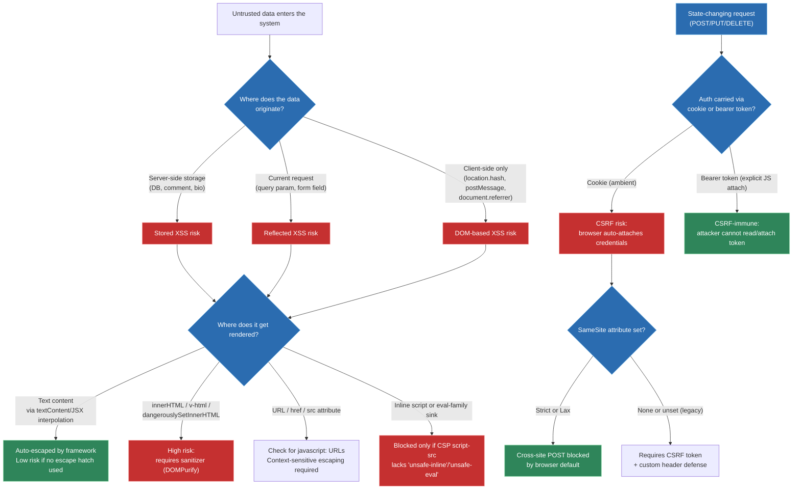

# Web security: XSS, CSRF, CSP headers

## 🎯 Executive Summary

Web security is one of the few interview topics where a Staff/Lead engineer is expected to reason about **systems, not snippets**. Any mid-level engineer can tell you "escape user input to prevent XSS." A Lead is expected to explain *why* the browser's trust model creates these vulnerabilities in the first place, how the same-origin policy and its deliberate exceptions (forms, `<script src>`, cookies) create the attack surface for CSRF, and how to architect defense-in-depth across the stack — CSP headers, framework-level auto-escaping, cookie attributes, and CSRF tokens — so that no single bypassed control results in a breach.

This topic is a "must-know" because it's a proxy for a broader Lead signal: **do you think about failure modes of the systems you didn't personally write?** Frontend leads increasingly own the client's security posture even though the actual exploits (stored XSS in a comment field, a CSRF'd money transfer) are executed against backend endpoints. Interviewers use this topic to test whether you can reason about trust boundaries — between origins, between the DOM and the JS engine, between first-party and third-party code — rather than just reciting "sanitize your inputs."

## 🧠 Core Technical Deep Dive

### The trust model: why XSS exists at all

The browser's core execution model treats **HTML, CSS, and JS parsed from a trusted origin's response as fully privileged**. There is no runtime distinction between "a `<script>` tag the developer wrote" and "a `<script>` tag that ended up in the response because user input was concatenated into HTML." Once bytes are in the document and are parsed as markup or executable script, they run with the full privileges of that origin: access to `document.cookie` (unless `HttpOnly`), the DOM, `localStorage`, `fetch` with ambient credentials, and the ability to make same-origin requests carrying session cookies.

This is the fundamental reason XSS is catastrophic rather than merely annoying — injected script isn't "sandboxed lite JS," it's indistinguishable from first-party code to the JS engine.

**Three canonical XSS vectors, and where each is architecturally rooted:**

1. **Stored XSS** — malicious payload persisted server-side (comment, bio, product review) and reflected into HTML on every subsequent render. Highest severity because it's a stored, wormable attack — it fires on every viewer, no click required.
2. **Reflected XSS** — payload comes from the request itself (query params, form fields) and is echoed back unescaped in the response. Requires social engineering to get the victim to click a crafted URL — lower severity, but still credential/session theft.
3. **DOM-based XSS** — the vulnerable data flow never touches the server at all. A client-side "source" (`location.hash`, `location.search`, `document.referrer`, `postMessage` data) flows into a client-side "sink" (`innerHTML`, `document.write`, `eval`, `setTimeout(string)`, `location.href =`) entirely within the browser. This is the vector modern SPA frameworks are most exposed to, because routing logic increasingly reads from `location` and renders it.

**Why React/Vue/Angular's auto-escaping isn't a complete answer:**

Frameworks auto-escape *text interpolation* (`{value}` in JSX, `{{ value }}` in Vue) by routing it through `textContent`/`createTextNode`, which never triggers HTML parsing. But every framework has an explicit escape hatch that bypasses this — `dangerouslySetInnerHTML` in React, `v-html` in Vue, `[innerHTML]` in Angular (Angular additionally runs a `DomSanitizer` by default, which is why Angular is comparatively harder to XSS out of the box). A Staff engineer's job is knowing that **the framework's default posture is not the same as the codebase's actual posture** — a single `dangerouslySetInnerHTML` fed by unsanitized markdown-to-HTML rendering (a very common real pattern: user bios, rich-text comments) reintroduces the full vulnerability class the framework was otherwise protecting against.

There's a second, subtler DOM-XSS surface: **attribute and URL sinks**. `<a href={userInput}>` looks safe because it's JSX interpolation, but if `userInput` is `javascript:alert(document.cookie)`, the framework will happily render `href="javascript:alert(...)"`, and a click executes it. React added protections against this in later versions (warns on `javascript:` URLs), but homegrown attribute binding or older framework versions do not. The mental model: **escaping is context-sensitive**. HTML-entity-escaping text content does nothing to neutralize a `javascript:` URL in an `href`, or a `style="background:url(javascript:...)"` in older IE-class parsers, or a payload breaking out of a `<script>` block via `</script>` inside a JSON blob embedded server-side.

### CSRF: the same-origin policy's deliberate blind spot

CSRF is not a bug in the same-origin policy (SOP) — it's a consequence of a deliberate exception the browser makes. SOP prevents `evil.com`'s JavaScript from **reading** responses from `bank.com`. It does *not* prevent `evil.com` from **causing a request to be sent** to `bank.com` — a `<form>` POST, an `` GET, a fetch with `mode: 'no-cors'` — and critically, the browser will attach `bank.com`'s cookies to that request automatically, because cookie attachment is origin-scoped to the *target*, not the *initiator*. The attacker can't read the response (SOP blocks that), but for state-changing operations, they don't need to — firing the request with ambient credentials is the attack.

This is why CSRF specifically targets **cookie-based session authentication**. It does not affect schemes where the credential must be *explicitly attached by JavaScript* (e.g., `Authorization: Bearer <token>` read from memory/`localStorage` and set via a `fetch` header) — because `evil.com`'s form/image tag has no mechanism to read `bank.com`'s `localStorage` or construct an arbitrary header on a simple form submission. This is the architectural trade-off Leads are expected to articulate: **bearer-token auth stored out of cookies sidesteps CSRF entirely, but reopens XSS-based token theft as a bigger prize** (steal the token once, no need for a live CSRF vector), whereas `HttpOnly` cookies are immune to XSS-based *theft* but are exactly the credential CSRF exploits.

**The three real defenses, and why each works:**

- **SameSite cookie attribute** (`Lax` default in modern Chrome/Firefox/Safari) — the browser itself refuses to attach the cookie on cross-site navigations/requests above a certain method/context threshold. `Strict` blocks it on all cross-site requests including top-level navigation from a link; `Lax` allows top-level GET navigations (so following a link from an email still logs you in) but blocks cross-site POST. This is a browser-enforced default now, which is why CSRF has become *less* prevalent than it was pre-2020 — but it's not a complete fix: it doesn't protect against subdomain-to-subdomain attacks under the same registrable domain, and legacy browsers/API clients may not honor it.
- **CSRF tokens (synchronizer token pattern)** — server generates a per-session (or per-request) random token, embeds it in the HTML form/response, client must echo it back in the request body or a custom header. This works because SOP *does* block `evil.com` from reading `bank.com`'s response to extract the token — the attacker can force a request but can't read what value to put in it.
- **Custom header requirement** — requiring `X-Requested-With` or similar on state-changing `fetch`/XHR calls. This works because simple `<form>` submissions cannot set arbitrary headers, only `fetch`/XHR can, and those are subject to CORS preflight — so an attacker's cross-origin fetch attempting to set that header triggers a preflight `OPTIONS` that the server can reject.

None of these should be deployed alone. `SameSite=Lax` plus CSRF tokens is the standard defense-in-depth combination a Lead should propose, because `SameSite` is a browser behavior you don't fully control the rollout of (older clients), while tokens are a server-verifiable guarantee.

### CSP: shifting from "prevent the injection" to "neuter the injection"

Every defense above is about *preventing* untrusted content from entering the DOM/response. Content-Security-Policy is fundamentally different: it assumes injection **will** happen sometimes (defense-in-depth, not defense-instead-of) and constrains *what injected code is allowed to do* at the browser-enforcement level, via an HTTP response header (or `<meta>` tag, with reduced coverage — `frame-ancestors` and report-only directives don't work in `<meta>`).

Core directive families a Lead should be fluent in:

- `script-src` — the highest-value directive. `script-src 'self'` blocks inline `<script>` blocks, `javascript:` URLs, and `eval`-family calls (`eval`, `new Function`, `setTimeout(string)`) by default, and only allows script tags whose `src` matches an allow-listed origin.
- `'unsafe-inline'` — effectively disables the inline-script protection; **a Lead should treat any CSP containing this as providing near-zero XSS mitigation**, since the vast majority of real-world XSS payloads are inline `<script>` or `on*` attribute injections.
- **Nonces and hashes** — the modern replacement for `'unsafe-inline'`. Server generates a cryptographically random nonce per response (`script-src 'nonce-r4nd0m123'`), and only `<script nonce="r4nd0m123">` tags matching it execute. Because the nonce is regenerated per-response and never predictable, an attacker who injects a `<script>` tag cannot guess the nonce to attach, so their injected script simply fails to execute — silently neutralized rather than blocked-and-erroring. Hash-based (`'sha256-...'`) works for known static inline scripts but doesn't scale to dynamically rendered inline scripts (SSR'd initial-state blobs), which is why nonces are preferred for SSR apps.
- `object-src 'none'` — blocks Flash/plugin-based XSS vectors, still recommended as a blanket default.
- `base-uri 'self'` — prevents an attacker-injected `<base href="evil.com">` from silently rewriting all relative URLs on the page (script srcs, form actions) to point at an attacker origin — a commonly forgotten directive.
- `frame-ancestors` — the modern replacement for the `X-Frame-Options` header, controls who can iframe you (clickjacking defense, related but distinct threat model from XSS/CSRF).
- **Report-only mode** (`Content-Security-Policy-Report-Only` + `report-uri`/`report-to`) — the operationally critical rollout mechanism. A Lead does not ship a strict CSP cold to production; they ship report-only first, harvest violation reports for real (not synthetic) traffic for days/weeks, fix the false positives (a third-party analytics snippet that needs allow-listing, an inline event handler the codebase didn't know still existed), and only then flip to enforcing mode. This operational sequencing — not the directive syntax — is the actual Staff-level signal.

**Trust-boundary reasoning interviewers are probing for:** CSP is often the *last* line of defense, not the first — it doesn't replace output encoding or framework auto-escaping, because a sufficiently permissive `script-src` (broad third-party CDN allow-lists, `'unsafe-eval'` for a legacy dependency) can still leave real gaps. A nuanced answer acknowledges CSP's own bypass classes: JSONP endpoints on an allow-listed origin can be abused to execute arbitrary script (an allow-listed CDN hosting a JSONP callback endpoint effectively grants script execution), and Angular's older versions had documented CSP bypasses via its template sandbox. CSP is a mitigation that reduces blast radius and buys detection time (via violation reporting), not a silver bullet.

## 📊 Visual Architecture & Logic

**Diagram 1 — Attack surface decision tree: classifying an injection/request vulnerability**



**Diagram 2 — Defense-in-depth sequence: a stored XSS payload meeting layered controls**

```mermaid
sequenceDiagram
    participant U as "Attacker"
    participant S as "Server<br>(input validation)"
    participant DB as "Database"
    participant V as "Victim's Browser"
    participant B as "Browser CSP Engine"

    U->>S: "POST /comments<br>body: '&lt;script&gt;steal()&lt;/script&gt;'"
    S->>S: "Validate/sanitize input<br>(defense layer 1)"
    alt "Sanitization fails or is bypassed"
        S->>DB: "Store raw payload"
        Note over S,DB: "Stored XSS now persisted"
        V->>S: "GET /post/123"
        S->>DB: "Fetch comments"
        DB-->>S: "Return stored payload"
        S-->>V: "HTML response<br>with unescaped payload<br>+ CSP header: script-src 'self' 'nonce-abc123'"
        V->>B: "Parse HTML, encounter<br>injected &lt;script&gt; tag"
        B->>B: "Check nonce on injected tag<br>(defense layer 2)"
        alt "Injected script has no valid nonce"
            B--xV: "Script execution blocked<br>CSP violation reported"
            B->>S: "POST /csp-report<br>violation details"
        else "CSP misconfigured with 'unsafe-inline'"
            B->>V: "Script executes:<br>document.cookie read"
            Note over V: "Defense layer 3: HttpOnly cookie<br>prevents document.cookie access"
        end
    else "Sanitization succeeds<br>(defense layer 1 holds)"
        S->>DB: "Store escaped/neutralized payload"
        Note over S,DB: "Attack neutralized at origin"
    end
```

## 🏢 Interview Context & FAANG Signals

This topic surfaces in three distinct interview formats, and Leads should recognize which one they're in:

1. **System design rounds** — "design a comments feature" or "design a payments confirmation flow" implicitly expects XSS/CSRF handling to be mentioned unprompted, not just when asked "what about security?" Interviewers note whether security is baked into the initial design (output encoding at the render boundary, CSRF tokens on the mutation endpoint, `SameSite` cookies) versus bolted on when probed.
2. **Coding rounds** — implement a "sanitize this user bio" function, or debug a snippet using `dangerouslySetInnerHTML`/`v-html` with raw user input. The signal here is **recognizing the vulnerable sink pattern immediately**, not deriving it from first principles — this should be pattern-matched instantly, freeing reasoning time for the harder trade-off discussion (allow-list sanitizer like DOMPurify vs. deny-list regex, which is a very common Lead-level trap question since deny-list regex sanitizers are almost always bypassable).
3. **Behavioral/"tell me about a time" rounds** — "tell me about a security issue you found or shipped." Leads are expected to describe the *process* (how it was discovered — code review, pen test, bug bounty, CSP violation reports — and how the fix was rolled out without breaking prod) more than the technical mechanism, because this demonstrates the organizational maturity a Lead is hired to bring.

**Specific Lead signals interviewers listen for:**

- Distinguishing the three XSS types unprompted and mapping each to a different mitigation (this signals real production experience vs. memorized definitions).
- Correctly identifying that `SameSite=Lax` is now a *browser default*, not something every team explicitly configured — showing current knowledge, not knowledge frozen circa 2018.
- Bringing up CSP rollout strategy (report-only → enforce) unprompted — this is the single most reliable "this person has actually shipped a CSP in production" signal, because report-only mode is rarely mentioned by candidates who've only read about CSP.
- Talking about sanitizer library trade-offs (DOMPurify vs. hand-rolled) rather than claiming to "just escape special characters," which reveals unfamiliarity with context-sensitive escaping (HTML body vs. attribute vs. URL vs. JS string each need different escaping rules).
- Connecting security posture to **team practices**: linting rules banning `dangerouslySetInnerHTML` without an explicit sanitizer wrapper, PR templates requiring a security checklist for auth/payment flows, dependency scanning for known-vulnerable sanitizer versions.

## ⚔️ Lead Level vs Senior Level

**Scenario: "We found a stored XSS vulnerability in the production comments feature. What do you do?"**

A **Senior** response is correct but scoped to the immediate fix: identify the vulnerable render path, wrap the output in the framework's escaping (or swap `dangerouslySetInnerHTML` for a sanitizer call), write a regression test asserting the payload is neutralized, ship the patch.

A **Lead/Staff** response treats this as a systemic signal, not an isolated bug:

- **Blast radius assessment first**: is this stored payload live in production right now, actively serving to users? This may require an incident response path (emergency deploy, feature-flag kill switch on the comments feature, or a database-level purge of matching payloads) *before* the code fix even ships — sequencing matters under active exploitation.
- **Root-cause the pattern, not the instance**: grep the codebase for every other use of the same vulnerable sink (`dangerouslySetInnerHTML`, `v-html`, `innerHTML =`) — a single reported instance is almost always a symptom of a broader missing guardrail, not an isolated typo.
- **Add a systemic guardrail**: an ESLint rule (`react/no-danger` with an allow-list exception requiring an explicit sanitizer call adjacent to it), a custom lint rule, or a Danger/PR-bot check — so the *class* of bug can't reappear, rather than relying on code review vigilance.
- **Add CSP as a second layer**: even with the sanitizer fix, propose (or accelerate) a CSP rollout so that *future* undiscovered instances of this bug class are mitigated by policy rather than only by code correctness.
- **Cross-team/process follow-up**: was this caught by a pen test, bug bounty, or user report? Feed that back into the security review checklist for new features touching user-generated content, and consider whether a security champion/review gate is needed for this surface area.

The trade-off framing a Lead brings that a Senior typically doesn't: **fixing the code is necessary but not sufficient** — the Lead is evaluated on whether they design the system (lint rules, CSP, review process) so the same mistake becomes structurally harder to make again, at the cost of near-term velocity (a new lint rule blocking existing PRs, a CSP rollout requiring cross-team coordination to allow-list third-party scripts).

## ⚠️ Common Pitfalls & Anti-Patterns

> ### ✕ Deny-list ("blacklist") input sanitization
> **Why it's wrong:** Regex-based filtering of "known bad" patterns (stripping `<script>` tags, blocking the literal string `javascript:`) is trivially bypassed via case variation (`JaVaScRiPt:`), encoding (`&#106;avascript:`), whitespace/null-byte insertion, or entirely different sinks the filter didn't anticipate (`` when the filter only checked for `<script>`). Deny-lists enumerate known attacks; attackers only need one the list missed.
> **✓ Correct Lead Approach:** Use allow-list, context-aware sanitization via a maintained library (DOMPurify for HTML, framework-native escaping for text/attributes). Treat the "escape/sanitize" step as context-sensitive — HTML body, HTML attribute, URL, and JS-string contexts each require different encoding functions, and using the wrong one (e.g., HTML-entity-encoding a value destined for a `javascript:` URL context) provides no protection.

> ### ✕ Treating CSP as a drop-in fix shipped directly to enforcing mode
> **Why it's wrong:** Real production pages almost always have inline scripts, third-party tags (analytics, ads, chat widgets), and `eval`-adjacent code from legacy dependencies that a strict CSP will break. Shipping `Content-Security-Policy` (enforcing) without a discovery phase reliably breaks production functionality — the team's first strict CSP deploy is very commonly a broken checkout flow or blocked analytics pipeline discovered by users, not by the team.
> **✓ Correct Lead Approach:** Ship `Content-Security-Policy-Report-Only` first, collect violation reports (`report-to`/`report-uri`) against real traffic for a meaningful window, triage and allow-list legitimate violations (nonce the legitimate inline scripts, allow-list required third-party origins), then flip to enforcing mode. Treat CSP rollout as a migration project with a monitoring phase, not a header you add and forget.

> ### ✕ Relying solely on `SameSite=Lax/Strict` and skipping CSRF tokens
> **Why it's wrong:** `SameSite` is a client-enforced browser behavior. It provides no protection against older browsers, misconfigured API clients, or same-registrable-domain attacks (a compromised or attacker-controlled subdomain under the same eTLD+1 is still "same-site" under the `SameSite` definition, even though it should be untrusted). It's a strong default, not a guarantee.
> **✓ Correct Lead Approach:** Layer `SameSite=Lax` (or `Strict` for highly sensitive flows) with server-verified CSRF tokens (synchronizer token pattern) on all state-changing endpoints. Treat browser-enforced protections as raising the attacker's cost, not as the sole control for anything touching money, account state, or PII.

> ### ✕ Storing auth tokens in `localStorage` "because cookies have CSRF issues"
> **Why it's wrong:** This trades a mitigable, well-understood risk (CSRF, solved by `SameSite` + tokens) for a more severe one: any XSS on the page — even a minor one in an unrelated third-party widget — gets full, silent, persistent read access to the auth token via `localStorage.getItem`, with no `HttpOnly`-equivalent protection available for `localStorage`. This single decision often converts a contained XSS bug into full account takeover.
> **✓ Correct Lead Approach:** Prefer `HttpOnly`, `Secure`, `SameSite` cookies for session credentials, and treat XSS prevention (framework escaping, sanitization, CSP) as the primary defense specifically because it protects the *cookie* from theft too. Only use in-memory (not `localStorage`) storage for short-lived tokens when cookie-based auth is architecturally incompatible with the flow (e.g., cross-origin API consumed by multiple first-party frontends), and pair it with aggressive XSS mitigation.

> ### ✕ Assuming a UI framework's default escaping covers the whole app
> **Why it's wrong:** Auto-escaping only covers the interpolation paths the framework controls (`{value}`, `{{ value }}`). It does not cover `dangerouslySetInnerHTML`/`v-html` escape hatches, attribute/URL-context injections (`javascript:` URLs), server-side-rendered initial-state blobs embedded via `<script>window.__STATE__ = {...}</script>` (vulnerable to `</script>` breakout if the JSON isn't escaped for the `<` character), or third-party widgets injecting their own unescaped markup into the page.
> **✓ Correct Lead Approach:** Audit every escape hatch explicitly (grep for `dangerouslySetInnerHTML`, `v-html`, `innerHTML`, `document.write`) as part of security review, require a sanitizer call at each one, and specifically verify SSR state-serialization uses a JSON serializer that escapes `<`, `>`, and `&` (or use a script type like `application/json` in a non-executing tag instead of inline `<script>` interpolation).

## 🛠️ Practice Scenarios (5-10 Scenarios)

<details>
<summary><strong>Scenario 1: The markdown comment renderer</strong></summary>

**Problem statement:** Your team ships a comments feature where user input is written in markdown and rendered to HTML client-side using a markdown-to-HTML library, then inserted via `dangerouslySetInnerHTML`. A security researcher reports that a comment containing `)` executes script when clicked. How do you fix this, and how do you prevent the next markdown-rendering feature from having the same bug?

**Staff-Level Solution:**
The immediate fix is inserting a sanitization pass (DOMPurify) between the markdown-to-HTML conversion and the `dangerouslySetInnerHTML` call — markdown-to-HTML libraries are not security boundaries, they only convert syntax, and most will happily emit `` or similar if the markdown syntax permits arbitrary URLs in link/image syntax. Configure DOMPurify with an explicit allow-list of tags/attributes appropriate for comments (no `<script>`, no `on*` handlers, restrict `href`/`src` schemes to `http(s)`/`mailto`).

```typescript
import DOMPurify from 'dompurify';
import { markdownToHtml } from './markdown';

function renderComment(rawMarkdown: string): string {
  const html = markdownToHtml(rawMarkdown);
  return DOMPurify.sanitize(html, {
    ALLOWED_TAGS: ['p', 'a', 'strong', 'em', 'code', 'pre', 'ul', 'ol', 'li'],
    ALLOWED_ATTR: ['href'],
    ALLOWED_URI_REGEXP: /^(?:(?:https?|mailto):|[^a-z]|[a-z+.-]+(?:[^a-z+.:-]|$))/i,
  });
}
```

Systemically: introduce a shared `renderUserMarkdown()` utility that wraps this pattern, lint-ban raw `dangerouslySetInnerHTML` usage outside that utility via a custom ESLint rule, and add a unit test suite with a corpus of known XSS payloads (OWASP's XSS filter evasion cheat sheet) run against the utility in CI so a future dependency upgrade that regresses sanitization is caught automatically.
</details>

<details>
<summary><strong>Scenario 2: CSRF on a password-change endpoint that "isn't cookie-based"</strong></summary>

**Problem statement:** A teammate argues the `/api/change-password` endpoint doesn't need CSRF protection because "we use JWT auth, not cookies." During a security review you discover the JWT is actually stored in a cookie (for httpOnly protection against XSS theft) and attached automatically by the browser. Explain the risk and the fix.

**Staff-Level Solution:**
The teammate conflated "token-based auth" with "immune to CSRF" — the CSRF-immunity property comes specifically from the credential being *explicitly attached by JavaScript reading from memory/storage*, not from the token format. Since this JWT lives in a cookie, the browser attaches it automatically on any request to the origin regardless of what site initiated the request, which is exactly the CSRF precondition. An attacker page with an auto-submitting form pointed at `/api/change-password` would execute the change using the victim's ambient session.

The fix requires the standard layered defense specifically because this is a high-value target (account takeover via password change):
```typescript
// Server: verify SameSite is set correctly on the auth cookie
res.cookie('auth_token', jwt, {
  httpOnly: true,
  secure: true,
  sameSite: 'strict', // stricter than default Lax, appropriate for high-value cookie
});

// Server: require and verify a per-session CSRF token on state-changing routes
app.post('/api/change-password', requireCsrfToken, async (req, res) => {
  // ...
});
```
I'd also flag this as a broader audit trigger: any other state-changing endpoint that assumed "we use JWTs so we're CSRF-safe" needs the same review, since this misconception likely wasn't isolated to one route.
</details>

<details>
<summary><strong>Scenario 3: Rolling out CSP without breaking the checkout flow</strong></summary>

**Problem statement:** Leadership wants a strict CSP shipped this quarter after a competitor's XSS breach made news. The checkout page embeds three third-party scripts (payment processor SDK, fraud-detection SDK, a chat widget) that all use inline `<script>` blocks for configuration. How do you plan the rollout?

**Staff-Level Solution:**
This is explicitly a migration project, not a header change. Sequence:

1. **Inventory phase**: audit every script source, inline script block, and `eval`-adjacent call across the app (not just checkout) — third-party SDKs frequently inject additional inline scripts dynamically post-load, which won't show up in a static source read.
2. **Report-only rollout**: ship `Content-Security-Policy-Report-Only` with a reasonably strict starting policy (`script-src 'self' <known-cdn-origins>; object-src 'none'; base-uri 'self'`) and a `report-to` endpoint, on all pages including checkout, for 2-3 weeks minimum to capture real traffic patterns including less-common browser/extension combinations.
3. **Triage violations**: for the inline config scripts, migrate to nonces (`script-src 'nonce-{per-response-random}'`) if the team controls the HTML template that embeds them; if a third party's script requires genuinely dynamic inline execution the team can't nonce (rare but happens with some ad/analytics tags), that's an explicit, documented, reviewed exception — not a blanket `'unsafe-inline'`.
4. **Staged enforcement**: flip to enforcing mode on lower-risk pages first, monitor error rates/support tickets, then extend to checkout last (highest business risk if something breaks) once violation reports are near-zero.
5. **Ongoing**: keep `report-to` active even in enforcing mode — it's free early-warning telemetry for the next XSS attempt or the next engineer accidentally adding an inline script.

I'd explicitly push back on a leadership timeline that skips the report-only measurement window — "ship strict CSP this quarter" is achievable, but "ship it in week one" risks a checkout outage during a high-visibility security initiative, which undermines the initiative's credibility.
</details>

<details>
<summary><strong>Scenario 4: DOM XSS via a client-side router reading `location.hash`</strong></summary>

**Problem statement:** Your SPA implements a "back to previous search" feature that reads a search query from `location.hash` (e.g., `#q=`) and renders it into a "Showing results for: {query}" banner using `innerHTML` for legacy reasons (it needs to support `<mark>` highlighting tags the search backend injects). Diagnose and fix.

**Staff-Level Solution:**
This is textbook DOM-based XSS: `location.hash` is an attacker-controllable source, `innerHTML` is a sink, and the value never touches the server, so server-side WAF/input validation provides zero protection — this is purely a client-side data flow problem.

The constraint (needing to render `<mark>` tags for highlighting) rules out plain text-escaping, so a full sanitizer is required rather than switching to `textContent`:

```typescript
import DOMPurify from 'dompurify';

function renderSearchBanner(rawQuery: string, container: HTMLElement) {
  const sanitized = DOMPurify.sanitize(rawQuery, {
    ALLOWED_TAGS: ['mark'],
    ALLOWED_ATTR: [],
  });
  container.innerHTML = sanitized;
}
```
I'd also note the URL-decoding step matters here — `location.hash` needs decoding before sanitization, and re-encoding assumptions between the search backend (that injects `<mark>`) and the client need to be verified so the sanitizer isn't stripping legitimate highlight tags or, worse, being bypassed by a double-encoding trick. As a systemic fix, I'd add this pattern (`location.*` → DOM sink) to the team's DOM-XSS-specific lint rule set (eslint-plugin-security or a custom rule), since `location.hash`/`postMessage`/`document.referrer` sources are easy to miss in review because they don't look like "user input" the way a form field does.
</details>

<details>
<summary><strong>Scenario 5: A third-party npm sanitizer dependency gets a CVE</strong></summary>

**Problem statement:** Your dependency scanner flags that the sanitizer library your comment-rendering pipeline relies on has a published CVE allowing a specific bypass payload to slip through unsanitized. Walk through your response.

**Staff-Level Solution:**
Treat this with incident-response rigor proportional to exploitability, not just as a routine dependency bump:

1. **Immediate triage**: read the CVE detail — is the bypass payload publicly known/weaponized, and does it apply to the sanitizer configuration actually in use (many CVEs are specific to non-default configs or specific allowed-tag combinations)?
2. **Check for exposure**: if the vulnerable version has been in production, this is potentially a *live* stored-XSS exposure — search existing stored content (comments, bios) for patterns matching the known bypass payload, since content stored while the vulnerable version was live may already contain live exploits waiting to fire.
3. **Patch and verify**: upgrade to the patched version, and add the specific CVE's payload to the team's XSS regression test corpus so a future regression is caught in CI, not by another CVE disclosure.
4. **Defense-in-depth check**: this is exactly the scenario where CSP earns its keep as a second layer — if `script-src` was already properly configured (no `'unsafe-inline'`, nonce-based), a sanitizer bypass that injects an inline `<script>` would still be blocked at the browser level, containing the blast radius even while the sanitizer was vulnerable. I'd use this incident to justify accelerating CSP rollout if it wasn't already enforcing.
5. **Process follow-up**: verify the dependency scanner is actually gating merges/deploys on high-severity CVEs in security-relevant packages (sanitizers, auth libraries) rather than only reporting asynchronously — this incident is a good forcing function to tighten that gate if it's currently advisory-only.
</details>

<details>
<summary><strong>Scenario 6: Explaining to a PM why "just escape the angle brackets" isn't sufficient</strong></summary>

**Problem statement:** A PM, non-technical but engaged, asks why the team needs weeks of work on CSP and sanitizer libraries when "can't we just replace `<` and `>` with something safe in whatever the user types?" Explain the real answer in a way that justifies the engineering investment without being condescending.

**Staff-Level Solution:**
"That escaping approach handles one category of the problem — text that becomes HTML tags — but attackers have several other doors into the same house. If a user's input ends up inside a link (like a 'visit my website' field), someone can put `javascript:stealYourData()` there instead of a real URL, and no angle bracket is involved at all — clicking the link just runs code. If input ends up inside certain data blocks our page loads on startup, there are ways to break out of that context that don't use `<` or `>` either.

Escaping angle brackets is one lock on one door — necessary, but we have several other doors (links, embedded data, third-party widgets we don't control the code of). The sanitizer library handles all of those doors correctly and is maintained by security specialists who track new bypass techniques as they're discovered — writing and maintaining that ourselves would mean re-discovering years of known attack techniques the hard way, in production, instead of relying on a library already hardened against them.

CSP is different — think of it as a circuit breaker: even if something gets past all our locks, CSP is a browser-level rule that says 'this page is only allowed to run code from these specific trusted sources,' so even a successful break-in mostly can't do anything, because the malicious code itself is refused permission to run. It's why we're investing in both: better locks, and a breaker that limits damage if a lock fails anyway."
</details>

<details>
<summary><strong>Scenario 7: A `postMessage` handler with a missing origin check</strong></summary>

**Problem statement:** Your app embeds a third-party payment iframe and listens for `postMessage` events to know when payment completes:
```javascript
window.addEventListener('message', (event) => {
  if (event.data.type === 'PAYMENT_COMPLETE') {
    completeCheckout(event.data.orderId);
  }
});
```
A pen test flags this as a vulnerability. Explain why, and fix it.

**Staff-Level Solution:**
`postMessage` listeners without an `event.origin` check accept messages from *any* window that can obtain a reference to this window — including a malicious iframe, popup, or a compromised ad embedded elsewhere on the page. An attacker can `postMessage({type: 'PAYMENT_COMPLETE', orderId: <victim's order id>}, targetOrigin)` from any page that gets the victim to open it, tricking `completeCheckout` into firing without an actual payment — a business-logic bypass, not a classic XSS, but rooted in the same "browser trusts what looks like a valid message" trust-boundary failure.

```typescript
const TRUSTED_PAYMENT_ORIGIN = 'https://payments.trusted-vendor.com';

window.addEventListener('message', (event: MessageEvent) => {
  if (event.origin !== TRUSTED_PAYMENT_ORIGIN) {
    return; // reject messages from any other origin, silently
  }
  if (event.data?.type === 'PAYMENT_COMPLETE') {
    completeCheckout(event.data.orderId);
  }
});
```
I'd also flag validating `event.source` in higher-security contexts (confirming the message came from the specific iframe reference expected, not just the right origin, since multiple same-origin frames could exist), and note that the *sending* side matters too — always call `postMessage(data, explicitTargetOrigin)` rather than `'*'`, so a same-page XSS elsewhere can't eavesdrop on outgoing messages either. I'd search the codebase for every other `postMessage` listener, since a missing origin check is a copy-paste-prone pattern once it exists once.
</details>

<details>
<summary><strong>Scenario 8: SSR initial-state injection breakout</strong></summary>

**Problem statement:** Your SSR framework embeds initial Redux state into the HTML for client-side hydration:
```javascript
res.send(`
  <script>window.__INITIAL_STATE__ = ${JSON.stringify(state)};</script>
`);
```
A user's profile `bio` field, included in `state`, contains `</script><script>alert(document.cookie)</script>`. Diagnose and fix.

**Staff-Level Solution:**
`JSON.stringify` correctly escapes JSON-syntax-significant characters but does *not* escape `<`, so a bio containing `</script>` prematurely closes the legitimate script tag, and the browser's HTML parser then treats the attacker's trailing `<script>` as a new, independent, executing script tag — the vulnerability lives in the HTML-parsing context the JSON is embedded in, not in the JSON serialization itself, so `JSON.stringify` alone can never fix it.

```typescript
function safeSerializeForScript(data: unknown): string {
  return JSON.stringify(data).replace(/</g, '\\u003c');
}

res.send(`
  <script>window.__INITIAL_STATE__ = ${safeSerializeForScript(state)};</script>
`);
```
A cleaner architectural fix avoids the inline `<script>` HTML-parsing context entirely by using a non-executing type:
```typescript
res.send(`
  <script type="application/json" id="initial-state">${JSON.stringify(state)}</script>
  <script>window.__INITIAL_STATE__ = JSON.parse(document.getElementById('initial-state').textContent);</script>
`);
```
The second script tag here has type `application/json`, so the browser's HTML parser never treats its content as script-executable, meaning embedded `</script>`-like strings inside it don't terminate the tag early — the breakout vector is structurally eliminated rather than pattern-matched away. Given this bug class is subtle and easy to reintroduce, I'd centralize this into a single `renderInitialStateScript()` helper used by every SSR entry point, and add a regression test asserting a `</script>`-containing payload round-trips safely.
</details>
