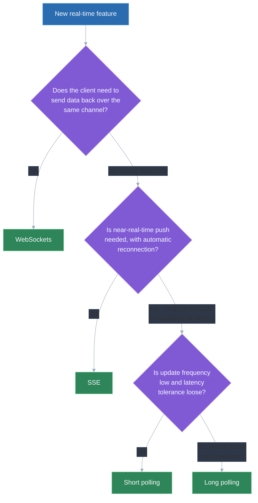
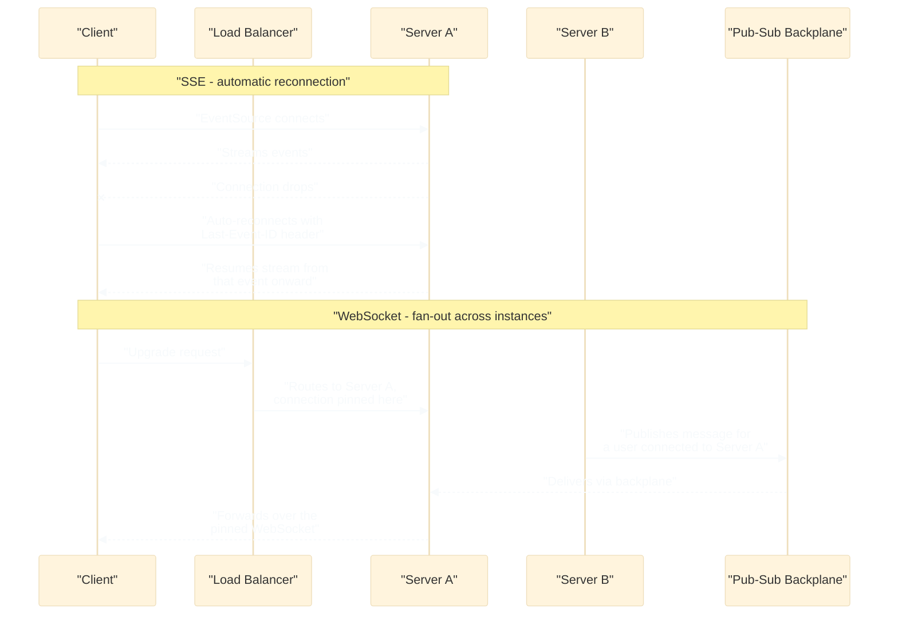

# WebSockets vs SSE vs long polling — when to use each

## 🎯 Executive Summary

Every "real-time" feature request — a chat window, a live notification bell, collaborative cursors, a live score ticker — gets reflexively answered with "use WebSockets" by candidates who haven't actually checked whether the feature needs bidirectional communication at all. The single biggest filter is directionality: does the client genuinely need to push data back over the same persistent channel, or does it only need to receive updates? That one question eliminates most of the debate before infrastructure cost, reconnection behavior, or browser limits even enter the conversation.

This is a must-know topic because it comes up in nearly every "design a real-time feature" system design round, and it's cheap to get visibly wrong — reaching for the heaviest, most powerful-sounding option (WebSockets) for a problem that's actually one-directional signals a candidate optimizing for sounding impressive rather than for operational cost. The deeper signal interviewers look for is a Lead reasoning from requirements (direction, frequency, latency tolerance, infra budget) to a transport, not from transport familiarity to a justification.

## 🧠 Core Technical Deep Dive

Four approaches show up in production and in interviews, ordered from the naive baseline to the most capable (and most expensive) option.

### Short Polling

**How it works:** the client sends a request on a fixed interval — every few seconds, say — regardless of whether anything has actually changed on the server. Each request gets an immediate response, empty or not, and the client just asks again next tick.

**Used for:** extremely simple, low-frequency update needs where implementation simplicity matters more than efficiency or latency — an admin panel checking for a rare status change, a feature flag check, anything where "eventually, within a minute or two" is an acceptable update latency.

**Drawbacks:**
- Wasted requests: most polls return "nothing changed," which is pure overhead on both client and server.
- Update latency is bounded by the poll interval — a change that happens right after a poll won't be seen until the next one fires, no matter how urgent it is.
- Doesn't scale well as a pattern — every connected client hits the server on a timer independent of whether any actual event occurred, so server load scales with client count times poll frequency, not with real event volume.

> **Key takeaway:** short polling is the simplest possible approach and the right default only when update latency genuinely doesn't matter and request volume stays low — it's rarely the right choice once either frequency or client count grows.

### Long Polling

**How it works:** the client makes a request exactly like short polling, but the server doesn't respond immediately — it holds the connection open until there's actually new data to send, or until a timeout is reached. The moment the client gets a response, it immediately re-requests, so from the outside it looks like a continuous stream of near-instant updates riding on plain HTTP.

**Used for:** getting near-real-time updates without investing in WebSocket or SSE infrastructure, or in environments where a plain HTTP request/response cycle is more likely to make it through a restrictive corporate proxy or older load balancer than a protocol upgrade.

**Drawbacks:**
- Each open-but-idle request holds a real server-side connection/thread (or event-loop slot) for as long as it's waiting, which is a genuine resource cost per connected client, not a free way to fake push.
- Still pays HTTP request overhead per update (headers, TCP/TLS setup if not reused, a fresh round trip) even though it feels push-like.
- Multiple browser tabs from the same user each hold their own long-poll connection, and ordering/deduplication across them adds real complexity that a single persistent connection wouldn't have.

> **Key takeaway:** long polling buys near-real-time behavior over vanilla HTTP with no special infrastructure, at the cost of holding open connections that carry a real per-client resource cost while they wait.

### Server-Sent Events (SSE)

**How it works:** the client opens a single long-lived HTTP connection, and the server streams text-based events down it as they happen — no re-request needed between events. The browser's built-in `EventSource` API manages the connection for you, including automatic reconnection with `Last-Event-ID`-based resumption if the connection drops, entirely for free.

**Used for:** server-to-client-only push where the client never needs to talk back over the same channel — live notifications, activity feeds, price/score tickers, progress updates on a long-running job.

**Drawbacks:**
- Strictly one-directional — if the client needs to send anything back, that's a separate, ordinary HTTP request, not part of the SSE connection.
- `EventSource` specifically can only issue GET requests and can't set custom headers, so bearer-token auth has to be smuggled into a cookie or a query-string param instead of an `Authorization` header.
- Browsers cap the number of concurrent HTTP connections per origin (historically 6 for HTTP/1.1), and each open `EventSource` counts against that budget — a page with several SSE connections to the same origin, or several tabs open, can hit that ceiling. HTTP/2 relaxes this significantly by multiplexing over one connection, but it's still a real constraint to know about.
- Payloads are text-only; sending binary data means base64-encoding it first, which adds size and CPU overhead.

> A narrower version of this exact transport question — SSE vs `fetch` + `ReadableStream` vs WebSocket specifically for streaming LLM tokens, where the deciding factor is `EventSource`'s inability to send a POST body with an auth header — is covered in `ai-integrated-ui-streaming.md`; that's a special case of the general trade-offs described here, not a different set of rules.

> **Key takeaway:** SSE is the simplest way to get real push with automatic reconnection, and it's the right choice the instant the requirement is "server pushes, client only listens" — it stops being the right choice the moment the client needs to send data back over the same connection.

### WebSockets

**How it works:** the connection starts as an HTTP request but "upgrades" to a persistent, full-duplex TCP-based connection — after the handshake, either side can send messages to the other at any time, with no request/response pairing required.

**Used for:** genuinely bidirectional, low-latency real-time needs — chat, collaborative cursors and presence, multiplayer or live-collaboration features, anything where both sides are actively sending, not just one side pushing to a passive listener.

**Drawbacks:**
- Real infrastructure cost: a WebSocket connection is stateful and pinned to a specific server instance, which doesn't load-balance as simply as stateless HTTP — scaling beyond one server instance needs either sticky sessions or a pub-sub backplane (Redis, for example) to fan messages out to whichever instance holds the recipient's connection.
- No automatic reconnection or resumption — unlike SSE's free `Last-Event-ID` support, a dropped WebSocket connection has to be detected, reconnected, and (if messages need to be replayed) resumed entirely by hand.
- Overkill for one-directional needs — if the client never actually sends anything back, WebSockets add connection-management complexity that SSE would have avoided while getting reconnection for free.

> **Key takeaway:** WebSockets are the only option here that's genuinely bidirectional, and that's exactly what makes them the right choice for chat/collaboration-shaped problems and the wrong, needlessly expensive choice for anything that's actually one-directional.

### Choosing a transport

Directionality is the filter to apply first, before infra cost, browser limits, or anything else — it eliminates half the field in one question.

| Question | If the answer is... | Points toward |
|---|---|---|
| Does the client need to send data back over the *same* channel, not just via a normal separate request? | No | Short polling, long polling, or SSE |
| ...same question | Yes | WebSockets |
| Is update frequency low and latency tolerance loose? | Yes | Short polling |
| Is near-real-time needed but WebSocket/SSE infra isn't available or worth building? | Yes | Long polling |
| Is it server-push-only, and does automatic reconnection matter? | Yes | SSE |
| Is it genuinely two-way and latency-sensitive? | Yes | WebSockets |

| Dimension | Short polling | Long polling | SSE | WebSockets |
|---|---|---|---|---|
| Direction | Client → server (repeated) | Client → server (repeated, delayed response) | Server → client only | Full duplex |
| Reconnection support | N/A (stateless, retries trivially) | Manual re-request loop, built by hand | Automatic, built into `EventSource`, with `Last-Event-ID` resumption | None built in — must be hand-built |
| Infra / scaling complexity | Low | Moderate (idle connections held open) | Low–moderate (browser per-origin connection limit) | High (sticky sessions or pub-sub backplane needed to scale across instances) |
| Browser API simplicity | Trivial (`setInterval` + `fetch`) | Simple, but the retry loop is hand-rolled | Very simple (`EventSource`) | Moderate (`WebSocket` API, no reconnection helpers) |
| Binary support | Yes (normal HTTP body) | Yes (normal HTTP body) | No (text only, binary needs base64) | Yes (native binary frames) |
| Typical use case | Rare, low-urgency status checks | Near-real-time updates without WS/SSE infra | Notifications, feeds, tickers | Chat, presence, collaborative editing, multiplayer |

> **Key takeaway:** start every one of these decisions from directionality, not from which transport sounds most capable — a one-directional feature built on WebSockets pays real, avoidable infrastructure cost for a capability (bidirectional push) it never uses.

## 📊 Visual Architecture & Logic

### Diagram 1 — Choosing a transport

### Diagram 2 — Connection lifecycle: SSE reconnection vs WebSocket scaling across instances

## 🏢 Interview Context & FAANG Signals

This comes up in **system design rounds** for essentially any "real-time" feature — chat, a live activity feed, in-app notifications, collaborative editing, live dashboards/tickers — where the interviewer wants to see the transport decision reasoned through, not assumed. It also surfaces in **scaling/infrastructure follow-ups** ("how do you scale that WebSocket connection across multiple servers?") and in **debugging rounds** (diagnosing why a real-time feature silently stops updating when a connection drops without a reconnection strategy).

**Lead signals interviewers listen for:**

- Starting from "does this need to be bidirectional" rather than reflexively reaching for WebSockets because it sounds like the most powerful option.
- Naming the WebSocket scaling problem unprompted — sticky sessions or a pub-sub backplane are required the moment there's more than one server instance.
- Knowing that SSE's reconnection/resumption is free (`Last-Event-ID`) while WebSocket's is not, and factoring that into the cost of each choice.
- Recognizing long polling and short polling as legitimate fallback options, not obsolete relics — some networks/proxies still make WebSocket upgrades unreliable.
- Connecting the transport choice to actual infra cost (open connections held server-side, per-origin browser connection limits) rather than treating all three as interchangeable "real-time" mechanisms.

## ⚔️ Lead Level vs Senior Level

A **Senior** response typically jumps straight to "I'd use WebSockets for real-time" without first checking whether the feature actually needs the client to send data back over the same channel.

A **Staff/Lead** response starts with directionality, picks SSE over WebSockets for a one-directional notification feed specifically because it gets automatic reconnection for free and avoids the sticky-session/pub-sub scaling problem WebSockets would introduce for no benefit, and can describe concretely how WebSocket connections get fanned out across multiple server instances via a pub-sub backplane once the app scales past one server. They also know when to fall back to long polling for compatibility with restrictive network environments, rather than treating WebSocket support as universal.

## ⚠️ Common Pitfalls & Anti-Patterns

> ### ✕ Reaching for WebSockets for a one-directional feature
> **Why it's wrong:** A live notification feed or activity ticker never needs the client to push data back over the same channel — using WebSockets anyway adds sticky-session or pub-sub-backplane scaling cost and forfeits SSE's free automatic reconnection, for a bidirectional capability the feature never exercises.
> **✓ Correct Lead Approach:** Check directionality first. If it's server-push-only, default to SSE and only escalate to WebSockets once there's a real requirement for the client to send data back over the same connection.

> ### ✕ Assuming WebSocket connections scale the same way stateless HTTP requests do
> **Why it's wrong:** A WebSocket connection is pinned to whichever server instance accepted the upgrade — a second server instance has no way to reach a client connected to the first one without extra infrastructure, so naively load-balancing WebSocket traffic like stateless requests silently breaks message delivery for some fraction of users.
> **✓ Correct Lead Approach:** Design for either sticky sessions (routing a given client consistently to the same instance) or a pub-sub backplane (Redis or equivalent) that lets any instance publish a message and have it delivered to the instance actually holding that user's connection.

> ### ✕ Treating `EventSource` as capable of POST requests or custom auth headers
> **Why it's wrong:** `EventSource` can only issue GET requests and can't set custom headers, so any design that assumes it can send a bearer token in an `Authorization` header or a POST body will fail outright, not degrade gracefully.
> **✓ Correct Lead Approach:** Plan auth for SSE via a cookie or a query-string token from the start, or use `fetch` + `ReadableStream` instead of `EventSource` if POST/custom-header control is actually required (accepting that reconnection then has to be hand-built).

> ### ✕ Building a WebSocket feature with no reconnection or resumption strategy
> **Why it's wrong:** Unlike SSE, WebSockets have no built-in reconnection or `Last-Event-ID`-style resumption — a connection drop (network blip, server restart, laptop sleep) silently stops the feature from updating until the user notices and manually refreshes.
> **✓ Correct Lead Approach:** Build explicit reconnect-with-backoff logic and a way to resume or re-sync state after a gap (a sequence id or timestamp the server can replay from), treating this as required work, not an edge case.

> ### ✕ Assuming WebSocket upgrades always succeed on every network
> **Why it's wrong:** Some corporate proxies, older load balancers, or restrictive network environments interfere with or block the HTTP upgrade handshake WebSockets depend on, silently breaking the feature for a subset of users with no obvious error message.
> **✓ Correct Lead Approach:** Design a fallback path — typically long polling — that the client can drop into when a WebSocket connection attempt fails or times out, so the feature degrades to "slower but working" instead of "broken."

## 🛠️ Practice Scenarios

### Scenario 1 — Choosing a Transport for a Live Notification Feed

Design the transport for an in-app notification bell that shows new notifications (mentions, likes, system alerts) as they happen, with no requirement for the client to send anything back over the same channel.

Staff-Level Solution

This is a textbook server-push-only case, which makes SSE the right default over WebSockets: the client only ever receives, never sends, over this channel, so SSE's automatic reconnection and `Last-Event-ID` resumption are pure upside with none of WebSocket's bidirectional capability going unused. Auth rides in a cookie rather than an `Authorization` header, since `EventSource` can't set custom headers.

Watch the per-origin connection limit if the notification bell is one of several concurrent SSE connections on the same page — consolidating to a single SSE connection that multiplexes multiple notification types (rather than one connection per notification category) avoids burning through that budget.

### Scenario 2 — Choosing a Transport for a Chat Feature

Design the transport for a real-time chat feature where users send and receive messages in the same conversation.

Staff-Level Solution

Chat is genuinely bidirectional — a user sending a message and receiving others' messages both need to happen over the same low-latency channel — so this is the clear WebSockets case, not SSE-plus-a-separate-POST, which would add latency and complexity for something WebSockets handle natively.

Plan explicitly for what SSE would have given for free: reconnection with backoff, and a way to resync missed messages after a drop (fetching recent message history by timestamp/sequence id on reconnect, since WebSockets don't replay anything automatically).

### Scenario 3 — Choosing a Transport for Collaborative Cursors and Presence

Design the transport for a collaborative document editor showing other users' live cursor positions and online/offline presence.

Staff-Level Solution

Live cursor positions are inherently bidirectional and latency-sensitive — every connected client is simultaneously broadcasting its own cursor position and receiving everyone else's — which is exactly the shape WebSockets are built for. SSE would require a separate outbound request per cursor movement, adding latency and request overhead that undermines the "live" feel.

Cursor updates are also high-frequency and don't need reliable delivery of every single position (a missed intermediate cursor position is invisible to the user, only the latest matters), so this is a good candidate for throttling/sampling outbound updates client-side rather than sending on every mousemove, independent of the transport choice.

### Scenario 4 — Scaling WebSocket Connections Across Multiple Server Instances

A chat feature built on WebSockets works fine with one server instance, but breaks intermittently — messages sometimes don't reach their recipient — after scaling out to multiple instances behind a load balancer.

Staff-Level Solution

This is the classic WebSocket scaling problem: each client's WebSocket connection is pinned to whichever instance accepted its upgrade handshake, so when the sender and recipient land on different instances, the sending instance has no direct way to reach the recipient's connection — messages silently fail to deliver rather than erroring loudly.

Fix by introducing a pub-sub backplane (Redis pub/sub or equivalent): every instance subscribes to relevant channels, and when a message needs to reach a user connected to a different instance, it's published to the backplane and delivered by whichever instance actually holds that user's connection. Sticky sessions (routing a user consistently to one instance) reduce cross-instance traffic but don't eliminate the need for a backplane, since users on different instances still need to reach each other.

### Scenario 5 — Handling SSE's Per-Origin Connection Limit

A dashboard page opens several SSE connections at once (one for notifications, one for a live metrics widget, one for a live activity feed) and users on some browsers report that one or more of the feeds silently stops updating.

Staff-Level Solution

This is very likely the browser's per-origin concurrent-connection limit (historically 6 under HTTP/1.1) — once every slot is consumed by open SSE connections (and any other pending requests to the same origin), further connections queue silently rather than failing loudly, which looks exactly like a feed that "stopped updating."

Fix by consolidating to a single SSE connection that multiplexes multiple event types (tag each event with a `type` field the client dispatches on) rather than one connection per feature. If the backend is served over HTTP/2, confirm it's actually being used end-to-end (including through any proxy/load balancer) since HTTP/2's connection multiplexing removes this ceiling entirely.

### Scenario 6 — Building Reconnection and Resumption for a WebSocket Feature

A WebSocket-based live dashboard silently stops updating whenever a user's laptop sleeps or their network blips, with no visible error and no automatic recovery.

Staff-Level Solution

Unlike SSE, WebSockets don't reconnect or resume automatically — this has to be built by hand: detect the `close`/`error` event, retry the connection with exponential backoff (to avoid hammering the server on a wider outage), and surface a visible "reconnecting" state to the user rather than silently failing.

For resumption, don't just reconnect and assume the stream picks up where it left off — track a sequence id or timestamp of the last received message, and on reconnect, either request a resync of anything missed (via a normal HTTP call) or explicitly warn the user that some updates may have been missed, depending on how critical completeness is for that feature.

### Scenario 7 — Falling Back Gracefully Behind a Restrictive Corporate Proxy

A live-collaboration feature built on WebSockets works for most users but fails entirely for users on a specific corporate network, with the WebSocket upgrade handshake never completing.

Staff-Level Solution

Restrictive corporate proxies and older load balancers are a known real-world cause of WebSocket upgrade failures — treat this as an expected condition to design around, not an edge case to dismiss. Detect the failed/timed-out upgrade attempt client-side and fall back to long polling, which rides on plain HTTP and is far more likely to pass through the same restrictive infrastructure.

Communicate the degraded mode honestly if it affects behavior noticeably (slightly higher latency under long polling) rather than pretending the fallback is transparently identical, and log which transport each session actually ended up using so the fallback rate is visible and monitorable rather than a silent, unmeasured degradation.

### Scenario 8 — Choosing Between SSE and Long Polling for Legacy-Browser Compatibility

A notification system needs to support a meaningful population of users on older browsers or environments where `EventSource` isn't reliably available, alongside modern browsers where it is.

Staff-Level Solution

Rather than picking one transport for every user, detect `EventSource` support and use SSE where it's available (the common case), falling back to long polling specifically for the environments that lack it — this gets the majority of users SSE's lower overhead and free reconnection while still serving the rest correctly.

Design the backend to expose the same underlying event stream to both transports (a shared "give me updates since X" interface) rather than building two independent, diverging implementations, so the two client paths differ only in how they consume updates, not in what data or ordering guarantees they receive.

