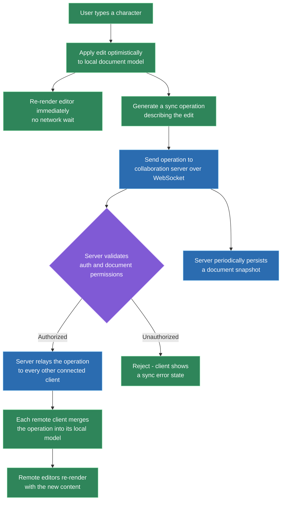
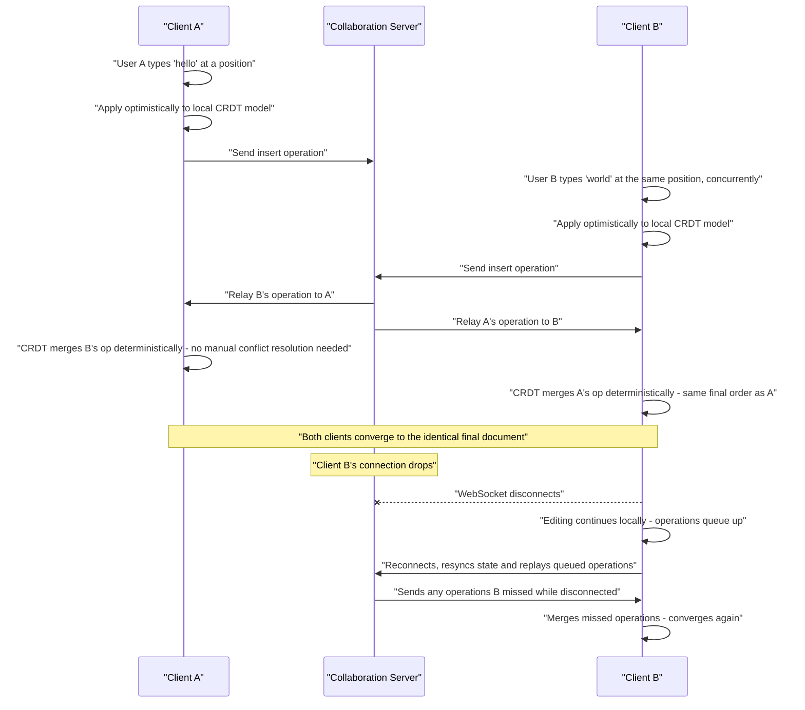

# Design a Collaborative Document Editor

**How to use this document:** this is a worked answer to a real interview prompt, structured as the steps you'd actually narrate in a 45-minute round — applying the general frontend system design framework to this specific question. Every major decision includes an explicit **why**, and the alternative that was considered and rejected, because that reasoning — not the final diagram — is what's actually being evaluated. A condensed rehearsal summary is at the end.

---

## Step 0 — Scope the Prompt (~2-3 min)

**What to say:** "Before I start designing, I want to bound the scope. Is this closer to a Google-Docs-style rich text editor, or something more constrained like a shared plain-text notes app? What's the target scale — tens of concurrent editors per document, or hundreds? Is offline editing in scope, or can I assume a mostly-connected client?"

**Why ask this first:** "collaborative document editor" spans wildly different systems depending on the answers — a plain-text pair-programming tool and a full rich-text Google Docs clone have almost nothing in common architecturally below the surface. Designing before scoping risks solving the wrong problem entirely, which is a worse outcome than solving a smaller problem well.

**Scope assumed for the rest of this walkthrough** (state this out loud, don't just silently assume it):
- Rich text editing (bold/italic/lists/headings) — not just plain text.
- Up to ~20 concurrent editors per document — small-group real-time collaboration, not thousands of simultaneous viewers.
- Real-time sync is the P0 requirement; offline editing is explicitly named as an extension, discussed in cross-cutting concerns but not the primary design target.
- Web only — no native mobile client to design for.

---

## Step 1 — Requirements (~3-5 min)

| Type | Requirement |
|---|---|
| **Functional** | Multiple users edit the same document simultaneously and see each other's changes in near real time |
| **Functional** | Users see each other's cursor position and text selection ("presence") |
| **Functional** | Standard rich text formatting, undo/redo per user |
| **Functional** | Document persists and can be reopened later with full history intact |
| **Non-functional** | Perceived edit latency for the local user must be near-zero — typing must never wait on the network |
| **Non-functional** | Remote edits should generally appear within a few hundred milliseconds under normal network conditions |
| **Non-functional** | All clients must converge to the identical final document, regardless of the order operations arrive in |
| **Non-functional** | Graceful degradation on a dropped connection — no data loss, no silent divergence |

> **Why these non-functional requirements specifically:** the "near-zero local latency" and "guaranteed convergence" requirements are what actually drive the entire sync-protocol decision in Step 3 — naming them explicitly here means the interviewer sees the deep dive is justified by a stated requirement, not just a favorite technology.

---

## Step 2 — High-Level Architecture (~10-15 min)

At the highest level: each client keeps its own local, editable copy of the document, edits apply to that local copy immediately, and a background sync mechanism reconciles changes across clients through a lightweight relay server. The server's job is to relay and persist, not to be the single source of truth clients must round-trip to before showing a change — that distinction is the reason typing never has to wait on the network.



**Why the server is a relay, not an authority the client waits on:** if every keystroke had to round-trip to the server and back before the local editor updated, typing would feel exactly as laggy as the network — unacceptable per the latency requirement above. Treating the local model as immediately-correct (optimistic) and reconciling in the background is what makes this feel instant regardless of network conditions.

> **Key takeaway:** the architecture's core shape — local-first apply, background sync, server as relay/persistence rather than gatekeeper — falls directly out of the "near-zero local latency" requirement from Step 1. This is worth stating explicitly in the interview: the architecture isn't a default, it's a consequence of a specific requirement.

---

## Step 3 — Data Model & Sync Protocol Deep Dive (~15-20 min)

This is the hard part of the problem, and where the interview signal actually concentrates. If every client applies edits locally and independently, and those edits can arrive at other clients in any order, the core question is: **how do all clients guarantee they converge on the exact same final document, without a central server dictating a strict operation order?**

### The central decision: CRDTs vs. Operational Transformation

| | **CRDTs** (Conflict-free Replicated Data Types) | **Operational Transformation (OT)** |
|---|---|---|
| **Convergence guarantee** | Mathematically guaranteed by the data structure itself — operations commute or are designed to merge deterministically | Guaranteed by a transform algorithm that rewrites operations against each other in the correct order |
| **Server requirement** | Server can be a "dumb" relay — no need to see or understand operation order | Requires a central server to sequence and transform operations correctly — genuinely peer-to-peer OT is very hard to get right |
| **Offline / reconnect behavior** | Naturally merge-friendly — a client can accumulate local operations indefinitely and merge them whenever it reconnects | Harder — the transform algorithm assumes a mostly-live operation stream; long offline periods complicate the transform math significantly |
| **Complexity** | Complexity lives in the data structure and its merge function, implemented once and reused | Complexity lives in the transform functions, which must correctly handle every pair of operation types — historically a major source of subtle bugs |
| **Real-world adopters** | Figma, Notion, Yjs-based editors | Google Docs (historically), Google Wave |

**Decision: CRDT**, given the requirements scoped in Step 1. A dumb-relay server is simpler to reason about and cheaper to run at this scale, and the "graceful degradation on dropped connections, no data loss" requirement maps directly onto CRDTs' natural tolerance for a client rejoining after an arbitrary gap and merging cleanly — which is a materially harder problem to solve well with OT.

> **When I'd choose OT instead:** if the requirements named a strict, centrally-defined operation order as a hard requirement (for example, an audit log that must reflect a single canonical sequence of edits across all users, not just an eventually-consistent merged result), OT's server-mediated sequencing would be the better fit. Naming this condition explicitly is what separates "I know CRDTs exist" from "I understand the actual trade-off."

### The concrete data structure: a sequence CRDT for text

For rich text specifically, each character (or run of characters) gets a unique, stable position identifier that doesn't change when other characters are inserted or deleted around it — commonly implemented as a fractional-index or a tree-based positioning scheme (this is the approach libraries like Yjs use under the hood). Two clients inserting at "the same visual position" concurrently naturally end up with different, well-ordered position identifiers, so there's no ambiguity to resolve — the CRDT's merge rule (a deterministic tie-breaker, e.g., by client ID, for genuinely simultaneous inserts at the same position) produces the same final ordering on every client without any negotiation.

```typescript
// Simplified shape of a CRDT insert operation - not an actual Yjs API
type InsertOp = {
  id: { clientId: string; counter: number }; // globally unique, stable
  afterPositionId: PositionId | null;        // "insert after this element"
  content: string;
};
```

### The full round-trip: local edit to remote convergence



> **Key takeaway:** the reconnect flow in the second half of this diagram isn't a special case bolted on — it's the same merge function used for every normal concurrent edit, just applied to a larger batch of queued operations. That reuse is a direct payoff of the CRDT decision from earlier: there's no separate "reconciliation algorithm" to design for the offline case.

---

## Step 4 — Presence & Awareness (~5 min)

Cursor positions, text selections, and "who's currently viewing this document" are architecturally distinct from the document content itself, and deliberately handled differently.

**Why presence is not part of the CRDT document state:** presence is ephemeral and last-write-wins by nature — if User A's cursor position update from two seconds ago arrives after a more recent one, the old one should simply be discarded, not merged. Running this through the same conflict-free merge machinery as document content would be unnecessary complexity for data that doesn't need durability or conflict resolution at all. A separate, lightweight broadcast channel (piggybacked on the same WebSocket connection, but logically distinct messages) is simpler and cheaper.

> **Key takeaway:** not everything flowing through the same connection needs the same consistency guarantees — recognizing which data needs CRDT-grade convergence and which just needs "latest wins, ephemeral" is itself a design decision worth stating explicitly.

---

## Step 5 — Cross-Cutting Concerns (~5 min)

| Concern | What to say |
|---|---|
| **Performance** | For very large documents, virtualize rendering of off-screen content, and debounce snapshot persistence rather than persisting on every keystroke |
| **Accessibility** | Remote edits appearing while a screen-reader user is mid-task need careful ARIA live-region tuning — announcing every remote keystroke would be unusable; batch and summarize instead ("2 changes from Alex") |
| **Security** | The WebSocket channel must be authenticated per-document, not just per-user, since document-level permissions can differ from account-level auth; user-generated rich text content must be sanitized against XSS before rendering |
| **Offline resilience** | This is where the CRDT decision pays off directly — queued local operations replay and merge cleanly on reconnect, covered in Step 3's diagram |
| **Testing** | Deterministic merge-convergence property tests (given any operation ordering, assert all replicas converge identically) are the testing layer unique to this kind of system — standard unit tests don't exercise concurrent-merge correctness |

---

## Step 6 — Trade-offs & Wrap-up (~3-5 min)

**Alternatives considered and explicitly rejected:**

- **A naive "last write wins, whole document" approach** — rejected immediately: two users editing different parts of the document simultaneously would silently destroy one user's changes entirely, which fails the "no data loss" requirement outright.
- **Broadcasting raw operations without a CRDT merge function** — rejected: without a principled merge rule, concurrent edits at the same position produce genuinely ambiguous results that differ depending on arrival order, breaking the convergence guarantee.
- **Operational Transformation** — not rejected outright, but deprioritized given this specific requirement set; explicitly named as the better choice under a different, stricter ordering requirement (see Step 3).

**What I'd revisit given more time or scale:**
- Very large documents (tens of thousands of words) likely need the CRDT structure itself sharded or paginated, since a single flat sequence CRDT's metadata overhead grows with document size.
- Persistence is described here as "the same collaboration server," but at real scale I'd split persistence into its own service so a spike in relay traffic doesn't compete with write throughput to storage.
- Rich embedded objects (comments anchored to text ranges, inline images) introduce their own merge semantics beyond plain text and would need a follow-up design pass.

---

## 60-Second Rehearsal Summary

- **Scope:** rich text, ~20 concurrent editors, real-time is P0, offline is an extension.
- **Architecture:** local-first optimistic apply → background sync via a relay server → server persists snapshots. Server is a relay, not a gatekeeper, because local latency must be near-zero.
- **Sync protocol:** CRDT over OT, because the requirements favor a dumb-relay server and graceful offline/reconnect behavior over strict central ordering. Sequence CRDT with stable per-character position IDs; deterministic merge means no negotiation needed.
- **Presence:** separate ephemeral, last-write-wins channel — deliberately not run through the CRDT merge path.
- **Cross-cutting:** batched a11y announcements for remote edits, per-document WebSocket auth, debounced persistence, convergence property tests as the testing layer unique to this system.
- **Rejected alternatives named explicitly:** naive last-write-wins (data loss), raw op broadcast with no merge function (ambiguous convergence), OT (right call only under a stricter ordering requirement than this one).
