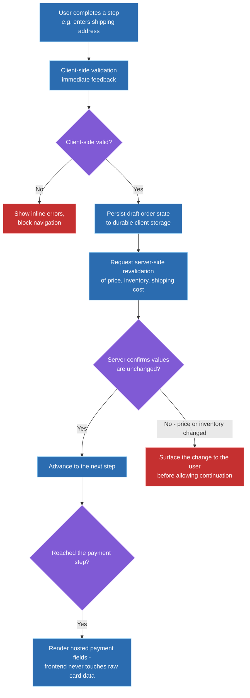
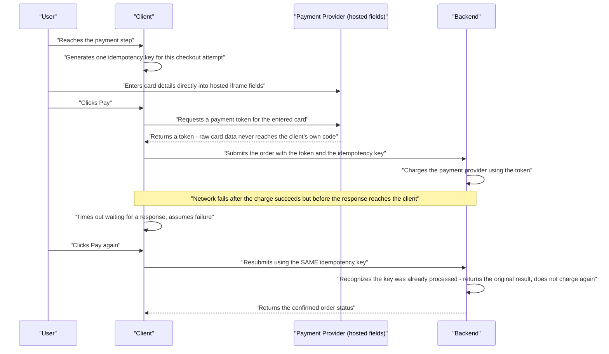

# Design an E-commerce Checkout Flow

**How to use this document:** this is a worked answer to a real interview prompt, structured as the steps you'd actually narrate in a 45-minute round — applying the general frontend system design framework to this specific question. Every major decision includes an explicit **why** and the alternative that was considered and rejected. A condensed rehearsal summary is at the end.

---

## Step 0 — Scope the Prompt (~2-3 min)

**What to say:** "Is this a single-page checkout or a multi-step flow — cart review, shipping, payment, confirmation? Do we need to support guest checkout, or only logged-in users? Should I deep-dive one payment method, like card payments, or design for several simultaneously? And is this steady-state traffic, or should I account for flash-sale-style inventory contention?"

**Why ask this first:** checkout is one of the highest-stakes, most cross-cutting flows in any e-commerce product — it touches state management, form UX, payment security, pricing/inventory correctness, and conversion-rate-sensitive performance all at once. Without scoping, 45 minutes can easily be spent entirely on form validation UX or entirely on payment security, missing the chance to demonstrate both breadth and depth.

**Scope assumed for the rest of this walkthrough:**
- A multi-step flow: cart review → shipping → payment → confirmation.
- Guest checkout is supported — the harder case, since there's no durable logged-in session to lean on for state.
- One payment method (credit card) is deep-dived; other methods (wallets, BNPL) are noted as integrating at the same architectural layer.
- Single-region, single-currency, steady-state traffic. Flash-sale-style inventory contention is explicitly named as an extension in the wrap-up, not the focus here.

---

## Step 1 — Requirements (~3-5 min)

| Type | Requirement |
|---|---|
| **Functional** | Multi-step flow; users can move back and forth between steps without losing entered data |
| **Functional** | Client-side validation gives immediate feedback; server-side validation is the source of truth |
| **Functional** | Payment is collected without the frontend ever handling raw card data |
| **Functional** | Order confirmation is durable and retrievable, surviving a page refresh |
| **Functional** | Users can apply a promo code before completing payment |
| **Non-functional** | The frontend must stay outside PCI DSS scope for raw card data handling |
| **Non-functional** | A network retry or accidental double-click must never result in a duplicate charge |
| **Non-functional** | In-progress form state must survive an accidental refresh or back-navigation |
| **Non-functional** | Step transitions must feel fast — this is a directly conversion-sensitive flow, and perceived latency has a measurable drop-off cost |

> **Why these non-functional requirements specifically:** "frontend never touches raw card data" and "no duplicate charges" are exactly what rule out the simplest naive payment implementation and drive the entire Step 3 decision — a first-party card form and a naive submit handler both fail these requirements directly, not just suboptimally.

---

## Step 2 — High-Level Architecture (~10-15 min)

A `CheckoutFlow` container owns a normalized "draft order" — shipping address, selected shipping method, applied promo, payment status — persisted to durable client-side storage so it survives a refresh. Each step (cart review, shipping, payment, confirmation) is its own component with its own validation boundary, rather than one giant form validated only at final submit. Critically, the server is treated as the source of truth for price, inventory, and shipping cost at **every** step transition, not just at final submit — client-held values are always a cache, since checkout can be a multi-minute session during which prices and stock can legitimately change underneath the user.



**Why this shape follows from the requirements, not from default habit:** persisted draft state is what directly satisfies "survives refresh"; per-step validation boundaries satisfy both the immediate-feedback UX requirement and the correctness requirement, since a giant end-of-flow validation would only catch a stale price *after* the user has already filled out shipping and payment; and revalidating at every transition — not just once at the end — is what prevents "I paid for something that just went out of stock" as a class of bug, rather than patching it as a one-off check before charging.

> **Key takeaway:** treating client-side order state as a cache that gets revalidated at every step, rather than a value trusted until final submit, is the single architectural decision that prevents the largest class of pricing/inventory correctness bugs in checkout flows.

---

## Step 3 — Payment Collection & Idempotent Submission Deep Dive (~15-20 min)

The one genuinely hard technical decision this problem hinges on: **how do you collect payment while never letting raw card data touch your own systems, and guarantee a retry or double-click never charges the customer twice?**

| Approach | How it works | Trade-off |
|---|---|---|
| **First-party fields, raw card data to your own backend** | Card number/CVV are regular form fields on your page, POSTed to your backend, which forwards to a payment processor | Simplest mentally; puts your entire frontend and backend in full PCI DSS Level 1 scope, since raw card data touches your infrastructure — a large, ongoing compliance burden |
| **Hosted fields / tokenization** (Stripe Elements, Braintree Hosted Fields) | The payment provider's iframe renders the actual card input fields; your page receives only a token after submission, never the raw values | Dramatically reduces PCI scope (SAQ A / SAQ A-EP instead of Level 1) since raw card data never enters your systems at all; keeps the embedded, branded checkout experience |
| **Full redirect to a provider-hosted payment page** | The user leaves your site entirely for the payment step, then returns | Maximizes PCI scope reduction — you never even render the payment form — but the jarring context switch away from your branded flow historically hurts conversion, and adds a full navigation round trip |

**Real-world adopters:** hosted fields (the middle approach) is extremely widely adopted — Stripe's Payment Element and Braintree's Hosted Fields both work this way. Full-redirect flows are largely legacy at this point, though some regional payment methods and buy-now-pay-later providers still only offer redirect-style integration.

**Decision: hosted fields / tokenization**, given the requirements. It satisfies "frontend never touches raw card data" architecturally rather than procedurally, while preserving the embedded checkout experience the conversion-sensitive performance requirement calls for — a materially better trade-off than either alternative.

> **When full redirect would be the right call:** if a specific payment method being supported simply doesn't offer a hosted-fields SDK and only integrates via redirect — a real, common constraint with some regional payment methods and BNPL providers, not a hypothetical. Naming this shows the decision was made against real integration constraints, not just a general preference.

The hosted-fields integration itself — the card input never becomes our own DOM element, it's mounted from the provider's own script into a container we point at:

```typescript
// The card element is rendered by the provider's iframe into this container -
// keystrokes for card number/CVV never touch our own DOM or JS at all.
const cardElement = elements.create('card');
cardElement.mount('#card-element');

async function submitPayment() {
  const { token } = await stripe.createToken(cardElement); // raw card data never reaches our code
  return fetch('/api/orders', {
    method: 'POST',
    headers: { 'Idempotency-Key': idempotencyKey },
    body: JSON.stringify({ paymentToken: token.id }),
  });
}
```

### Idempotent submission: the retry-safe mechanism

A client-generated idempotency key (a UUID, generated once and reused across retries — see `idempotencyKey` in the snippet above) is created when the user reaches the payment step, and included on every submission attempt for that checkout — including retries after a network failure or the user clicking "Pay" again:

```typescript
const idempotencyKey = useRef(crypto.randomUUID()).current; // one per checkout attempt, not per click
```

The backend uses this key to recognize a retried request as the same attempt and returns the original result instead of charging a second time.



> **Key takeaway:** the idempotency key must be generated once per checkout attempt and reused across every retry, not regenerated on each click — regenerating it defeats the entire mechanism, since the backend can only deduplicate requests it can recognize as the same attempt.

---

## Step 4 — Promo Code & Final Charge Amount (~5 min)

This looks like it could reuse the general "server revalidates at each step" pattern from Step 2, but it needs stronger handling than that pattern alone provides.

**Why it's handled differently:** shipping address is just data the user provides — there's no correctness question, only a validity one. A promo code's discount is a monetary value that directly determines what gets charged, so it can never be merely *revalidated* against what the client believes — at final submit, the server must **independently recompute the charge total from scratch** (current cart contents plus currently valid promo rules), ignoring whatever discounted total the client sent. Trusting a client-computed total, even one that was "valid" a few steps earlier, is a real, exploitable pricing-integrity gap, not a theoretical one.

---

## Step 5 — Cross-Cutting Concerns (~5 min)

| Concern | What to say |
|---|---|
| **Performance** | Prefetch the next step's assets while the user is on the current step, and use client-side routing within the flow — a full page reload between steps directly costs conversion in a flow this latency-sensitive |
| **Accessibility** | Validation errors must be programmatically associated with their fields (`aria-describedby`) and announced on a failed submission, not just shown as visual red text; the multi-step flow needs an accessible step indicator, not just a visual progress bar, so screen reader and keyboard users know where they are |
| **Security** | PCI scope reduction via hosted fields (Step 3) is the primary payment security control; server-recomputed pricing (Step 4) and CSRF protection on the final order-submission endpoint round out the security boundary for this specific flow |
| **Offline / network resilience** | Checkout generally can't be completed offline, so the right framing is failure *recovery*, not offline support — idempotent retries (Step 3) plus locally-preserved form data mean a dropped connection doesn't force the user to re-enter everything once connectivity returns |
| **Testing** | End-to-end tests must specifically cover the retry/idempotency path — simulating a dropped response and asserting no duplicate charge — since this class of bug only manifests across a full multi-request sequence and won't be caught by unit-testing individual steps in isolation |

---

## Step 6 — Trade-offs & Wrap-up (~3-5 min)

**Alternatives considered and explicitly rejected:**

- **Single-page checkout instead of multi-step** — not rejected on technical merit, deprioritized for this scope: a single page can reduce total clicks for a very simple, single-SKU cart, but multi-step gives cleaner per-step validation boundaries and scales better for carts with multiple shipping options and promo codes, which is the more general case this design targets.
- **First-party raw card fields** — rejected directly against the PCI non-functional requirement, covered in Step 3.
- **Trusting a client-computed final total at submit** — rejected: creates a real, exploitable pricing-integrity gap, covered in Step 4.

**What I'd revisit given more time or at 10x scale:**
- Flash-sale-style inventory contention (explicitly scoped out in Step 0) would need a dedicated short-lived inventory reservation mechanism when a user reaches payment, to prevent overselling — a materially different problem from the steady-state flow designed here.
- Multi-currency and international support would need currency-aware pricing display and likely region-specific payment methods, some of which only integrate via the redirect pattern named in Step 3.
- Given how conversion-sensitive this flow is, I'd want A/B testing infrastructure for checkout variants built into the architecture from the start at real scale, rather than bolted on afterward.

---

## 60-Second Rehearsal Summary

- **Scope:** multi-step flow (cart/shipping/payment/confirmation), guest checkout supported, one payment method deep-dived (card via hosted fields), single-region and steady-state traffic.
- **Architecture:** `CheckoutFlow` with persisted draft-order state surviving refresh; each step has its own validation boundary; the server revalidates price/inventory/shipping at every step transition, not just at final submit.
- **Hard decision:** hosted fields/tokenization over first-party raw card fields (fails PCI requirement) or full provider redirect (hurts the conversion-sensitive UX requirement) — redirect is still the right call for payment methods with no hosted-fields SDK.
- **Idempotency:** a client-generated key created once per checkout attempt and reused across retries, letting the backend safely deduplicate a dropped-response retry without a duplicate charge.
- **Promo codes:** the final charge total is always server-recomputed from scratch at payment time, never trusted from client state — a stricter guarantee than ordinary step revalidation.
- **Cross-cutting:** prefetching for perceived performance, accessible step indicators plus `aria-describedby` errors, server-recomputed pricing and CSRF protection as the security backbone, locally-preserved form data for failure recovery, and end-to-end tests specifically covering the retry/idempotency path.
- **Rejected alternatives named:** single-page checkout (viable for simpler carts), raw card fields (fails PCI), trusting client-computed totals (pricing-integrity gap).
