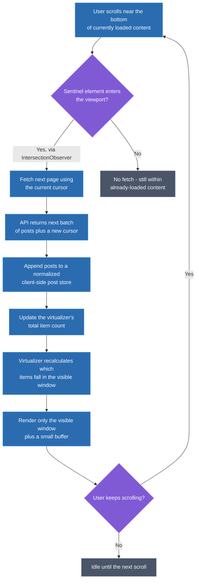
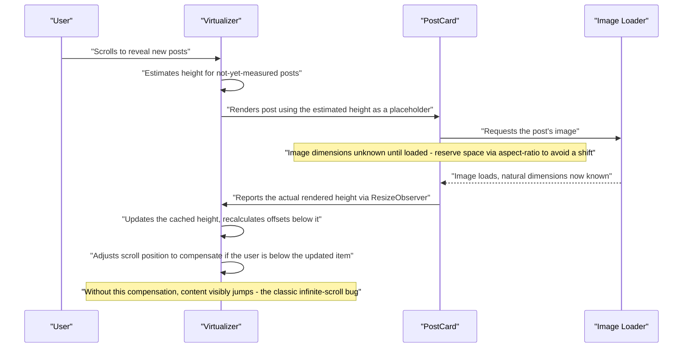

# Design an Infinite Scrolling News Feed

**How to use this document:** this is a worked answer to a real interview prompt, structured as the steps you'd actually narrate in a 45-minute round — applying the general frontend system design framework to this specific question. Every major decision includes an explicit **why** and the alternative that was considered and rejected. A condensed rehearsal summary is at the end.

---

## Step 0 — Scope the Prompt (~2-3 min)

**What to say:** "Is this closer to a Twitter/X-style chronological-plus-algorithmic timeline, or a more curated Instagram-style feed? Do users need to see new posts arrive in near real time while they're actively scrolling, or is a periodic refresh acceptable? And should I focus on the client — fetching, rendering, and scroll performance — or does this also include backend feed ranking?"

**Why ask this first:** "infinite scrolling news feed" spans a purely client-side rendering problem and a full backend ranking/generation system depending on interpretation. As a *frontend* system design prompt, the interviewer almost always wants the client-side problem — fetching, rendering, virtualization, and real-time UX — not a ranking algorithm, and stating that scoping decision out loud avoids solving the wrong half of the problem.

**Scope assumed for the rest of this walkthrough:**
- A social-feed-style UI: posts with text, optional image/video, author info, and engagement metrics (likes/comments).
- True infinite scroll (not a "load more" button), as the prompt requires.
- New posts can arrive in near real time while the user is mid-scroll — this becomes Step 4.
- The feed can grow arbitrarily large within a session (thousands of items over time) — this is what makes memory management the central problem, not an edge case.
- Web only.

---

## Step 1 — Requirements (~3-5 min)

| Type | Requirement |
|---|---|
| **Functional** | User scrolls indefinitely; more content loads automatically as they approach the bottom |
| **Functional** | Each post renders rich, variable-length content: text, optional media, author info, engagement counts |
| **Functional** | Liking/commenting updates optimistically, with rollback on failure |
| **Functional** | New posts arriving in real time are surfaced without disrupting the user's current reading position |
| **Non-functional** | Initial load must be fast — this is directly measured by LCP |
| **Non-functional** | Scrolling must stay smooth (effectively 60fps) even after thousands of items have loaded in a session |
| **Non-functional** | Memory usage must stay bounded regardless of how far the user has scrolled |
| **Non-functional** | Must degrade gracefully on flaky mobile networks — partial content and retry, not silent failure |

> **Why these non-functional requirements specifically:** "memory must stay bounded" and "60fps after thousands of items" are exactly what rules out the simplest possible implementation (render every loaded post) and forces the hard technical decision in Step 3. If the feed were guaranteed short, this would be a much simpler design.

---

## Step 2 — High-Level Architecture (~10-15 min)

A `FeedContainer` owns the loaded post data, the pagination cursor, and loading/error state. A virtualized list renders only the currently-visible window of `PostCard` components plus a small buffer, regardless of how many posts have been loaded in total. A sentinel element near the bottom of the rendered content, observed via `IntersectionObserver`, triggers the next page fetch — not a scroll-position calculation, which is expensive to compute on every scroll event.

**Why this shape follows from the requirements, not from default habit:** cursor-based pagination, not offset-based, because a live feed has ongoing inserts from other users — offset pagination silently duplicates or skips items when the underlying list shifts mid-scroll. `IntersectionObserver` over a manual scroll-position calculation because it doesn't force synchronous layout reads on every scroll event, which the 60fps requirement rules out. Virtualization is introduced here at the architecture level because it's not an optimization bolted on later — the memory-bound requirement makes it a load-bearing part of the shape from the start.

> **Key takeaway:** virtualization, cursor-based pagination, and observer-triggered fetching together are what make "infinite" scroll actually behave like a bounded-cost operation no matter how far the user has scrolled — none of the three alone would be sufficient.

---

## Step 3 — DOM & Memory Management Deep Dive (~15-20 min)

The one genuinely hard technical decision this problem hinges on: **how do you keep DOM node count and memory bounded as the feed grows unbounded, when posts have genuinely variable height?**

| Approach | How it works | Trade-off |
|---|---|---|
| **No virtualization** | Render every loaded post | Simplest to implement; DOM node count and memory grow unbounded — fails the stated requirements past a few hundred items |
| **Fixed-height virtualization** | Windowing assumes every item is the same height, so scroll position is a cheap `index × itemHeight` calculation | Fast and simple, but forces uniform sizing that conflicts with genuinely variable rich content (image posts vs. text-only posts) |
| **Variable-height virtualization** (measure-as-you-go) | Renders an estimated height, measures the actual rendered height once mounted, and corrects the windowing calculation | Matches real content shape; more complex, and the first render of any item uses an estimate that can be wrong |
| **DOM node recycling** (native list-view style) | A fixed pool of DOM nodes is reused and rewritten as the user scrolls, rather than mounted/unmounted | Can outperform mount/unmount virtualization at very high scroll frequency, but fights against React's declarative reconciliation model and adds real implementation complexity |

**Real-world adopters:** Meta's own feed and X's timeline both use variable-height virtualization internally; TanStack Virtual and `react-window` are the common OSS implementations of the measure-as-you-go approach.

**Decision: variable-height virtualization**, given the scoped requirement for rich, variable-length content. Fixed-height virtualization is rejected outright — it would require truncating or padding every post to a uniform size, which directly conflicts with the content requirement. DOM node recycling is not rejected on technical grounds, but deprioritized: it adds meaningful implementation complexity by working against React's model, and measured windowing already provides enough headroom at the scale scoped in Step 0.

> **When I'd reconsider DOM recycling:** if profiling after shipping measured virtualization showed scroll performance was still insufficient — for example, on low-end devices at a much higher post-density-per-screen than assumed here — the recycling approach would be the next lever to pull. Naming this condition is the difference between "I picked one option" and "I understand what would change my mind."

### The failure mode that actually matters: layout shift from late-measured content

> **Key takeaway:** the real failure mode of a variable-height virtualized list isn't "does it render" — it's "does it avoid visible jank when a height estimate turns out to be wrong." Reserving space with `aspect-ratio` before an image loads, plus scroll-offset compensation once the real height is known, is what actually solves that.

---

## Step 4 — Real-Time New-Post Delivery (~5 min)

This looks like it could reuse the same fetch-and-append mechanism as pagination, but architecturally shouldn't.

**Why it's handled differently:** pagination is a *pull* signal — the user scrolling down is an explicit request for more content. New-post arrival is a *push* signal — the server decides when something new exists, independent of what the user is doing. Auto-injecting new posts directly above the user's current scroll position the moment they arrive shifts their reading position mid-read, which is a well-known, jarring feed anti-pattern.

The correct handling: new posts arriving over a lightweight channel (polling a `since` cursor, or a push mechanism) are held in a pending buffer rather than inserted immediately, and a non-disruptive affordance ("12 new posts — tap to view") gives the user control over when to see them. Conflating this with the pagination fetch would force the client to guess whether an incoming batch is "the next page" or "new content since load," which is exactly the kind of ambiguity that keeping the two signals separate avoids entirely.

---

## Step 5 — Cross-Cutting Concerns (~5 min)

| Concern | What to say |
|---|---|
| **Performance** | Lazy-load below-the-fold media (native `loading="lazy"` or observer-triggered), and cancel/debounce in-flight page fetches if the user scrolls past the sentinel rapidly, to avoid request pile-up |
| **Accessibility** | Virtualized lists remove off-screen items from the DOM entirely, breaking screen-reader "read from here" navigation and browser find-in-page — mitigate with `aria-setsize`/`aria-posinset` on rendered items, and announce new-post availability via an ARIA live region rather than letting it appear silently |
| **Security** | User-generated post/comment content must be sanitized against XSS before rendering — never trust rich text content is safe just because it came from the API |
| **Offline / network resilience** | A failed page fetch should show an inline retry affordance, not silently stop scrolling with no explanation; queue optimistic like/comment actions and reconcile on reconnect |
| **Testing** | Virtualization means most of the list isn't in the DOM at any given time — tests need to explicitly assert windowing behavior (e.g., only N nodes exist after scrolling X pixels), since a test suite that never scrolls won't catch a broken virtualizer |

---

## Step 6 — Trade-offs & Wrap-up (~3-5 min)

**Alternatives considered and explicitly rejected:**

- **A "load more" button instead of true infinite scroll** — not rejected on technical grounds, but out of scope: the prompt explicitly requires infinite scroll. Worth naming that a button gives users a predictable stopping point and can be preferable for accessibility and control — the right call under a different requirement set.
- **Fixed-height virtualization** — rejected because the scoped content (variable text length, optional media) genuinely varies in height; forcing uniformity would degrade the content requirement to fit the simpler technique.
- **No virtualization at all** — rejected outright against the stated memory and 60fps non-functional requirements; only acceptable if the feed were scoped to a guaranteed-short length.

**What I'd revisit given more time or at 10x scale:**
- Move new-post detection from polling to a genuine push mechanism (WebSocket/SSE) if real-time freshness became a stronger requirement than assumed here.
- Add a service-worker-backed cache for partial offline feed viewing.
- If client-side filtering/ranking logic grew heavier, consider moving it off the main thread into a worker, since the main thread is already doing real work for scroll-driven virtualization recalculation.

---

## 60-Second Rehearsal Summary

- **Scope:** social-feed UI, true infinite scroll, real-time new posts, variable-height rich content, web only.
- **Architecture:** `FeedContainer` + virtualized list + cursor-based pagination triggered by an `IntersectionObserver` sentinel, backed by a normalized client-side post store.
- **Hard decision:** variable-height (measure-as-you-go) virtualization over fixed-height or DOM recycling — content genuinely varies in height, and recycling's added complexity isn't justified at this scale.
- **Key pitfall:** unmeasured/lazy-loaded media causing layout shift — solved with `aspect-ratio` space reservation plus scroll-offset compensation once real height is known.
- **New posts:** a separate push signal with a non-disruptive "N new posts" affordance — deliberately not auto-injected, and deliberately not the same code path as pagination's pull signal.
- **Cross-cutting:** lazy media loading, `aria-setsize`/`aria-posinset` plus live-region announcements for a11y, XSS sanitization on user content, inline retry on failed fetches, virtualization-aware test assertions.
- **Rejected alternatives named:** load-more button (valid under different requirements), fixed-height virtualization (breaks under variable content), full DOM rendering (fails the stated memory/perf requirements outright).
