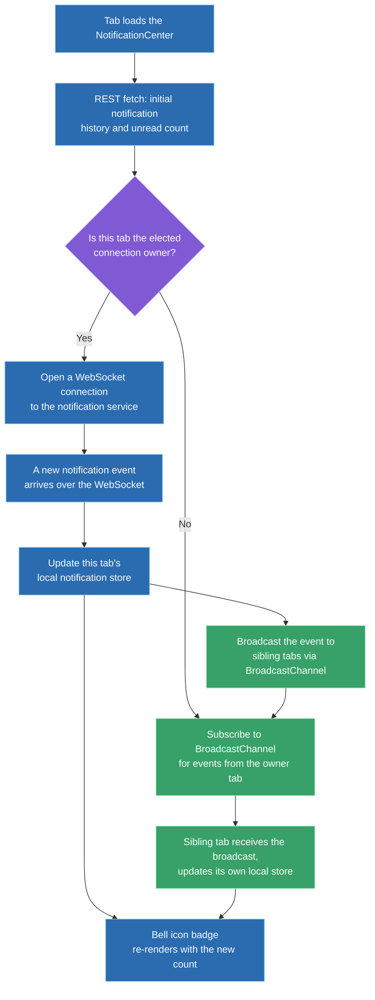
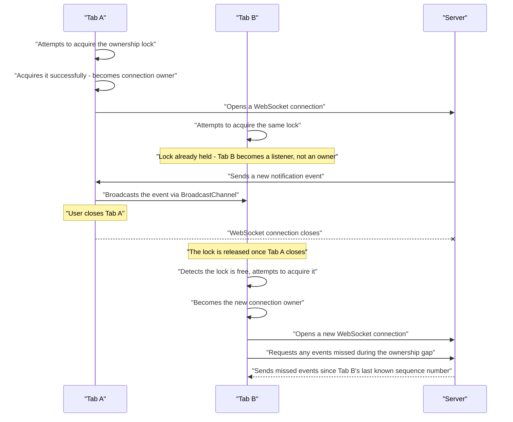

# Design a Notification System (In-App and Push)

**How to use this document:** this is a worked answer to a real interview prompt, structured as the steps you'd actually narrate in a 45-minute round — applying the general frontend system design framework to this specific question. Every major decision includes an explicit **why** and the alternative that was considered and rejected. A condensed rehearsal summary is at the end.

---

## Step 0 — Scope the Prompt (~2-3 min)

**What to say:** "The prompt names both in-app and push — I want to confirm both are genuinely in scope, since they're different browser mechanisms with different failure modes. Does read/unread state need to sync across multiple open tabs of the same browser, or full cross-device sync too? Are we talking about moderate-frequency notifications like comments and mentions, or high-frequency alerts like a trading app? And is this a single product surface, or a platform other teams plug new notification types into?"

**Why ask this first:** "in-app and push" already signals the interviewer wants both the real-time-while-active path and the delivered-while-closed path covered — conflating them into one generic "notifications" discussion misses the actual hard part of this question, which is architecting both cleanly while keeping read/unread state consistent between them.

**Scope assumed for the rest of this walkthrough:**
- Both in-app real-time notifications and browser push notifications are in scope, matching the prompt directly.
- Read/unread state must stay consistent across multiple open tabs of the same browser. Full cross-device sync is named as an extension, not the focus here.
- Moderate-frequency, informational notifications — comments, mentions, follows — not high-frequency trading-alert-style volume.
- A single product surface for this design; extensibility for other teams to register new notification types is named as a cross-cutting concern, not the primary axis.

---

## Step 1 — Requirements (~3-5 min)

| Type | Requirement |
|---|---|
| **Functional** | Real-time in-app delivery while a tab is open — a bell icon badge updates live |
| **Functional** | Browser push notifications delivered even when no tab is open |
| **Functional** | Users can mark notifications as read, individually or all at once |
| **Functional** | Notification history is durable and retrievable, not just ephemeral toasts |
| **Non-functional** | Delivery must be resilient to a dropped connection — no notification silently lost |
| **Non-functional** | Read/unread state must never desync between two open tabs of the same browser |
| **Non-functional** | The system must not open a redundant network connection per open tab |
| **Non-functional** | Push permission requests must not tank opt-in rates — a measured, real UX metric |

> **Why these non-functional requirements specifically:** "never desync between tabs" and "no redundant connection per tab" together are what rule out the simplest implementation — each tab independently managing its own connection and state — and drive the entire Step 3 decision.

---

## Step 2 — High-Level Architecture (~10-15 min)

A `NotificationCenter` module (the bell icon and its panel) is backed by a local notification store, seeded on load by a REST fetch of history and unread count — the socket only ever carries *new* events, not history, so an initial durable fetch is required regardless of the real-time mechanism chosen. While a tab is open, one tab is elected as the connection owner and holds the actual WebSocket to the notification service; every other open tab relays through it via `BroadcastChannel` rather than opening its own connection.

**Why this shape follows from the requirements, not from default habit:** durable history requires a REST-backed initial load, since a WebSocket only ever streams what happens after connection; the "no redundant connections" and "no desync between tabs" requirements together are exactly what necessitate a single connection owner with broadcast relay, rather than each tab independently managing its own socket and state.

> **Key takeaway:** only one tab ever holds the actual network connection — every other tab's "real-time" experience is a same-browser broadcast relay, not an independent connection. This single decision satisfies both the connection-efficiency and consistency requirements at once.

---

## Step 3 — Cross-Tab Connection Coordination Deep Dive (~15-20 min)

The one genuinely hard technical decision this problem hinges on: **how do multiple tabs of the same browser agree on which one owns the shared connection, especially when tabs open and close unpredictably?**

| Approach | How it works | Trade-off |
|---|---|---|
| **Independent WebSocket per tab** | Every open tab opens its own connection to the server | Simplest to implement; violates the connection-efficiency requirement outright (N tabs = N connections), and creates a real desync risk if two tabs independently apply optimistic updates that race against their own connection's message order |
| **Leader election + BroadcastChannel** | One tab acquires an ownership lock (e.g., via the Web Locks API) and opens the real connection; other tabs listen via `BroadcastChannel` | Solves both problems, but introduces its own miniature distributed-systems problem — the owner tab closing requires the remaining tabs to detect the gap and re-elect a new owner |
| **A dedicated SharedWorker** | All tabs connect to one `SharedWorker`, which itself owns the single WebSocket connection | Conceptually the cleanest solution — the browser primitive is literally designed for "one shared context across same-origin tabs" — avoiding manual leader election entirely; but Safari's `SharedWorker` support has real, current gaps, and DevTools support for debugging shared workers is generally worse than tab-scoped code |

**Real-world adopters:** Slack's web/desktop client is a well-known real-world example that had to solve exactly this cross-tab coordination problem for notification and presence sync; most collaboration tools with multi-tab support land on either the leader-election or `SharedWorker` pattern.

**Decision: leader election with `BroadcastChannel`**, given the requirement for reliable behavior across the full browser support matrix — Safari's `SharedWorker` gaps are a real, current constraint here, not a hypothetical.

> **When `SharedWorker` would be the right call instead:** if the product's browser support matrix excluded Safari, or if Safari's `SharedWorker` support meaningfully improves — at that point the architecturally cleaner primitive would be worth adopting. Naming this condition explicitly matters more than picking a single "winner" dogmatically.

### The edge case that actually matters: the owner tab closing mid-session

> **Key takeaway:** the failover moment is exactly where naive implementations quietly lose notifications. The new owner has to explicitly resync from a last-known sequence number, not just start listening for new events — otherwise anything that arrived during the brief gap between the old owner closing and the new owner connecting is gone.

---

## Step 4 — Browser Push Notifications (~5 min)

This looks like it could reuse the in-app real-time pipeline from Step 3, but architecturally can't.

**Why it's handled differently:** push notifications must be delivered even when no tab is open at all — there's no tab to elect as a connection owner, no `BroadcastChannel` to relay through (it only works between currently-open contexts of the same origin), and no active WebSocket to receive over. Push instead relies on an entirely separate mechanism: a persistent `PushSubscription` registered once via the Push API and stored server-side, and a Service Worker that stays registered independent of any open tab, woken by the browser's own OS-level push service to handle a `push` event and display a native notification. None of this depends on Step 3's tab-coordination machinery.

**Reconciliation:** the service worker's push path and the in-app notification store are two independently-updated views of the same underlying data. When a tab next opens, Step 2's REST fetch naturally reconciles them by pulling current authoritative state — the two paths never need to talk to each other directly, they just converge on the same source of truth eventually.

---

## Step 5 — Cross-Cutting Concerns (~5 min)

| Concern | What to say |
|---|---|
| **Performance** | Batch near-simultaneous notification events into a single UI update rather than re-rendering on every individual message — a burst of 10 notifications shouldn't cause 10 separate re-renders |
| **Accessibility** | New notifications shouldn't interrupt a screen-reader user's current task with an assertive announcement per item — use a polite ARIA live region and batch the announcement ("3 new notifications"); the unread badge needs an accessible label, not just a visually-styled number |
| **Security** | Push subscription endpoints must be tied to an authenticated user server-side, never registerable by or delivered to the wrong client; notification content shown in an OS-level preview (visible even on a locked screen) must avoid leaking sensitive content by default — a commonly-overlooked privacy gap |
| **Offline / network resilience** | For in-app, this is exactly what Step 3's sequence-number resync exists to handle; for push, the browser/OS push service itself is responsible for offline delivery durability — worth naming explicitly as "the platform already solves this, it isn't ours to rebuild" |
| **Testing** | The leader-election and failover logic from Step 3 is the highest-risk code in this system and needs dedicated tests simulating tab close/reopen sequences, verifying no notification is lost across a failover — this is exactly the class of bug that won't surface in normal single-tab manual testing |

---

## Step 6 — Trade-offs & Wrap-up (~3-5 min)

**Alternatives considered and explicitly rejected:**

- **Independent WebSocket per tab** — rejected directly against both the connection-efficiency and consistency-risk requirements, covered in Step 3.
- **Polling instead of WebSocket for the entire in-app path** — not rejected outright: polling trades real-time responsiveness for simplicity, and would be the right call for a lower-priority notification type within the same product (e.g., a "your export is ready" notification that's fine to be a few seconds delayed) even while the primary path uses a real-time connection. Not every notification type needs the same delivery guarantee.
- **`SharedWorker` as the primary recommendation** — not rejected on technical merit, deprioritized given the current real-world Safari support gap named in Step 3.

**What I'd revisit given more time or at 10x scale:**
- True cross-device read/unread sync, explicitly scoped out in Step 0, would need the backend to be the unambiguous source of truth with an explicit sync-on-focus pull, rather than any client-side coordination.
- Notification-type extensibility for other product teams would need its own schema and registration story — the same governance concerns that apply to any shared platform surface.
- At genuinely high notification volume (explicitly scoped out here), the batching strategy from Step 5 would need to become a central design concern rather than a cross-cutting afterthought.

---

## 60-Second Rehearsal Summary

- **Scope:** both in-app real-time and browser push in scope; cross-tab (not cross-device) consistency; moderate notification frequency; single product surface.
- **Architecture:** `NotificationCenter` backed by a local store seeded via REST history fetch, kept live via one shared WebSocket per browser session, with sibling tabs relayed via broadcast rather than opening their own connections.
- **Hard decision:** leader election (Web Locks API) plus `BroadcastChannel` over independent per-tab sockets (fails efficiency/consistency) or `SharedWorker` (architecturally cleaner, but real Safari gaps make it the fallback, not the primary, recommendation).
- **Key edge case:** the owner tab closing mid-session — the new owner must resync from a last-known sequence number on takeover, or events during the failover gap are silently lost.
- **Push notifications:** an entirely separate delivery path (Service Worker + Push API + OS-level push service), since it must work with zero tabs open — reconciles with in-app state naturally via the same REST fetch on next tab open, with no direct coupling needed.
- **Cross-cutting:** batched re-renders for notification bursts, polite (not assertive) ARIA live regions, authenticated push subscriptions with no sensitive content in OS-level previews, platform-handled offline durability for push, and dedicated tests for the tab-failover path specifically.
- **Rejected alternatives named:** independent per-tab sockets (efficiency/consistency failure), `SharedWorker` as primary (Safari gap), universal polling (fine for lower-priority notification types, not the primary path).
