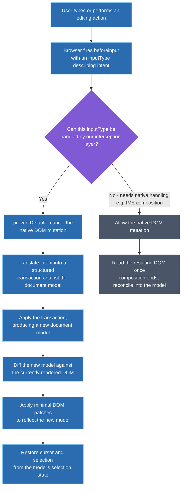
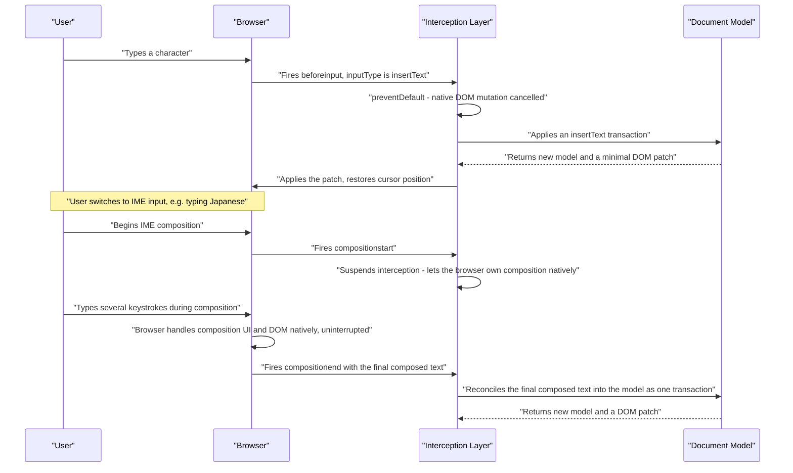

# Design a WYSIWYG Editor

**How to use this document:** this is a worked answer to a real interview prompt, structured as the steps you'd actually narrate in a 45-minute round — applying the general frontend system design framework to this specific question. Every major decision includes an explicit **why** and the alternative that was considered and rejected. A condensed rehearsal summary is at the end.

---

## Step 0 — Scope the Prompt (~2-3 min)

**What to say:** "What level of richness are we targeting — basic formatting like bold, italic, lists, and links, or something closer to a full block-based editor with tables and nested embeds? Does this need to support real-time multi-user collaborative editing, or is single-user editing the focus? Is this a standalone product, or an embeddable component other teams will integrate into their own products? And are there specific export requirements — clean HTML, Markdown, or both?"

**Why ask this first:** "WYSIWYG editor" spans a simple comment-box rich text field and a full Notion-style block editor with a plugin ecosystem — designing for the wrong level of richness either wastes the session over-engineering a comment box or attempts to design Notion from scratch in 45 minutes. The collaboration question specifically matters because it changes the core architecture significantly enough that it deserves its own separate design discussion rather than being folded in here as an afterthought.

**Scope assumed for the rest of this walkthrough:**
- A mid-complexity rich text editor: bold/italic/underline, headings, ordered/unordered lists, links, blockquotes, and image embeds — comparable to a blog CMS editor, not a full block-based document processor.
- Single-user editing. Real-time multi-user collaboration is explicitly named as an extension, not the focus of this design.
- Embeddable — other product teams integrate this as a component, which is why extensibility comes up explicitly later.
- Must serialize to canonical, portable HTML (and ideally Markdown) for storage and export — not raw, browser-dependent DOM markup.

---

## Step 1 — Requirements (~3-5 min)

| Type | Requirement |
|---|---|
| **Functional** | Standard formatting: bold, italic, underline, headings, ordered/unordered lists, links, blockquotes |
| **Functional** | Undo/redo with predictable, testable behavior |
| **Functional** | Paste from external sources (Word, Google Docs, web pages) without importing garbage markup |
| **Functional** | Image embedding |
| **Functional** | New formatting/content types can be added without modifying the editor's core |
| **Non-functional** | Behavior must be consistent across Chrome, Firefox, and Safari — not "mostly the same" |
| **Non-functional** | Must not be vulnerable to XSS via pasted or imported content |
| **Non-functional** | Typing must stay responsive in documents of tens of thousands of words |
| **Non-functional** | International text input (IME composition for CJK languages) must work correctly |

> **Why these non-functional requirements specifically:** "consistent across browsers," "predictable undo/redo," and "extensible without touching the core" are exactly what rule out the simplest possible implementation — trusting the browser's native `contentEditable` DOM mutations directly — and drive the entire Step 3 decision.

---

## Step 2 — High-Level Architecture (~10-15 min)

A structured document model — a JSON tree of typed nodes (paragraph, heading, list-item) with marks (bold, italic) applied to text ranges — is the single source of truth, not the DOM. `contentEditable` is used only as an input surface: the browser owns cursor rendering, focus, and native text input behavior, but every actual content change is intercepted via the `beforeinput` event, translated into a structured transaction, and applied to the model. The DOM is then re-rendered from the model, one-directionally, similar in spirit to how a virtual DOM diff works but specialized for text editing.

**Why this shape follows from the requirements, not from default habit:** cross-browser consistency is unreachable if the DOM mutations `contentEditable` produces for a given action are trusted as ground truth, because those mutations genuinely differ across browsers for identical user input. Intercepting *intent* (via `beforeinput`'s `inputType`) and applying it to an owned model inverts the naive approach — the browser's inconsistency stops mattering because it never gets to decide the actual document structure.

> **Key takeaway:** the model is the source of truth and the DOM is a rendering target kept in sync via diffing — this is the same architectural pattern real production rich text frameworks (ProseMirror, Slate, Lexical) use, not a simplification invented for this walkthrough.

---

## Step 3 — Input Interception & Document Model Deep Dive (~15-20 min)

The one genuinely hard technical decision this problem hinges on: **how much do you trust the browser's native `contentEditable` behavior, versus taking over content mutation yourself?**

| Approach | How it works | Trade-off |
|---|---|---|
| **Raw `contentEditable`, DOM as source of truth** | Let the browser mutate the DOM freely; read and serialize whatever's there | Simplest to start; cross-browser DOM mutation differences make behavior inconsistent, undo/redo becomes unreliable diffing of arbitrary DOM snapshots, and invalid nested markup is hard to prevent |
| **`contentEditable` as input surface + custom model** (intercept via `beforeinput`) | Browser handles caret rendering, focus, and native text input; all content mutation is translated into transactions against an owned model | Gets native IME/mobile keyboard/spellcheck behavior largely for free while keeping full control over document structure; requires careful handling of when *not* to intercept |
| **Fully custom rendering, no `contentEditable`** (e.g., canvas-based) | Reimplement cursor rendering, selection, and text input entirely outside browser-native editable surfaces | Maximum control and consistency, including pixel-perfect fidelity; reimplementing IME composition and native text input correctly is an enormous, notoriously hard undertaking |

**Real-world adopters:** ProseMirror, Slate, and Lexical (Meta's own rich text framework) all use the middle approach — `contentEditable` as an input surface with an owned model. Google Docs is a well-known example that went further toward fully custom rendering, but did so for reasons specific to its scale and print-fidelity requirements.

**Decision: `contentEditable` as an input surface with a custom document model**, given the scoped requirements. Raw `contentEditable` is rejected outright — it fails the consistency and predictable-undo requirements directly. Fully custom rendering is not rejected on technical merit, but deprioritized: the engineering cost of correctly reimplementing IME composition and native input handling is disproportionate to a mid-complexity embeddable editor.

> **When I'd reconsider fully custom rendering:** if the requirements included something like Google Docs' pixel-perfect print fidelity, or the editor needed to render inside a canvas-based surface for unrelated reasons (e.g., embedded in a whiteboard product). Naming that condition explicitly is what separates "I picked the popular option" from "I understand the actual trade-off."

### The edge case that actually breaks naive implementations: IME composition

> **Key takeaway:** the interception layer's hardest job isn't intercepting input — it's knowing when *not* to. IME composition is the canonical case where fighting native browser behavior mid-composition breaks the experience entirely for CJK-language users, and naming this unprompted is a strong signal of real production experience with rich text editors.

---

## Step 4 — Copy/Paste & Content Sanitization (~5 min)

This looks like it could reuse the same "intercept and apply to model" pipeline from Step 3, but architecturally shouldn't.

**Why it's handled differently:** pasted content arrives as arbitrary, often messy HTML — from Word, Google Docs, or an arbitrary webpage — that doesn't map cleanly onto a sequence of `insertText`-style transactions. It needs its own dedicated path: parse the clipboard HTML, strip or normalize disallowed markup and inline styles, and convert what remains into valid document-model nodes. This boundary is also the editor's primary XSS attack surface — pasted or imported HTML can carry `<script>` tags, inline event handler attributes, or dangerous `href`/`src` values — so sanitization has to happen specifically here, not be assumed to happen somewhere downstream.

---

## Step 5 — Cross-Cutting Concerns (~5 min)

| Concern | What to say |
|---|---|
| **Performance** | Scope diffing and DOM patching to the affected node subtree on each keystroke, not the whole document; virtualizing rendering for very large documents is a real option but interacts awkwardly with `contentEditable`'s caret behavior and is worth naming as an open tension, not a solved problem |
| **Accessibility** | A generic `contentEditable` surface isn't self-describing to screen readers the way native form controls are — needs explicit `role` and ARIA labeling, plus toolbar keyboard shortcuts that don't collide with screen reader shortcuts |
| **Security** | Paste/import sanitization (Step 4) is the primary XSS boundary; any HTML export path must also guarantee a plugin author can't introduce an escape hatch that injects raw, unsanitized HTML |
| **Offline / network resilience** | Local autosave (IndexedDB or localStorage) so in-progress edits survive a tab crash or accidental close independent of network save success; retry/backoff on save failure with a visible "unsaved changes" indicator rather than silent failure |
| **Testing** | Browser input event behavior is exactly the layer under test and is notoriously inconsistent across engines — this needs real browser-level integration tests, not just unit tests against the model, since a pure model-level test suite won't catch an actual cross-browser `beforeinput`/composition regression |

---

## Step 6 — Trade-offs & Wrap-up (~3-5 min)

**Alternatives considered and explicitly rejected:**

- **Raw `contentEditable` with the DOM as source of truth** — rejected directly against the consistency and predictable-undo requirements, elaborated in Step 3.
- **Fully custom canvas/DOM rendering with no `contentEditable`** — not rejected on technical merit, deprioritized given scope; the right call specifically under pixel-perfect fidelity requirements this design doesn't have.
- **Storing the document as raw HTML instead of a structured model** — rejected: this is the same underlying failure mode as raw `contentEditable` — undo/redo over arbitrary HTML diffs, no structural validity guarantees, and no safe way to extend with new node or mark types.

**What I'd revisit given more time or at 10x scale:**
- Real-time collaborative editing was explicitly scoped out here — if added later, the structured document model chosen in this design is compatible groundwork for the CRDT-based sync approach a collaborative editor needs, not a dead end that would need to be rebuilt.
- A formal versioning story for the plugin/extensibility API surface, if this editor is adopted by many product teams — the same governance concerns (breaking changes, migration paths) that apply to any shared component library.
- Large-document performance with `contentEditable` remains a genuinely hard, industry-wide under-solved problem and would need dedicated investigation at real scale rather than a confident answer in an interview setting.

---

## 60-Second Rehearsal Summary

- **Scope:** mid-complexity rich text editor (not a full block-based document processor), single-user, embeddable, canonical HTML/Markdown export.
- **Architecture:** a structured document model is the source of truth; `contentEditable` is used only as an input surface; `beforeinput` interception translates browser intent into model transactions; the DOM is re-rendered via diffing against the model.
- **Hard decision:** `contentEditable`-as-input-surface plus a custom model (the ProseMirror/Slate/Lexical approach) over raw `contentEditable` (fails consistency and undo requirements) or fully custom rendering (disproportionate engineering cost here, the right call only under Google-Docs-level fidelity needs).
- **Key edge case:** IME composition — the interception layer must suspend itself during composition and reconcile only once it ends, or typing breaks entirely for CJK-language users.
- **Copy/paste:** a distinct parse-and-sanitize pipeline, not reused `insertText` transactions — also the editor's primary XSS boundary.
- **Cross-cutting:** subtree-scoped diffing for performance, explicit ARIA labeling since `contentEditable` isn't self-describing, sanitization at the paste boundary for security, local autosave for resilience, and real browser-level integration tests since input behavior is the layer actually under test.
- **Rejected alternatives named:** raw `contentEditable` (fails consistency), fully custom rendering (right call only under stricter fidelity requirements), raw HTML as the model (same failure mode as raw `contentEditable`).
